# Technical Specification

# 0. Agent Action Plan

## 0.1 Core Feature Objective

Based on the prompt, the Blitzy platform understands that the new feature requirement is to:

- Add a single function to `test.py` that adds two numbers together
- Keep the implementation minimal and straightforward
- No additional features or complexity required

This is a simple utility function addition with no dependencies or integrations needed.

## 0.2 Special Instructions and Constraints

**User Directive:** "very tiny tech spec is sufficient"

**Constraints:**
- Minimal implementation only
- No additional features beyond the add function
- Single file modification (test.py)
- No external dependencies required

## 0.3 Technical Interpretation

The feature requirement translates to the following technical implementation strategy:

- To implement the add function, we will **create** a Python function named `add` in `test.py`
- Function signature: `def add(a, b)` that returns the sum of two numbers
- Implementation: `return a + b`

No architectural changes, integrations, or additional modules required.

## 0.4 Comprehensive File Analysis

**Files to Modify:**
- `test.py` - Add the `add(a, b)` function

**Current State:**
- Repository contains only `test.py` (currently empty/minimal)
- No other Python files, configuration files, or dependencies present

**Integration Points:**
- None - standalone function

## 0.5 Web Search Research Conducted

No web search required - adding two numbers is a fundamental Python operation requiring no external research or best practices analysis.

## 0.6 New File Requirements

No new files required - only modifying existing `test.py` file.

## 0.7 Dependency Inventory

**Runtime Environment:**

| Component | Version | Purpose |
|-----------|---------|---------|
| Python | 3.12.3 | Runtime environment |

**External Dependencies:**
- None required - uses only Python built-in operations

**Dependency Updates:**
- No import updates required
- No external packages needed

## 0.8 Integration Analysis

**Existing Code Touchpoints:**
- None - standalone function with no integrations

**Dependency Injections:**
- Not applicable

**Database/Schema Updates:**
- Not applicable

## 0.9 Technical Implementation

**File-by-File Execution Plan:**

**Group 1 - Core Implementation:**
- **MODIFY:** `test.py` - Add function: `def add(a, b): return a + b`

**Implementation Approach:**
- Open test.py
- Add the add function with two parameters
- Return the sum of the parameters
- No additional setup or configuration needed

## 0.10 Scope Boundaries

**In Scope:**
- `test.py` - Add function to add two numbers

**Out of Scope:**
- Test files (not required per user request)
- Documentation files
- Configuration files
- Type hints or docstrings
- Input validation
- Error handling
- Any other features or enhancements

## 0.11 Special Instructions for Feature Addition

**User-Emphasized Requirements:**
- Keep implementation minimal ("That's it. nothing else")
- Very tiny tech spec requested
- Single function addition only
- No additional complexity or features

**Implementation Notes:**
- Function should be simple and straightforward
- No need for comprehensive error handling or validation
- Focus solely on the requested functionality


# 1. Introduction

This document serves as the baseline Technical Specification for an empty codebase. It provides a template structure for future documentation as the system evolves.

## 1.1 Executive Summary

### 1.1.1 Project Overview

This is a baseline documentation template for an empty codebase. No active implementation currently exists within the repository.

### 1.1.2 Current State

- **Business Problem**: Not yet defined
- **Key Stakeholders**: To be determined
- **Business Impact**: Pending project initiation
- **Value Proposition**: Awaiting scope definition

## 1.2 System Overview

### 1.2.1 Project Context

This baseline document establishes a documentation framework for future development. No current system exists to document.

| Aspect | Status |
|--------|--------|
| Business Context | Undefined |
| Market Positioning | Not applicable |
| Existing System | None |
| Enterprise Integration | Not applicable |

### 1.2.2 High-Level Description

No system components or capabilities currently exist to document.

### 1.2.3 Success Criteria

Success criteria will be defined when project scope is established.

## 1.3 Scope

### 1.3.1 In-Scope Elements

**Core Features and Functionalities:**
- None defined (empty baseline)

**Implementation Boundaries:**
- No boundaries established (empty codebase)

### 1.3.2 Out-of-Scope Elements

**Excluded Features:**
- All features (no implementation exists)

**Future Considerations:**
- All functionality pending project definition

## 1.4 Document Purpose

This baseline Introduction serves as a template structure that should be populated when:
- Project requirements are defined
- System architecture is designed
- Implementation begins
- Stakeholders are identified

---

#### References

**Repository State**: Empty codebase baseline  
**Files Examined**: None (per user directive)  
**Folders Explored**: None (per user directive)

# 2. Product Requirements

## 2.1 Feature Catalog

### 2.1.1 Current Status

No features have been defined for this system. This section serves as a placeholder for future feature documentation.

### 2.1.2 Feature Documentation Framework

When features are identified and approved, each will be documented with the following metadata structure:

| Metadata Element | Description |
|-----------------|-------------|
| Feature ID | Unique identifier (format: F-XXX) |
| Feature Name | Descriptive name of the feature |
| Category | Functional grouping |
| Priority Level | Critical/High/Medium/Low |

### 2.1.3 Feature Details Template

Future features will include comprehensive documentation covering:
- **Description**: Overview, business value, user benefits, and technical context
- **Dependencies**: Prerequisite features, system dependencies, external dependencies, and integration requirements
- **Status Tracking**: Current implementation state and version history

## 2.2 Functional Requirements

### 2.2.1 Requirements Status

No functional requirements currently exist. This empty baseline establishes the structure for future requirements documentation.

### 2.2.2 Requirements Table Structure

When requirements are defined, they will be documented using the following format:

| Requirement ID | Description | Priority | Complexity |
|---------------|-------------|----------|------------|
| F-XXX-RQ-YYY | Requirement description | Must-Have/Should-Have/Could-Have | High/Medium/Low |

### 2.2.3 Requirements Specification Framework

Future requirements will include:
- **Acceptance Criteria**: Testable conditions for requirement satisfaction
- **Technical Specifications**: Input parameters, outputs, performance criteria, and data requirements
- **Validation Rules**: Business rules, data validation, security requirements, and compliance requirements

## 2.3 Feature Relationships

### 2.3.1 Relationship Mapping Status

No feature relationships exist to document. This section will be populated as features are defined and interdependencies emerge.

### 2.3.2 Relationship Documentation Approach

When features are implemented, this section will document:
- Feature dependency maps
- Integration points between features
- Shared components and services
- Common data flows

### 2.3.3 Traceability Matrix

A traceability matrix will be established to track relationships between features, requirements, and system components once development begins.

## 2.4 Implementation Considerations

### 2.4.1 Considerations Status

No implementation considerations exist for the current empty baseline. This section establishes the framework for documenting technical constraints and requirements.

### 2.4.2 Technical Considerations Framework

Future implementation documentation will address:
- **Technical Constraints**: Technology limitations and dependencies
- **Performance Requirements**: Response time, throughput, and resource utilization targets
- **Scalability Considerations**: Growth projections and scaling strategies

### 2.4.3 Non-Functional Requirements Template

When the system is defined, this section will document:
- **Security Implications**: Authentication, authorization, and data protection requirements
- **Maintenance Requirements**: Operational needs and support considerations
- **Compliance Requirements**: Regulatory and standards adherence

## 2.5 Requirements Management

### 2.5.1 Version Control

Requirements versioning will be tracked as the project evolves. Current version: N/A (empty baseline).

### 2.5.2 Change Management Process

A change management process will be established to handle:
- Requirement additions and modifications
- Impact analysis for proposed changes
- Approval workflows and stakeholder sign-off
- Requirements traceability throughout the development lifecycle

### 2.5.3 Assumptions and Constraints

**Current Assumptions:**
- This is a baseline documentation template for an empty codebase
- Requirements will be defined during project initiation
- Documentation structure follows enterprise standards

**Current Constraints:**
- No implementation exists
- No active development in progress
- All features and requirements pending definition

## 2.6 References

### 2.6.1 Documentation Sources

This section was developed with reference to:
- Section 1.1 Executive Summary - Confirmed empty codebase status
- Section 1.2 System Overview - Established baseline documentation context
- Section 1.3 Scope - Confirmed no defined features or boundaries

### 2.6.2 Repository Analysis

**Files Examined**: 0  
**Rationale**: User directive confirmed empty codebase with no files requiring analysis for requirements definition.

# 3. Technology Stack

## 3.1 Current Implementation Status

### 3.1.1 Technology Stack Overview

This section documents the technology stack for a baseline empty codebase. **No technologies are currently implemented or deployed.** The repository contains no active code, dependencies, or infrastructure configurations.

### 3.1.2 Current State Summary

| Technology Category | Current Status |
|-------------------|----------------|
| Programming Languages | None implemented |
| Frameworks & Libraries | None installed |
| Open Source Dependencies | No dependencies configured |
| Third-Party Services | No integrations established |
| Databases & Storage | No data persistence layer |
| Development & Deployment | No tooling configured |

### 3.1.3 Documentation Scope

This section establishes a comprehensive technology stack framework for future implementation. All technologies described below represent the **target architecture** to be implemented when project development begins.

## 3.2 Target Technology Stack

### 3.2.1 Technology Stack Architecture

The following diagram illustrates the planned multi-tier technology architecture:

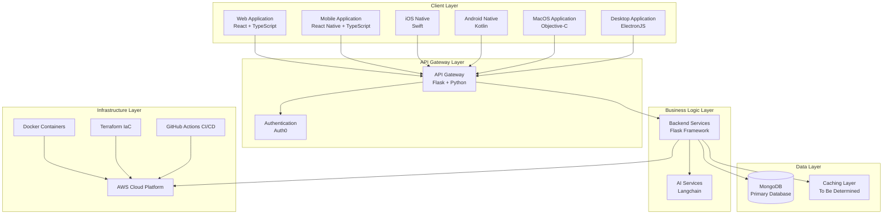
```mermaid
graph TB
    subgraph "Client Layer"
        WEB[Web Application<br/>React + TypeScript]
        MOBILE[Mobile Application<br/>React Native + TypeScript]
        IOS[iOS Native<br/>Swift]
        ANDROID[Android Native<br/>Kotlin]
        MACOS[MacOS Application<br/>Objective-C]
        DESKTOP[Desktop Application<br/>ElectronJS]
    end
    
    subgraph "API Gateway Layer"
        API[API Gateway<br/>Flask + Python]
        AUTH[Authentication<br/>Auth0]
    end
    
    subgraph "Business Logic Layer"
        FLASK[Backend Services<br/>Flask Framework]
        AI[AI Services<br/>Langchain]
    end
    
    subgraph "Data Layer"
        MONGO[(MongoDB<br/>Primary Database)]
        CACHE[Caching Layer<br/>To Be Determined]
    end
    
    subgraph "Infrastructure Layer"
        AWS[AWS Cloud Platform]
        DOCKER[Docker Containers]
        TERRAFORM[Terraform IaC]
        GITHUB[GitHub Actions CI/CD]
    end
    
    WEB --> API
    MOBILE --> API
    IOS --> API
    ANDROID --> API
    MACOS --> API
    DESKTOP --> API
    
    API --> AUTH
    API --> FLASK
    FLASK --> AI
    FLASK --> MONGO
    FLASK --> CACHE
    
    FLASK --> AWS
    DOCKER --> AWS
    TERRAFORM --> AWS
    GITHUB --> AWS
```

## 3.3 Programming Languages

### 3.3.1 Backend Languages

#### 3.3.1.1 Python (Target Version: 3.11+)

**Platform**: Backend services, API layer, AI/ML integration

**Selection Rationale**:
- **AI/ML Ecosystem**: Native integration with Langchain and extensive AI/ML library support
- **Rapid Development**: Simplified syntax enables faster backend development and prototyping
- **Community Support**: Extensive package ecosystem via PyPI with mature third-party libraries
- **Flask Compatibility**: Native language for Flask framework integration
- **Type Safety**: Type hints (PEP 484) provide optional static typing for improved code reliability

**Constraints & Dependencies**:
- Minimum version 3.11 required for modern async features and performance optimizations
- Virtual environment management required (venv/virtualenv)
- Dependency management via pip and requirements.txt or Poetry

### 3.3.2 Frontend Languages

#### 3.3.2.1 TypeScript (Target Version: 5.0+)

**Platform**: Web frontend (React), Mobile frontend (React Native), Desktop application (ElectronJS)

**Selection Rationale**:
- **Type Safety**: Static typing reduces runtime errors and improves code maintainability
- **React Ecosystem**: First-class support for React and React Native development
- **Developer Experience**: Superior IDE support with intelligent code completion and refactoring
- **Scalability**: Type system enables safer refactoring in large codebases
- **JavaScript Compatibility**: Superset of JavaScript ensures interoperability with existing libraries

**Constraints & Dependencies**:
- Requires TypeScript compiler (tsc) and build tooling
- Type definitions (@types/*) required for JavaScript libraries
- Compatible with ES6+ module systems

#### 3.3.2.2 JavaScript (Implicit via TypeScript)

**Platform**: Runtime environment for all frontend applications

**Selection Rationale**:
- **Universal Browser Support**: Native execution in all modern browsers
- **Node.js Runtime**: Enables server-side tooling and build processes
- **Ecosystem Standard**: Industry standard for web and cross-platform development

### 3.3.3 Native Platform Languages

#### 3.3.3.1 Swift (Target Version: 5.9+)

**Platform**: iOS native applications

**Selection Rationale**:
- **iOS Optimization**: Native language provides optimal performance on Apple's mobile platform
- **Modern Language Features**: Strong type safety, optionals, and memory safety
- **Apple Ecosystem**: Direct access to iOS SDKs and platform-specific features
- **SwiftUI Integration**: Modern declarative UI framework for iOS development

**Constraints & Dependencies**:
- Requires Xcode and iOS SDK
- macOS development environment required
- Minimum iOS deployment target to be determined based on user base

#### 3.3.3.2 Kotlin (Target Version: 1.9+)

**Platform**: Android native applications

**Selection Rationale**:
- **Android First**: Official language for Android development endorsed by Google
- **Java Interoperability**: Seamless integration with existing Java libraries and Android SDK
- **Modern Features**: Null safety, coroutines for async operations, and concise syntax
- **Performance**: Compiles to JVM bytecode with comparable performance to Java

**Constraints & Dependencies**:
- Requires Android Studio and Android SDK
- Gradle build system integration
- Minimum Android API level to be determined based on target market

#### 3.3.3.3 Objective-C (Target Version: 2.0)

**Platform**: MacOS desktop applications

**Selection Rationale**:
- **MacOS Legacy Support**: Mature language with extensive MacOS framework support
- **AppKit Integration**: Direct access to native MacOS UI components
- **Performance**: Compiled language with direct system-level access
- **Stability**: Well-established language for MacOS development

**Constraints & Dependencies**:
- Requires Xcode and MacOS SDK
- macOS development environment required
- Consideration for Swift migration in future iterations

**Note**: Future consideration may be given to migrating MacOS applications to Swift for consistency with iOS development and modern language features.

## 3.4 Frameworks & Libraries

### 3.4.1 Backend Framework

#### 3.4.1.1 Flask (Target Version: 3.0+)

**Purpose**: Primary backend web framework for RESTful API development

**Selection Rationale**:
- **Lightweight & Flexible**: Microframework approach allows modular architecture without unnecessary overhead
- **Python Native**: Seamless integration with Python ecosystem and AI/ML libraries
- **RESTful API Support**: Excellent support for building scalable API endpoints
- **Extension Ecosystem**: Rich plugin architecture for authentication, database integration, and middleware
- **Production Ready**: Mature framework with proven enterprise deployment patterns

**Compatibility Requirements**:
- Python 3.11+ required
- WSGI server (Gunicorn/uWSGI) for production deployment
- Compatible with async operations via asyncio integration

**Key Extensions (Planned)**:
- Flask-CORS: Cross-origin resource sharing for frontend integration
- Flask-RESTful: RESTful API development utilities
- Flask-JWT-Extended: JWT token management (if supplementing Auth0)
- Flask-SQLAlchemy: ORM integration if SQL database added

#### 3.4.1.2 Langchain (Target Version: 0.1+)

**Purpose**: AI and large language model (LLM) integration framework

**Selection Rationale**:
- **LLM Abstraction**: Unified interface for multiple LLM providers (OpenAI, Anthropic, etc.)
- **Chain Composition**: Modular approach to building complex AI workflows
- **Memory Management**: Built-in conversation history and context management
- **Tool Integration**: Framework for connecting LLMs with external tools and APIs
- **Agent Capabilities**: Support for autonomous AI agents with reasoning capabilities

**Compatibility Requirements**:
- Python 3.11+ required
- Integration with vector databases for embedding storage
- API keys required for LLM provider access

**Integration Considerations**:
- Security: API key management via environment variables
- Performance: Caching strategies for repeated queries
- Cost Management: Token usage monitoring and optimization

### 3.4.2 Frontend Frameworks

#### 3.4.2.1 React (Target Version: 18.2+)

**Purpose**: Web application user interface framework

**Selection Rationale**:
- **Component Architecture**: Reusable component model promotes code modularity
- **Virtual DOM**: Efficient rendering and optimal performance
- **Ecosystem Maturity**: Extensive third-party library support and community resources
- **TypeScript Support**: First-class TypeScript integration for type-safe development
- **Hooks API**: Modern state management and lifecycle capabilities

**Compatibility Requirements**:
- Node.js 18+ for development tooling
- Build tools: Vite or Create React App
- TypeScript 5.0+ for type checking

**Key Libraries (Planned)**:
- React Router: Client-side routing and navigation
- React Query/TanStack Query: Data fetching and caching
- React Hook Form: Form state management and validation
- Zustand/Redux: Global state management (to be determined based on complexity)

#### 3.4.2.2 React Native (Target Version: 0.73+)

**Purpose**: Cross-platform mobile application framework

**Selection Rationale**:
- **Code Reuse**: Shared codebase between iOS and Android platforms
- **Native Performance**: Bridges to native components for optimal performance
- **React Ecosystem**: Leverages React knowledge and component patterns
- **Hot Reloading**: Rapid development iteration with live code updates
- **Community Support**: Extensive library ecosystem and community plugins

**Compatibility Requirements**:
- Node.js 18+ required
- iOS: Xcode and CocoaPods
- Android: Android Studio and Gradle
- Metro bundler for JavaScript packaging

**Platform-Specific Considerations**:
- Native modules may require Swift/Kotlin bridge code
- Platform-specific styling and UI adjustments
- Navigation: React Navigation library for cross-platform routing

#### 3.4.2.3 TailwindCSS (Target Version: 3.4+)

**Purpose**: Utility-first CSS framework for styling

**Selection Rationale**:
- **Utility-First Approach**: Composable utility classes enable rapid UI development
- **Consistency**: Design system built into framework ensures visual consistency
- **Customization**: Highly configurable design tokens and theme system
- **Performance**: Purged CSS eliminates unused styles in production builds
- **Developer Experience**: IntelliSense support for IDE autocompletion

**Compatibility Requirements**:
- PostCSS processing pipeline
- Build tool integration (Vite/Webpack)
- TypeScript-safe class name usage

**Integration Patterns**:
- React: className-based styling
- React Native: React Native for Web or native styling alternatives
- Design System: Custom Tailwind configuration for brand consistency

#### 3.4.2.4 ElectronJS (Target Version: 28+)

**Purpose**: Cross-platform desktop application framework

**Selection Rationale**:
- **Web Technology Stack**: Reuses React/TypeScript codebase for desktop
- **Cross-Platform**: Single codebase for Windows, macOS, and Linux
- **Native APIs**: Access to file system, system tray, and native integrations
- **Auto-Update**: Built-in application update mechanisms
- **Chromium-Based**: Modern web rendering engine with full API support

**Compatibility Requirements**:
- Node.js 18+ required
- Platform-specific build dependencies
- Code signing certificates for distribution

**Architecture Considerations**:
- Main process (Node.js) vs. Renderer process (Chromium) separation
- IPC (Inter-Process Communication) for secure main-renderer communication
- Security: Context isolation and sandboxing enabled

### 3.4.3 Framework Integration Architecture

The following diagram illustrates framework interactions across the application stack:

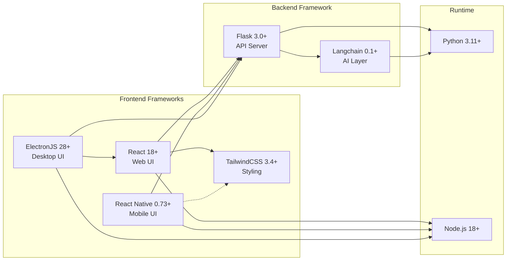
```mermaid
graph LR
subgraph "Frontend Frameworks"
    REACT[React 18+<br/>Web UI]
    RN[React Native 0.73+<br/>Mobile UI]
    ELECTRON[ElectronJS 28+<br/>Desktop UI]
    TAILWIND[TailwindCSS 3.4+<br/>Styling]
end

subgraph "Backend Framework"
    FLASK_FW[Flask 3.0+<br/>API Server]
    LANGCHAIN_FW[Langchain 0.1+<br/>AI Layer]
end

subgraph "Runtime"
    PYTHON_RT[Python 3.11+]
    NODE_RT[Node.js 18+]
end

REACT --> TAILWIND
RN -.-> TAILWIND
ELECTRON --> REACT

REACT --> FLASK_FW
RN --> FLASK_FW
ELECTRON --> FLASK_FW

FLASK_FW --> LANGCHAIN_FW

FLASK_FW --> PYTHON_RT
LANGCHAIN_FW --> PYTHON_RT

REACT --> NODE_RT
RN --> NODE_RT
ELECTRON --> NODE_RT
```

## 3.5 Open Source Dependencies

### 3.5.1 Dependency Management Strategy

#### 3.5.1.1 Backend Dependencies (Python)

**Package Registry**: PyPI (Python Package Index)

**Package Manager**: pip with requirements.txt or Poetry for advanced dependency resolution

**Dependency Categories**:

**Core Framework Dependencies**:
- `flask>=3.0.0` - Web framework
- `langchain>=0.1.0` - AI/LLM integration
- `pymongo>=4.6.0` - MongoDB driver
- `python-dotenv>=1.0.0` - Environment variable management

**API & Authentication**:
- `flask-cors>=4.0.0` - CORS middleware
- `authlib>=1.3.0` - Auth0 integration
- `pyjwt>=2.8.0` - JWT token handling

**Data Processing**:
- `pydantic>=2.5.0` - Data validation and serialization
- `pandas>=2.1.0` - Data manipulation (if analytics required)
- `numpy>=1.26.0` - Numerical operations (if AI features require)

**AI/ML Dependencies**:
- `openai>=1.6.0` - OpenAI API client (if using GPT models)
- `tiktoken>=0.5.0` - Token counting for LLM requests
- `chromadb>=0.4.0` - Vector database client (if embedding storage required)

**Production Server**:
- `gunicorn>=21.2.0` - WSGI HTTP server for production
- `gevent>=23.9.0` - Async worker support

**Development Dependencies**:
- `pytest>=7.4.0` - Testing framework
- `black>=23.12.0` - Code formatting
- `flake8>=7.0.0` - Linting
- `mypy>=1.8.0` - Static type checking

#### 3.5.1.2 Frontend Dependencies (Node.js)

**Package Registry**: npm (Node Package Manager)

**Package Manager**: npm or yarn (to be determined based on team preference)

**Dependency Categories**:

**React Web Dependencies**:
- `react@^18.2.0` - UI framework
- `react-dom@^18.2.0` - DOM rendering
- `typescript@^5.0.0` - Type system
- `vite@^5.0.0` - Build tool and dev server

**React Native Dependencies**:
- `react-native@^0.73.0` - Mobile framework
- `@react-native-community/cli@^12.0.0` - CLI tooling
- `@react-navigation/native@^6.1.0` - Navigation
- `@react-navigation/stack@^6.3.0` - Stack navigator

**ElectronJS Dependencies**:
- `electron@^28.0.0` - Desktop framework
- `electron-builder@^24.9.0` - Application packaging
- `electron-updater@^6.1.0` - Auto-update functionality

**UI & Styling**:
- `tailwindcss@^3.4.0` - CSS framework
- `postcss@^8.4.0` - CSS processing
- `autoprefixer@^10.4.0` - CSS vendor prefixing

**State Management & Data Fetching**:
- `@tanstack/react-query@^5.17.0` - Server state management
- `zustand@^4.4.0` or `@reduxjs/toolkit@^2.0.0` - Client state management
- `axios@^1.6.0` - HTTP client

**Form & Validation**:
- `react-hook-form@^7.49.0` - Form management
- `zod@^3.22.0` - Schema validation

**Development Dependencies**:
- `@typescript-eslint/parser@^6.18.0` - TypeScript ESLint parser
- `@typescript-eslint/eslint-plugin@^6.18.0` - TypeScript linting rules
- `prettier@^3.1.0` - Code formatting
- `vitest@^1.1.0` - Testing framework
- `@testing-library/react@^14.1.0` - React testing utilities

#### 3.5.1.3 Native Platform Dependencies

**iOS (Swift/Objective-C)**:
- **Package Manager**: CocoaPods or Swift Package Manager
- **Key Dependencies**: To be determined based on feature requirements
- **Common Libraries**: Alamofire (networking), SDWebImage (image loading), KeychainAccess (secure storage)

**Android (Kotlin)**:
- **Package Manager**: Gradle with Maven repositories
- **Key Dependencies**: To be determined based on feature requirements
- **Common Libraries**: Retrofit (networking), OkHttp (HTTP client), Room (local database)

### 3.5.2 Dependency Version Management

**Version Pinning Strategy**:
- **Backend**: Exact versions in requirements.txt for production reproducibility
- **Frontend**: Caret ranges (^) in package.json for minor version flexibility
- **Lock Files**: 
  - Python: requirements.lock or poetry.lock
  - Node.js: package-lock.json or yarn.lock

**Update Policy**:
- **Security Updates**: Applied immediately upon identification
- **Minor Updates**: Monthly review cycle
- **Major Updates**: Quarterly evaluation with breaking change assessment

### 3.5.3 Dependency Security

**Security Scanning**:
- **Python**: Safety or Snyk for vulnerability scanning
- **Node.js**: npm audit or Snyk for dependency auditing
- **CI/CD Integration**: Automated security checks in deployment pipeline

**License Compliance**:
- All dependencies must use permissive licenses (MIT, Apache 2.0, BSD)
- Copyleft licenses (GPL) require legal review
- License scanning via tools like FOSSA or LicenseFinder

## 3.6 Third-Party Services

### 3.6.1 Authentication Services

#### 3.6.1.1 Auth0

**Purpose**: Identity and access management (IAM) platform

**Selection Rationale**:
- **Enterprise-Grade Security**: Industry-leading authentication infrastructure with SOC 2 Type II compliance
- **Multi-Factor Authentication**: Built-in MFA support including SMS, email, and authenticator apps
- **Social Login Integration**: Pre-built connectors for Google, Facebook, GitHub, and other OAuth providers
- **Universal Login**: Centralized login page with customizable branding
- **Token Management**: JWT-based authentication with refresh token rotation
- **Role-Based Access Control**: Fine-grained permission management
- **SDK Support**: Native SDKs for Python, JavaScript, Swift, and Kotlin

**Integration Requirements**:
- **Backend**: Auth0 Python SDK with JWT validation middleware in Flask
- **Frontend**: Auth0 SPA SDK for React web application
- **Mobile**: Auth0 native SDKs for React Native, iOS (Swift), and Android (Kotlin)
- **Configuration**: Auth0 tenant configuration with application registrations per platform

**Security Considerations**:
- Secure token storage (httpOnly cookies for web, secure storage for mobile)
- Token refresh strategies to minimize exposure
- Rate limiting and brute force protection
- Audit logging for authentication events

### 3.6.2 Cloud Services

#### 3.6.2.1 Amazon Web Services (AWS)

**Purpose**: Primary cloud infrastructure platform

**Selection Rationale**:
- **Market Leader**: Most mature cloud platform with comprehensive service offerings
- **Service Breadth**: Complete suite from compute to AI/ML services
- **Global Infrastructure**: Multi-region deployment capabilities for scalability
- **Security & Compliance**: Extensive compliance certifications (SOC, ISO, HIPAA, etc.)
- **Cost Management**: Granular pricing with cost optimization tools

**Planned Service Utilization**:

**Compute Services**:
- **Amazon ECS (Elastic Container Service)**: Docker container orchestration
- **AWS Fargate**: Serverless container execution
- **Amazon EC2**: Virtual machines for specialized workloads (if required)

**Storage Services**:
- **Amazon S3**: Object storage for static assets, file uploads, and backups
- **Amazon EBS**: Block storage for persistent data volumes

**Database Services**:
- **Amazon DocumentDB**: MongoDB-compatible managed database (alternative to self-hosted MongoDB)
- **Amazon ElastiCache**: Redis/Memcached for caching layer

**Networking**:
- **Amazon VPC**: Isolated network environment
- **Application Load Balancer**: HTTP/HTTPS traffic distribution
- **Amazon Route 53**: DNS management and routing

**Security & Monitoring**:
- **AWS IAM**: Identity and access management for AWS resources
- **AWS Secrets Manager**: Secure credential and API key storage
- **Amazon CloudWatch**: Logging, monitoring, and alerting
- **AWS WAF**: Web application firewall for API protection

**CI/CD Integration**:
- **Amazon ECR**: Docker container registry
- **AWS CodeDeploy**: Automated deployment service (if supplementing GitHub Actions)

**Integration Requirements**:
- AWS SDK for Python (boto3) for backend integration
- Terraform AWS provider for infrastructure provisioning
- AWS CLI for development and deployment automation

### 3.6.3 AI & LLM Services

#### 3.6.3.1 OpenAI API (Potential Integration)

**Purpose**: Large language model access for AI features

**Considerations**:
- **Integration**: Via Langchain abstraction layer
- **Models**: GPT-4, GPT-3.5-turbo depending on use case requirements
- **Cost Management**: Token usage monitoring and rate limiting
- **Alternatives**: Anthropic Claude, Google PaLM, or open-source models via Hugging Face

**Note**: Specific LLM provider selection pending feature requirements definition

### 3.6.4 Monitoring & Observability

#### 3.6.4.1 Monitoring Solutions (To Be Determined)

**Candidates Under Consideration**:
- **DataDog**: Comprehensive APM and infrastructure monitoring
- **New Relic**: Application performance monitoring
- **Sentry**: Error tracking and crash reporting
- **AWS CloudWatch**: Native AWS monitoring solution

**Requirements**:
- Real-time application performance monitoring
- Error tracking and alerting
- Distributed tracing for microservices
- Log aggregation and analysis
- Custom metrics and dashboards

**Selection Criteria**:
- Cost-effectiveness at scale
- Integration with AWS and application stack
- Alerting capabilities and notification channels
- Team familiarity and learning curve

### 3.6.5 Communication Services (Future Consideration)

**Potential Services**:
- **SendGrid/Amazon SES**: Transactional email delivery
- **Twilio**: SMS notifications and voice capabilities
- **Pusher/Amazon SNS**: Real-time push notifications

**Note**: Communication service selection pending feature requirements

### 3.6.6 Third-Party Service Architecture

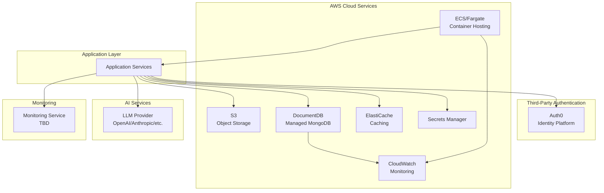
```mermaid
graph TB
subgraph "Application Layer"
    APP[Application Services]
end

subgraph "Third-Party Authentication"
    AUTH0["Auth0<br/>Identity Platform"]
end

subgraph "AWS Cloud Services"
    ECS["ECS/Fargate<br/>Container Hosting"]
    S3["S3<br/>Object Storage"]
    DB["DocumentDB<br/>Managed MongoDB"]
    CACHE["ElastiCache<br/>Caching"]
    SECRETS["Secrets Manager"]
    CLOUDWATCH["CloudWatch<br/>Monitoring"]
end

subgraph "AI Services"
    LLM["LLM Provider<br/>OpenAI/Anthropic/etc."]
end

subgraph "Monitoring"
    MONITORING["Monitoring Service<br/>TBD"]
end

APP --> AUTH0
APP --> LLM

ECS --> APP
APP --> DB
APP --> CACHE
APP --> S3
APP --> SECRETS

APP --> MONITORING
ECS --> CLOUDWATCH
DB --> CLOUDWATCH
```

## 3.7 Databases & Storage

### 3.7.1 Primary Database

#### 3.7.1.1 MongoDB (Target Version: 7.0+)

**Purpose**: Primary document-oriented NoSQL database

**Selection Rationale**:
- **Document Model**: JSON-like document structure aligns with JavaScript/TypeScript frontend data models
- **Schema Flexibility**: Dynamic schema enables rapid iteration during development
- **Scalability**: Horizontal scaling via sharding for future growth
- **Query Capabilities**: Rich query language with aggregation framework for complex data operations
- **Python Integration**: Mature PyMongo driver with excellent Flask integration
- **Geospatial Support**: Built-in geospatial queries if location-based features required
- **Change Streams**: Real-time data change notifications for reactive features

**Deployment Options**:
- **Development**: Local MongoDB instance or MongoDB Atlas free tier
- **Production**: 
  - **Option A**: Amazon DocumentDB (MongoDB-compatible managed service)
  - **Option B**: MongoDB Atlas (fully managed MongoDB)
  - **Option C**: Self-managed MongoDB on AWS ECS

**Recommended Approach**: Amazon DocumentDB for AWS integration and managed service benefits

**Data Persistence Strategy**:
- **Collections**: Organized by domain entities (users, sessions, documents, etc.)
- **Indexes**: Strategic indexing on frequently queried fields
- **Replica Sets**: Multi-node replication for high availability
- **Backup Strategy**: Automated daily backups with point-in-time recovery

**Schema Design Principles**:
- Embedding for one-to-few relationships
- Referencing for one-to-many and many-to-many relationships
- Denormalization for read-heavy operations
- Schema validation via MongoDB schema validation or Pydantic models

### 3.7.2 Caching Solutions

#### 3.7.2.1 Redis (Target Version: 7.2+)

**Purpose**: In-memory data store for caching and session management

**Selection Rationale**:
- **Performance**: Sub-millisecond response times for cached data retrieval
- **Data Structures**: Rich data structure support (strings, hashes, lists, sets, sorted sets)
- **Persistence Options**: Optional disk persistence for durability
- **Pub/Sub**: Real-time messaging capabilities for event-driven features
- **Session Storage**: Efficient storage for user sessions and authentication tokens
- **Rate Limiting**: Token bucket implementation for API rate limiting

**Deployment**: Amazon ElastiCache for Redis (managed service)

**Caching Strategy**:
- **Cache-Aside Pattern**: Application explicitly manages cache population
- **API Response Caching**: Cache frequent API responses with TTL-based expiration
- **Session Management**: Store user session data with automatic expiration
- **Database Query Caching**: Cache expensive MongoDB aggregation results
- **Rate Limiting**: Track API request counts per user/IP

**Cache Invalidation**:
- **Time-Based**: TTL (Time To Live) for automatic expiration
- **Event-Based**: Invalidate on data mutations
- **Manual**: Administrative cache clearing when required

### 3.7.3 Object Storage

#### 3.7.3.1 Amazon S3

**Purpose**: Scalable object storage for files and static assets

**Use Cases**:
- **Static Assets**: Frontend build artifacts (JavaScript bundles, CSS, images)
- **User Uploads**: Profile images, documents, media files
- **Backups**: Database backups and application state snapshots
- **Logs**: Long-term log archival
- **AI Artifacts**: Model outputs, generated content

**Storage Classes**:
- **S3 Standard**: Frequently accessed data (user uploads, active files)
- **S3 Intelligent-Tiering**: Automatic cost optimization for varying access patterns
- **S3 Glacier**: Long-term archival (old backups, compliance data)

**Security Configuration**:
- **Access Control**: IAM policies and bucket policies for fine-grained permissions
- **Encryption**: Server-side encryption (SSE-S3 or SSE-KMS) for data at rest
- **Versioning**: Object versioning for accidental deletion protection
- **Lifecycle Policies**: Automatic transition to cheaper storage classes

**Integration**:
- **Backend**: boto3 (AWS SDK for Python) for S3 operations
- **Frontend**: Pre-signed URLs for direct client uploads
- **CDN**: Amazon CloudFront for global content delivery (optional)

### 3.7.4 Data Architecture

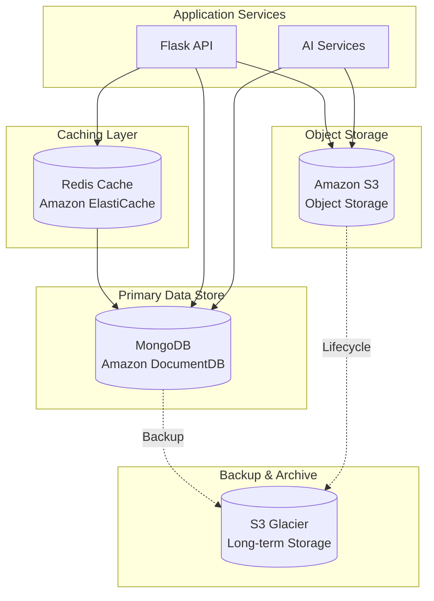
```mermaid
graph TB
    subgraph "Application Services"
        API[Flask API]
        AI[AI Services]
    end
    
    subgraph "Caching Layer"
        REDIS[(Redis Cache<br/>Amazon ElastiCache)]
    end
    
    subgraph "Primary Data Store"
        MONGO[(MongoDB<br/>Amazon DocumentDB)]
    end
    
    subgraph "Object Storage"
        S3[(Amazon S3<br/>Object Storage)]
    end
    
    subgraph "Backup & Archive"
        BACKUP[(S3 Glacier<br/>Long-term Storage)]
    end
    
    API --> REDIS
    REDIS --> MONGO
    API --> MONGO
    API --> S3
    AI --> MONGO
    AI --> S3
    
    MONGO -.Backup.-> BACKUP
    S3 -.Lifecycle.-> BACKUP
```

### 3.7.5 Data Persistence Strategy

#### 3.7.5.1 Data Classification

| Data Type | Storage Solution | Rationale |
|-----------|-----------------|-----------|
| Structured Application Data | MongoDB | Document model, query capabilities |
| User Sessions | Redis | Fast access, automatic expiration |
| Cached API Responses | Redis | Sub-millisecond response times |
| User-Uploaded Files | S3 | Scalable object storage |
| Static Assets | S3 + CloudFront (optional) | Global content delivery |
| Database Backups | S3 Glacier | Cost-effective long-term storage |
| Application Logs | CloudWatch + S3 | Real-time monitoring + archival |

#### 3.7.5.2 Data Durability & Availability

**MongoDB/DocumentDB**:
- **Durability**: Multi-AZ replication with automatic failover
- **Availability Target**: 99.99% uptime SLA
- **Backup Schedule**: Daily automated snapshots with 7-day retention
- **Recovery**: Point-in-time recovery within backup retention window

**Redis/ElastiCache**:
- **Durability**: Optional AOF (Append-Only File) persistence
- **Availability**: Multi-AZ replication for automatic failover
- **Backup**: Daily snapshots (if persistence enabled)
- **Recovery**: Snapshot-based restoration

**Amazon S3**:
- **Durability**: 99.999999999% (11 nines) durability
- **Availability**: 99.99% availability SLA
- **Redundancy**: Automatic replication across multiple availability zones
- **Versioning**: Object versioning enabled for accidental deletion protection

## 3.8 Development & Deployment

### 3.8.1 Development Tools

#### 3.8.1.1 Version Control

**Tool**: Git with GitHub

**Repository Structure**:
- **Monorepo**: Single repository containing all application components
- **Branch Strategy**: 
  - `main`: Production-ready code
  - `develop`: Integration branch for ongoing development
  - `feature/*`: Feature development branches
  - `hotfix/*`: Production bug fixes
- **Commit Conventions**: Conventional Commits specification for semantic versioning

**Code Review Process**:
- Pull request required for all changes
- Minimum one approval before merge
- Automated checks must pass (linting, tests, security scans)

#### 3.8.1.2 Integrated Development Environments

**Backend Development**:
- **PyCharm** or **VS Code** with Python extensions
- **Extensions**: Python, Pylance, Black Formatter, Flake8

**Frontend Development**:
- **VS Code** with TypeScript/React extensions
- **Extensions**: ESLint, Prettier, Tailwind CSS IntelliSense, TypeScript

**Native Development**:
- **iOS**: Xcode
- **Android**: Android Studio
- **MacOS**: Xcode

#### 3.8.1.3 Local Development Environment

**Backend**:
- Python virtual environment (venv)
- Local MongoDB instance or MongoDB Atlas development cluster
- Local Redis instance
- Environment variable management via .env files

**Frontend**:
- Node.js 18+ with npm/yarn
- Vite development server with hot module replacement
- React DevTools browser extension

**Mobile**:
- iOS Simulator (Xcode) or Android Emulator (Android Studio)
- React Native CLI with Metro bundler
- Physical device testing via USB debugging

**Docker Compose** (optional for local development):
- Containerized MongoDB and Redis
- Backend API container
- Simplified local environment setup

### 3.8.2 Build System

#### 3.8.2.1 Backend Build

**Build Tool**: pip for dependency installation

**Build Process**:
1. Create virtual environment
2. Install dependencies from requirements.txt
3. Run database migrations (if applicable)
4. Run linters and formatters (Black, Flake8)
5. Execute test suite (pytest)
6. Generate coverage reports

**Production Build**:
- Compile Python bytecode (.pyc) for faster startup
- Generate optimized dependency list
- Security vulnerability scanning

#### 3.8.2.2 Frontend Build

**Build Tool**: Vite (web), Metro (React Native), Webpack (Electron)

**Web Build Process**:
1. TypeScript compilation and type checking
2. JavaScript/TypeScript bundling and minification
3. CSS processing (Tailwind compilation and purging)
4. Asset optimization (image compression, lazy loading)
5. Source map generation
6. Bundle analysis for size optimization

**Output**:
- Optimized production bundles
- Static HTML, CSS, and JavaScript files
- Deployed to S3 or CDN

**Mobile Build Process**:
- **iOS**: Xcode build with code signing
- **Android**: Gradle build with APK/AAB generation
- **Code Signing**: Required for distribution

**Desktop Build Process**:
- Electron application packaging
- Platform-specific installers (DMG for macOS, EXE for Windows, AppImage for Linux)
- Code signing for trusted installation

### 3.8.3 Containerization

#### 3.8.3.1 Docker (Target Version: 24.0+)

**Purpose**: Application containerization for consistent deployment

**Selection Rationale**:
- **Environment Consistency**: Identical runtime across development, staging, and production
- **Isolation**: Process and filesystem isolation for security and stability
- **Portability**: Run anywhere Docker is supported
- **Resource Efficiency**: Lightweight compared to virtual machines
- **Orchestration Ready**: Compatible with ECS, Kubernetes, and other orchestrators

**Container Strategy**:

**Backend Container**:
```dockerfile
# Base: Python 3.11 slim
# Contains: Flask application, dependencies, Gunicorn
# Exposed Port: 5000
# Health Check: GET /health endpoint
```

**Container Images**:
- **Base Image**: python:3.11-slim-bookworm
- **Multi-Stage Build**: Separate build and runtime stages for minimal image size
- **Security**: Non-root user execution, minimal installed packages

**Image Repository**: Amazon ECR (Elastic Container Registry)

**Container Configuration**:
- Environment variables for configuration
- Volume mounts for logs and temporary data
- Network: Bridge network for inter-container communication
- Resource limits: CPU and memory constraints

#### 3.8.3.2 Docker Compose (Development)

**Purpose**: Multi-container orchestration for local development

**Services Defined**:
- Backend API service
- MongoDB service
- Redis service
- (Optional) Frontend development server

**Benefits**:
- One-command environment startup
- Service dependency management
- Consistent development environment across team

### 3.8.4 Infrastructure as Code

#### 3.8.4.1 Terraform (Target Version: 1.6+)

**Purpose**: Declarative infrastructure provisioning and management

**Selection Rationale**:
- **Multi-Cloud Support**: Cloud-agnostic infrastructure definition
- **State Management**: Centralized state tracking for infrastructure changes
- **Version Control**: Infrastructure as code in Git repository
- **Plan & Apply**: Preview changes before execution
- **Module Ecosystem**: Reusable infrastructure components

**Infrastructure Components Managed**:
- **Networking**: VPC, subnets, security groups, load balancers
- **Compute**: ECS clusters, task definitions, services
- **Storage**: S3 buckets with policies and lifecycle rules
- **Database**: DocumentDB clusters and instances
- **Caching**: ElastiCache Redis clusters
- **Security**: IAM roles, policies, security groups
- **Secrets**: AWS Secrets Manager entries
- **Monitoring**: CloudWatch alarms and log groups

**Terraform Structure**:
```
terraform/
├── environments/
│   ├── dev/
│   ├── staging/
│   └── production/
├── modules/
│   ├── networking/
│   ├── compute/
│   ├── database/
│   └── monitoring/
├── main.tf
├── variables.tf
└── outputs.tf
```

**State Management**:
- **Backend**: S3 bucket with DynamoDB state locking
- **Encryption**: Server-side encryption for state files
- **Access Control**: IAM-based access to state

**Workflow**:
1. Write/modify Terraform configuration
2. `terraform plan` - Preview infrastructure changes
3. Review plan output
4. `terraform apply` - Execute changes
5. Commit Terraform code to Git

### 3.8.5 Continuous Integration / Continuous Deployment

#### 3.8.5.1 GitHub Actions

**Purpose**: Automated CI/CD pipeline

**Selection Rationale**:
- **Native GitHub Integration**: Seamless integration with source repository
- **Workflow Flexibility**: YAML-based workflow configuration
- **Matrix Builds**: Test across multiple environments simultaneously
- **Extensive Marketplace**: Pre-built actions for common tasks
- **Secrets Management**: Secure credential storage
- **Cost Effective**: Free for public repositories, generous free tier for private

**CI/CD Workflows**:

**Continuous Integration (CI)**:

**Triggered On**: Pull request, push to develop/main branches

**Backend CI Steps**:
1. Checkout code
2. Set up Python environment
3. Install dependencies
4. Run linters (Black, Flake8, mypy)
5. Execute test suite (pytest)
6. Generate code coverage report
7. Security scanning (Bandit, Safety)
8. Upload coverage to CodeCov (optional)

**Frontend CI Steps**:
1. Checkout code
2. Set up Node.js environment
3. Install dependencies (npm ci)
4. Run linters (ESLint, Prettier)
5. TypeScript type checking
6. Execute test suite (Vitest/Jest)
7. Build production bundle
8. Run bundle size analysis

**Continuous Deployment (CD)**:

**Triggered On**: Merge to main branch (production), merge to develop (staging)

**Deployment Steps**:
1. Run CI pipeline (all checks must pass)
2. Build Docker image
3. Tag image with commit SHA and version
4. Push image to Amazon ECR
5. Update ECS task definition with new image
6. Deploy to ECS cluster (rolling update)
7. Run smoke tests against deployed environment
8. Notify team (Slack/email) of deployment status

**Environment-Specific Deployments**:
- **Development**: Automatic deployment on merge to develop
- **Staging**: Automatic deployment with manual approval gate
- **Production**: Manual approval required + deployment window enforcement

**Rollback Strategy**:
- **Automated**: Rollback on failed health checks
- **Manual**: Redeploy previous task definition version via AWS ECS

**Workflow Configuration**:
```
.github/
└── workflows/
    ├── backend-ci.yml
    ├── frontend-ci.yml
    ├── deploy-staging.yml
    └── deploy-production.yml
```

**Secrets Configuration** (GitHub Secrets):
- AWS access credentials
- Auth0 credentials
- MongoDB connection strings
- API keys for third-party services
- Docker registry credentials

### 3.8.6 Development & Deployment Architecture

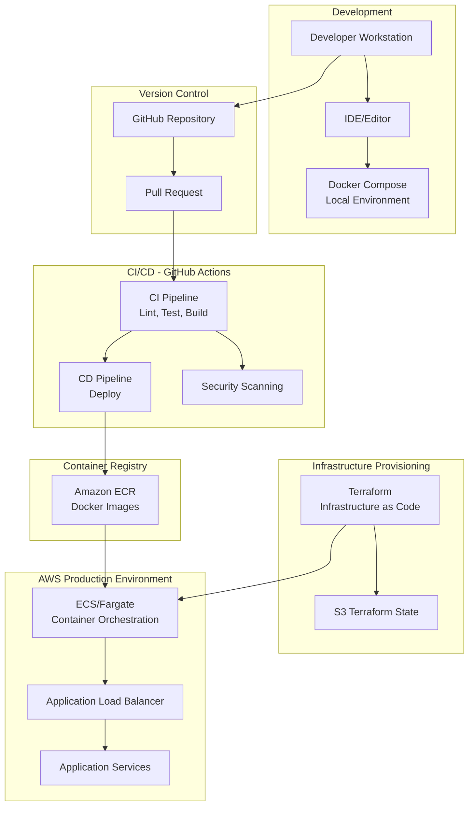
```mermaid
graph TB
    subgraph "Development"
        DEV[Developer Workstation]
        IDE[IDE/Editor]
        DOCKER_LOCAL[Docker Compose<br/>Local Environment]
    end
    
    subgraph "Version Control"
        GITHUB[GitHub Repository]
        PR[Pull Request]
    end
    
    subgraph "CI/CD - GitHub Actions"
        CI[CI Pipeline<br/>Lint, Test, Build]
        CD[CD Pipeline<br/>Deploy]
        SECURITY[Security Scanning]
    end
    
    subgraph "Container Registry"
        ECR[Amazon ECR<br/>Docker Images]
    end
    
    subgraph "Infrastructure Provisioning"
        TERRAFORM[Terraform<br/>Infrastructure as Code]
        TF_STATE[S3 Terraform State]
    end
    
    subgraph "AWS Production Environment"
        ECS[ECS/Fargate<br/>Container Orchestration]
        ALB[Application Load Balancer]
        SERVICES[Application Services]
    end
    
    DEV --> IDE
    IDE --> DOCKER_LOCAL
    DEV --> GITHUB
    
    GITHUB --> PR
    PR --> CI
    CI --> SECURITY
    CI --> CD
    
    CD --> ECR
    ECR --> ECS
    
    TERRAFORM --> TF_STATE
    TERRAFORM --> ECS
    
    ECS --> ALB
    ALB --> SERVICES
```

### 3.8.7 Environment Configuration

#### 3.8.7.1 Environment Variables

**Configuration Management**: Environment-specific variables stored securely

**Development**:
- `.env` files (git-ignored)
- python-dotenv for loading
- Local credentials and endpoints

**Staging/Production**:
- AWS Secrets Manager for sensitive credentials
- ECS task definition environment variables for non-sensitive config
- Parameter Store for application configuration

**Required Environment Variables**:
- `FLASK_ENV`: Application environment (development/staging/production)
- `DATABASE_URL`: MongoDB connection string
- `REDIS_URL`: Redis connection string
- `AUTH0_DOMAIN`: Auth0 tenant domain
- `AUTH0_CLIENT_ID`: Auth0 application client ID
- `AUTH0_CLIENT_SECRET`: Auth0 application secret
- `AWS_REGION`: AWS deployment region
- `S3_BUCKET`: S3 bucket name for file storage
- `LOG_LEVEL`: Application logging level

#### 3.8.7.2 Configuration Hierarchy

**Precedence Order** (highest to lowest):
1. Environment variables (production)
2. .env file (development)
3. Configuration file defaults
4. Application defaults

### 3.8.8 Quality Assurance

**Code Quality Tools**:
- **Python**: Black (formatting), Flake8 (linting), mypy (type checking), Bandit (security)
- **JavaScript/TypeScript**: Prettier (formatting), ESLint (linting), TypeScript compiler (type checking)

**Testing Strategy**:
- **Unit Tests**: pytest (backend), Vitest/Jest (frontend)
- **Integration Tests**: API endpoint testing, database integration testing
- **End-to-End Tests**: Playwright or Cypress (optional, future consideration)
- **Coverage Target**: Minimum 80% code coverage

**Performance Testing**:
- Load testing with Locust or k6 (future consideration)
- Performance monitoring via APM tools

## 3.9 Technology Decision Matrix

### 3.9.1 Decision Criteria

The following matrix summarizes key technology decisions and their rationale:

| Category | Technology | Primary Driver | Alternative Considered | Decision Rationale |
|----------|-----------|----------------|----------------------|-------------------|
| Backend Language | Python 3.11+ | AI/ML ecosystem, Flask compatibility | Node.js, Go | Superior AI library support (Langchain), rapid development |
| Backend Framework | Flask | Lightweight, flexible | FastAPI, Django | Microframework flexibility, extensive ecosystem |
| Frontend Framework | React 18+ | Component model, ecosystem | Vue.js, Angular | Largest ecosystem, TypeScript support, hiring pool |
| Mobile Framework | React Native | Code reuse with web | Flutter, Native | Shared React knowledge, cross-platform efficiency |
| Database | MongoDB | Schema flexibility, JSON alignment | PostgreSQL, MySQL | Document model matches app data structures |
| Caching | Redis | Performance, data structures | Memcached | Rich data structure support beyond simple caching |
| Authentication | Auth0 | Enterprise features, security | AWS Cognito, self-hosted | Fastest implementation, security best practices built-in |
| Cloud Platform | AWS | Service breadth, maturity | Google Cloud, Azure | Most comprehensive service catalog, team familiarity |
| Containerization | Docker | Portability, consistency | Native deployment | Environment consistency, orchestration compatibility |
| IaC | Terraform | Multi-cloud, ecosystem | CloudFormation, Pulumi | Cloud-agnostic, declarative approach |
| CI/CD | GitHub Actions | GitHub integration | GitLab CI, Jenkins | Native repository integration, extensive marketplace |
| CSS Framework | TailwindCSS | Utility-first, consistency | Bootstrap, Material-UI | Rapid development, design system flexibility |

### 3.9.2 Security Considerations

**Technology Stack Security Measures**:

**Backend Security**:
- Python dependency scanning (Safety, Bandit)
- JWT token validation and expiration
- Input validation via Pydantic
- SQL injection prevention (though MongoDB uses BSON)
- CORS configuration for API access control

**Frontend Security**:
- Content Security Policy (CSP) headers
- XSS prevention via React's built-in escaping
- Secure token storage (httpOnly cookies, secure storage APIs)
- HTTPS enforcement for all communication
- Dependency vulnerability scanning (npm audit, Snyk)

**Infrastructure Security**:
- VPC isolation with private subnets
- Security groups for network access control
- IAM roles with least-privilege principles
- Secrets Manager for credential storage
- Encryption at rest and in transit
- WAF rules for API protection

**Authentication Security**:
- Auth0 multi-factor authentication
- Token refresh rotation
- Session timeout enforcement
- Anomaly detection (via Auth0)

### 3.9.3 Scalability Considerations

**Horizontal Scalability**:
- **Backend**: ECS auto-scaling based on CPU/memory metrics
- **Database**: MongoDB sharding for data distribution
- **Caching**: Redis cluster mode for distributed caching

**Vertical Scalability**:
- **Compute**: ECS task definition resource adjustments
- **Database**: DocumentDB instance class upgrades

**Performance Optimization**:
- **Caching Strategy**: Multi-layer caching (Redis, CDN)
- **Database Indexing**: Strategic index creation on query patterns
- **CDN**: CloudFront for static asset delivery
- **Load Balancing**: Application Load Balancer with health checks

### 3.9.4 Cost Optimization

**Cost Management Strategies**:
- **Compute**: Fargate Spot instances for non-critical workloads
- **Storage**: S3 lifecycle policies for automatic tiering
- **Database**: Right-sized instance selection with monitoring
- **Development**: Free-tier utilization for development environments
- **Monitoring**: CloudWatch metric filtering to reduce costs

**Estimated Cost Factors**:
- ECS Fargate: CPU and memory allocation per task
- DocumentDB: Instance class and storage
- ElastiCache: Node type and number of nodes
- S3: Storage volume and request patterns
- Data Transfer: Cross-AZ and internet egress

**Cost Monitoring**:
- AWS Cost Explorer for spend analysis
- Budget alerts for threshold notifications
- Resource tagging for cost allocation

## 3.10 Technology Integration Patterns

### 3.10.1 Frontend-Backend Integration

**API Communication**:
- **Protocol**: RESTful HTTP/HTTPS with JSON payloads
- **Authentication**: Bearer token (JWT) in Authorization header
- **Error Handling**: Standard HTTP status codes with structured error responses

**Request Flow**:
1. Frontend: User action triggers API request
2. Frontend: Attach JWT from Auth0 authentication
3. Backend: Validate JWT signature and expiration
4. Backend: Process request, query database/cache
5. Backend: Return JSON response
6. Frontend: Update UI based on response

**State Management**:
- React Query for server state synchronization
- Optimistic updates for improved perceived performance
- Automatic retry logic for failed requests

### 3.10.2 AI Service Integration

**Langchain Integration Pattern**:
1. User request received by Flask API
2. API constructs Langchain prompt/chain
3. Langchain invokes LLM provider (OpenAI, etc.)
4. Response processed and stored in MongoDB
5. Result returned to frontend

**Caching Strategy**:
- Cache LLM responses by input hash
- TTL-based expiration for dynamic content
- Redis storage for fast retrieval

### 3.10.3 Authentication Flow

**Web Application Flow**:
1. User clicks login button
2. Redirect to Auth0 Universal Login
3. User authenticates (credentials/social/MFA)
4. Auth0 redirects back with authorization code
5. Exchange code for JWT tokens
6. Store tokens securely (httpOnly cookie)
7. Include access token in API requests

**Mobile Application Flow**:
- Native Auth0 SDK with system browser
- Secure token storage in iOS Keychain / Android Keystore
- Automatic token refresh

**Token Refresh**:
- Access token: Short-lived (15 minutes)
- Refresh token: Long-lived (7 days)
- Automatic refresh before expiration
- Silent re-authentication when refresh token expires

## 3.11 Migration & Evolution Strategy

### 3.11.1 Technology Adoption Path

**Phase 1: Core Infrastructure** (Initial Implementation)
- AWS account setup and IAM configuration
- Terraform infrastructure provisioning
- MongoDB and Redis deployment
- Basic Flask API skeleton

**Phase 2: Authentication & Frontend** (Week 2-4)
- Auth0 tenant configuration
- React web application setup
- Basic authentication flow
- API integration

**Phase 3: AI Integration** (Week 4-6)
- Langchain framework integration
- LLM provider setup
- AI feature implementation

**Phase 4: Mobile Applications** (Week 6-10)
- React Native application development
- Platform-specific native modules
- App store preparation

**Phase 5: Production Hardening** (Week 10-12)
- CI/CD pipeline completion
- Monitoring and alerting setup
- Performance optimization
- Security audit

### 3.11.2 Technology Upgrade Policy

**Version Upgrade Strategy**:
- **Minor Versions**: Evaluated monthly, applied if security/performance benefits
- **Major Versions**: Evaluated quarterly, with dedicated upgrade sprint
- **Security Patches**: Applied immediately upon release

**Upgrade Process**:
1. Review release notes and breaking changes
2. Test in development environment
3. Deploy to staging environment
4. Run full test suite
5. Monitor for issues (24-48 hours)
6. Deploy to production with rollback plan

### 3.11.3 Future Technology Considerations

**Potential Future Additions**:
- **GraphQL**: Alternative to REST API for more efficient data fetching
- **Kubernetes**: Container orchestration for multi-cloud deployment
- **Message Queue**: RabbitMQ or Amazon SQS for async processing
- **Search Engine**: Elasticsearch for advanced search capabilities
- **Real-Time**: WebSockets for real-time features
- **Analytics**: Segment, Mixpanel, or Amplitude for user analytics

**Evaluation Criteria**:
- Addresses specific performance or scalability bottleneck
- Provides measurable business value
- Team has capacity to learn and maintain
- Cost-justified by benefits

## 3.12 Technology Compliance & Standards

### 3.12.1 Coding Standards

**Python Backend**:
- PEP 8 style guide compliance
- Type hints for all function signatures
- Docstrings for all public modules, classes, and functions
- Maximum line length: 100 characters

**TypeScript Frontend**:
- Airbnb TypeScript style guide
- Strict TypeScript configuration
- ESLint and Prettier enforcement
- Functional components with hooks (React)

**Code Review Checklist**:
- All tests passing
- Code coverage maintained/improved
- No linter warnings
- Security best practices followed
- Documentation updated

### 3.12.2 Security Standards

**OWASP Top 10 Compliance**:
- Injection prevention
- Broken authentication protection (via Auth0)
- Sensitive data exposure prevention (encryption)
- XML external entities prevention (N/A - JSON API)
- Broken access control prevention (RBAC)
- Security misconfiguration prevention (automated scanning)
- Cross-site scripting prevention (React auto-escaping)
- Insecure deserialization prevention
- Vulnerable components monitoring (dependency scanning)
- Insufficient logging and monitoring prevention (CloudWatch)

**Compliance Frameworks** (Future Consideration):
- SOC 2 Type II
- GDPR (if EU users)
- HIPAA (if healthcare data)
- PCI DSS (if payment processing)

### 3.12.3 Performance Standards

**API Performance Targets**:
- Response time: < 200ms (p95) for non-AI endpoints
- Response time: < 2s (p95) for AI-powered endpoints
- Uptime: 99.9% availability
- Error rate: < 0.1% of requests

**Frontend Performance Targets**:
- First Contentful Paint: < 1.8s
- Time to Interactive: < 3.9s
- Cumulative Layout Shift: < 0.1
- Lighthouse score: > 90

**Database Performance**:
- Query response time: < 100ms (p95)
- Index coverage: > 95% of queries

## 3.13 References

### 3.13.1 Documentation Sources

**No repository files examined** - This technology stack documentation is based on:

1. **Default Technology Stack Specification**: Provided in section prompt defining target technologies
2. **Technical Specification Context**: 
   - Section 1.1 Executive Summary - Confirmed empty codebase status
   - Section 1.2 System Overview - Verified no existing system implementation
   - Section 2.1 Feature Catalog - Confirmed no defined features yet
   - Section 2.2 Functional Requirements - Confirmed no requirements defined

### 3.13.2 Technology References

**Official Documentation**:
- Python: https://docs.python.org/3/
- Flask: https://flask.palletsprojects.com/
- React: https://react.dev/
- TypeScript: https://www.typescriptlang.org/docs/
- MongoDB: https://www.mongodb.com/docs/
- Docker: https://docs.docker.com/
- Terraform: https://developer.hashicorp.com/terraform/docs
- AWS Services: https://docs.aws.amazon.com/
- Auth0: https://auth0.com/docs

**Framework & Library Documentation**:
- Langchain: https://python.langchain.com/docs/
- React Native: https://reactnative.dev/docs/
- TailwindCSS: https://tailwindcss.com/docs
- ElectronJS: https://www.electronjs.org/docs
- GitHub Actions: https://docs.github.com/en/actions

### 3.13.3 Current Status Summary

**Technology Implementation Status**: This document describes a **target technology stack** for an empty codebase. No technologies are currently implemented. All selections represent planned architecture pending project initiation and feature definition.

**Next Steps for Implementation**:
1. Define business requirements and feature scope (Section 2)
2. Initialize repository with selected technology stack
3. Set up development environments
4. Configure AWS infrastructure via Terraform
5. Implement authentication with Auth0
6. Develop core API endpoints with Flask
7. Build frontend applications with React/React Native
8. Establish CI/CD pipelines with GitHub Actions
9. Deploy to AWS ECS for staging and production environments

---

**Document Version**: 1.0  
**Last Updated**: Generated for empty codebase baseline  
**Status**: Target Architecture - Not Implemented

# 4. Process Flowchart

## 4.1 Current Process State

### 4.1.1 Implementation Status

**No business processes, workflows, or system interactions are currently implemented in this empty codebase.** The repository contains no executable code, process logic, or workflow implementations to document.

### 4.1.2 Current State Summary

| Process Category | Current Status |
|-----------------|----------------|
| Core Business Processes | Not implemented |
| User Journeys | Not defined |
| Integration Workflows | Not established |
| Data Flow Processes | Not configured |
| State Management | Not implemented |
| Error Handling Flows | Not defined |
| Event Processing | Not established |
| Batch Processing | Not configured |

### 4.1.3 Documentation Scope

This section establishes a comprehensive process flowchart framework for future implementation. All process flows, workflows, and diagrams described below represent the **documentation template** to be populated when system processes are developed and deployed.

## 4.2 Process Documentation Framework

### 4.2.1 Core Business Processes

When business processes are implemented, this subsection will document:

**End-to-End User Journeys**
- Primary user workflows from initiation to completion
- User interaction touchpoints and decision points
- System responses and feedback mechanisms
- Success and failure paths

**System Interactions**
- Component communication patterns
- Service orchestration flows
- Data transformation steps
- Integration points between subsystems

**Decision Points**
- Business rule evaluation criteria
- Conditional branching logic
- Authorization and validation checkpoints
- Routing and escalation rules

**Error Handling Paths**
- Exception detection and classification
- Recovery mechanisms and fallback procedures
- Error notification and logging flows
- User communication strategies

### 4.2.2 Integration Workflows

When integration processes are established, this subsection will document:

**Data Flow Between Systems**
- Inter-system data exchange patterns
- Data transformation and mapping logic
- Synchronization mechanisms
- Data consistency validation

**API Interactions**
- Request/response flows
- Authentication and authorization sequences
- Payload structure and validation
- Rate limiting and throttling behavior

**Event Processing Flows**
- Event emission and subscription patterns
- Event routing and filtering logic
- Event handler execution sequences
- Asynchronous processing workflows

**Batch Processing Sequences**
- Scheduled job execution flows
- Batch data processing pipelines
- Job dependency management
- Error handling and retry logic

## 4.3 Flowchart Standards

### 4.3.1 Diagram Requirements

When processes are implemented, each workflow diagram will include:

**Structural Elements**
- **Start and End Points**: Clearly marked process boundaries
- **Process Steps**: Detailed activity descriptions with responsible actors
- **Decision Diamonds**: Conditional logic with labeled branches
- **System Boundaries**: Visual separation of different systems/components
- **User Touchpoints**: Human interaction points requiring input or approval
- **Error States**: Exception handling and recovery paths
- **Timing Constraints**: SLA requirements and performance expectations

**Documentation Standards**
- Mermaid.js flowchart syntax for consistency
- Swim lanes for different actors and systems
- Color coding for process types (normal, error, critical)
- Descriptive labels for all transitions
- Annotations for complex logic or business rules

### 4.3.2 Validation Rules

When validation processes are defined, this subsection will document:

**Business Rules**
- Rule evaluation at each process step
- Data validation requirements and criteria
- Compliance with business policies
- Constraint checking mechanisms

**Authorization Checkpoints**
- Permission verification points
- Role-based access control validation
- Authentication requirements
- Security policy enforcement

**Regulatory Compliance**
- Compliance checkpoint locations
- Regulatory requirement verification
- Audit trail generation
- Documentation and reporting requirements

## 4.4 Technical Implementation Patterns

### 4.4.1 State Management

When state management is implemented, this subsection will document:

**State Transitions**
- Valid state transition paths
- State validation rules
- Transition triggers and conditions
- State history tracking

**Data Persistence Points**
- Data save operations in workflows
- Transaction boundaries and commit points
- Rollback and recovery mechanisms
- Data consistency guarantees

**Caching Requirements**
- Cache read and write operations
- Cache invalidation triggers
- Cache synchronization patterns
- Performance optimization strategies

**Transaction Boundaries**
- ACID transaction scopes
- Distributed transaction coordination
- Compensation logic for failures
- Idempotency guarantees

### 4.4.2 Error Handling Strategies

When error handling is implemented, this subsection will document:

**Retry Mechanisms**
- Retry policies and backoff strategies
- Maximum retry attempts
- Retry conditions and triggers
- Circuit breaker patterns

**Fallback Processes**
- Degraded mode operations
- Alternative workflow paths
- Default value handling
- Service degradation strategies

**Error Notification Flows**
- Alert generation and routing
- Notification recipients and channels
- Escalation procedures
- Incident tracking integration

**Recovery Procedures**
- Automated recovery workflows
- Manual intervention requirements
- Data reconciliation processes
- Service restoration sequences

## 4.5 Process Diagram Templates

### 4.5.1 High-Level System Workflow Template

When system workflows are implemented, a diagram following this pattern will be included:

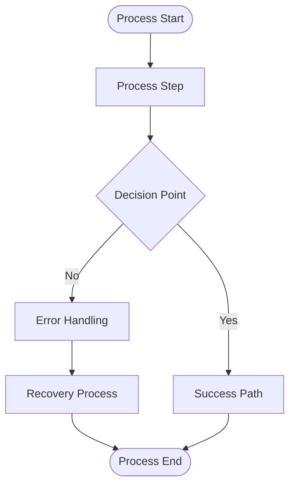
```mermaid
flowchart TD
    Start([Process Start]) --> ProcessStep[Process Step]
    ProcessStep --> Decision{Decision Point}
    Decision -->|Yes| SuccessPath[Success Path]
    Decision -->|No| ErrorPath[Error Handling]
    ErrorPath --> Recovery[Recovery Process]
    Recovery --> End([Process End])
    SuccessPath --> End
```

**Note**: This is a template structure. Actual workflows will be documented when processes are implemented.

### 4.5.2 Integration Sequence Diagram Template

When integration workflows are established, sequence diagrams will follow this pattern:

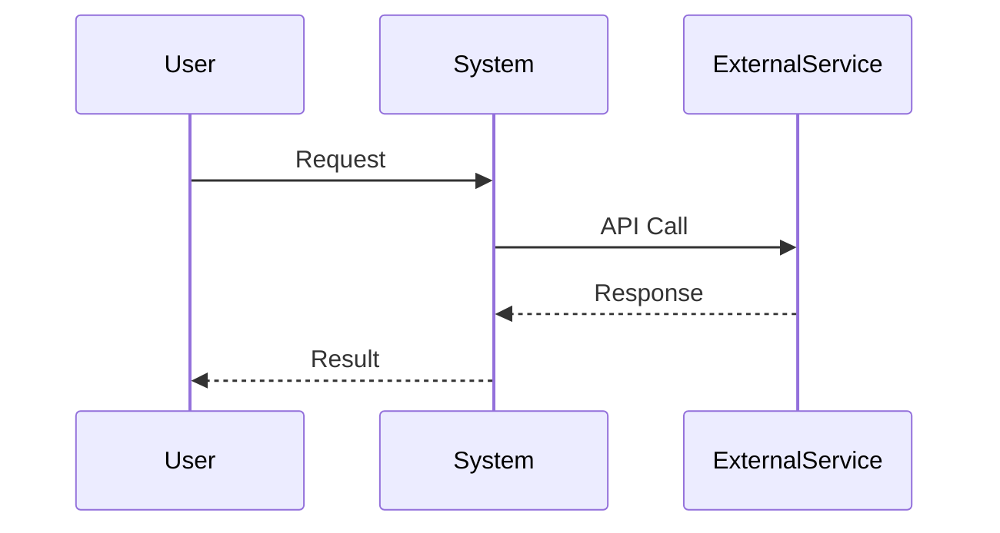
```mermaid
sequenceDiagram
    participant User
    participant System
    participant ExternalService
    
    User->>System: Request
    System->>ExternalService: API Call
    ExternalService-->>System: Response
    System-->>User: Result
```

**Note**: This is a template structure. Actual integration sequences will be documented when integrations are implemented.

### 4.5.3 State Transition Diagram Template

When state management is implemented, state diagrams will follow this pattern:

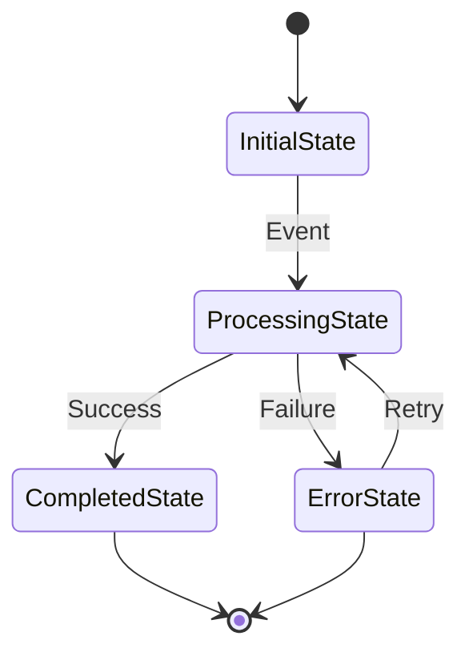
```mermaid
stateDiagram-v2
    [*] --> InitialState
    InitialState --> ProcessingState: Event
    ProcessingState --> CompletedState: Success
    ProcessingState --> ErrorState: Failure
    ErrorState --> ProcessingState: Retry
    CompletedState --> [*]
    ErrorState --> [*]
```

**Note**: This is a template structure. Actual state transitions will be documented when state management is implemented.

### 4.5.4 Error Handling Flowchart Template

When error handling processes are defined, error flow diagrams will follow this pattern:

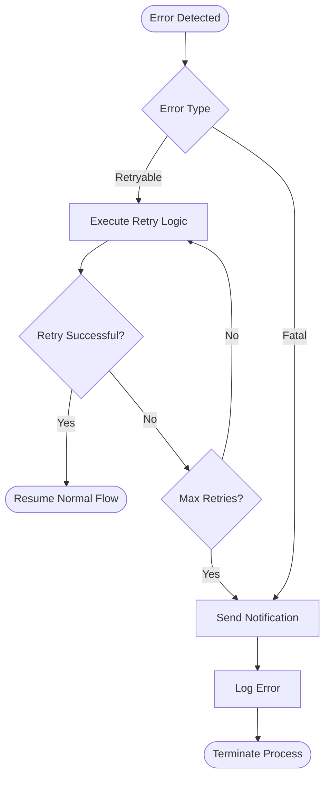
```mermaid
flowchart TD
    Error([Error Detected]) --> Classify{Error Type}
    Classify -->|Retryable| Retry[Execute Retry Logic]
    Classify -->|Fatal| Notify[Send Notification]
    Retry --> RetryCheck{Retry Successful?}
    RetryCheck -->|Yes| Success([Resume Normal Flow])
    RetryCheck -->|No| MaxRetries{Max Retries?}
    MaxRetries -->|Yes| Notify
    MaxRetries -->|No| Retry
    Notify --> Log[Log Error]
    Log --> End([Terminate Process])
```

**Note**: This is a template structure. Actual error handling flows will be documented when error handling is implemented.

## 4.6 Workflow Documentation Requirements

### 4.6.1 Process Documentation Standards

When documenting implemented processes, each workflow will include:

**Process Metadata**
- Process name and identifier
- Process owner and stakeholders
- Business objective and success criteria
- SLA requirements and performance metrics

**Process Steps Documentation**
- Step-by-step descriptions
- Input and output specifications
- Dependencies and prerequisites
- Success and failure conditions

**Integration Points**
- External system dependencies
- API contracts and specifications
- Data format requirements
- Error handling protocols

**Monitoring and Observability**
- Key performance indicators (KPIs)
- Monitoring checkpoints
- Logging requirements
- Alert and notification rules

### 4.6.2 Swim Lane Diagrams

When multi-actor processes are implemented, swim lane diagrams will organize workflows by:

**Actor Separation**
- User roles and responsibilities
- System components and services
- External services and integrations
- Support and operations teams

**Cross-Lane Interactions**
- Handoff points between actors
- Communication protocols
- Synchronization requirements
- Approval and escalation flows

## 4.7 Performance and Timing Considerations

### 4.7.1 Process Performance Requirements

When performance requirements are defined, this subsection will document:

**Response Time Expectations**
- User-facing operation timeouts
- Background process completion times
- API response time SLAs
- Batch processing windows

**Throughput Requirements**
- Transaction volume capacity
- Concurrent user support
- Peak load handling
- Scalability thresholds

**Timeout and Retry Policies**
- Operation timeout values
- Retry interval specifications
- Exponential backoff parameters
- Maximum retry limits

### 4.7.2 Service Level Agreements

When SLAs are established, this subsection will document:

**Availability Requirements**
- Uptime commitments
- Maintenance window definitions
- Failover and redundancy strategies
- Disaster recovery procedures

**Performance Metrics**
- Response time percentiles (p50, p95, p99)
- Error rate thresholds
- Success rate targets
- Throughput guarantees

## 4.8 Process Evolution and Versioning

### 4.8.1 Process Change Management

When processes are implemented and evolve, this subsection will track:

**Version History**
- Process version numbers
- Change descriptions and rationale
- Impact analysis
- Rollback procedures

**Approval Workflow**
- Change request procedures
- Stakeholder review requirements
- Testing and validation criteria
- Deployment authorization

### 4.8.2 Process Optimization

When process optimization occurs, this subsection will document:

**Performance Improvements**
- Bottleneck identification and resolution
- Optimization implementations
- Performance measurement results
- Cost reduction achievements

**Process Refinements**
- Simplified workflow paths
- Eliminated redundancies
- Enhanced error handling
- Improved user experience

## 4.9 Compliance and Audit

### 4.9.1 Audit Trail Requirements

When audit requirements are defined, this subsection will document:

**Process Logging**
- Critical decision point logging
- Data access and modification tracking
- User action auditing
- System event recording

**Compliance Checkpoints**
- Regulatory requirement verification points
- Policy enforcement validation
- Documentation generation requirements
- Audit report production

### 4.9.2 Data Privacy and Security

When security processes are implemented, this subsection will document:

**Data Protection Flows**
- Personal data handling procedures
- Encryption and masking operations
- Data retention and deletion processes
- Consent management workflows

**Security Validation**
- Authentication verification steps
- Authorization enforcement points
- Security policy compliance checks
- Vulnerability mitigation procedures

## 4.10 References

### 4.10.1 Repository Analysis

**Files Examined**: None (empty codebase - no process implementations exist)

**Folders Explored**:
- Root directory: Contains only empty `test.py` file with no process logic

### 4.10.2 Documentation Sources

This section was created as a comprehensive framework template for future process documentation. No active processes, workflows, or business logic currently exist in the repository to document.

**Section Status**: Placeholder for future implementation
**Content Type**: Documentation framework and standards
**Applicable When**: System processes are developed and deployed
</markdown>

# 5. System Architecture

## 5.1 Current Architecture Status

### 5.1.1 Implementation State

This section documents the system architecture for a baseline empty codebase. **No architectural components, services, or infrastructure currently exist.** The repository contains no implementation of the planned architecture described below.

| Architecture Aspect | Current Status |
|-------------------|----------------|
| System Components | Not implemented |
| Service Architecture | Not deployed |
| Data Persistence Layer | Not configured |
| External Integrations | Not established |
| Infrastructure | Not provisioned |
| Security Framework | Not implemented |

### 5.1.2 Documentation Purpose

This section establishes the **target system architecture** to be implemented when project development begins. All architectural components, patterns, and decisions described below represent the planned state.

---

## 5.2 Target System Architecture

### 5.2.1 Architecture Overview

#### 5.2.1.1 Architectural Style

The target system adopts a **modern multi-tier client-server architecture** with the following characteristics:

**Primary Architectural Pattern**: Three-tier architecture with clear separation of concerns
- **Presentation Tier**: Multiple client applications (web, mobile, desktop) consuming backend services
- **Application Tier**: RESTful API services built with Flask framework, handling business logic and AI integration
- **Data Tier**: MongoDB document database with Redis caching layer and S3 object storage

**Architectural Principles**:
- **Separation of Concerns**: Clear boundaries between presentation, business logic, and data layers
- **API-First Design**: Backend exposes well-defined REST APIs consumed by all client applications
- **Stateless Services**: Application tier maintains no client state, enabling horizontal scalability
- **Cloud-Native**: Containerized services deployed on AWS infrastructure with managed services
- **Security by Design**: Authentication and authorization integrated at all layers
- **Scalability**: Horizontal scaling capabilities through containerization and load balancing
- **Resilience**: Multi-availability zone deployment with automated failover

**System Boundaries**:
- **Internal**: Client applications, Flask API services, AI processing layer, databases, and caching
- **External**: Auth0 authentication service, LLM providers (OpenAI/Anthropic), AWS managed services
- **Integration Layer**: API Gateway pattern with centralized authentication and request routing

#### 5.2.1.2 Architecture Rationale

**Why Three-Tier Architecture**:
- **Proven Pattern**: Well-established pattern with extensive industry adoption and best practices
- **Independent Scaling**: Each tier can scale independently based on load characteristics
- **Technology Flexibility**: Client and server technologies can evolve independently
- **Multiple Client Support**: Single backend serves web, mobile, and desktop clients efficiently
- **Maintainability**: Clear architectural boundaries simplify development and maintenance

**Why RESTful API Design**:
- **Universal Compatibility**: REST APIs work seamlessly across all client platforms
- **Simplicity**: HTTP-based communication with standard methods (GET, POST, PUT, DELETE)
- **Caching**: Built-in HTTP caching mechanisms improve performance
- **Tooling**: Extensive ecosystem of testing, documentation, and monitoring tools

**Why Containerization**:
- **Consistency**: Identical runtime environment across development, staging, and production
- **Portability**: Deploy anywhere containers are supported
- **Scalability**: Container orchestration enables automatic scaling
- **Resource Efficiency**: Lightweight isolation compared to virtual machines

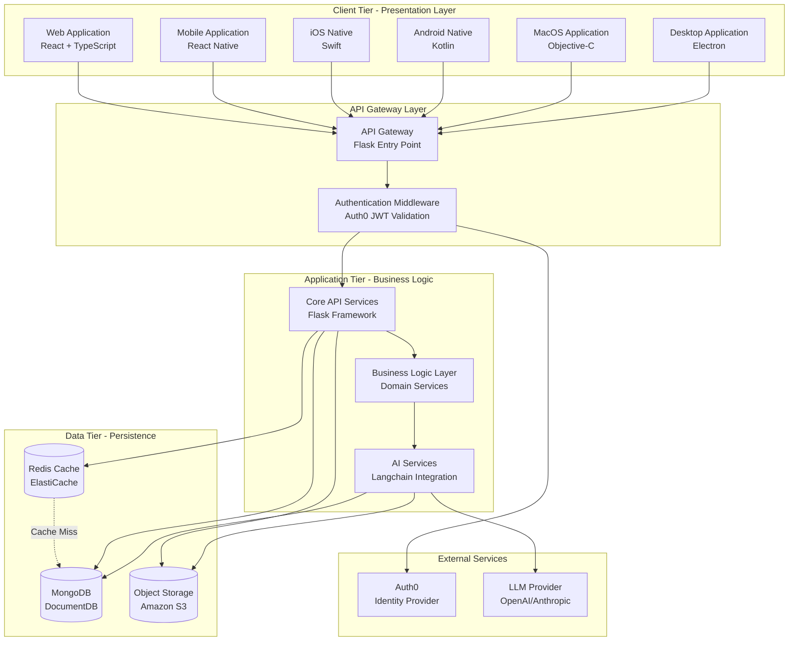
```mermaid
graph TB
    subgraph "Client Tier - Presentation Layer"
        WEB[Web Application<br/>React + TypeScript]
        MOBILE[Mobile Application<br/>React Native]
        IOS[iOS Native<br/>Swift]
        ANDROID[Android Native<br/>Kotlin]
        MACOS[MacOS Application<br/>Objective-C]
        DESKTOP[Desktop Application<br/>Electron]
    end
    
    subgraph "API Gateway Layer"
        GATEWAY[API Gateway<br/>Flask Entry Point]
        AUTH_MW[Authentication Middleware<br/>Auth0 JWT Validation]
    end
    
    subgraph "Application Tier - Business Logic"
        API_CORE[Core API Services<br/>Flask Framework]
        AI_SERVICE[AI Services<br/>Langchain Integration]
        BUSINESS_LOGIC[Business Logic Layer<br/>Domain Services]
    end
    
    subgraph "Data Tier - Persistence"
        CACHE[(Redis Cache<br/>ElastiCache)]
        DATABASE[(MongoDB<br/>DocumentDB)]
        STORAGE[(Object Storage<br/>Amazon S3)]
    end
    
    subgraph "External Services"
        AUTH0[Auth0<br/>Identity Provider]
        LLM[LLM Provider<br/>OpenAI/Anthropic]
    end
    
    WEB --> GATEWAY
    MOBILE --> GATEWAY
    IOS --> GATEWAY
    ANDROID --> GATEWAY
    MACOS --> GATEWAY
    DESKTOP --> GATEWAY
    
    GATEWAY --> AUTH_MW
    AUTH_MW --> AUTH0
    AUTH_MW --> API_CORE
    
    API_CORE --> BUSINESS_LOGIC
    BUSINESS_LOGIC --> AI_SERVICE
    AI_SERVICE --> LLM
    
    API_CORE --> CACHE
    CACHE -.Cache Miss.-> DATABASE
    API_CORE --> DATABASE
    API_CORE --> STORAGE
    AI_SERVICE --> DATABASE
    AI_SERVICE --> STORAGE
```

### 5.2.2 Core Components

#### 5.2.2.1 Component Catalog

| Component Name | Primary Responsibility | Key Dependencies |
|---------------|----------------------|------------------|
| Web Application | User interface for browser-based access | React, TypeScript, TailwindCSS, API Gateway |
| Mobile Applications | Native mobile experience for iOS/Android | React Native, Native SDKs, API Gateway |
| Desktop Application | Cross-platform desktop client | Electron, React, API Gateway |
| API Gateway | Request routing, authentication, rate limiting | Flask, Auth0 SDK, Redis |
| Business Logic Layer | Core application logic and orchestration | Flask, MongoDB driver, S3 SDK |
| AI Services | LLM integration and AI workflows | Langchain, LLM provider APIs, MongoDB |
| Authentication Service | Identity management and access control | Auth0 (external) |
| Caching Layer | Response caching and session storage | Redis, ElastiCache |
| Primary Database | Persistent data storage | MongoDB, DocumentDB |
| Object Storage | File and asset storage | Amazon S3 |

| Component Name | Integration Points | Critical Considerations |
|---------------|-------------------|------------------------|
| Web Application | REST API over HTTPS, Auth0 Universal Login | Browser compatibility, responsive design, security (XSS, CSRF) |
| Mobile Applications | REST API over HTTPS, native Auth0 SDKs | Offline capabilities, platform-specific UI, app store compliance |
| Desktop Application | REST API over HTTPS, Electron IPC | Auto-updates, native OS integration, security sandboxing |
| API Gateway | Load balancer ingress, Auth0 JWT validation | High availability, request throttling, SSL/TLS termination |
| Business Logic Layer | Database connections, external API calls | Transaction management, error handling, retry logic |
| AI Services | Langchain abstractions, vector databases | Cost management, rate limiting, response streaming |
| Authentication Service | OAuth 2.0/OIDC flows, JWT tokens | Token refresh, MFA support, session management |
| Caching Layer | In-memory storage, TTL-based expiration | Cache invalidation, memory limits, persistence options |
| Primary Database | Network connections, replica sets | Data consistency, backup automation, index optimization |
| Object Storage | S3 API, pre-signed URLs | Access control, versioning, lifecycle policies |

#### 5.2.2.2 Component Responsibilities

**Client Applications (Presentation Tier)**:
- **User Interface Rendering**: Display data and provide interactive user experiences
- **User Input Handling**: Capture and validate user interactions
- **State Management**: Manage application state and UI reactivity
- **API Communication**: Make authenticated HTTP requests to backend services
- **Local Storage**: Cache data and manage offline capabilities (mobile/desktop)
- **Authentication Flow**: Handle OAuth flows and token management

**API Gateway**:
- **Request Routing**: Direct incoming requests to appropriate service handlers
- **Authentication**: Validate JWT tokens and enforce authentication requirements
- **Authorization**: Check user permissions for requested resources
- **Rate Limiting**: Enforce API usage quotas per user/client
- **Request/Response Transformation**: Standardize API contracts
- **CORS Management**: Handle cross-origin resource sharing policies
- **Logging**: Record all API requests for monitoring and auditing

**Business Logic Layer**:
- **Domain Logic**: Implement core business rules and workflows
- **Data Validation**: Validate incoming data against business rules
- **Service Orchestration**: Coordinate operations across multiple services
- **Transaction Management**: Ensure data consistency across operations
- **Error Handling**: Handle and transform errors into appropriate responses
- **Integration Management**: Coordinate with AI services, databases, and external APIs

**AI Services**:
- **LLM Integration**: Interface with large language model providers
- **Prompt Engineering**: Construct and optimize prompts for AI models
- **Response Processing**: Parse and validate AI-generated responses
- **Context Management**: Maintain conversation history and context
- **Embedding Generation**: Create vector embeddings for semantic search
- **Cost Optimization**: Manage token usage and implement caching strategies

**Caching Layer**:
- **Response Caching**: Store frequently accessed API responses
- **Session Management**: Store user session data with automatic expiration
- **Rate Limit Tracking**: Track API request counts for rate limiting
- **Temporary Data Storage**: Store transient data requiring fast access
- **Cache Invalidation**: Remove or update stale cache entries

**Primary Database**:
- **Data Persistence**: Store application data with ACID guarantees
- **Query Processing**: Execute complex queries and aggregations
- **Indexing**: Optimize query performance through strategic indexing
- **Replication**: Maintain data copies across availability zones
- **Backup Management**: Automated backup and point-in-time recovery

**Object Storage**:
- **File Storage**: Store user uploads, documents, and media files
- **Static Asset Hosting**: Serve frontend application bundles
- **Backup Storage**: Store database backups and application snapshots
- **Artifact Storage**: Store AI-generated content and processing results

### 5.2.3 Data Flow Architecture

#### 5.2.3.1 Primary Data Flows

**User Authentication Flow**:
1. Client application initiates authentication with Auth0
2. User provides credentials through Auth0 Universal Login
3. Auth0 validates credentials and returns JWT access token
4. Client stores token securely (httpOnly cookie for web, secure storage for mobile)
5. Client includes JWT token in Authorization header for all API requests
6. API Gateway validates JWT signature and expiration
7. API Gateway extracts user identity and permissions from token claims
8. Request proceeds to business logic layer with authenticated user context

**Standard API Request Flow**:
1. Client sends authenticated HTTP request to API Gateway
2. API Gateway validates authentication token
3. API Gateway checks rate limits in Redis cache
4. Request routed to appropriate business logic handler
5. Business logic checks Redis cache for cached response
6. On cache miss, business logic queries MongoDB database
7. Business logic processes data and applies business rules
8. Response cached in Redis with appropriate TTL
9. Response returned through API Gateway to client
10. Client updates UI with received data

**AI-Enhanced Request Flow**:
1. Client sends request requiring AI processing to API Gateway
2. API Gateway validates authentication and routes to AI service
3. AI service retrieves relevant context from MongoDB
4. AI service constructs prompt with user input and context
5. AI service sends prompt to LLM provider (OpenAI/Anthropic)
6. LLM provider processes prompt and streams response
7. AI service processes and validates LLM response
8. AI service stores interaction history in MongoDB
9. AI service caches result in Redis for similar future queries
10. Processed response returned to client

**File Upload Flow**:
1. Client requests pre-signed S3 upload URL from API
2. API Gateway validates authentication and generates pre-signed URL
3. Pre-signed URL returned to client with expiration time
4. Client uploads file directly to S3 using pre-signed URL
5. S3 confirms successful upload to client
6. Client notifies API of completed upload with file metadata
7. API stores file reference and metadata in MongoDB
8. File available for retrieval via S3 or CloudFront (if CDN enabled)

**Cache Invalidation Flow**:
1. Business logic modifies data in MongoDB
2. Business logic identifies affected cache keys
3. Business logic sends cache invalidation commands to Redis
4. Redis removes or updates affected cache entries
5. Subsequent requests fetch fresh data from MongoDB
6. Fresh data cached in Redis for future requests

#### 5.2.3.2 Data Transformation Points

| Transformation Point | Input Format | Output Format | Purpose |
|---------------------|--------------|---------------|---------|
| Client to API Gateway | JSON over HTTP | Validated JSON | Request validation and sanitization |
| API Gateway to Business Logic | Validated JSON | Python objects | Type-safe processing with Pydantic models |
| Business Logic to Database | Python objects | BSON documents | MongoDB document serialization |
| Database to Business Logic | BSON documents | Python objects | Object deserialization and mapping |
| Business Logic to AI Service | Python objects | Structured prompts | Prompt engineering for LLM consumption |
| LLM Provider Response | Text/JSON | Validated Python objects | Response parsing and validation |
| Business Logic to Cache | Python objects | Serialized bytes | Redis-compatible serialization (pickle/JSON) |
| Cache to Business Logic | Serialized bytes | Python objects | Deserialization with type validation |
| Business Logic to Client | Python objects | JSON over HTTP | API response serialization |

#### 5.2.3.3 Integration Patterns

**Synchronous Integration**:
- **REST API Calls**: HTTP request-response pattern for all client-to-server communication
- **Database Queries**: Synchronous read/write operations to MongoDB
- **Cache Operations**: Synchronous get/set operations with Redis
- **Auth0 Token Validation**: Synchronous JWT signature verification

**Asynchronous Integration** (Future Consideration):
- **Event-Driven Processing**: Message queues (SQS) for long-running tasks
- **Webhook Notifications**: Asynchronous callbacks for external service events
- **Background Jobs**: Celery or similar for scheduled and deferred tasks

**Caching Strategy**:
- **Cache-Aside Pattern**: Application explicitly manages cache population
- **Write-Through Pattern**: Updates written to cache and database simultaneously (select use cases)
- **Time-Based Expiration**: TTL-based automatic cache invalidation
- **Event-Based Invalidation**: Explicit cache clearing on data mutations

### 5.2.4 External Integration Points

| System Name | Integration Type | Data Exchange Pattern |
|------------|-----------------|----------------------|
| Auth0 | Authentication & Authorization | OAuth 2.0/OIDC, JWT tokens |
| AWS DocumentDB | Data Persistence | MongoDB Wire Protocol, BSON documents |
| AWS ElastiCache | Caching & Session Storage | Redis Protocol (RESP), key-value pairs |
| Amazon S3 | Object Storage | AWS S3 API, pre-signed URLs |
| OpenAI/Anthropic | AI/LLM Services | REST API, JSON payloads |
| AWS CloudWatch | Monitoring & Logging | CloudWatch Logs API, metrics & events |
| AWS Secrets Manager | Configuration Management | AWS API, encrypted secrets retrieval |

| System Name | Protocol/Format | SLA Requirements |
|------------|----------------|------------------|
| Auth0 | HTTPS, JSON, JWT | 99.99% uptime, <200ms response time |
| AWS DocumentDB | MongoDB Wire Protocol over TLS | 99.99% uptime, <10ms latency (same AZ) |
| AWS ElastiCache | Redis Protocol over TLS | 99.99% uptime, <1ms latency (same AZ) |
| Amazon S3 | HTTPS, REST API | 99.99% availability, 11 nines durability |
| OpenAI/Anthropic | HTTPS, REST API, JSON | Provider-dependent, rate limits apply |
| AWS CloudWatch | HTTPS, AWS API | 99.99% uptime, <5 minute log ingestion |
| AWS Secrets Manager | HTTPS, AWS API | 99.99% uptime, encrypted at rest/transit |

---

## 5.3 Component Details

### 5.3.1 Client Applications

#### 5.3.1.1 Web Application

**Purpose**: Provide browser-based access to application features with responsive design for desktop and tablet devices.

**Technologies**:
- **Framework**: React 18.2+ with TypeScript 5.0+
- **Styling**: TailwindCSS 3.4+ for utility-first styling
- **State Management**: Zustand or Redux (to be determined based on complexity)
- **Data Fetching**: TanStack Query for server state management
- **Routing**: React Router for client-side navigation
- **Build Tool**: Vite for fast development and optimized production builds
- **Authentication**: Auth0 SPA SDK for OAuth flows

**Key Interfaces**:
- **API Communication**: RESTful HTTP requests to Flask backend
- **Authentication**: OAuth 2.0 authorization code flow with PKCE
- **WebSocket** (Future): Real-time updates via WebSocket connections

**Data Persistence**:
- **Browser Storage**: localStorage for user preferences, sessionStorage for temporary data
- **IndexedDB** (Future): Client-side caching for offline capabilities

**Scaling Considerations**:
- **Static Hosting**: Deployed to S3 with CloudFront CDN for global distribution
- **Code Splitting**: Lazy loading of routes and components for faster initial load
- **Caching**: Aggressive caching of static assets with cache-busting via content hashes
- **Performance Budget**: Target < 3s First Contentful Paint, < 5s Time to Interactive

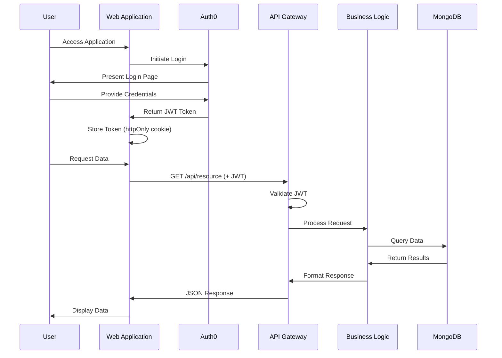
```mermaid
sequenceDiagram
    participant User
    participant WebApp as Web Application
    participant Auth0
    participant API as API Gateway
    participant Business as Business Logic
    participant DB as MongoDB
    
    User->>WebApp: Access Application
    WebApp->>Auth0: Initiate Login
    Auth0->>User: Present Login Page
    User->>Auth0: Provide Credentials
    Auth0->>WebApp: Return JWT Token
    WebApp->>WebApp: Store Token (httpOnly cookie)
    
    User->>WebApp: Request Data
    WebApp->>API: GET /api/resource (+ JWT)
    API->>API: Validate JWT
    API->>Business: Process Request
    Business->>DB: Query Data
    DB->>Business: Return Results
    Business->>API: Format Response
    API->>WebApp: JSON Response
    WebApp->>User: Display Data
```

#### 5.3.1.2 Mobile Applications

**Purpose**: Provide native mobile experiences for iOS and Android platforms with offline capabilities.

**Technologies**:
- **Cross-Platform Framework**: React Native 0.73+ with TypeScript
- **Native iOS**: Swift for platform-specific features
- **Native Android**: Kotlin for platform-specific features
- **Navigation**: React Navigation for cross-platform routing
- **State Management**: Zustand or Redux Toolkit
- **Data Fetching**: TanStack Query with React Native optimizations
- **Authentication**: Auth0 native SDKs for iOS and Android

**Key Interfaces**:
- **API Communication**: RESTful HTTP requests with retry logic for unreliable networks
- **Push Notifications**: Firebase Cloud Messaging (FCM) or AWS SNS
- **Deep Linking**: Universal Links (iOS) and App Links (Android)
- **Native Bridge**: React Native bridge for platform-specific functionality

**Data Persistence**:
- **AsyncStorage**: Key-value storage for user preferences
- **SQLite**: Local relational database for offline data
- **Secure Storage**: Keychain (iOS) and Keystore (Android) for sensitive data

**Scaling Considerations**:
- **App Size Optimization**: Code splitting and dynamic feature loading
- **Performance**: 60 FPS UI rendering, lazy loading of images
- **Offline Support**: Queue API requests when offline, sync when connected
- **Battery Optimization**: Efficient background task scheduling

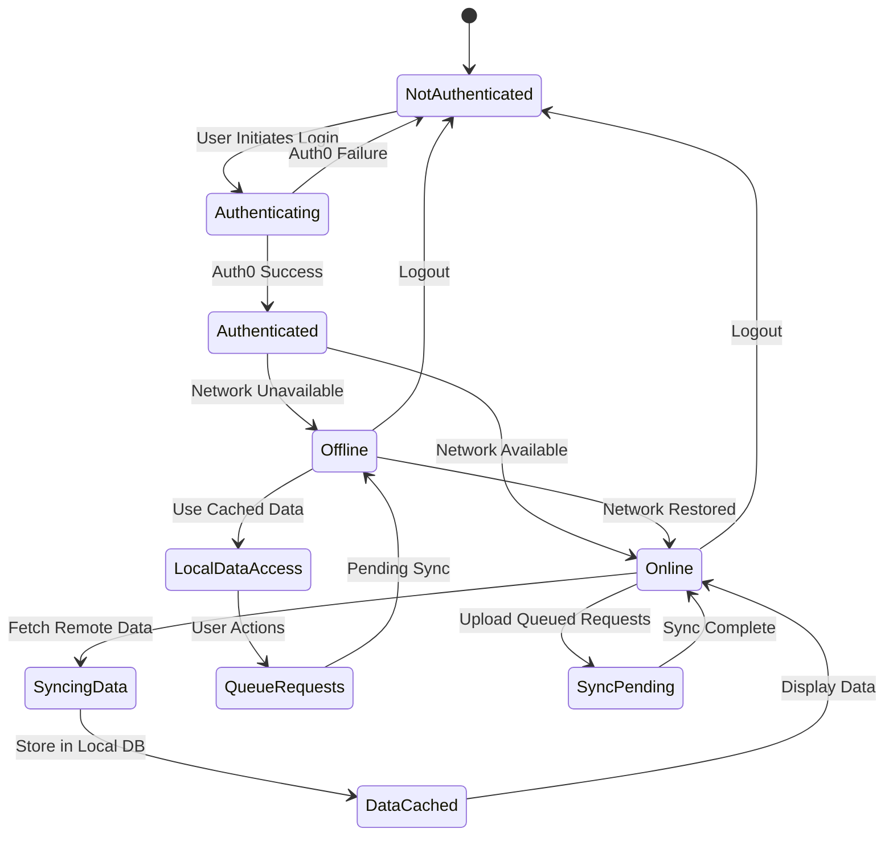
```mermaid
stateDiagram-v2
    [*] --> NotAuthenticated
    NotAuthenticated --> Authenticating: User Initiates Login
    Authenticating --> Authenticated: Auth0 Success
    Authenticating --> NotAuthenticated: Auth0 Failure
    
    Authenticated --> Online: Network Available
    Authenticated --> Offline: Network Unavailable
    
    Online --> SyncingData: Fetch Remote Data
    SyncingData --> DataCached: Store in Local DB
    DataCached --> Online: Display Data
    
    Offline --> LocalDataAccess: Use Cached Data
    LocalDataAccess --> QueueRequests: User Actions
    QueueRequests --> Offline: Pending Sync
    
    Offline --> Online: Network Restored
    Online --> SyncPending: Upload Queued Requests
    SyncPending --> Online: Sync Complete
    
    Online --> NotAuthenticated: Logout
    Offline --> NotAuthenticated: Logout
```

#### 5.3.1.3 Desktop Application

**Purpose**: Provide cross-platform desktop application with native OS integration and offline capabilities.

**Technologies**:
- **Framework**: Electron 28+ with React and TypeScript
- **Main Process**: Node.js for native OS access
- **Renderer Process**: Chromium for UI rendering
- **IPC**: Electron IPC for main-renderer communication
- **Auto-Update**: Electron Builder for application updates

**Key Interfaces**:
- **File System Access**: Native file operations via Electron API
- **System Tray**: Background application with system tray icon
- **Native Menus**: OS-native menu bars and context menus
- **Notifications**: OS-native notification system

**Data Persistence**:
- **Local Storage**: Browser localStorage and IndexedDB
- **File System**: Direct file access for user documents
- **Electron Store**: Configuration and preferences storage

**Scaling Considerations**:
- **Package Size**: Minimize bundle size, optional feature downloads
- **Memory Management**: Efficient renderer process management
- **Multi-Window**: Support multiple application windows
- **Auto-Update**: Seamless background updates without user disruption

### 5.3.2 Backend Services

#### 5.3.2.1 API Gateway

**Purpose**: Centralized entry point for all client requests, providing authentication, routing, and cross-cutting concerns.

**Technologies**:
- **Framework**: Flask 3.0+ with Python 3.11+
- **WSGI Server**: Gunicorn for production deployment
- **Authentication**: Auth0 Python SDK with JWT validation middleware
- **Rate Limiting**: Flask-Limiter with Redis backend
- **CORS**: Flask-CORS for cross-origin request handling
- **Request Validation**: Pydantic for request/response validation

**Key Interfaces**:
- **Ingress**: AWS Application Load Balancer (ALB)
- **Egress**: Internal service calls to business logic layer
- **Auth0 Integration**: JWT token validation endpoint
- **Redis Integration**: Rate limit tracking and session management

**Scaling Considerations**:
- **Stateless Design**: No server-side session state (JWT tokens)
- **Horizontal Scaling**: Deploy multiple API Gateway containers behind load balancer
- **Connection Pooling**: Reuse database and cache connections
- **Request Timeout**: 30-second timeout for all API requests
- **Rate Limiting**: Per-user and global rate limits to prevent abuse

**API Endpoints** (Illustrative):
- `POST /auth/login` - Initiate authentication flow
- `POST /auth/logout` - Invalidate session
- `GET /api/v1/users/{id}` - Retrieve user profile
- `POST /api/v1/ai/query` - Submit AI query
- `GET /api/v1/documents` - List user documents
- `POST /api/v1/upload/presigned-url` - Generate S3 upload URL

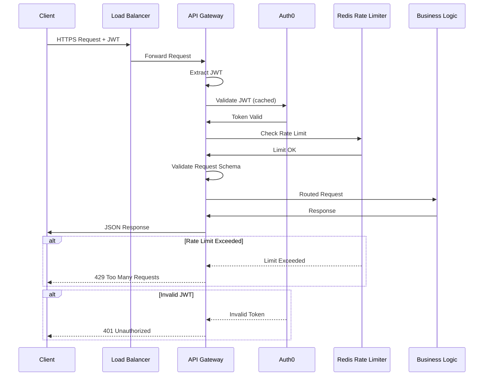
```mermaid
sequenceDiagram
    participant Client
    participant ALB as Load Balancer
    participant Gateway as API Gateway
    participant Auth0
    participant RateLimit as Redis Rate Limiter
    participant Business as Business Logic
    
    Client->>ALB: HTTPS Request + JWT
    ALB->>Gateway: Forward Request
    
    Gateway->>Gateway: Extract JWT
    Gateway->>Auth0: Validate JWT (cached)
    Auth0->>Gateway: Token Valid
    
    Gateway->>RateLimit: Check Rate Limit
    RateLimit->>Gateway: Limit OK
    
    Gateway->>Gateway: Validate Request Schema
    Gateway->>Business: Routed Request
    Business->>Gateway: Response
    
    Gateway->>Client: JSON Response
    
    alt Rate Limit Exceeded
        RateLimit-->>Gateway: Limit Exceeded
        Gateway-->>Client: 429 Too Many Requests
    end
    
    alt Invalid JWT
        Auth0-->>Gateway: Invalid Token
        Gateway-->>Client: 401 Unauthorized
    end
```

#### 5.3.2.2 Business Logic Layer

**Purpose**: Implement core application logic, orchestrate services, and manage data operations.

**Technologies**:
- **Framework**: Flask 3.0+ with Blueprint architecture
- **ORM/ODM**: PyMongo for MongoDB integration, Motor for async operations (future)
- **Data Validation**: Pydantic for type-safe data models
- **Task Processing**: Background tasks via thread pool (async task queue future consideration)
- **Logging**: Python logging module with structured JSON logs

**Key Interfaces**:
- **Database**: PyMongo connection to MongoDB
- **Cache**: Redis client for caching operations
- **AI Services**: Direct function calls within Python application
- **Object Storage**: boto3 for S3 operations

**Data Models** (Illustrative):
- **User**: User profiles, authentication metadata, preferences
- **Session**: Active sessions, authentication tokens
- **Document**: User documents, metadata, S3 references
- **Conversation**: AI conversation history and context
- **Audit Log**: Security and operational audit trail

**Scaling Considerations**:
- **Connection Pooling**: Database connection pools (min: 10, max: 100)
- **Async Processing**: Thread pools for I/O-bound operations
- **Caching Strategy**: Aggressive caching of read-heavy data
- **Database Indexing**: Strategic indexes on frequently queried fields
- **Query Optimization**: Pagination for large result sets, projection to limit fields

#### 5.3.2.3 AI Services

**Purpose**: Integrate large language models and AI capabilities into application workflows.

**Technologies**:
- **Framework**: Langchain 0.1+ for LLM abstraction
- **LLM Providers**: OpenAI GPT-4/GPT-3.5, Anthropic Claude (configurable)
- **Embedding Models**: OpenAI text-embedding-ada-002 or alternatives
- **Vector Store** (Future): Pinecone or MongoDB Atlas Vector Search
- **Prompt Templates**: Langchain prompt templates for consistency

**Key Interfaces**:
- **LLM Provider APIs**: REST API calls to OpenAI/Anthropic
- **Context Storage**: MongoDB for conversation history
- **Embedding Storage**: Vector database for semantic search
- **Cache**: Redis for caching LLM responses

**AI Workflows**:
- **Conversational AI**: Multi-turn conversations with context management
- **Document Analysis**: Extract insights from user-uploaded documents
- **Semantic Search**: Vector similarity search across user content
- **Content Generation**: Generate text, summaries, or structured outputs

**Cost Optimization**:
- **Response Caching**: Cache similar queries to reduce API calls
- **Token Management**: Monitor and limit token usage per request
- **Model Selection**: Use appropriate model for task complexity
- **Streaming**: Stream responses for long-running generations

**Scaling Considerations**:
- **Rate Limiting**: Respect LLM provider rate limits
- **Timeout Handling**: Fallback for slow or failed LLM requests
- **Cost Monitoring**: Track token usage and API costs per user/feature
- **Error Handling**: Graceful degradation when LLM services unavailable

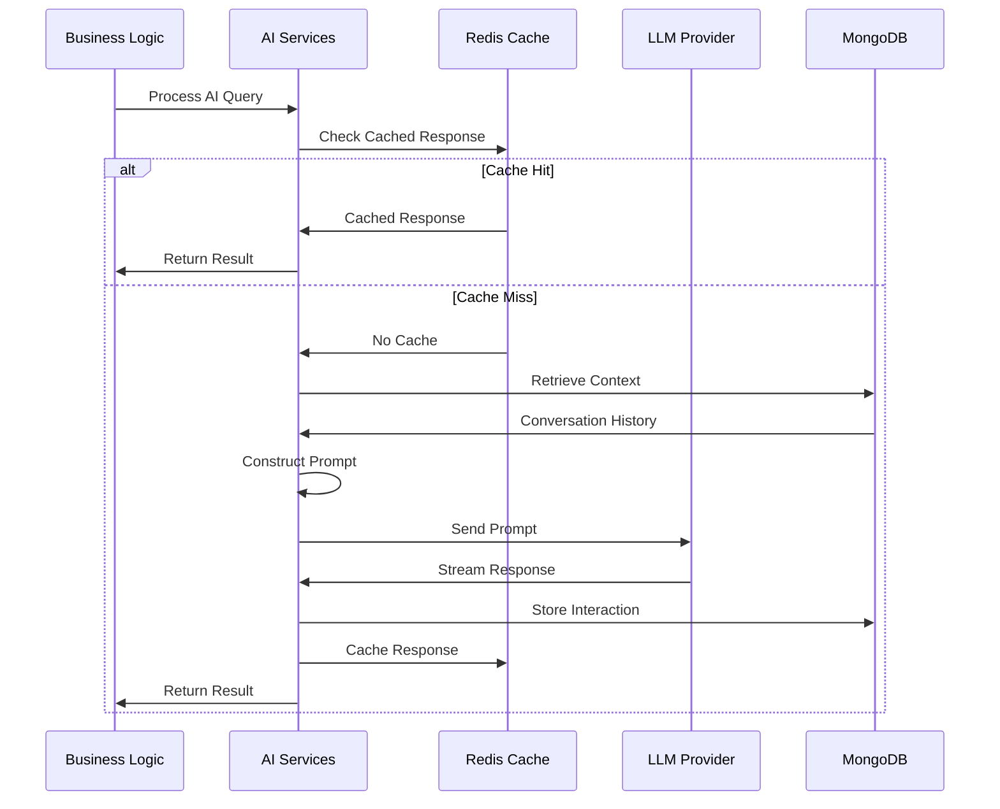
```mermaid
sequenceDiagram
    participant Business as Business Logic
    participant AI as AI Services
    participant Cache as Redis Cache
    participant LLM as LLM Provider
    participant DB as MongoDB
    
    Business->>AI: Process AI Query
    AI->>Cache: Check Cached Response
    
    alt Cache Hit
        Cache->>AI: Cached Response
        AI->>Business: Return Result
    else Cache Miss
        Cache->>AI: No Cache
        AI->>DB: Retrieve Context
        DB->>AI: Conversation History
        
        AI->>AI: Construct Prompt
        AI->>LLM: Send Prompt
        LLM->>AI: Stream Response
        
        AI->>DB: Store Interaction
        AI->>Cache: Cache Response
        AI->>Business: Return Result
    end
```

### 5.3.3 Data Tier Components

#### 5.3.3.1 MongoDB (DocumentDB)

**Purpose**: Primary persistent data store for application data with flexible schema and powerful query capabilities.

**Technologies**:
- **Database**: Amazon DocumentDB (MongoDB 5.0 compatible) or MongoDB Atlas
- **Driver**: PyMongo 4.0+ for Python integration
- **Schema Validation**: MongoDB schema validation rules

**Key Collections** (Illustrative):
- `users`: User profiles and authentication metadata
- `sessions`: Active user sessions
- `documents`: User-uploaded document metadata
- `conversations`: AI conversation threads and messages
- `audit_logs`: Security and operational audit trail

**Indexing Strategy**:
- **Compound Indexes**: Multi-field indexes for common query patterns
- **Text Indexes**: Full-text search on document content
- **TTL Indexes**: Automatic expiration for sessions and temporary data
- **Geospatial Indexes**: Location-based queries (if applicable)

**Scaling Considerations**:
- **Replica Sets**: Multi-node replication for high availability (3-node minimum)
- **Sharding** (Future): Horizontal partitioning for massive scale
- **Read Preference**: Route read operations to secondary replicas for read-heavy workloads
- **Write Concern**: Balance durability and performance (majority write concern)
- **Connection Pooling**: Reuse connections to minimize overhead

#### 5.3.3.2 Redis (ElastiCache)

**Purpose**: High-performance in-memory cache for API responses, sessions, and rate limiting.

**Technologies**:
- **Cache**: Amazon ElastiCache for Redis 7.2+
- **Driver**: redis-py for Python integration
- **Serialization**: JSON or pickle for Python objects

**Data Structures Used**:
- **Strings**: Simple key-value cache entries
- **Hashes**: Structured objects (e.g., user sessions)
- **Sets**: Unique collections (e.g., user permissions)
- **Sorted Sets**: Ranked data (e.g., leaderboards, time-series)
- **Lists**: Queue implementations (e.g., background tasks)

**Cache Keys** (Illustrative):
- `api:response:{endpoint}:{params_hash}`: Cached API responses
- `session:{user_id}`: User session data
- `rate_limit:{user_id}:{endpoint}`: Request count for rate limiting
- `user:profile:{user_id}`: Cached user profile data

**Scaling Considerations**:
- **Cluster Mode**: Redis cluster for horizontal scaling (if needed)
- **Replication**: Multi-AZ replication for high availability
- **Memory Management**: Eviction policy (LRU) when memory limit reached
- **TTL Strategy**: Appropriate expiration times to prevent stale data
- **Connection Pooling**: Reuse connections to minimize latency

#### 5.3.3.3 Amazon S3

**Purpose**: Scalable object storage for user uploads, static assets, and backups.

**Technologies**:
- **Storage**: Amazon S3 Standard, Intelligent-Tiering, and Glacier
- **SDK**: boto3 (AWS SDK for Python)
- **CDN** (Future): Amazon CloudFront for global content delivery

**Bucket Structure**:
- `app-static-assets-{env}`: Frontend build artifacts (HTML, CSS, JS)
- `app-user-uploads-{env}`: User-uploaded files
- `app-backups-{env}`: Database backups and snapshots
- `app-ai-artifacts-{env}`: AI-generated content and outputs

**Access Patterns**:
- **Pre-Signed URLs**: Time-limited URLs for direct client uploads/downloads
- **IAM Roles**: Service-to-service access via IAM roles
- **Bucket Policies**: Fine-grained access control
- **CORS Configuration**: Enable cross-origin uploads from web clients

**Scaling Considerations**:
- **Unlimited Storage**: S3 scales automatically with no capacity planning
- **Multipart Upload**: Efficient uploads for large files
- **Transfer Acceleration**: Faster uploads via CloudFront edge locations
- **Lifecycle Policies**: Automatic transition to cheaper storage classes
- **Versioning**: Protect against accidental deletion

---

## 5.4 Technical Decisions

### 5.4.1 Architecture Style Decisions

#### 5.4.1.1 Multi-Tier Architecture vs. Alternatives

| Architecture Style | Advantages | Disadvantages | Decision |
|--------------------|-----------|---------------|----------|
| **Three-Tier (Selected)** | Clear separation of concerns, independent scaling, technology flexibility, multiple client support | Network latency between tiers, complexity in distributed debugging | ✅ **Selected**: Best fit for multi-client (web/mobile/desktop) requirements |
| Monolithic Architecture | Simpler development, easier debugging, single deployment | Limited scalability, tight coupling, technology lock-in | ❌ Rejected: Insufficient flexibility for multiple client platforms |
| Microservices Architecture | Maximum scalability, independent deployment, fault isolation | Increased complexity, distributed system challenges, higher operational overhead | ❌ Rejected: Over-engineered for current scale, premature optimization |
| Serverless Architecture | No infrastructure management, automatic scaling, pay-per-use pricing | Cold start latency, vendor lock-in, debugging complexity | ❌ Rejected: Flask/Python ecosystem maturity favors containerized deployment |

**Rationale**: Three-tier architecture provides the right balance of scalability, maintainability, and complexity for a system serving multiple client types (web, mobile, desktop) with moderate scale expectations. The clear separation between presentation, application, and data tiers enables independent evolution while avoiding the operational complexity of microservices.

#### 5.4.1.2 RESTful API vs. Alternatives

| Communication Pattern | Advantages | Disadvantages | Decision |
|--------------------|-----------|---------------|----------|
| **REST API (Selected)** | Universal compatibility, HTTP caching, simple tooling, stateless | Over-fetching/under-fetching, multiple round trips | ✅ **Selected**: Industry standard with excellent client support |
| GraphQL | Flexible queries, single endpoint, typed schema | Complex server implementation, caching challenges | ❌ Rejected: Added complexity without clear benefit for this use case |
| gRPC | High performance, strongly typed, bidirectional streaming | Browser support limitations, binary protocol complexity | ❌ Rejected: Browser support issues complicate web client implementation |
| WebSocket | Real-time bidirectional communication, low latency | Connection state management, load balancing complexity | ⏳ Future: Planned for real-time features (notifications, collaborative editing) |

**Rationale**: RESTful APIs provide the simplest, most universally supported communication pattern for client-server interaction. HTTP-based REST works seamlessly across all target platforms (web browsers, mobile apps, desktop applications) with extensive tooling and caching infrastructure.

### 5.4.2 Data Storage Decisions

#### 5.4.2.1 MongoDB vs. Relational Databases

| Database Type | Advantages | Disadvantages | Decision |
|--------------|-----------|---------------|----------|
| **MongoDB (Selected)** | Flexible schema, JSON-like documents, horizontal scaling, rich query language | Eventual consistency in distributed mode, joins less efficient | ✅ **Selected**: Schema flexibility ideal for evolving requirements |
| PostgreSQL | ACID transactions, relational integrity, mature ecosystem, JSON support | Rigid schema, vertical scaling limits, complex sharding | ❌ Rejected: Schema rigidity incompatible with rapid iteration |
| MySQL | Mature ecosystem, excellent performance, replication support | Limited JSON support, rigid schema | ❌ Rejected: Similar limitations to PostgreSQL |
| DynamoDB | Fully managed, infinite scale, predictable performance | Complex data modeling, expensive for reads, limited queries | ❌ Rejected: Query limitations and cost concerns |

**Rationale**: MongoDB's document model aligns naturally with JSON-based frontend data structures, enabling rapid schema evolution during development. The flexible schema is particularly valuable when requirements are still being defined. Amazon DocumentDB provides MongoDB compatibility with AWS-native management.

#### 5.4.2.2 Redis vs. Alternative Caching Solutions

| Caching Solution | Advantages | Disadvantages | Decision |
|-----------------|-----------|---------------|----------|
| **Redis (Selected)** | Rich data structures, pub/sub, persistence options, mature Python client | In-memory only (higher cost), single-threaded | ✅ **Selected**: Best balance of features and performance |
| Memcached | Simple key-value, high performance, multi-threaded | Limited data structures, no persistence | ❌ Rejected: Insufficient functionality for session storage and rate limiting |
| Application Memory | Zero latency, no network overhead | Not shared across instances, limited capacity | ❌ Rejected: Incompatible with horizontal scaling |
| DynamoDB (DAX) | Fully managed, integrated with DynamoDB | AWS-specific, limited use cases | ❌ Rejected: Over-engineered for simple caching needs |

**Rationale**: Redis provides the rich data structures needed for session management and rate limiting while delivering sub-millisecond latency. ElastiCache for Redis offers AWS-native management with multi-AZ replication for high availability.

### 5.4.3 Technology Stack Decisions

#### 5.4.3.1 Flask vs. Alternative Python Frameworks

| Framework | Advantages | Disadvantages | Decision |
|-----------|-----------|---------------|----------|
| **Flask (Selected)** | Lightweight, flexible, extensive ecosystem, easy testing | Manual configuration, fewer built-in features | ✅ **Selected**: Best match for API-focused architecture |
| Django | Batteries included, admin interface, ORM | Heavy framework, opinionated, overkill for API-only | ❌ Rejected: Too heavyweight for RESTful API service |
| FastAPI | Modern async, automatic OpenAPI docs, type hints | Newer ecosystem, async complexity | ⏳ Future: Consider for async-heavy workloads |
| Tornado | Async-first, WebSocket support | Steeper learning curve, smaller ecosystem | ❌ Rejected: Flask ecosystem more mature |

**Rationale**: Flask's lightweight, flexible architecture aligns with the microframework philosophy appropriate for RESTful API services. The extensive plugin ecosystem provides needed functionality (authentication, CORS, rate limiting) without framework bloat.

#### 5.4.3.2 React vs. Alternative Frontend Frameworks

| Framework | Advantages | Disadvantages | Decision |
|-----------|-----------|---------------|----------|
| **React (Selected)** | Massive ecosystem, component reuse (React Native), mature tooling | Boilerplate code, frequent library updates | ✅ **Selected**: Code reuse across web, mobile, and desktop |
| Vue.js | Simpler learning curve, less boilerplate, good performance | Smaller ecosystem, limited mobile options | ❌ Rejected: No native mobile framework equivalent |
| Angular | Full framework, TypeScript-first, enterprise support | Steep learning curve, verbose, heavy bundle size | ❌ Rejected: Complexity outweighs benefits |
| Svelte | Minimal code, no virtual DOM, excellent performance | Smaller ecosystem, newer framework | ❌ Rejected: Ecosystem immaturity, no mobile equivalent |

**Rationale**: React enables maximum code reuse across web (React), mobile (React Native), and desktop (Electron + React) platforms. The unified component model and shared knowledge significantly reduce development effort across platforms.

### 5.4.4 Deployment Architecture Decisions

#### 5.4.4.1 Container Orchestration

| Platform | Advantages | Disadvantages | Decision |
|----------|-----------|---------------|----------|
| **AWS ECS + Fargate (Selected)** | AWS-native, serverless containers, simple operations | AWS lock-in, less portability | ✅ **Selected**: Simplest AWS-native container deployment |
| Kubernetes (EKS) | Portable, feature-rich, industry standard | Complex operations, steep learning curve, higher costs | ❌ Rejected: Over-engineered for current scale |
| AWS Lambda | Fully serverless, automatic scaling, pay-per-invocation | Cold starts, execution limits, Flask compatibility issues | ❌ Rejected: Flask framework not optimized for serverless |
| EC2 (Traditional) | Full control, predictable costs | Manual infrastructure management, no auto-scaling | ❌ Rejected: Higher operational burden |

**Rationale**: AWS ECS with Fargate provides the simplest path to containerized deployment on AWS. Fargate's serverless container model eliminates infrastructure management while providing automatic scaling. The learning curve is significantly lower than Kubernetes while meeting all current requirements.

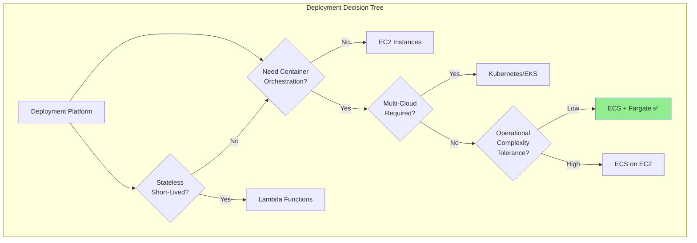
```mermaid
graph TB
    subgraph "Deployment Decision Tree"
        START[Deployment Platform]
        START --> Q1{Need Container<br/>Orchestration?}
        Q1 -->|No| EC2[EC2 Instances]
        Q1 -->|Yes| Q2{Multi-Cloud<br/>Required?}
        Q2 -->|Yes| K8S[Kubernetes/EKS]
        Q2 -->|No| Q3{Operational<br/>Complexity<br/>Tolerance?}
        Q3 -->|Low| FARGATE[ECS + Fargate ✅]
        Q3 -->|High| ECS_EC2[ECS on EC2]
        
        START --> Q4{Stateless<br/>Short-Lived?}
        Q4 -->|Yes| LAMBDA[Lambda Functions]
        Q4 -->|No| Q1
    end
    
    style FARGATE fill:#90EE90
```

#### 5.4.4.2 Infrastructure as Code Selection

| Tool | Advantages | Disadvantages | Decision |
|------|-----------|---------------|----------|
| **Terraform (Selected)** | Multi-cloud, declarative, large community, state management | HCL learning curve, state management complexity | ✅ **Selected**: Industry standard with AWS provider maturity |
| AWS CloudFormation | AWS-native, deep service integration, free | AWS-only, verbose YAML, limited preview | ❌ Rejected: Lack of portability, verbose syntax |
| Pulumi | Use familiar languages (Python), strong typing | Smaller community, newer tool | ⏳ Future: Interesting alternative for Python-heavy teams |
| AWS CDK | TypeScript/Python, AWS-native, high-level constructs | AWS-only, generates CloudFormation | ❌ Rejected: AWS lock-in similar to CloudFormation |

**Rationale**: Terraform's declarative approach and multi-cloud support provide the best balance of power and flexibility. The mature AWS provider covers all required services, and the plan-apply workflow prevents accidental infrastructure changes.

---

## 5.5 Cross-Cutting Concerns

### 5.5.1 Monitoring and Observability

#### 5.5.1.1 Observability Strategy

**Three Pillars of Observability**:

**1. Metrics**: Quantitative measurements of system behavior
- **Application Metrics**: Request rate, response time, error rate
- **Infrastructure Metrics**: CPU usage, memory utilization, network throughput
- **Business Metrics**: User activity, feature usage, conversion rates
- **Custom Metrics**: AI token usage, cache hit rate, database query performance

**2. Logs**: Time-stamped records of discrete events
- **Application Logs**: API requests, business logic execution, errors
- **Access Logs**: HTTP request logs from load balancer
- **Audit Logs**: Security-relevant events (authentication, authorization, data access)
- **Infrastructure Logs**: Container logs, database logs, service logs

**3. Traces**: End-to-end request flow across services
- **Distributed Tracing**: Track requests across API Gateway, business logic, database
- **Span Instrumentation**: Measure individual operation durations
- **Context Propagation**: Maintain trace context across service boundaries

**Monitoring Stack**:

| Component | Technology | Purpose |
|-----------|-----------|---------|
| Metrics Collection | AWS CloudWatch Metrics | Collect system and application metrics |
| Log Aggregation | AWS CloudWatch Logs | Centralized log storage and search |
| Tracing | AWS X-Ray (future) | Distributed request tracing |
| Alerting | CloudWatch Alarms + SNS | Alert on threshold violations |
| Dashboards | CloudWatch Dashboards | Real-time operational visibility |
| APM (Future) | DataDog or New Relic | Application performance monitoring |

#### 5.5.1.2 Key Monitoring Metrics

**API Gateway Metrics**:
- Request rate (requests per second)
- Response time percentiles (p50, p95, p99)
- Error rate (4xx and 5xx errors)
- Rate limit rejections
- Authentication failures

**Business Logic Metrics**:
- Request processing time
- Database query latency
- Cache hit/miss ratio
- External API call duration
- AI service token usage

**Infrastructure Metrics**:
- Container CPU utilization (target: <70%)
- Container memory utilization (target: <80%)
- Database connections (monitor pool exhaustion)
- Redis memory usage (monitor evictions)
- Network throughput

**Alerting Thresholds**:
- Error rate >1% for 5 minutes → Page on-call engineer
- Response time p95 >2 seconds for 5 minutes → Warning notification
- Database connections >80% of pool → Warning notification
- Cache hit rate <70% for 15 minutes → Investigate alert
- Authentication service failures >5% for 5 minutes → Critical alert

### 5.5.2 Logging Strategy

#### 5.5.2.1 Structured Logging

**Log Format**: JSON-structured logs for machine readability

**Standard Log Fields**:
- `timestamp`: ISO 8601 timestamp
- `level`: Log level (DEBUG, INFO, WARNING, ERROR, CRITICAL)
- `service`: Service name (api-gateway, business-logic, ai-service)
- `request_id`: Unique identifier for request tracing
- `user_id`: Authenticated user identifier (if applicable)
- `message`: Human-readable log message
- `context`: Additional contextual data (dictionary)
- `exception`: Exception details (for error logs)

**Log Levels**:
- **DEBUG**: Detailed diagnostic information (disabled in production)
- **INFO**: General informational messages (API requests, business events)
- **WARNING**: Warning messages (degraded performance, recoverable errors)
- **ERROR**: Error messages (failed requests, caught exceptions)
- **CRITICAL**: Critical failures (system unavailable, data loss)

**Example Log Entry**:
```json
{
  "timestamp": "2024-01-15T10:30:45.123Z",
  "level": "INFO",
  "service": "api-gateway",
  "request_id": "req_abc123xyz",
  "user_id": "user_12345",
  "message": "API request processed successfully",
  "context": {
    "method": "GET",
    "path": "/api/v1/users/12345",
    "status_code": 200,
    "duration_ms": 45,
    "cache_hit": true
  }
}
```

#### 5.5.2.2 Log Management

**Log Retention**:
- **Application Logs**: 30 days in CloudWatch, 1 year in S3 archive
- **Access Logs**: 90 days in CloudWatch, indefinite in S3 archive
- **Audit Logs**: 7 years in S3 (compliance requirement)

**Log Analysis**:
- **CloudWatch Insights**: Query and analyze logs with SQL-like syntax
- **Log Filters**: Create metric filters for specific log patterns
- **Anomaly Detection**: CloudWatch anomaly detection for unusual patterns

**Security Logging**:
- Authentication attempts (success and failure)
- Authorization failures (access denied)
- Sensitive data access (PII, financial data)
- Configuration changes
- Privilege escalation attempts

### 5.5.3 Error Handling Patterns

#### 5.5.3.1 Error Classification

| Error Type | HTTP Status | Client Action | Logging Level |
|-----------|------------|---------------|--------------|
| **Validation Error** | 400 Bad Request | Display error to user, correct input | INFO |
| **Authentication Error** | 401 Unauthorized | Redirect to login | WARNING |
| **Authorization Error** | 403 Forbidden | Display access denied message | WARNING |
| **Resource Not Found** | 404 Not Found | Display not found message | INFO |
| **Rate Limit Exceeded** | 429 Too Many Requests | Retry with exponential backoff | WARNING |
| **Server Error** | 500 Internal Server Error | Display generic error, retry | ERROR |
| **Service Unavailable** | 503 Service Unavailable | Retry with backoff | ERROR |
| **Gateway Timeout** | 504 Gateway Timeout | Retry with backoff | ERROR |

#### 5.5.3.2 Error Handling Flow

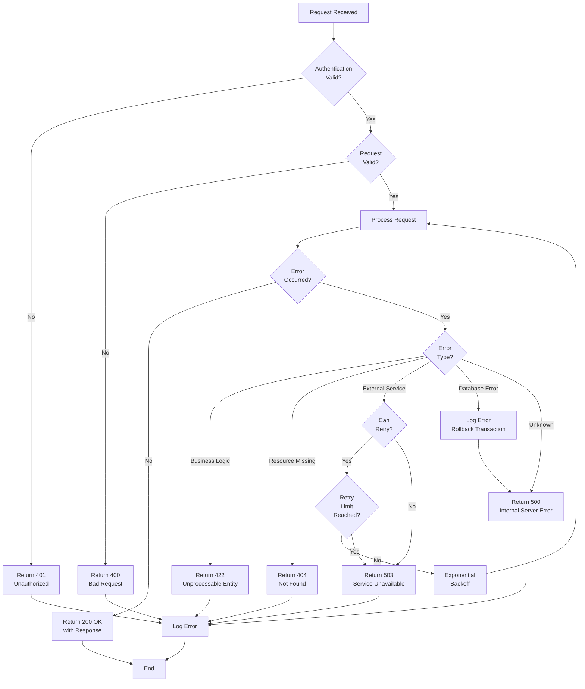
```mermaid
flowchart TD
    START[Request Received] --> AUTH{Authentication<br/>Valid?}
    AUTH -->|No| RETURN_401[Return 401<br/>Unauthorized]
    AUTH -->|Yes| VALIDATE{Request<br/>Valid?}
    
    VALIDATE -->|No| RETURN_400[Return 400<br/>Bad Request]
    VALIDATE -->|Yes| PROCESS[Process Request]
    
    PROCESS --> CHECK_ERROR{Error<br/>Occurred?}
    CHECK_ERROR -->|No| RETURN_200[Return 200 OK<br/>with Response]
    
    CHECK_ERROR -->|Yes| ERROR_TYPE{Error<br/>Type?}
    ERROR_TYPE -->|Business Logic| RETURN_422[Return 422<br/>Unprocessable Entity]
    ERROR_TYPE -->|Resource Missing| RETURN_404[Return 404<br/>Not Found]
    ERROR_TYPE -->|External Service| EXTERNAL{Can<br/>Retry?}
    ERROR_TYPE -->|Database Error| DB_HANDLE[Log Error<br/>Rollback Transaction]
    ERROR_TYPE -->|Unknown| RETURN_500[Return 500<br/>Internal Server Error]
    
    EXTERNAL -->|Yes| RETRY{Retry<br/>Limit<br/>Reached?}
    EXTERNAL -->|No| RETURN_503[Return 503<br/>Service Unavailable]
    
    RETRY -->|No| BACKOFF[Exponential<br/>Backoff]
    BACKOFF --> PROCESS
    RETRY -->|Yes| RETURN_503
    
    DB_HANDLE --> RETURN_500
    
    RETURN_401 --> LOG[Log Error]
    RETURN_400 --> LOG
    RETURN_422 --> LOG
    RETURN_404 --> LOG
    RETURN_500 --> LOG
    RETURN_503 --> LOG
    RETURN_200 --> END[End]
    LOG --> END
```

#### 5.5.3.3 Retry and Circuit Breaker Patterns

**Exponential Backoff Retry**:
- **Initial Delay**: 100ms
- **Maximum Delay**: 10 seconds
- **Maximum Retries**: 3 attempts
- **Jitter**: Add random jitter to prevent thundering herd

**Circuit Breaker** (for external service calls):
- **Closed State**: Normal operation, all requests pass through
- **Open State**: Failures exceed threshold (50% error rate over 1 minute), immediately fail requests
- **Half-Open State**: After timeout (30 seconds), allow limited requests to test service recovery
- **Transition**: Half-open → Closed if requests succeed, Half-open → Open if requests fail

**Graceful Degradation**:
- **Cache Fallback**: Return stale cached data when external service unavailable
- **Feature Degradation**: Disable non-critical features (e.g., AI suggestions) when service unavailable
- **Default Responses**: Return sensible defaults when data unavailable

### 5.5.4 Authentication and Authorization Framework

#### 5.5.4.1 Authentication Flow

**OAuth 2.0 Authorization Code Flow with PKCE** (for web and mobile):

1. **Client Initiates Login**: User clicks "Login" button
2. **Generate PKCE Parameters**: Client generates code verifier and challenge
3. **Redirect to Auth0**: Client redirects to Auth0 Universal Login with challenge
4. **User Authenticates**: User provides credentials to Auth0
5. **Authorization Code**: Auth0 redirects back with authorization code
6. **Token Exchange**: Client exchanges code + verifier for access token and refresh token
7. **Store Tokens**: Client stores tokens securely (httpOnly cookie for web, secure storage for mobile)
8. **API Requests**: Client includes access token in Authorization header for all API requests

**Token Management**:
- **Access Token**: Short-lived (1 hour), used for API authentication
- **Refresh Token**: Long-lived (7 days), used to obtain new access tokens
- **Token Refresh**: Automatically refresh access token before expiration
- **Token Revocation**: Revoke refresh token on logout

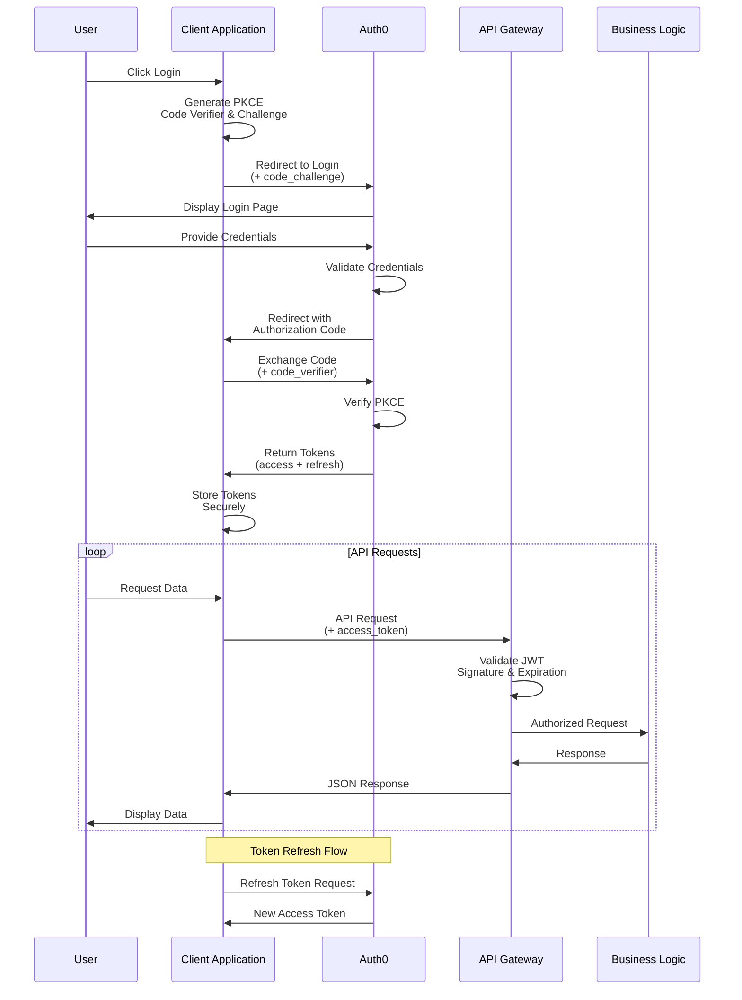
```mermaid
sequenceDiagram
    participant User
    participant Client as Client Application
    participant Auth0
    participant API as API Gateway
    participant Business as Business Logic
    
    User->>Client: Click Login
    Client->>Client: Generate PKCE<br/>Code Verifier & Challenge
    Client->>Auth0: Redirect to Login<br/>(+ code_challenge)
    Auth0->>User: Display Login Page
    User->>Auth0: Provide Credentials
    Auth0->>Auth0: Validate Credentials
    Auth0->>Client: Redirect with<br/>Authorization Code
    
    Client->>Auth0: Exchange Code<br/>(+ code_verifier)
    Auth0->>Auth0: Verify PKCE
    Auth0->>Client: Return Tokens<br/>(access + refresh)
    
    Client->>Client: Store Tokens<br/>Securely
    
    loop API Requests
        User->>Client: Request Data
        Client->>API: API Request<br/>(+ access_token)
        API->>API: Validate JWT<br/>Signature & Expiration
        API->>Business: Authorized Request
        Business->>API: Response
        API->>Client: JSON Response
        Client->>User: Display Data
    end
    
    Note over Client,Auth0: Token Refresh Flow
    Client->>Auth0: Refresh Token Request
    Auth0->>Client: New Access Token
```

#### 5.5.4.2 Authorization Model

**Role-Based Access Control (RBAC)**:

**Roles** (Defined in Auth0):
- **Admin**: Full system access, user management, configuration changes
- **User**: Standard user access to personal data and features
- **Guest**: Limited read-only access to public features (if applicable)

**Permissions** (Granular capabilities):
- `read:own_profile` - Read own user profile
- `write:own_profile` - Update own user profile
- `read:own_documents` - Read own documents
- `write:own_documents` - Create/update own documents
- `delete:own_documents` - Delete own documents
- `admin:users` - Manage all users (admin only)
- `admin:system` - System configuration (admin only)

**Authorization Enforcement**:
- **API Gateway**: Validates token and extracts user roles/permissions from JWT claims
- **Business Logic**: Enforces fine-grained permissions on resource access
- **Database Queries**: Filter queries by user ownership (e.g., `userId` field)

**Permission Check Example**:
```python
# Pseudocode for permission checking
def get_document(document_id, user):
    # Check if user has permission to read documents
    if not user.has_permission('read:own_documents'):
        raise PermissionDenied("Insufficient permissions")
    
    # Retrieve document
    document = db.documents.find_one({'_id': document_id})
    
    # Verify ownership (unless admin)
    if not user.is_admin() and document.user_id != user.id:
        raise PermissionDenied("Access denied to this document")
    
    return document
```

### 5.5.5 Performance Requirements

#### 5.5.5.1 Service Level Objectives (SLOs)

| Metric | Target | Measurement |
|--------|--------|-------------|
| **API Response Time (p95)** | <500ms | 95% of requests complete in under 500ms |
| **API Response Time (p99)** | <2000ms | 99% of requests complete in under 2 seconds |
| **Availability** | 99.9% | Service available 99.9% of time (max 43 minutes downtime/month) |
| **Error Rate** | <0.1% | Less than 1 in 1000 requests result in 5xx errors |
| **Database Query Time (p95)** | <50ms | 95% of database queries complete in under 50ms |
| **Cache Hit Rate** | >80% | 80% of cacheable requests served from cache |
| **AI Response Time (p95)** | <10 seconds | 95% of AI queries return results in under 10 seconds |

#### 5.5.5.2 Performance Optimization Strategies

**Database Optimization**:
- **Indexing**: Create indexes on frequently queried fields
- **Pagination**: Limit result sets to 50 items per page
- **Projection**: Return only required fields, not entire documents
- **Connection Pooling**: Reuse database connections (pool size: 10-100)

**Caching Strategy**:
- **API Response Caching**: Cache frequent GET requests (TTL: 5-60 minutes)
- **Database Query Caching**: Cache expensive aggregations (TTL: 10 minutes)
- **User Session Caching**: Store active sessions in Redis (TTL: session lifetime)
- **Cache Warming**: Pre-populate cache with popular data

**API Optimization**:
- **Request Batching**: Combine multiple requests into single API call (future)
- **Response Compression**: Enable gzip compression for API responses
- **Conditional Requests**: Support ETag/If-None-Match for efficient caching
- **Rate Limiting**: Prevent abuse while ensuring fair resource allocation

**Frontend Optimization**:
- **Code Splitting**: Lazy load routes and components
- **Image Optimization**: Compress images, use modern formats (WebP)
- **Bundle Size**: Target <500KB initial JavaScript bundle
- **CDN**: Serve static assets from CloudFront (future)

### 5.5.6 Disaster Recovery

#### 5.5.6.1 Backup Strategy

**Database Backups**:
- **Frequency**: Daily automated snapshots at 2:00 AM UTC
- **Retention**: 7 daily backups, 4 weekly backups, 12 monthly backups
- **Location**: Amazon S3 in separate region (cross-region replication)
- **Encryption**: AES-256 encryption at rest
- **Testing**: Monthly restore testing to verify backup integrity

**Application Backups**:
- **Configuration**: Store in version-controlled infrastructure as code (Terraform)
- **Secrets**: Backed up in AWS Secrets Manager with automatic rotation
- **Container Images**: Retained in ECR with tag immutability

**Recovery Time Objective (RTO)**:
- **Critical Services**: <1 hour (API Gateway, Business Logic)
- **Database**: <2 hours (restore from backup)
- **Full System**: <4 hours (complete infrastructure rebuild)

**Recovery Point Objective (RPO)**:
- **Database**: <24 hours (daily backup schedule)
- **Critical Data**: <1 hour (MongoDB replica set with continuous replication)

#### 5.5.6.2 Disaster Recovery Procedures

**Minor Incident (Single Service Failure)**:
1. AWS ECS automatically restarts failed containers
2. Health checks detect failure within 30 seconds
3. New container launched from healthy image
4. Load balancer routes traffic to healthy instances
5. Total recovery time: <5 minutes

**Major Incident (Complete Region Failure)**:
1. Detect region failure via CloudWatch alarms
2. Activate disaster recovery plan
3. Provision infrastructure in backup region using Terraform
4. Restore database from latest cross-region backup
5. Deploy application containers from ECR
6. Update DNS to point to new region
7. Total recovery time: <4 hours (RTO)

**Data Corruption**:
1. Identify corruption time window
2. Restore database to point-in-time before corruption
3. Replay valid transactions from audit log (if available)
4. Validate data integrity
5. Resume normal operations

---

## 5.6 References

### 5.6.1 Referenced Technical Specification Sections

The following sections of this technical specification were referenced to ensure architectural alignment:

- **Section 1.2 System Overview**: Established baseline documentation context
- **Section 2.1 Feature Catalog**: Validated that architecture supports future feature implementation
- **Section 3.2 Target Technology Stack**: Defined technology choices informing architecture decisions
- **Section 3.4 Frameworks & Libraries**: Detailed framework capabilities and integration patterns
- **Section 3.6 Third-Party Services**: External service integrations and dependencies
- **Section 3.7 Databases & Storage**: Data persistence architecture and scaling strategies
- **Section 3.8 Development & Deployment**: Infrastructure provisioning and deployment architecture

### 5.6.2 Architectural Patterns and Standards

**Industry Patterns Referenced**:
- **Three-Tier Architecture Pattern**: Classic separation of presentation, application, and data layers
- **API Gateway Pattern**: Centralized API entry point for authentication, routing, and cross-cutting concerns
- **Cache-Aside Pattern**: Application explicitly manages cache population and invalidation
- **Circuit Breaker Pattern**: Prevent cascading failures in distributed systems
- **Retry with Exponential Backoff**: Resilient external service integration

**Security Standards**:
- **OAuth 2.0**: Industry-standard authorization framework
- **OpenID Connect (OIDC)**: Authentication layer on top of OAuth 2.0
- **JWT (JSON Web Tokens)**: Token-based authentication standard

**Cloud Architecture Best Practices**:
- **AWS Well-Architected Framework**: Operational excellence, security, reliability, performance efficiency, cost optimization
- **Twelve-Factor App Methodology**: Cloud-native application design principles

### 5.6.3 Documentation Notes

**Current State**: This system architecture documentation describes a **target architecture** for a greenfield codebase. No components, services, or infrastructure are currently implemented.

**Future Updates**: As implementation progresses, this document should be updated to reflect:
- Actual implementation details and deviations from planned architecture
- Performance benchmarks and optimization results
- Lessons learned and architectural refinements
- New components or services added to the system

**Related Documentation**:
- API documentation (to be created using OpenAPI/Swagger)
- Deployment runbooks (to be created for operational procedures)
- Security documentation (to be created for compliance and security controls)
- Performance testing results (to be documented as load testing completed)

# 6. SYSTEM COMPONENTS DESIGN

## 6.1 Core Services Architecture

##### 6. INFRASTRUCTURE & DEPLOYMENT

## 6.1 Core Services Architecture

### 6.1.1 Architecture Assessment

**Core Services Architecture is not applicable for this system.**

This repository represents an empty codebase with no implemented services, components, or architectural patterns. As such, there are no core services to document at this time.

### 6.1.2 Current State

The repository contains no service implementations, distributed architecture components, or infrastructure patterns that would require core services architecture documentation.

#### Absence of Service Components

No service boundaries, inter-service communication patterns, service discovery mechanisms, load balancing strategies, circuit breaker patterns, or retry mechanisms exist in the current codebase.

#### Absence of Scalability Design

No horizontal or vertical scaling approaches, auto-scaling configurations, resource allocation strategies, performance optimization techniques, or capacity planning guidelines are present.

#### Absence of Resilience Patterns

No fault tolerance mechanisms, disaster recovery procedures, data redundancy approaches, failover configurations, or service degradation policies have been implemented.

### 6.1.3 Future Considerations

This section should be revisited when the system evolves to include:

- Microservices or distributed service components
- Service-oriented architecture patterns
- Scalability requirements beyond single-instance deployment
- Resilience and fault tolerance mechanisms
- Inter-service communication and orchestration

### 6.1.4 References

**Repository Analysis:**
- Root directory inspection confirmed empty codebase state
- `test.py` - Empty placeholder file with no implementation

## 6.2 Database Design

### 6.2.1 Current Database Implementation Status

**Implementation State**: Not Implemented

This section documents the target database design for the system. **No database schemas, data models, or persistence mechanisms currently exist** in the codebase. The repository contains no implementation of the database architecture described below.

| Database Component | Current Status |
|-------------------|----------------|
| Database Schemas | Not defined |
| Data Models | Not implemented |
| Migration Scripts | Not created |
| Indexing Strategy | Not configured |
| Replication Architecture | Not deployed |
| Backup Systems | Not established |

### 6.2.2 Documentation Purpose

This section establishes the **target database design** to be implemented when development begins. All schemas, data models, indexing strategies, and architectural patterns described below represent the planned state based on the technology stack defined in Section 3.7.

---

## 6.3 Target Database Architecture

### 6.3.1 Database Technology Stack

The system will utilize a multi-tier data persistence strategy leveraging different storage technologies optimized for specific use cases:

| Storage Layer | Technology | Primary Use Case |
|--------------|------------|-----------------|
| Primary Database | MongoDB (Amazon DocumentDB) | Structured application data, entities |
| Caching Layer | Redis (Amazon ElastiCache) | Session management, API caching |
| Object Storage | Amazon S3 | Files, media, static assets, backups |

---

## 6.4 Schema Design

### 6.4.1 MongoDB Schema Architecture

#### 6.4.1.1 Schema Design Principles

The target MongoDB schema will follow these design principles:

**Modeling Strategy**:
- **Embedding**: One-to-few relationships will be embedded within parent documents to minimize joins and optimize read performance
- **Referencing**: One-to-many and many-to-many relationships will use references to prevent document bloat
- **Denormalization**: Read-heavy operations will benefit from controlled denormalization to reduce query complexity
- **Schema Validation**: MongoDB schema validation rules and Pydantic models will enforce data integrity at both database and application layers

**Document Design Guidelines**:
- Maximum document size: 16MB (MongoDB limit)
- Avoid unbounded arrays that could exceed document size limits
- Use projections to retrieve only required fields
- Implement atomic operations for concurrent updates

#### 6.4.1.2 Core Entity Models

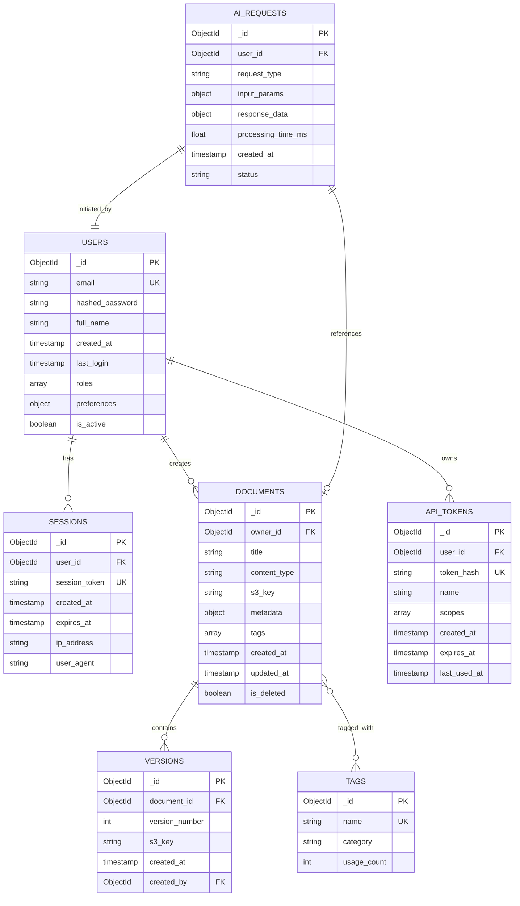
```mermaid
erDiagram
    USERS ||--o{ SESSIONS : has
    USERS ||--o{ DOCUMENTS : creates
    USERS ||--o{ API_TOKENS : owns
    DOCUMENTS ||--o{ VERSIONS : contains
    DOCUMENTS }o--o{ TAGS : tagged_with
    AI_REQUESTS ||--|| USERS : initiated_by
    AI_REQUESTS ||--o| DOCUMENTS : references

    USERS {
        ObjectId _id PK
        string email UK
        string hashed_password
        string full_name
        timestamp created_at
        timestamp last_login
        array roles
        object preferences
        boolean is_active
    }

    SESSIONS {
        ObjectId _id PK
        ObjectId user_id FK
        string session_token UK
        timestamp created_at
        timestamp expires_at
        string ip_address
        string user_agent
    }

    DOCUMENTS {
        ObjectId _id PK
        ObjectId owner_id FK
        string title
        string content_type
        string s3_key
        object metadata
        array tags
        timestamp created_at
        timestamp updated_at
        boolean is_deleted
    }

    VERSIONS {
        ObjectId _id PK
        ObjectId document_id FK
        int version_number
        string s3_key
        timestamp created_at
        ObjectId created_by FK
    }

    TAGS {
        ObjectId _id PK
        string name UK
        string category
        int usage_count
    }

    API_TOKENS {
        ObjectId _id PK
        ObjectId user_id FK
        string token_hash UK
        string name
        array scopes
        timestamp created_at
        timestamp expires_at
        timestamp last_used_at
    }

    AI_REQUESTS {
        ObjectId _id PK
        ObjectId user_id FK
        string request_type
        object input_params
        object response_data
        float processing_time_ms
        timestamp created_at
        string status
    }
```

#### 6.4.1.3 Collection Schemas

**Users Collection**:
```javascript
{
  _id: ObjectId,
  email: String (unique, indexed),
  hashed_password: String,
  full_name: String,
  created_at: ISODate,
  last_login: ISODate,
  roles: [String],  // ['user', 'admin', 'moderator']
  preferences: {
    theme: String,
    notifications: Boolean,
    language: String
  },
  profile: {
    avatar_s3_key: String,
    bio: String,
    location: String
  },
  is_active: Boolean,
  email_verified: Boolean,
  two_factor_enabled: Boolean
}
```

**Documents Collection**:
```javascript
{
  _id: ObjectId,
  owner_id: ObjectId (indexed),
  title: String,
  description: String,
  content_type: String,  // 'text', 'image', 'pdf', etc.
  s3_key: String (unique),
  s3_bucket: String,
  file_size_bytes: Number,
  metadata: {
    width: Number,
    height: Number,
    duration: Number,
    // ... extensible metadata
  },
  tags: [ObjectId],  // References to Tags collection
  permissions: {
    is_public: Boolean,
    shared_with: [ObjectId]  // User IDs
  },
  ai_processing: {
    processed: Boolean,
    processing_results: Object,
    last_processed_at: ISODate
  },
  created_at: ISODate (indexed),
  updated_at: ISODate (indexed),
  is_deleted: Boolean,
  deleted_at: ISODate
}
```

**Sessions Collection** (Short-lived, TTL-indexed):
```javascript
{
  _id: ObjectId,
  user_id: ObjectId (indexed),
  session_token: String (unique, hashed),
  refresh_token: String (hashed),
  created_at: ISODate,
  expires_at: ISODate (TTL index),
  ip_address: String,
  user_agent: String,
  last_activity: ISODate
}
```

**AI Requests Collection** (Audit trail):
```javascript
{
  _id: ObjectId,
  user_id: ObjectId (indexed),
  request_type: String,  // 'text_generation', 'image_analysis', etc.
  input_params: Object,
  response_data: Object,
  processing_time_ms: Number,
  model_version: String,
  created_at: ISODate (indexed),
  status: String,  // 'success', 'failure', 'timeout'
  error_message: String
}
```

### 6.4.2 Indexing Strategy

#### 6.4.2.1 Primary Indexes

| Collection | Index Definition | Type | Purpose |
|-----------|-----------------|------|---------|
| users | `{ email: 1 }` | Unique | Authentication lookups |
| users | `{ created_at: -1 }` | Single | User listing, pagination |
| sessions | `{ session_token: 1 }` | Unique | Session validation |
| sessions | `{ user_id: 1 }` | Single | User session retrieval |
| sessions | `{ expires_at: 1 }` | TTL | Automatic session cleanup |
| documents | `{ owner_id: 1, created_at: -1 }` | Compound | User document listing |
| documents | `{ s3_key: 1 }` | Unique | S3 object reference |
| documents | `{ tags: 1 }` | Multikey | Tag-based search |

#### 6.4.2.2 Compound Indexes

**Documents - Advanced Queries**:
```javascript
// Multi-field search optimization
{ owner_id: 1, is_deleted: 1, created_at: -1 }

// Tag filtering with date range
{ tags: 1, created_at: -1 }

// Public document discovery
{ "permissions.is_public": 1, created_at: -1 }
```

**AI Requests - Analytics**:
```javascript
// User activity analysis
{ user_id: 1, created_at: -1 }

// Performance monitoring
{ request_type: 1, created_at: -1 }

// Status tracking
{ status: 1, created_at: -1 }
```

#### 6.4.2.3 Text Search Indexes

```javascript
// Full-text search on documents
db.documents.createIndex({
  title: "text",
  description: "text"
}, {
  weights: {
    title: 10,
    description: 5
  },
  name: "document_text_search"
})

// Tag name search
db.tags.createIndex({ name: "text" })
```

### 6.4.3 Partitioning & Sharding Strategy

#### 6.4.3.1 Sharding Approach

**Initial Deployment**: Single replica set (no sharding)

**Sharding Threshold**: Implement sharding when:
- Collection size exceeds 500GB
- Query throughput exceeds single replica set capacity
- Geographic distribution requires data locality

**Proposed Sharding Keys**:

| Collection | Shard Key | Rationale |
|-----------|-----------|-----------|
| documents | `{ owner_id: "hashed" }` | Even distribution, user data locality |
| ai_requests | `{ user_id: "hashed", created_at: 1 }` | Balanced writes, time-based queries |
| sessions | Not sharded | Small, TTL-managed collection |

#### 6.4.3.2 Zone Sharding (Future)

For geographic data distribution:
```javascript
// North America zone
sh.addShardTag("shard0000", "NA")
sh.addTagRange("app.documents", 
  { owner_id: MinKey }, 
  { owner_id: MaxKey }, 
  "NA"
)

// Europe zone
sh.addShardTag("shard0001", "EU")
// Tag range based on user location metadata
```

### 6.4.4 Replication Configuration

#### 6.4.4.1 Replica Set Architecture

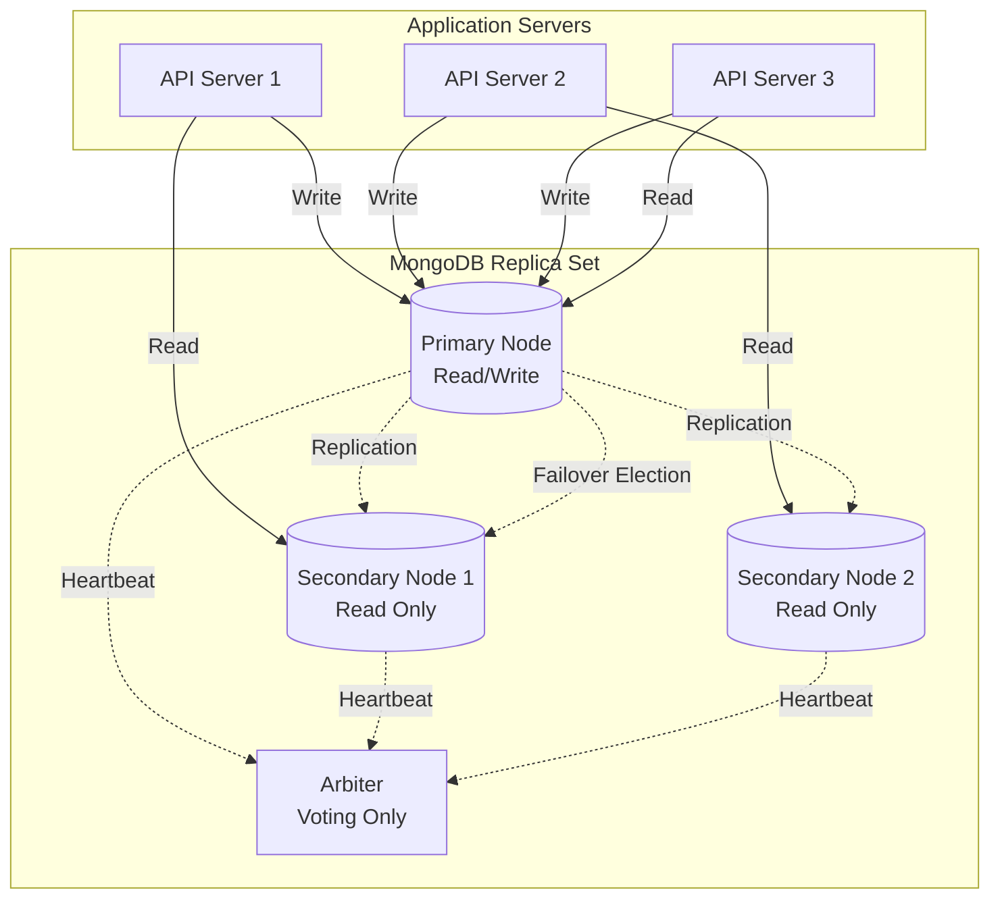
```mermaid
graph TB
    subgraph "MongoDB Replica Set"
        PRIMARY[(Primary Node<br/>Read/Write)]
        SECONDARY1[(Secondary Node 1<br/>Read Only)]
        SECONDARY2[(Secondary Node 2<br/>Read Only)]
        ARBITER[Arbiter<br/>Voting Only]
    end
    
    subgraph "Application Servers"
        APP1[API Server 1]
        APP2[API Server 2]
        APP3[API Server 3]
    end
    
    APP1 -->|Write| PRIMARY
    APP1 -->|Read| SECONDARY1
    APP2 -->|Write| PRIMARY
    APP2 -->|Read| SECONDARY2
    APP3 -->|Write| PRIMARY
    APP3 -->|Read| PRIMARY
    
    PRIMARY -.Replication.-> SECONDARY1
    PRIMARY -.Replication.-> SECONDARY2
    PRIMARY -.Heartbeat.-> ARBITER
    SECONDARY1 -.Heartbeat.-> ARBITER
    SECONDARY2 -.Heartbeat.-> ARBITER
    
    PRIMARY -.Failover Election.-> SECONDARY1
```

**Configuration**:
- **Replica Set Size**: 3 data-bearing nodes + 1 arbiter
- **Deployment**: Multi-AZ (Availability Zone) for high availability
- **Write Concern**: `{ w: "majority", j: true }` for data durability
- **Read Preference**: `primaryPreferred` for consistency, `secondaryPreferred` for read-heavy workloads

**Read Preference Strategy**:
- **Critical Writes**: Direct to primary with `w: "majority"`
- **User Queries**: `secondaryPreferred` for load distribution
- **Analytics**: `secondary` with eventual consistency tolerance
- **Session Reads**: `primary` for consistency after write

#### 6.4.4.2 Replication Lag Monitoring

**Acceptable Thresholds**:
- **Normal Operations**: < 1 second lag
- **Alert Threshold**: > 10 seconds lag
- **Critical Threshold**: > 60 seconds lag

**Monitoring Metrics**:
```javascript
// Check replication lag
rs.printSlaveReplicationInfo()

// Monitor oplog window
db.getReplicationInfo()
```

### 6.4.5 Backup Architecture

#### 6.4.5.1 Backup Strategy

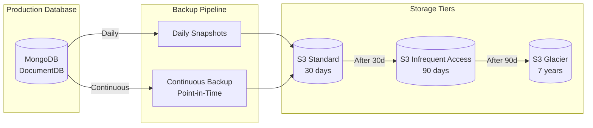
```mermaid
graph LR
    subgraph "Production Database"
        MONGO[(MongoDB<br/>DocumentDB)]
    end
    
    subgraph "Backup Pipeline"
        SNAPSHOT[Daily Snapshots]
        CONTINUOUS[Continuous Backup<br/>Point-in-Time]
    end
    
    subgraph "Storage Tiers"
        S3_STANDARD[(S3 Standard<br/>30 days)]
        S3_IA[(S3 Infrequent Access<br/>90 days)]
        GLACIER[(S3 Glacier<br/>7 years)]
    end
    
    MONGO -->|Daily| SNAPSHOT
    MONGO -->|Continuous| CONTINUOUS
    
    SNAPSHOT --> S3_STANDARD
    CONTINUOUS --> S3_STANDARD
    
    S3_STANDARD -->|After 30d| S3_IA
    S3_IA -->|After 90d| GLACIER
```

**Backup Schedule**:

| Backup Type | Frequency | Retention | Recovery Time |
|------------|-----------|-----------|---------------|
| Automated Snapshots | Daily at 2 AM UTC | 30 days | < 1 hour |
| Point-in-Time Backup | Continuous (oplog) | 7 days | < 15 minutes |
| Weekly Full Backup | Sunday 2 AM UTC | 90 days | < 2 hours |
| Monthly Archive | 1st of month | 7 years | < 4 hours |

**Backup Verification**:
- Weekly automated restore tests to staging environment
- Monthly backup integrity checks
- Quarterly disaster recovery drills

---

## 6.5 Data Management

### 6.5.1 Migration Procedures

#### 6.5.1.1 Migration Framework

**Tool**: Custom Python migration scripts using PyMongo + `alembic`-style versioning

**Migration Structure**:
```
migrations/
├── versions/
│   ├── 001_initial_schema.py
│   ├── 002_add_user_preferences.py
│   └── 003_document_tags.py
├── migration_engine.py
└── migration_config.yaml
```

**Migration Script Template**:
```python
# Migration: 001_initial_schema.py
def upgrade(db):
    """Apply migration"""
    # Create collections
    db.create_collection("users")
    db.create_collection("documents")
    
    # Create indexes
    db.users.create_index("email", unique=True)
    db.documents.create_index([("owner_id", 1), ("created_at", -1)])

def downgrade(db):
    """Rollback migration"""
    db.drop_collection("users")
    db.drop_collection("documents")
```

#### 6.5.1.2 Migration Execution Process

**Pre-Migration Checklist**:
1. Full database backup completed and verified
2. Migration tested in staging environment
3. Rollback plan documented and tested
4. Maintenance window scheduled (if required)
5. Monitoring alerts configured

**Execution Steps**:
```bash
# 1. Check current migration version
python migrate.py current

##### 2. Dry-run migration (no changes)
python migrate.py upgrade --dry-run

##### 3. Execute migration
python migrate.py upgrade

##### 4. Verify migration success
python migrate.py verify
```

**Rollback Procedure**:
```bash
# Immediate rollback to previous version
python migrate.py downgrade --steps 1

#### Rollback to specific version
python migrate.py downgrade --target 003
```

#### 6.5.1.3 Zero-Downtime Migrations

**Strategy for Large Collections**:
1. **Dual-Write Phase**: Application writes to both old and new schema
2. **Background Migration**: Async job migrates existing data
3. **Read-Switch Phase**: Application reads from new schema, falls back to old
4. **Validation Phase**: Verify data consistency between schemas
5. **Cleanup Phase**: Remove old schema fields/collections

### 6.5.2 Versioning Strategy

#### 6.5.2.1 Schema Versioning

**Approach**: Implicit schema versioning through backward-compatible changes

**Version Tracking**:
```javascript
// schema_versions collection
{
  _id: ObjectId,
  version: "1.2.0",
  applied_at: ISODate,
  migrations: ["001_initial", "002_preferences", "003_tags"],
  applied_by: "deployment_system",
  notes: "Added document tagging support"
}
```

**Semantic Versioning**:
- **Major (X.0.0)**: Breaking schema changes requiring data migration
- **Minor (x.X.0)**: Backward-compatible additions (new fields, collections)
- **Patch (x.x.X)**: Index optimizations, constraint updates

#### 6.5.2.2 Document Versioning

**User-Facing Content Versions**:
- Document versions stored in separate `versions` collection
- Original document maintains reference to current version
- Full version history preserved for audit trail

**Version Storage**:
```javascript
// documents collection
{
  _id: ObjectId,
  current_version: 5,
  version_history: [ObjectId1, ObjectId2, ...],
  // ... other fields
}

// versions collection
{
  _id: ObjectId,
  document_id: ObjectId,
  version_number: 5,
  s3_key: "versions/doc123_v5.txt",
  created_at: ISODate,
  created_by: ObjectId,
  change_summary: "Updated introduction section"
}
```

### 6.5.3 Archival Policies

#### 6.5.3.1 Data Lifecycle Management

**Archival Triggers**:

| Data Type | Archival Condition | Destination | Retention |
|-----------|-------------------|-------------|-----------|
| Deleted Documents | Soft-deleted > 30 days | S3 Glacier | 7 years |
| Inactive Sessions | Expired > 7 days | Purged | N/A |
| AI Request Logs | > 90 days old | S3 IA → Glacier | 3 years |
| Old Document Versions | > 1 year, > 10 versions | S3 Glacier | 5 years |
| User Audit Logs | > 180 days | S3 Glacier | 7 years |

#### 6.5.3.2 Archival Process

```mermaid
flowchart TD
    A[Daily Archival Job] --> B{Identify Archival Candidates}
    B -->|Documents| C[Export to S3 Glacier]
    B -->|Logs| D[Compress & Archive]
    B -->|Sessions| E[Purge from Database]
    
    C --> F[Update Document Status]
    F --> G[Remove from Active Collection]
    G --> H[Update Archive Index]
    
    D --> I[Store in Glacier Deep Archive]
    I --> H
    
    E --> J[Log Purge Activity]
    
    H --> K[Archive Manifest Updated]
```

**Archive Metadata Index**:
```javascript
// archives collection (lightweight index)
{
  _id: ObjectId,
  original_id: ObjectId,
  collection: "documents",
  archived_at: ISODate,
  glacier_object_key: "archives/2024/documents/doc123.json.gz",
  retrieval_tier: "standard",  // standard, bulk, expedited
  size_bytes: 15234,
  checksum: "sha256:abc123..."
}
```

#### 6.5.3.3 Data Restoration

**Retrieval Process**:
1. Query archive index for object location
2. Initiate S3 Glacier retrieval (3-5 hours for standard)
3. Temporary staging in S3 Standard (24-hour expiration)
4. Optional: Restore to active database collection

### 6.5.4 Caching Policies (Redis)

#### 6.5.4.1 Cache Strategy Patterns

**Cache-Aside Pattern** (Primary):
```python
def get_user(user_id):
    # 1. Check cache
    cached = redis.get(f"user:{user_id}")
    if cached:
        return json.loads(cached)
    
    # 2. Cache miss - fetch from DB
    user = db.users.find_one({"_id": user_id})
    
    # 3. Populate cache
    redis.setex(f"user:{user_id}", 3600, json.dumps(user))
    return user
```

**Write-Through Pattern** (Critical Data):
```python
def update_user(user_id, updates):
    # 1. Update database
    db.users.update_one({"_id": user_id}, {"$set": updates})
    
    # 2. Update cache
    user = db.users.find_one({"_id": user_id})
    redis.setex(f"user:{user_id}", 3600, json.dumps(user))
```

#### 6.5.4.2 Cache TTL Strategy

| Cache Type | TTL | Rationale |
|-----------|-----|-----------|
| User Profile | 1 hour | Moderate update frequency |
| API Responses | 5 minutes | Frequent data changes |
| Session Data | 24 hours | Session expiration alignment |
| Static Config | 12 hours | Rarely changes |
| Query Results | 10 minutes | Balance freshness vs load |
| Rate Limit Counters | 1 minute | Sliding window precision |

#### 6.5.4.3 Cache Invalidation Strategy

**Event-Driven Invalidation**:
```python
# After user profile update
def on_user_update(user_id):
    redis.delete(f"user:{user_id}")
    redis.delete(f"user:{user_id}:documents")
    # Invalidate related caches
```

**Pattern-Based Invalidation**:
```python
# Invalidate all user-related caches
def invalidate_user_caches(user_id):
    pattern = f"user:{user_id}:*"
    keys = redis.keys(pattern)
    if keys:
        redis.delete(*keys)
```

**Cache Warming**:
- Pre-populate cache for frequently accessed data on application startup
- Background jobs refresh hot data before TTL expiration
- Predictive caching for anticipated user actions

---

## 6.6 Compliance Considerations

### 6.6.1 Data Retention Rules

#### 6.6.1.1 Regulatory Compliance

**GDPR Compliance**:
- **Right to Erasure**: User data permanently deleted within 30 days of request
- **Data Portability**: Export user data in JSON format on request
- **Purpose Limitation**: Data retained only for specified purposes
- **Storage Limitation**: Automated deletion of data beyond retention period

**Retention Schedule**:

| Data Category | Retention Period | Legal Basis |
|--------------|------------------|-------------|
| User Accounts (Active) | Duration of account + 30 days | Contract necessity |
| User Accounts (Deleted) | 30 days | Legal obligation |
| Transaction Logs | 7 years | Financial regulations |
| Audit Logs | 7 years | Security compliance |
| User Content | User-controlled + 30 days post-deletion | Contract necessity |
| AI Interaction Logs | 3 years | Service improvement |
| Session Data | 24 hours post-expiration | Technical necessity |

#### 6.6.1.2 Data Deletion Process

```mermaid
flowchart TD
    A[User Deletion Request] --> B{Request Validation}
    B -->|Invalid| C[Reject Request]
    B -->|Valid| D[Initiate Soft Delete]
    
    D --> E[Mark account is_active=false]
    E --> F[Anonymize PII fields]
    F --> G[30-Day Grace Period]
    
    G --> H{Grace Period Expired}
    H -->|No| G
    H -->|Yes| I[Hard Delete Cascade]
    
    I --> J[Delete User Record]
    I --> K[Delete Sessions]
    I --> L[Delete API Tokens]
    I --> M[Delete/Transfer Documents]
    
    J --> N[Delete S3 Objects]
    K --> N
    L --> N
    M --> N
    
    N --> O[Generate Deletion Certificate]
    O --> P[Audit Log Entry]
```

**Anonymization Strategy**:
```javascript
// Soft delete - anonymize PII
{
  email: "deleted_user_123@anonymized.local",
  full_name: "[DELETED]",
  profile: {},
  is_active: false,
  deleted_at: ISODate,
  deletion_request_id: ObjectId
}
```

### 6.6.2 Backup & Fault Tolerance

#### 6.6.2.1 Fault Tolerance Architecture

**Database High Availability**:
- **Multi-AZ Deployment**: Primary and secondary nodes in different availability zones
- **Automatic Failover**: < 30 seconds failover time to secondary node
- **Data Replication**: Synchronous replication with `w: "majority"` write concern

**Recovery Point Objective (RPO)**: < 5 minutes (continuous backup)
**Recovery Time Objective (RTO)**: < 1 hour (automated restore)

#### 6.6.2.2 Disaster Recovery Plan

**Failure Scenarios**:

| Scenario | Detection | Response | RTO |
|----------|-----------|----------|-----|
| Primary Node Failure | 10 seconds (heartbeat) | Automatic failover to secondary | < 30s |
| AZ Outage | 30 seconds | Promote secondary in healthy AZ | < 2 min |
| Region Outage | Manual detection | Restore from cross-region backup | < 4 hours |
| Data Corruption | Monitoring alerts | Point-in-time restore | < 1 hour |
| Complete Data Loss | N/A | Restore latest backup | < 2 hours |

**Backup Validation**:
```bash
# Weekly automated test
1. Restore latest backup to isolated environment
2. Verify data integrity (record counts, checksums)
3. Run test queries against restored database
4. Generate validation report
5. Alert on any discrepancies
```

### 6.6.3 Privacy Controls

#### 6.6.3.1 Data Classification

| Classification | Description | Examples | Protection Level |
|---------------|-------------|----------|-----------------|
| Public | Non-sensitive, publicly accessible | Product descriptions | Standard |
| Internal | Business data, not public | Usage analytics | Encrypted at rest |
| Confidential | Sensitive business data | User emails, API keys | Encrypted + access control |
| Restricted | Highly sensitive PII | Passwords, payment info | Encrypted + audit logging |

#### 6.6.3.2 Encryption Strategy

**Encryption at Rest**:
- **MongoDB**: Amazon DocumentDB encryption using AWS KMS
- **Redis**: ElastiCache encryption with CMK (Customer Master Key)
- **S3**: Server-side encryption (SSE-KMS) for all objects
- **Backups**: Encrypted before storage in S3/Glacier

**Encryption in Transit**:
- TLS 1.3 for all database connections
- Certificate-based authentication for MongoDB replica set
- VPC private subnets for database network isolation

**Key Management**:
```mermaid
graph TB
    subgraph "AWS KMS"
        CMK[Customer Master Key<br/>Auto-rotation enabled]
    end
    
    subgraph "Data Encryption"
        MONGO[MongoDB<br/>Encrypted at Rest]
        REDIS[Redis<br/>Encrypted at Rest]
        S3[S3 Objects<br/>SSE-KMS]
    end
    
    CMK -->|Encrypts DEK| MONGO
    CMK -->|Encrypts DEK| REDIS
    CMK -->|Encrypts Objects| S3
```

#### 6.6.3.3 PII Handling

**Personally Identifiable Information (PII) Fields**:
- Email addresses
- Full names
- IP addresses
- User-generated content containing personal data

**PII Protection Measures**:
1. **Field-Level Encryption**: Additional encryption for sensitive fields
2. **Access Logging**: All PII access logged to audit trail
3. **Tokenization**: External identifiers use non-reversible tokens
4. **Pseudonymization**: Analytics use hashed user IDs

### 6.6.4 Audit Mechanisms

#### 6.6.4.1 Database Audit Logging

**Audit Scope**:
- All DDL operations (schema changes)
- All DML operations on sensitive collections (users, api_tokens)
- Administrative actions (user privilege changes)
- Failed authentication attempts
- Data export operations

**Audit Log Schema**:
```javascript
// audit_logs collection
{
  _id: ObjectId,
  timestamp: ISODate,
  event_type: "USER_UPDATE",
  actor: {
    user_id: ObjectId,
    ip_address: String,
    user_agent: String
  },
  target: {
    collection: "users",
    document_id: ObjectId,
    action: "update"
  },
  changes: {
    fields: ["email", "full_name"],
    before: { /* snapshot */ },
    after: { /* snapshot */ }
  },
  metadata: {
    request_id: String,
    session_id: ObjectId,
    api_endpoint: String
  }
}
```

#### 6.6.4.2 Audit Trail Retention

**Retention Policy**:
- **Security Events**: 7 years (compliance requirement)
- **Data Access Logs**: 3 years
- **Administrative Actions**: 7 years
- **Failed Authentication**: 1 year

**Audit Log Archival**:
- Monthly export to S3 Glacier
- Immutable storage (WORM - Write Once Read Many)
- Chain-of-custody documentation for legal proceedings

#### 6.6.4.3 Compliance Reporting

**Automated Reports**:
- **Daily**: Failed authentication attempts, unusual access patterns
- **Weekly**: Data access summary per user, privilege escalations
- **Monthly**: Compliance posture report, retention policy adherence
- **Quarterly**: Full security audit, vulnerability assessment

### 6.6.5 Access Controls

#### 6.6.5.1 Database Authentication

**MongoDB Authentication**:
```javascript
// Database users with role-based access
{
  user: "app_service",
  roles: [
    { role: "readWrite", db: "production" }
  ],
  authenticationRestrictions: [{
    clientSource: ["10.0.0.0/16"],  // VPC CIDR only
    serverAddress: ["10.0.1.50"]
  }]
}

{
  user: "analytics_readonly",
  roles: [
    { role: "read", db: "production" }
  ]
}

{
  user: "admin_user",
  roles: [
    { role: "dbOwner", db: "production" }
  ]
}
```

**Authentication Mechanisms**:
- SCRAM-SHA-256 for user authentication
- X.509 certificates for service-to-service authentication
- AWS IAM authentication for DocumentDB

#### 6.6.5.2 Role-Based Access Control (RBAC)

**Application-Level Roles**:

| Role | Database Permissions | Use Case |
|------|---------------------|----------|
| `api_service` | Read/Write on users, documents, sessions | Primary application backend |
| `ai_service` | Read users, Read/Write ai_requests | AI processing service |
| `analytics_reader` | Read-only on all collections | Business intelligence queries |
| `backup_service` | Read-only + backup privileges | Automated backup jobs |
| `admin` | Full database admin | Emergency manual interventions |

**Collection-Level Security**:
```javascript
// MongoDB roles with granular permissions
db.createRole({
  role: "documentManager",
  privileges: [
    { resource: { db: "production", collection: "documents" }, 
      actions: ["find", "insert", "update", "remove"] },
    { resource: { db: "production", collection: "versions" }, 
      actions: ["find", "insert"] }
  ],
  roles: []
})
```

#### 6.6.5.3 Network Security

**Database Network Isolation**:
- Databases deployed in private VPC subnets
- No public internet access to database instances
- Security groups restrict access to application tier only
- VPC peering for cross-account access (if needed)

**Allowed Connections**:
```
MongoDB: Port 27017
- Source: Application security group (10.0.2.0/24)
- Destination: Database security group (10.0.1.0/24)

Redis: Port 6379
- Source: Application security group (10.0.2.0/24)
- Destination: Cache security group (10.0.3.0/24)
```

---

## 6.7 Performance Optimization

### 6.7.1 Query Optimization Patterns

#### 6.7.1.1 Query Performance Guidelines

**Optimization Principles**:
1. **Index Coverage**: Ensure all production queries use indexes
2. **Projection**: Retrieve only required fields to minimize bandwidth
3. **Avoid Collection Scans**: Monitor and eliminate COLLSCAN operations
4. **Limit Result Sets**: Always use `.limit()` for large result sets
5. **Aggregation Efficiency**: Use `$match` early in pipelines to filter documents

**Query Patterns**:

```javascript
// ✅ GOOD: Indexed query with projection
db.documents.find(
  { owner_id: ObjectId("..."), is_deleted: false },
  { title: 1, created_at: 1, s3_key: 1 }
).sort({ created_at: -1 }).limit(20)

// ❌ BAD: Full collection scan, no projection
db.documents.find({ title: /search term/i })

// ✅ BETTER: Text index search with projection
db.documents.find(
  { $text: { $search: "search term" } },
  { score: { $meta: "textScore" }, title: 1, created_at: 1 }
).sort({ score: { $meta: "textScore" } })
```

#### 6.7.1.2 Aggregation Pipeline Optimization

**Pipeline Best Practices**:
```javascript
// Optimized aggregation pipeline
db.documents.aggregate([
  // 1. Filter early (uses index)
  { $match: { 
      owner_id: ObjectId("..."), 
      created_at: { $gte: ISODate("2024-01-01") } 
  }},
  
  // 2. Project only needed fields
  { $project: { 
      title: 1, 
      created_at: 1, 
      file_size_bytes: 1 
  }},
  
  // 3. Group and aggregate
  { $group: {
      _id: "$owner_id",
      total_size: { $sum: "$file_size_bytes" },
      doc_count: { $sum: 1 }
  }},
  
  // 4. Limit results
  { $limit: 100 }
])
```

**Aggregation Performance Monitoring**:
- Enable profiling for slow queries (> 100ms)
- Use `explain()` to analyze pipeline stages
- Monitor aggregation memory usage (< 100MB per operation)

#### 6.7.1.3 Query Performance Monitoring

**Slow Query Threshold**: 100ms

**MongoDB Profiler Configuration**:
```javascript
// Enable profiling for slow queries
db.setProfilingLevel(1, { slowms: 100 })

// Analyze slow queries
db.system.profile.find({
  millis: { $gt: 100 }
}).sort({ ts: -1 }).limit(10)
```

### 6.7.2 Caching Strategy

#### 6.7.2.1 Multi-Layer Caching Architecture

```mermaid
graph TD
    CLIENT[Client Request] --> L1{Application Cache<br/>In-Memory}
    
    L1 -->|Hit| RETURN1[Return Cached]
    L1 -->|Miss| L2{Redis Cache<br/>Distributed}
    
    L2 -->|Hit| RETURN2[Return Cached]
    L2 -->|Miss| DB[(MongoDB<br/>Database)]
    
    DB --> POPULATE_L2[Populate Redis]
    POPULATE_L2 --> POPULATE_L1[Populate App Cache]
    POPULATE_L1 --> RETURN3[Return Result]
```

**Cache Layers**:

| Layer | Technology | TTL | Size Limit | Use Case |
|-------|-----------|-----|------------|----------|
| L1 - Application | Python Dict (LRU) | 5 minutes | 100 MB | Frequently accessed, read-heavy data |
| L2 - Distributed | Redis | 1-60 minutes | 10 GB | Shared cache across API instances |
| L3 - Database | MongoDB | Persistent | Unlimited | Source of truth |

#### 6.7.2.2 Cache Key Design

**Namespacing Strategy**:
```
{entity}:{identifier}:{version}:{attribute}

Examples:
user:123:v1:profile
document:456:v2:metadata
api:users:list:page1:v1
query:documents:owner123:recent:v1
```

**Cache Key Patterns**:
```python
# Entity cache
f"user:{user_id}"
f"document:{doc_id}"

#### Query result cache
f"query:documents:owner_{owner_id}:page_{page_num}"

#### Computed cache
f"stats:user_{user_id}:doc_count"

#### API response cache
f"api:/users/{user_id}/documents:v1"
```

#### 6.7.2.3 Cache Invalidation Strategy

**Invalidation Patterns**:

1. **Time-Based Expiration** (TTL):
   - Automatic cleanup via Redis TTL
   - Suitable for data with acceptable staleness

2. **Event-Driven Invalidation**:
   ```python
   # After document update
   def on_document_update(doc_id, owner_id):
       redis.delete(f"document:{doc_id}")
       redis.delete(f"query:documents:owner_{owner_id}:*")
   ```

3. **Version-Based Invalidation**:
   - Increment version in cache key on update
   - Old cache entries expire naturally via TTL

**Cache Stampede Prevention**:
```python
import redis
import time

def get_with_lock(key, fetch_function):
    # Try to get cached value
    value = redis.get(key)
    if value:
        return value
    
    # Acquire lock to prevent thundering herd
    lock_key = f"{key}:lock"
    lock = redis.set(lock_key, "1", ex=10, nx=True)
    
    if lock:
        # This process fetches and caches
        value = fetch_function()
        redis.setex(key, 300, value)
        redis.delete(lock_key)
        return value
    else:
        # Wait for other process to populate cache
        time.sleep(0.1)
        return get_with_lock(key, fetch_function)
```

### 6.7.3 Connection Pooling

#### 6.7.3.1 MongoDB Connection Pool

**PyMongo Configuration**:
```python
from pymongo import MongoClient

client = MongoClient(
    "mongodb://host:27017/",
    maxPoolSize=50,           # Maximum connections
    minPoolSize=10,           # Minimum connections
    maxIdleTimeMS=45000,      # Close idle connections after 45s
    waitQueueTimeoutMS=5000,  # Max wait time for connection
    serverSelectionTimeoutMS=5000,
    connectTimeoutMS=10000,
    socketTimeoutMS=20000,
    retryWrites=True,
    retryReads=True,
    w="majority",             # Write concern
    readPreference="primaryPreferred"
)
```

**Pool Sizing Strategy**:
- **Formula**: `Pool Size = (Core Count × 2) + Effective Spindle Count`
- **Development**: 10-20 connections
- **Production**: 50-100 connections per API instance
- **Monitoring**: Alert if pool exhaustion occurs

#### 6.7.3.2 Redis Connection Pool

**redis-py Configuration**:
```python
import redis

pool = redis.ConnectionPool(
    host='redis-host',
    port=6379,
    db=0,
    max_connections=50,
    socket_timeout=5,
    socket_connect_timeout=5,
    retry_on_timeout=True,
    health_check_interval=30
)

redis_client = redis.Redis(connection_pool=pool)
```

**Connection Management**:
- Use connection pooling to avoid connection overhead
- Monitor pool utilization metrics
- Implement circuit breaker for downstream failures

### 6.7.4 Read/Write Splitting

#### 6.7.4.1 Read Preference Strategy

```mermaid
graph LR
    subgraph "Application Tier"
        WRITE[Write Operations]
        READ_CRITICAL[Critical Reads<br/>After Write]
        READ_GENERAL[General Queries]
        READ_ANALYTICS[Analytics Queries]
    end
    
    subgraph "MongoDB Replica Set"
        PRIMARY[(Primary Node)]
        SECONDARY1[(Secondary 1)]
        SECONDARY2[(Secondary 2)]
    end
    
    WRITE -->|primary| PRIMARY
    READ_CRITICAL -->|primary| PRIMARY
    READ_GENERAL -->|secondaryPreferred| SECONDARY1
    READ_ANALYTICS -->|secondary| SECONDARY2
    
    PRIMARY -.Replication.-> SECONDARY1
    PRIMARY -.Replication.-> SECONDARY2
```

**Read Preference Mapping**:

| Operation Type | Read Preference | Rationale |
|---------------|-----------------|-----------|
| User writes | `primary` | Consistency guarantee |
| Read-after-write | `primary` | Immediate consistency |
| User document list | `secondaryPreferred` | Load distribution |
| Search queries | `secondaryPreferred` | Eventual consistency acceptable |
| Analytics/Reports | `secondary` | Isolate load from primary |
| Background jobs | `secondary` | Non-critical, high volume |

**Implementation**:
```python
from pymongo import ReadPreference

#### Critical read after write
user = db.users.find_one(
    {"_id": user_id},
    read_preference=ReadPreference.PRIMARY
)

#### General query
documents = db.documents.find(
    {"owner_id": user_id},
    read_preference=ReadPreference.SECONDARY_PREFERRED
)

#### Analytics query
stats = db.documents.aggregate(
    [...],
    read_preference=ReadPreference.SECONDARY
)
```

### 6.7.5 Batch Processing Approach

#### 6.7.5.1 Bulk Write Operations

**Batch Insert Optimization**:
```python
from pymongo import InsertOne, UpdateOne, DeleteOne

#### Batch write operations
bulk_operations = [
    InsertOne({"title": "Doc1", "owner_id": user_id}),
    InsertOne({"title": "Doc2", "owner_id": user_id}),
    UpdateOne({"_id": doc_id}, {"$set": {"processed": True}}),
    DeleteOne({"_id": old_doc_id})
]

result = db.documents.bulk_write(
    bulk_operations,
    ordered=False  # Parallel execution
)
```

**Batch Size Guidelines**:
- **Inserts**: 500-1000 documents per batch
- **Updates**: 100-500 operations per batch
- **Monitor**: BSON document size limits (16MB)

#### 6.7.5.2 Background Job Processing

**Async Processing Pattern**:
```mermaid
flowchart TD
    A[User Request] --> B[Create Job Record]
    B --> C[Queue Background Task]
    C --> D[Return Job ID Immediately]
    
    E[Background Worker] --> F[Poll Job Queue]
    F --> G{Job Available?}
    G -->|No| F
    G -->|Yes| H[Process Batch]
    
    H --> I[Update Job Status]
    I --> J{More Items?}
    J -->|Yes| H
    J -->|No| K[Mark Complete]
```

**Batch Job Examples**:
- **Document Processing**: AI analysis of uploaded documents (batch: 10 docs)
- **Thumbnail Generation**: Image resizing for user uploads (batch: 50 images)
- **Analytics Aggregation**: Daily statistics computation (batch: all data)
- **Archive Jobs**: Move old documents to S3 Glacier (batch: 100 docs)

**Job Tracking Schema**:
```javascript
// background_jobs collection
{
  _id: ObjectId,
  job_type: "document_ai_processing",
  status: "processing",  // pending, processing, completed, failed
  created_at: ISODate,
  started_at: ISODate,
  completed_at: ISODate,
  progress: {
    total: 100,
    processed: 45,
    failed: 2
  },
  retry_count: 0,
  error_message: null
}
```

### 6.7.6 Performance Metrics & Monitoring

#### 6.7.6.1 Key Performance Indicators

**Database Metrics**:

| Metric | Target | Alert Threshold |
|--------|--------|-----------------|
| Query Response Time (p95) | < 100ms | > 500ms |
| Connection Pool Utilization | < 70% | > 85% |
| Replication Lag | < 1s | > 10s |
| Cache Hit Ratio | > 85% | < 70% |
| Index Usage | 100% indexed queries | > 5% COLLSCAN |
| Disk IOPS | < 80% capacity | > 90% |

**Monitoring Dashboard**:
```mermaid
graph TB
    subgraph "Monitoring Stack"
        CW[CloudWatch Metrics]
        MONGO_METRICS[MongoDB Metrics]
        REDIS_METRICS[Redis Metrics]
        APP_METRICS[Application Metrics]
    end
    
    subgraph "Alerting"
        SNS[SNS Topics]
        PAGERDUTY[PagerDuty]
        SLACK[Slack Notifications]
    end
    
    CW --> SNS
    MONGO_METRICS --> CW
    REDIS_METRICS --> CW
    APP_METRICS --> CW
    
    SNS --> PAGERDUTY
    SNS --> SLACK
```

#### 6.7.6.2 Performance Testing

**Load Testing Scenarios**:
1. **Baseline**: 100 concurrent users, 1000 req/min
2. **Peak Load**: 500 concurrent users, 5000 req/min
3. **Stress Test**: Gradual increase until failure point
4. **Endurance**: Sustained load over 24 hours

**Performance Benchmarks**:
```python
# Expected performance targets
USER_LOOKUP_P95 = 50  # ms
DOCUMENT_LIST_P95 = 150  # ms
DOCUMENT_UPLOAD_P95 = 2000  # ms
SEARCH_QUERY_P95 = 300  # ms
AI_PROCESSING_P95 = 5000  # ms
```

---

## 6.8 Data Flow Diagrams

### 6.8.1 Document Upload Data Flow

```mermaid
sequenceDiagram
    participant Client
    participant API
    participant Redis
    participant MongoDB
    participant S3
    
    Client->>API: POST /documents (multipart)
    API->>API: Validate file & auth
    
    API->>S3: Upload file
    S3-->>API: S3 key & metadata
    
    API->>MongoDB: Insert document record
    MongoDB-->>API: Document ID
    
    API->>Redis: Cache document metadata
    
    API->>MongoDB: Create background job
    API-->>Client: 201 Created (document_id)
    
    Note over API,MongoDB: Async background processing
    API->>MongoDB: Fetch unprocessed documents
    API->>AI_Service: Process document
    AI_Service-->>API: AI results
    API->>MongoDB: Update document with results
    API->>Redis: Invalidate cache
```

### 6.8.2 User Authentication Data Flow

```mermaid
sequenceDiagram
    participant Client
    participant API
    participant Redis
    participant MongoDB
    
    Client->>API: POST /auth/login (email, password)
    
    API->>Redis: Check rate limit
    alt Rate limit exceeded
        Redis-->>API: Limit exceeded
        API-->>Client: 429 Too Many Requests
    else Within limit
        API->>MongoDB: Find user by email
        MongoDB-->>API: User document
        
        API->>API: Verify password hash
        
        alt Authentication successful
            API->>API: Generate JWT tokens
            API->>MongoDB: Create session record
            API->>Redis: Cache session (24h TTL)
            API-->>Client: 200 OK (access_token, refresh_token)
        else Authentication failed
            API->>MongoDB: Log failed attempt
            API-->>Client: 401 Unauthorized
        end
    end
```

### 6.8.3 Cache Invalidation Data Flow

```mermaid
flowchart TD
    A[User Updates Profile] --> B[API Receives PUT /users/:id]
    B --> C{Validate Request}
    C -->|Invalid| D[Return 400 Error]
    C -->|Valid| E[Update MongoDB]
    
    E --> F[MongoDB Write Acknowledged]
    F --> G[Invalidate Redis Cache]
    
    G --> H[Delete user profile cache]
    G --> I[Delete user documents list cache]
    G --> J[Delete user stats cache]
    
    H --> K[Cache Invalidation Complete]
    I --> K
    J --> K
    
    K --> L[Return 200 OK to Client]
    
    M[Next User Request] --> N{Check Redis Cache}
    N -->|Cache Miss| O[Fetch from MongoDB]
    O --> P[Populate Redis Cache]
    P --> Q[Return Fresh Data]
    
    N -->|Cache Hit| R[Return from Different User's Cache]
```

---

## 6.9 References

### 6.9.1 Technology Documentation

- MongoDB 7.0+ Documentation: https://docs.mongodb.com/manual/
- Amazon DocumentDB Documentation: https://docs.aws.amazon.com/documentdb/
- Redis 7.2+ Documentation: https://redis.io/documentation
- Amazon ElastiCache for Redis: https://docs.aws.amazon.com/elasticache/
- Amazon S3 Documentation: https://docs.aws.amazon.com/s3/
- PyMongo Driver Documentation: https://pymongo.readthedocs.io/

### 6.9.2 Referenced Sections

- Section 3.7: Databases & Storage (Target technology stack and architecture)
- Section 5.1: Current Architecture Status (Implementation state confirmation)

### 6.9.3 Repository Analysis

**Files Examined**: None (empty codebase - no database implementation exists)

**Folders Explored**:
- `/` (root): Contains only empty `test.py` file, no database-related code, schemas, models, or configurations

**Search Operations**: 1 folder exploration confirming empty repository state per user context

### 6.9.4 Design Standards & Compliance

- GDPR Compliance Guidelines
- AWS Well-Architected Framework - Data Storage
- MongoDB Schema Design Best Practices
- Redis Caching Strategies and Patterns
- Database Security & Encryption Standards

---

**Document Status**: Target architecture documented for empty codebase  
**Last Updated**: 2024 (Generated for future implementation reference)  
**Next Review**: Upon commencement of database implementation phase

## 6.3 Integration Architecture

### 6.3.1 Current Integration State

#### 6.3.1.1 Implementation Status

This section documents integration architecture for a baseline empty codebase. **No integration components, APIs, external service connections, or message processing systems currently exist.** The repository contains no implementation of the integration patterns described below.

| Integration Aspect | Current Status |
|-------------------|----------------|
| API Endpoints | Not implemented |
| Authentication Integration | Not configured |
| External Service Connections | Not established |
| Message Processing | Not deployed |
| Rate Limiting | Not implemented |
| Error Handling Framework | Not implemented |

**Repository Evidence:**
- Root directory: Contains only empty `test.py` placeholder file
- No API route definitions or Flask application structure
- No authentication middleware or Auth0 integration
- No external service client configurations
- No message queue or event processing systems

#### 6.3.1.2 Documentation Purpose

This section establishes the **target integration architecture** to be implemented when project development begins. All integration patterns, API specifications, and external service connections described below represent the planned state designed to enable seamless communication between system components and external services.

---

### 6.3.2 Target Integration Architecture Overview

#### 6.3.2.1 Integration Strategy

The planned integration architecture adopts an **API-first design** with the following characteristics:

**Core Integration Principles:**
- **Centralized API Gateway**: Single entry point for all client requests with authentication and routing
- **RESTful Communication**: Standard HTTP/HTTPS protocols with JSON payloads for universal compatibility
- **Stateless Services**: Enable horizontal scalability and load distribution
- **Security by Default**: All external communications encrypted, authenticated, and authorized
- **Resilience Patterns**: Retry logic, circuit breakers, and graceful degradation
- **Observable Integrations**: Comprehensive logging, monitoring, and tracing

**Integration Layers:**

```mermaid
graph TB
    subgraph "Client Layer"
        WEB[Web Application]
        MOBILE[Mobile Apps]
        DESKTOP[Desktop Application]
    end
    
    subgraph "API Gateway Layer"
        GATEWAY[API Gateway<br/>Flask Entry Point]
        AUTH_MW[Authentication<br/>Middleware]
        RATE_LIM[Rate Limiting<br/>Middleware]
        LOGGER[Request Logging]
    end
    
    subgraph "Business Logic Layer"
        BL[Core Business Logic]
        AI[AI Services<br/>Langchain]
    end
    
    subgraph "External Services"
        AUTH0[Auth0<br/>Identity Provider]
        LLM[LLM Providers<br/>OpenAI/Anthropic]
    end
    
    subgraph "Data Services"
        CACHE[(Redis Cache<br/>ElastiCache)]
        DB[(MongoDB<br/>DocumentDB)]
        STORAGE[(S3 Object<br/>Storage)]
    end
    
    WEB --> GATEWAY
    MOBILE --> GATEWAY
    DESKTOP --> GATEWAY
    
    GATEWAY --> AUTH_MW
    AUTH_MW --> AUTH0
    AUTH_MW --> RATE_LIM
    RATE_LIM --> LOGGER
    LOGGER --> BL
    
    BL --> AI
    AI --> LLM
    
    BL --> CACHE
    BL --> DB
    BL --> STORAGE
    AI --> DB
    AI --> CACHE
    
    style GATEWAY fill:#e1f5ff
    style AUTH0 fill:#fff4e1
    style LLM fill:#fff4e1
```

---

### 6.3.3 API Design

#### 6.3.3.1 Protocol Specifications

**RESTful HTTP/HTTPS Architecture:**

| Specification | Implementation Details |
|--------------|------------------------|
| **Protocol** | HTTP/1.1 and HTTP/2 over TLS 1.3 |
| **Content Type** | application/json for requests and responses |
| **Character Encoding** | UTF-8 for all text data |
| **Compression** | gzip compression enabled for responses >1KB |

**API Structure:**
- **Base URL Pattern**: `https://api.{domain}/api/v1/`
- **Versioning**: URL path versioning (e.g., `/api/v1/`, `/api/v2/`)
- **HTTP Methods**: GET (retrieval), POST (creation), PUT (full update), PATCH (partial update), DELETE (removal)
- **CORS**: Enabled via Flask-CORS extension for cross-origin requests

**Standard HTTP Status Codes:**

| Status Code | Usage | Response Body |
|-------------|-------|---------------|
| 200 OK | Successful GET, PUT, PATCH | Resource data |
| 201 Created | Successful POST | Created resource with Location header |
| 204 No Content | Successful DELETE | Empty body |
| 400 Bad Request | Validation failure | Error details with field-level messages |

#### 6.3.3.2 Authentication Methods

**OAuth 2.0 Authorization Code Flow with PKCE:**

The system implements industry-standard OAuth 2.0 authentication delegated to Auth0:

**Authentication Flow:**

```mermaid
sequenceDiagram
    participant User
    participant Client
    participant Auth0
    participant Gateway as API Gateway
    participant Business as Business Logic
    
    User->>Client: Initiate Login
    Client->>Client: Generate PKCE<br/>code_verifier & code_challenge
    Client->>Auth0: Authorization Request<br/>(code_challenge)
    Auth0->>User: Display Universal Login
    User->>Auth0: Provide Credentials/MFA
    Auth0->>Auth0: Validate Credentials
    Auth0->>Client: Authorization Code
    
    Client->>Auth0: Token Request<br/>(code + code_verifier)
    Auth0->>Auth0: Verify PKCE
    Auth0->>Client: JWT Access Token<br/>+ Refresh Token
    
    Client->>Client: Store Tokens Securely
    
    loop API Requests
        User->>Client: Request Action
        Client->>Gateway: API Request<br/>Authorization: Bearer {token}
        Gateway->>Gateway: Validate JWT<br/>Signature & Expiration
        Gateway->>Business: Authenticated Request
        Business->>Gateway: Response
        Gateway->>Client: JSON Response
        Client->>User: Display Result
    end
```

**Token Specifications:**

| Token Type | Lifetime | Storage Location | Refresh Strategy |
|-----------|----------|------------------|------------------|
| Access Token | 1 hour | Memory (web), Secure storage (mobile) | Auto-refresh before expiration |
| Refresh Token | 7 days | httpOnly cookie (web), Keychain/Keystore (mobile) | Rotate on use |
| ID Token | 1 hour | Not stored | Discarded after initial validation |

**JWT Token Structure:**
- **Header**: Algorithm (RS256), token type (JWT)
- **Payload**: User ID, email, roles, permissions, expiration
- **Signature**: RSA signature verified against Auth0 public keys

**Security Features:**
- PKCE (Proof Key for Code Exchange) prevents authorization code interception
- Token rotation on refresh prevents replay attacks
- Short-lived access tokens minimize exposure window
- Secure token storage prevents XSS and token theft

#### 6.3.3.3 Authorization Framework

**Role-Based Access Control (RBAC):**

The system enforces permissions through JWT claims validated at multiple layers:

**Authorization Roles:**

| Role | Permissions | Scope |
|------|-------------|-------|
| **Admin** | Full system access, user management | Global |
| **User** | Personal data access, feature usage | Own resources |
| **Guest** | Public content access (if applicable) | Public resources only |

**Permission Enforcement:**
1. **API Gateway Layer**: Validates JWT and extracts roles/permissions
2. **Business Logic Layer**: Verifies resource-level permissions
3. **Database Layer**: Filters queries by ownership (`userId` field)

**Authorization Decision Flow:**

```mermaid
flowchart TD
    START[API Request] --> VALIDATE_TOKEN{Valid JWT?}
    VALIDATE_TOKEN -->|No| RETURN_401[Return 401<br/>Unauthorized]
    VALIDATE_TOKEN -->|Yes| EXTRACT_CLAIMS[Extract User Claims<br/>Roles & Permissions]
    
    EXTRACT_CLAIMS --> CHECK_ROUTE{Route Requires<br/>Permission?}
    CHECK_ROUTE -->|No| ALLOW[Process Request]
    CHECK_ROUTE -->|Yes| HAS_PERM{User Has<br/>Permission?}
    
    HAS_PERM -->|No| RETURN_403[Return 403<br/>Forbidden]
    HAS_PERM -->|Yes| CHECK_RESOURCE{Resource-Level<br/>Check Required?}
    
    CHECK_RESOURCE -->|No| ALLOW
    CHECK_RESOURCE -->|Yes| OWNS_RESOURCE{User Owns<br/>Resource?}
    
    OWNS_RESOURCE -->|No| IS_ADMIN{Is Admin?}
    OWNS_RESOURCE -->|Yes| ALLOW
    
    IS_ADMIN -->|No| RETURN_403
    IS_ADMIN -->|Yes| ALLOW
    
    ALLOW --> SUCCESS[Return 200<br/>with Data]
    
    RETURN_401 --> END[End]
    RETURN_403 --> END
    SUCCESS --> END
```

#### 6.3.3.4 Rate Limiting Strategy

**Redis-Based Rate Limiting:**

**Implementation Approach:**
- **Algorithm**: Token bucket algorithm with Redis counters
- **Granularity**: Per user (authenticated) or per IP (unauthenticated)
- **Enforcement Point**: API Gateway middleware layer
- **Storage**: Redis for distributed rate limit tracking

**Rate Limit Tiers:**

| Tier | Requests per Minute | Requests per Hour | Burst Allowance |
|------|--------------------|--------------------|-----------------|
| Unauthenticated | 10 | 100 | 15 |
| Authenticated User | 60 | 1000 | 100 |
| Admin | 300 | 10000 | 500 |

**Rate Limit Response:**
```json
HTTP/1.1 429 Too Many Requests
X-RateLimit-Limit: 60
X-RateLimit-Remaining: 0
X-RateLimit-Reset: 1640000000
Retry-After: 45

{
  "error": "rate_limit_exceeded",
  "message": "Rate limit exceeded. Please retry after 45 seconds.",
  "retry_after": 45
}
```

**Client Retry Strategy:**
- Respect `Retry-After` header
- Implement exponential backoff: 1s, 2s, 4s, 8s
- Maximum 3 retry attempts
- Circuit breaker after repeated rate limit errors

#### 6.3.3.5 Versioning Approach

**URL Path Versioning:**

**Strategy:**
- Version included in URL path: `/api/v1/`, `/api/v2/`
- Semantic versioning for breaking changes
- Backward compatibility maintained within major versions
- Deprecation notices provided 6 months before removal

**Version Lifecycle:**

| Version | Status | Support Level | Sunset Date |
|---------|--------|---------------|-------------|
| v1 | Current (planned) | Full support | TBD |
| v2 | Future | Not yet available | N/A |

**Version Transition Strategy:**
- Parallel version support during transition periods
- Clear migration guides for breaking changes
- Automated compatibility testing across versions

#### 6.3.3.6 API Documentation Standards

**Documentation Approach:**
- Interactive API documentation using OpenAPI/Swagger specification (planned)
- Markdown tables for quick reference in technical documentation
- Code examples in multiple languages (Python, JavaScript, curl)
- Authentication flow diagrams and sequence diagrams

**API Endpoint Documentation Template:**

Each endpoint documented with:
- HTTP method and path
- Authentication requirements
- Request parameters and body schema
- Response codes and body schema
- Example requests and responses
- Error scenarios and handling

---

### 6.3.4 Message Processing

#### 6.3.4.1 Current Processing Model

**Synchronous Request-Response:**

The initial architecture implements synchronous processing for all operations:

- Client sends HTTP request
- API Gateway validates and routes
- Business logic processes synchronously
- Response returned immediately
- No background job processing or message queues

#### 6.3.4.2 Asynchronous Processing (Future Consideration)

**Planned for Long-Running Operations:**

When operations exceed acceptable response times, the following asynchronous patterns will be considered:

**Message Queue Architecture (Future):**
- **Queue Service**: AWS SQS for reliable message delivery
- **Worker Processes**: Separate worker containers consuming queue messages
- **Status Tracking**: Job status stored in MongoDB with polling endpoints

**Event Processing Patterns (Future):**
- Event-driven architecture for decoupled components
- Webhook notifications for external service callbacks
- Real-time updates via Server-Sent Events (SSE) or WebSockets

#### 6.3.4.3 AI Response Streaming

**Streaming for LLM Responses:**

To improve perceived performance for AI operations, response streaming is planned:

**Streaming Implementation:**
```mermaid
sequenceDiagram
    participant Client
    participant Gateway as API Gateway
    participant AI as AI Service
    participant LLM as LLM Provider
    
    Client->>Gateway: POST /api/v1/ai/chat<br/>(stream=true)
    Gateway->>AI: Process with Streaming
    AI->>LLM: Send Prompt
    
    loop Token Generation
        LLM->>AI: Stream Token Chunk
        AI->>Gateway: Forward Chunk
        Gateway->>Client: SSE Event<br/>data: {"token": "..."}
    end
    
    LLM->>AI: Stream Complete
    AI->>Gateway: Final Event
    Gateway->>Client: SSE Event<br/>data: {"done": true}
```

**Benefits:**
- Reduced perceived latency
- Progressive content display
- Better user experience for long responses

#### 6.3.4.4 Batch Processing Flows

**Not Currently Implemented**

Future considerations for batch processing:
- Bulk data import/export operations
- Scheduled report generation
- Periodic data synchronization tasks
- Cleanup and maintenance jobs

#### 6.3.4.5 Error Handling Strategy

**Comprehensive Error Management:**

**Error Classification and Response:**

| Error Category | HTTP Status | Retry Strategy | Logging Level |
|---------------|-------------|----------------|---------------|
| Client Errors (validation) | 400 | No retry | INFO |
| Authentication Failure | 401 | No retry, redirect to login | WARNING |
| Authorization Failure | 403 | No retry | WARNING |
| Resource Not Found | 404 | No retry | INFO |
| Conflict (optimistic locking) | 409 | No retry, client resolution | INFO |
| Rate Limit Exceeded | 429 | Exponential backoff retry | WARNING |
| Server Error (transient) | 500 | Retry up to 3 times | ERROR |
| Service Unavailable | 503 | Retry with backoff | ERROR |

**Retry Pattern Implementation:**

```mermaid
flowchart TD
    START[External API Call] --> ATTEMPT[Attempt Request]
    ATTEMPT --> CHECK{Response<br/>Status?}
    
    CHECK -->|2xx Success| SUCCESS[Return Response]
    CHECK -->|4xx Client Error| NO_RETRY[Log & Return Error]
    CHECK -->|5xx Server Error| RETRY_CHECK{Retries<br/>Remaining?}
    CHECK -->|Network Error| RETRY_CHECK
    
    RETRY_CHECK -->|No| EXHAUSTED[Return Error<br/>Circuit Open]
    RETRY_CHECK -->|Yes| BACKOFF[Exponential Backoff<br/>100ms * 2^attempt]
    
    BACKOFF --> JITTER[Add Random Jitter<br/>±20%]
    JITTER --> WAIT[Wait]
    WAIT --> ATTEMPT
    
    SUCCESS --> END[End]
    NO_RETRY --> END
    EXHAUSTED --> END
```

**Exponential Backoff Configuration:**
- **Initial Delay**: 100ms
- **Maximum Delay**: 10 seconds
- **Maximum Retries**: 3 attempts
- **Backoff Multiplier**: 2x per attempt
- **Jitter**: ±20% random variance to prevent thundering herd

**Circuit Breaker Pattern:**

Prevents cascading failures when external services are degraded:

- **Closed State**: Normal operation, all requests pass through
- **Open State**: >50% error rate triggers immediate fail-fast (prevents wasted calls)
- **Half-Open State**: After 30-second timeout, allow test requests to check recovery
- **Threshold**: 10 requests minimum before circuit evaluation

**Graceful Degradation Strategies:**

| Failure Scenario | Degradation Strategy | User Impact |
|-----------------|----------------------|-------------|
| Cache unavailable | Direct database queries | Slower response times |
| AI service down | Disable AI features, return cached/default responses | AI features unavailable |
| Database read failure | Return stale cached data if available | Potentially outdated data |
| External API timeout | Return partial results or defaults | Reduced functionality |

---

### 6.3.5 External Systems Integration

#### 6.3.5.1 Third-Party Integration Patterns

**Integration Architecture:**

```mermaid
graph TB
    subgraph "Application Services"
        API[API Gateway]
        BL[Business Logic]
        AI[AI Services]
    end
    
    subgraph "Identity & Auth"
        AUTH0[Auth0<br/>Identity Platform]
    end
    
    subgraph "AWS Cloud Services"
        DOCDB[(DocumentDB<br/>MongoDB-compatible)]
        CACHE[(ElastiCache<br/>Redis)]
        S3[(S3<br/>Object Storage)]
        SECRETS[Secrets Manager]
        CW[CloudWatch<br/>Monitoring]
    end
    
    subgraph "AI/ML Services"
        OPENAI[OpenAI<br/>GPT Models]
        ANTHROPIC[Anthropic<br/>Claude]
    end
    
    API --> AUTH0
    API --> BL
    BL --> AI
    
    BL --> DOCDB
    BL --> CACHE
    BL --> S3
    BL --> SECRETS
    
    AI --> OPENAI
    AI --> ANTHROPIC
    AI --> DOCDB
    AI --> CACHE
    
    API --> CW
    BL --> CW
    AI --> CW
    
    style AUTH0 fill:#ff9999
    style OPENAI fill:#99ccff
    style ANTHROPIC fill:#99ccff
```

#### 6.3.5.2 Auth0 Integration

**Identity and Access Management Platform:**

| Integration Aspect | Implementation Details |
|-------------------|------------------------|
| **Purpose** | Authentication and authorization |
| **Protocol** | OAuth 2.0 / OpenID Connect |
| **SDK** | authlib>=1.3.0, Auth0 Platform SDKs |
| **SLA** | 99.99% uptime, <200ms response time |

**Integration Features:**
- **Universal Login**: Centralized, customizable login experience
- **Multi-Factor Authentication**: SMS, email, authenticator app support
- **Social Login**: Pre-built connectors for Google, GitHub, etc.
- **Token Management**: JWT generation with automatic rotation
- **User Management API**: Programmatic user administration
- **Audit Logging**: Comprehensive authentication event logs

**API Integration Points:**
1. **Token Validation**: Backend validates JWT signatures using Auth0 public keys
2. **User Profile Retrieval**: Fetch extended user details via Management API
3. **Role Assignment**: Manage user roles and permissions
4. **MFA Enforcement**: Trigger MFA challenges programmatically

#### 6.3.5.3 AWS Services Integration

**Amazon DocumentDB (MongoDB-Compatible):**

| Configuration | Value |
|--------------|-------|
| **Protocol** | MongoDB Wire Protocol over TLS 1.2+ |
| **Driver** | pymongo>=4.6.0 |
| **Connection Pool** | 10-100 connections per instance |
| **SLA** | 99.99% uptime, <10ms latency (same AZ) |

**Integration Pattern:**
- Connection string stored in AWS Secrets Manager
- Automatic failover to replica instances
- Read replica routing for analytics queries
- Connection pooling for efficient resource usage

**Amazon ElastiCache (Redis):**

| Configuration | Value |
|--------------|-------|
| **Protocol** | Redis Protocol (RESP) over TLS |
| **Driver** | redis-py via connection pool |
| **Use Cases** | Response caching, session storage, rate limiting |
| **SLA** | 99.99% uptime, <1ms latency (same AZ) |

**Caching Strategy:**
- Cache-aside pattern: Check cache → Query DB → Populate cache
- TTL-based expiration: 5-60 minutes based on data volatility
- Event-based invalidation: Explicit cache clearing on mutations

**Amazon S3:**

| Configuration | Value |
|--------------|-------|
| **Protocol** | HTTPS REST API |
| **SDK** | boto3 (AWS SDK for Python) |
| **Authentication** | IAM roles with least-privilege access |
| **SLA** | 99.99% availability, 99.999999999% durability |

**Integration Patterns:**
- **Pre-signed URLs**: Secure, time-limited direct upload/download
- **Server-side Encryption**: AES-256 encryption at rest
- **Versioning**: Enabled for critical data protection
- **Lifecycle Policies**: Automatic archival to Glacier after 90 days

**AWS Secrets Manager:**

| Configuration | Value |
|--------------|-------|
| **Purpose** | Secure credential and API key storage |
| **Encryption** | KMS-managed keys |
| **Rotation** | Automatic rotation for database credentials |
| **Access** | IAM role-based access control |

**Stored Secrets:**
- Database connection strings
- LLM provider API keys
- Auth0 client secrets
- Third-party service credentials

**AWS CloudWatch:**

| Service Component | Purpose |
|------------------|---------|
| **CloudWatch Logs** | Centralized log aggregation and search |
| **CloudWatch Metrics** | Performance metrics and custom metrics |
| **CloudWatch Alarms** | Threshold-based alerting |
| **CloudWatch Insights** | Log query and analysis |

**Monitoring Integration:**
- Structured JSON logging to CloudWatch Logs
- Custom metrics for business KPIs
- Automated alarms for error rates and latency
- SNS notifications for critical alerts

#### 6.3.5.4 LLM Provider Integration

**Multi-Provider AI Architecture:**

**Abstraction Layer**: Langchain provides unified interface across providers

| Provider | Models | Integration Library | Rate Limits |
|----------|--------|---------------------|-------------|
| **OpenAI** | GPT-4, GPT-3.5-turbo | openai>=1.6.0 | Provider-dependent |
| **Anthropic** | Claude 3 (Opus, Sonnet, Haiku) | anthropic SDK via Langchain | Provider-dependent |

**Integration Flow:**

```mermaid
sequenceDiagram
    participant Client
    participant API as API Gateway
    participant AI as AI Service
    participant Cache as Redis Cache
    participant LLM as LLM Provider
    participant DB as MongoDB
    
    Client->>API: AI Request
    API->>AI: Route to AI Service
    AI->>Cache: Check Cache<br/>(prompt hash)
    
    alt Cache Hit
        Cache->>AI: Return Cached Response
        AI->>API: Cached Result
    else Cache Miss
        AI->>DB: Retrieve Context
        DB->>AI: User History/Data
        AI->>AI: Construct Prompt
        AI->>LLM: API Call with Prompt
        LLM->>AI: LLM Response
        AI->>DB: Store Interaction
        AI->>Cache: Cache Response
        AI->>API: Fresh Result
    end
    
    API->>Client: JSON Response
```

**Cost Management:**
- **Token Counting**: tiktoken library for accurate token usage tracking
- **Response Caching**: Redis caching by prompt hash (TTL: 1 hour)
- **Model Selection**: Use cheaper models (GPT-3.5) for simple tasks
- **Prompt Optimization**: Minimize token usage through concise prompts

**Error Handling:**
- Retry on transient failures (rate limits, network errors)
- Fallback to alternative model/provider on persistent failures
- Graceful degradation: Return non-AI response when service unavailable

#### 6.3.5.5 Legacy System Interfaces

**Not Applicable**: This is a greenfield project with no legacy system integrations.

#### 6.3.5.6 API Gateway Configuration

**Flask-Based API Gateway:**

**Gateway Responsibilities:**

| Responsibility | Implementation |
|---------------|----------------|
| **Request Routing** | Flask blueprints for modular route organization |
| **Authentication** | JWT validation middleware using Auth0 public keys |
| **Authorization** | Permission checking based on JWT claims |
| **Rate Limiting** | Redis-backed token bucket algorithm |
| **CORS Management** | Flask-CORS extension for cross-origin policies |
| **Request Logging** | Structured logging with request ID tracing |
| **Error Handling** | Centralized exception handling with standard responses |
| **Response Compression** | Gzip compression for responses >1KB |

**Gateway Architecture:**

```mermaid
flowchart LR
    subgraph "Load Balancer"
        ALB[AWS Application<br/>Load Balancer]
    end
    
    subgraph "API Gateway Instances"
        GW1[Gateway Instance 1]
        GW2[Gateway Instance 2]
        GW3[Gateway Instance N]
    end
    
    subgraph "Middleware Stack"
        CORS[CORS Handler]
        AUTH[Auth Validator]
        RATE[Rate Limiter]
        LOG[Request Logger]
    end
    
    subgraph "Route Handlers"
        ROUTES[Flask Blueprints]
    end
    
    ALB --> GW1
    ALB --> GW2
    ALB --> GW3
    
    GW1 --> CORS
    CORS --> AUTH
    AUTH --> RATE
    RATE --> LOG
    LOG --> ROUTES
```

**Middleware Execution Order:**
1. **CORS Handler**: Validate origin and set CORS headers
2. **Authentication Validator**: Verify JWT and extract user identity
3. **Authorization Checker**: Validate permissions for route
4. **Rate Limiter**: Check and update rate limit counters
5. **Request Logger**: Log incoming request details
6. **Route Handler**: Execute business logic
7. **Response Logger**: Log outgoing response details

**Health Check Endpoints:**
- `GET /health` - Simple liveness check (returns 200 OK)
- `GET /health/ready` - Readiness check (validates database/cache connections)
- `GET /health/metrics` - Basic performance metrics

#### 6.3.5.7 External Service Contracts

**Service Integration Summary:**

| Service | Contract Type | Data Format | Authentication Method |
|---------|--------------|-------------|----------------------|
| Auth0 | OAuth 2.0/OIDC | JSON, JWT | Client credentials, PKCE |
| AWS DocumentDB | Database Protocol | BSON documents | IAM roles, connection string |
| AWS ElastiCache | Key-value Protocol | Serialized Python objects | Security groups, auth token |
| Amazon S3 | REST API | Binary files, JSON | IAM roles, pre-signed URLs |
| LLM Providers | REST API | JSON | API keys (via Secrets Manager) |

**SLA Requirements:**

| Service | Uptime SLA | Latency Target | Error Budget |
|---------|------------|----------------|--------------|
| Auth0 | 99.99% | <200ms p95 | 0.01% errors |
| AWS DocumentDB | 99.99% | <10ms p95 (same AZ) | 0.01% errors |
| AWS ElastiCache | 99.99% | <1ms p95 | 0.01% errors |
| Amazon S3 | 99.99% | <100ms p95 for reads | 0.01% errors |
| LLM Providers | Provider-dependent | <10s p95 for responses | Provider-dependent |

---

### 6.3.6 Integration Monitoring & Observability

#### 6.3.6.1 Integration Health Metrics

**Key Performance Indicators:**

| Metric | Target | Alert Threshold |
|--------|--------|-----------------|
| API Response Time (p95) | <500ms | >2000ms for 5 minutes |
| API Error Rate | <0.1% | >1% for 5 minutes |
| External API Call Duration (p95) | <200ms | >1000ms for 5 minutes |
| Database Query Latency (p95) | <50ms | >200ms for 5 minutes |
| Cache Hit Rate | >80% | <70% for 15 minutes |
| Authentication Service Response (p95) | <200ms | >500ms for 5 minutes |
| AI Service Response (p95) | <10s | >30s for 5 minutes |

**Monitoring Dashboard:**

```mermaid
graph TB
    subgraph "Metrics Collection"
        APP[Application Metrics]
        INFRA[Infrastructure Metrics]
        BUSINESS[Business Metrics]
    end
    
    subgraph "AWS CloudWatch"
        LOGS[CloudWatch Logs]
        METRICS[CloudWatch Metrics]
        ALARMS[CloudWatch Alarms]
    end
    
    subgraph "Alerting"
        SNS[AWS SNS]
        EMAIL[Email Notifications]
        SLACK[Slack Integration]
    end
    
    APP --> LOGS
    APP --> METRICS
    INFRA --> METRICS
    BUSINESS --> METRICS
    
    METRICS --> ALARMS
    ALARMS --> SNS
    SNS --> EMAIL
    SNS --> SLACK
```

#### 6.3.6.2 Distributed Tracing

**Request Tracing Strategy:**

**Trace Context Propagation:**
- Unique `request_id` generated at API Gateway
- Request ID included in all log entries
- Request ID passed to all downstream service calls
- Request ID included in response headers (`X-Request-ID`)

**Structured Logging Format:**
```json
{
  "timestamp": "2024-01-15T10:30:45.123Z",
  "level": "INFO",
  "service": "api-gateway",
  "request_id": "req_abc123xyz",
  "user_id": "user_12345",
  "message": "External API call completed",
  "context": {
    "service": "auth0",
    "endpoint": "/oauth/token",
    "method": "POST",
    "duration_ms": 145,
    "status_code": 200
  }
}
```

#### 6.3.6.3 Alert Configuration

**Critical Alerts (Page On-Call):**
- API error rate >1% for 5 minutes
- Authentication service failures >5% for 5 minutes
- Database connection failures
- Multiple service outages simultaneously

**Warning Alerts (Email/Slack):**
- API response time p95 >2s for 5 minutes
- Cache hit rate <70% for 15 minutes
- Database connections >80% of pool capacity
- Rate limit rejections >10% of requests

**Informational Alerts:**
- Daily usage summaries
- Cost anomalies (AWS/LLM usage)
- Security events (unusual access patterns)

---

### 6.3.7 Security Considerations

#### 6.3.7.1 Transport Security

**Encryption in Transit:**
- All external communications over HTTPS/TLS 1.2+
- MongoDB connections encrypted with TLS
- Redis connections encrypted with TLS
- Certificate validation enabled for all external connections
- TLS termination at AWS Application Load Balancer

#### 6.3.7.2 Credential Management

**Secrets Management Strategy:**

| Credential Type | Storage Location | Rotation Policy |
|----------------|------------------|-----------------|
| Database Passwords | AWS Secrets Manager | Automatic (30 days) |
| LLM API Keys | AWS Secrets Manager | Manual (90 days) |
| Auth0 Secrets | AWS Secrets Manager | Manual (90 days) |
| JWT Signing Keys | Auth0 Managed | Automatic |
| AWS IAM Keys | IAM Roles (no keys) | N/A |

**Access Control:**
- Principle of least privilege for all service accounts
- IAM roles for AWS service access (no long-lived keys)
- Environment variables for non-sensitive configuration
- No hardcoded secrets in source code or containers

#### 6.3.7.3 API Security

**Security Layers:**

| Security Control | Implementation |
|-----------------|----------------|
| **Authentication** | OAuth 2.0 with JWT validation |
| **Authorization** | RBAC with JWT claims |
| **Rate Limiting** | Token bucket per user/IP |
| **Input Validation** | Pydantic schema validation |
| **Output Sanitization** | JSON encoding, no HTML injection |
| **CORS Policy** | Whitelisted origins only |
| **Request Size Limits** | 10MB maximum payload |
| **SQL Injection Prevention** | MongoDB (NoSQL), parameterized queries |

#### 6.3.7.4 Audit Logging

**Security Event Logging:**

Events requiring audit logs:
- Authentication attempts (success and failure)
- Authorization failures (access denied)
- Privilege escalation attempts
- Sensitive data access (PII, financial data)
- Configuration changes
- API key usage and rotation

**Audit Log Retention:**
- CloudWatch Logs: 30 days
- S3 Archive: 7 years (compliance requirement)

---

### 6.3.8 Deployment Architecture

#### 6.3.8.1 Container Orchestration

**AWS ECS/Fargate Deployment:**

```mermaid
graph TB
    subgraph "Internet"
        USERS[Users]
    end
    
    subgraph "AWS Cloud"
        subgraph "Public Subnet"
            ALB[Application Load Balancer]
        end
        
        subgraph "Private Subnet - AZ1"
            GW1[Gateway Container 1]
            BL1[Business Logic Container 1]
        end
        
        subgraph "Private Subnet - AZ2"
            GW2[Gateway Container 2]
            BL2[Business Logic Container 2]
        end
        
        subgraph "Data Services"
            DOCDB[(DocumentDB Cluster)]
            CACHE[(ElastiCache Cluster)]
            S3[(S3 Buckets)]
        end
    end
    
    USERS --> ALB
    ALB --> GW1
    ALB --> GW2
    
    GW1 --> BL1
    GW2 --> BL2
    
    BL1 --> DOCDB
    BL2 --> DOCDB
    BL1 --> CACHE
    BL2 --> CACHE
    BL1 --> S3
    BL2 --> S3
```

**Container Configuration:**
- Base Image: `python:3.11-slim-bookworm`
- Multi-stage Docker builds for minimal image size
- Health checks: `/health/ready` endpoint
- Auto-scaling: CPU >70% or memory >80% triggers scale-up
- Rolling deployments with zero downtime

#### 6.3.8.2 CI/CD Pipeline

**GitHub Actions Workflow:**

```mermaid
flowchart LR
    COMMIT[Git Commit] --> LINT[Lint & Type Check]
    LINT --> TEST[Unit Tests]
    TEST --> BUILD[Docker Build]
    BUILD --> SCAN[Security Scan]
    SCAN --> PUSH[Push to ECR]
    PUSH --> DEPLOY[Deploy to ECS]
    DEPLOY --> HEALTH[Health Check]
    HEALTH --> SUCCESS[Deployment Complete]
    HEALTH -->|Failure| ROLLBACK[Automatic Rollback]
```

**Deployment Stages:**
1. **Continuous Integration**: Lint, test, build on every PR
2. **Security Scanning**: Container vulnerability scanning
3. **Staging Deployment**: Deploy to staging environment
4. **Integration Tests**: Automated API tests against staging
5. **Production Deployment**: Blue-green deployment to production
6. **Smoke Tests**: Validate critical endpoints post-deployment
7. **Rollback on Failure**: Automatic revert if health checks fail

---

### 6.3.9 Integration Diagrams

#### 6.3.9.1 Complete Integration Flow

```mermaid
flowchart TB
    START[Client Request] --> AUTH_CHECK{Authenticated?}
    AUTH_CHECK -->|No| AUTH_FLOW[OAuth Flow with Auth0]
    AUTH_FLOW --> STORE_TOKEN[Store JWT Token]
    STORE_TOKEN --> API_REQUEST
    AUTH_CHECK -->|Yes| API_REQUEST[API Request with Token]
    
    API_REQUEST --> GATEWAY[API Gateway]
    GATEWAY --> VALIDATE_JWT{Valid JWT?}
    VALIDATE_JWT -->|No| RETURN_401[401 Unauthorized]
    VALIDATE_JWT -->|Yes| RATE_CHECK{Rate Limit OK?}
    
    RATE_CHECK -->|No| RETURN_429[429 Rate Limited]
    RATE_CHECK -->|Yes| CHECK_PERMS{Has Permission?}
    
    CHECK_PERMS -->|No| RETURN_403[403 Forbidden]
    CHECK_PERMS -->|Yes| ROUTE[Route to Handler]
    
    ROUTE --> CACHE_CHECK{Cache Hit?}
    CACHE_CHECK -->|Yes| RETURN_CACHED[Return Cached Data]
    CACHE_CHECK -->|No| BL[Execute Business Logic]
    
    BL --> NEEDS_AI{Needs AI?}
    NEEDS_AI -->|Yes| AI_SERVICE[AI Service Processing]
    AI_SERVICE --> LLM_CALL[Call LLM Provider]
    LLM_CALL --> PROCESS_RESPONSE[Process AI Response]
    PROCESS_RESPONSE --> DB_WRITE
    
    NEEDS_AI -->|No| DB_READ{Needs DB?}
    DB_READ -->|Yes| QUERY_DB[Query MongoDB]
    QUERY_DB --> UPDATE_CACHE[Update Cache]
    DB_READ -->|No| COMPUTE[Compute Result]
    
    UPDATE_CACHE --> RETURN_200
    COMPUTE --> DB_WRITE{Needs DB Write?}
    DB_WRITE -->|Yes| WRITE_DB[Write to MongoDB]
    DB_WRITE -->|No| RETURN_200
    WRITE_DB --> INVALIDATE_CACHE[Invalidate Cache]
    INVALIDATE_CACHE --> RETURN_200[200 Success]
    
    RETURN_401 --> END[End]
    RETURN_429 --> END
    RETURN_403 --> END
    RETURN_CACHED --> END
    RETURN_200 --> END
```

#### 6.3.9.2 File Upload Integration

```mermaid
sequenceDiagram
    participant Client
    participant Gateway as API Gateway
    participant S3 as Amazon S3
    participant DB as MongoDB
    
    Client->>Gateway: POST /api/v1/files/upload-url<br/>{filename, contentType}
    Gateway->>Gateway: Validate Auth
    Gateway->>S3: Generate Pre-signed URL<br/>(valid 15 minutes)
    S3->>Gateway: Pre-signed URL
    Gateway->>Client: {uploadUrl, fileId, expiresAt}
    
    Note over Client,S3: Direct Upload (bypasses API)
    Client->>S3: PUT to Pre-signed URL<br/>(file binary data)
    S3->>Client: 200 OK
    
    Client->>Gateway: POST /api/v1/files/confirm<br/>{fileId, size, checksum}
    Gateway->>Gateway: Validate Auth
    Gateway->>DB: Store File Metadata
    DB->>Gateway: Success
    Gateway->>Client: 201 Created<br/>{file metadata}
```

#### 6.3.9.3 Error Handling and Retry Flow

```mermaid
stateDiagram-v2
    [*] --> MakeRequest: Initial API Call
    
    MakeRequest --> CheckResponse: Receive Response
    
    CheckResponse --> Success: 2xx Status
    CheckResponse --> ClientError: 4xx Status
    CheckResponse --> ServerError: 5xx Status
    CheckResponse --> NetworkError: Connection Failed
    
    Success --> [*]: Return Result
    ClientError --> [*]: Return Error (No Retry)
    
    ServerError --> CheckRetries: Transient Error
    NetworkError --> CheckRetries: Transient Error
    
    CheckRetries --> Backoff: Retries < Max
    CheckRetries --> CircuitOpen: Retries >= Max
    
    Backoff --> Wait: Calculate Delay
    Wait --> MakeRequest: Retry Request
    
    CircuitOpen --> [*]: Return Error + Open Circuit
    
    note right of CheckRetries
        Max Retries: 3
        Backoff: Exponential
        Jitter: ±20%
    end note
    
    note right of CircuitOpen
        Circuit opens after
        repeated failures
        Half-open after 30s
    end note
```

---

### 6.3.10 Technology Stack Summary

#### 6.3.10.1 Integration Technologies

**Backend Integration Stack:**

| Technology | Version | Purpose |
|-----------|---------|---------|
| Flask | 3.0+ | API Gateway framework |
| Flask-CORS | 4.0+ | CORS middleware |
| authlib | 1.3+ | Auth0 SDK integration |
| pyjwt | 2.8+ | JWT validation |
| pymongo | 4.6+ | MongoDB driver |
| redis-py | Latest | Redis client |
| boto3 | Latest | AWS SDK |
| langchain | 0.1+ | LLM abstraction |
| openai | 1.6+ | OpenAI API client |
| gunicorn | 21.2+ | Production WSGI server |

**Frontend Integration Stack:**

| Technology | Version | Purpose |
|-----------|---------|---------|
| axios | 1.6+ | HTTP client |
| @tanstack/react-query | 5.17+ | API state management |
| Auth0 SPA SDK | Latest | Web authentication |
| Auth0 React Native SDK | Latest | Mobile authentication |

**Infrastructure Stack:**

| Technology | Version | Purpose |
|-----------|---------|---------|
| Docker | 24.0+ | Containerization |
| AWS ECS/Fargate | Latest | Container orchestration |
| AWS ALB | Latest | Load balancing |
| Terraform | 1.6+ | Infrastructure as Code |
| GitHub Actions | Latest | CI/CD automation |

---

### 6.3.11 Future Integration Enhancements

#### 6.3.11.1 Planned Improvements

**Short-Term (0-6 months):**
- Implement OpenAPI/Swagger documentation
- Add request/response schema validation
- Enhance monitoring dashboards with custom metrics
- Implement distributed tracing with AWS X-Ray

**Medium-Term (6-12 months):**
- Introduce message queue (AWS SQS) for async operations
- Implement WebSocket support for real-time features
- Add API versioning v2 with breaking changes
- Integrate CDN (CloudFront) for static asset delivery

**Long-Term (12+ months):**
- GraphQL API as alternative to REST
- Event-driven architecture with EventBridge
- Multi-region deployment for global performance
- Advanced AI features with vector search and RAG

#### 6.3.11.2 Scalability Roadmap

**Current Capacity:**
- Single-region deployment
- Auto-scaling 2-10 container instances
- Estimated capacity: 1000 requests/second

**Growth Path:**
- Phase 1: Vertical scaling (increase container resources)
- Phase 2: Horizontal scaling (increase instance count)
- Phase 3: Database read replicas for read-heavy workloads
- Phase 4: Multi-region deployment with global load balancing

---

### 6.3.12 References

#### 6.3.12.1 Repository Analysis

**Files Examined:**
- Root directory (`""`) - Confirmed empty codebase with single `test.py` placeholder file

#### 6.3.12.2 Technical Specification Sections

**Sections Retrieved and Analyzed:**
- `5.1 Current Architecture Status` - Empty state documentation pattern
- `5.2 Target System Architecture` - Three-tier architecture, data flows, integration points
- `5.5 Cross-Cutting Concerns` - Authentication, authorization, error handling, monitoring
- `3.4 Frameworks & Libraries` - Flask, Langchain, React ecosystem details
- `3.5 Open Source Dependencies` - Specific library versions and SDKs
- `3.6 Third-Party Services` - Auth0, AWS services, LLM providers
- `3.10 Technology Integration Patterns` - Frontend-backend, AI service, authentication flows
- `6.1 Core Services Architecture` - Pattern for documenting empty state

#### 6.3.12.3 External References

**Standards and Protocols:**
- OAuth 2.0 Authorization Framework (RFC 6749)
- OpenID Connect Core 1.0
- JWT (JSON Web Tokens) - RFC 7519
- RESTful API Design Principles
- HTTP/1.1 and HTTP/2 Specifications

**Service Documentation:**
- Auth0 Developer Documentation
- AWS DocumentDB Documentation
- AWS ElastiCache Documentation
- Amazon S3 Developer Guide
- OpenAI API Documentation
- Langchain Documentation

---

**Document Version**: 1.0  
**Last Updated**: Per technical specification baseline  
**Status**: Target Architecture (Planned Implementation)

## 6.4 Security Architecture

### 6.4.1 Security Architecture Overview

This section documents the security architecture for a baseline empty codebase. **No security components, authentication services, or security infrastructure currently exist.** The repository contains no implementation of the security architecture described below.

The security architecture framework described in this section represents the **target security architecture** to be implemented when project development begins. This framework builds upon the authentication and authorization patterns documented in Section 5.5.4 (Cross-Cutting Concerns) and provides comprehensive security coverage across all system layers.

#### 6.4.1.1 Documentation Purpose

This security architecture establishes:
- Comprehensive security controls framework
- Defense-in-depth strategy across all system layers
- Integration patterns with external security services
- Compliance and audit requirements
- Security monitoring and incident response procedures

### 6.4.2 Current Implementation Status

#### 6.4.2.1 Security Components Status

| Security Component | Current Status | Target Implementation |
|-------------------|----------------|----------------------|
| Authentication Framework | Not implemented | OAuth 2.0 with PKCE via Auth0 |
| Authorization System | Not implemented | RBAC with fine-grained permissions |
| Data Encryption | Not configured | TLS 1.3, AES-256 at rest |
| Key Management | Not established | AWS KMS with automatic rotation |
| Security Monitoring | Not deployed | CloudWatch + Security Hub |
| Audit Logging | Not implemented | Structured audit logs with retention |
| Network Security | Not configured | VPC with security groups and NACLs |
| API Security | Not implemented | Rate limiting, WAF, API authentication |
| Data Protection | Not implemented | Encryption, masking, DLP controls |
| Compliance Controls | Not established | SOC 2, GDPR compliance framework |

#### 6.4.2.2 Repository State

**Current State**: The repository contains only `test.py`, an empty placeholder file with no security implementations. No authentication services, authorization mechanisms, encryption implementations, security policies, or security infrastructure configurations exist.

**Cross-Reference**: Section 5.5.4 documents the planned Authentication and Authorization Framework, which forms the foundation of the security architecture described below.

### 6.4.3 Target Authentication Framework

#### 6.4.3.1 Identity Management

**Authentication Provider**: Auth0 (Identity-as-a-Service)

**Supported Authentication Methods**:
- **Username/Password**: Primary authentication with strong password policies
- **Social Login**: Google, GitHub, Microsoft OAuth integrations (future)
- **Multi-Factor Authentication (MFA)**: TOTP, SMS, email verification
- **Passwordless**: Magic link email authentication (future)
- **Single Sign-On (SSO)**: Enterprise SAML/OIDC integration (future)

**User Identity Lifecycle**:

| Lifecycle Stage | Process | Security Controls |
|----------------|---------|------------------|
| Registration | Email verification, CAPTCHA, rate limiting | Email validation, bot prevention |
| Authentication | Credential validation, MFA challenge | Password hashing (bcrypt), MFA enforcement |
| Session Management | JWT token issuance, refresh token handling | Secure token storage, expiration policies |
| Profile Updates | Email/phone verification for sensitive changes | Re-authentication required |
| Account Recovery | Password reset via email, security questions | Time-limited reset tokens, rate limiting |
| Account Deletion | Data retention policy compliance | Audit trail, irreversible deletion |

#### 6.4.3.2 Multi-Factor Authentication (MFA)

**MFA Strategy**:
- **Enforcement**: Optional for standard users, mandatory for administrators
- **Methods**: 
  - Time-based One-Time Passwords (TOTP) via authenticator apps (Google Authenticator, Authy)
  - SMS verification codes (backup method)
  - Email verification codes (backup method)
  - Backup recovery codes (one-time use)

**MFA Enrollment Flow**:
1. User enables MFA in account settings
2. System generates QR code for authenticator app
3. User scans QR code and enters verification code
4. System validates code and generates backup recovery codes
5. MFA required on all subsequent login attempts

#### 6.4.3.3 Session Management

**Token Management** (as documented in Section 5.5.4):
- **Access Token**: 
  - Lifetime: 1 hour
  - Format: JWT with RS256 signature
  - Claims: `user_id`, `roles`, `permissions`, `exp`, `iat`, `iss`
  - Storage: httpOnly secure cookie (web), secure keychain (mobile)
  
- **Refresh Token**:
  - Lifetime: 7 days (sliding window)
  - Storage: httpOnly secure cookie with SameSite=Strict
  - Rotation: New refresh token issued on each use
  - Revocation: Immediate revocation on logout or security event

**Session Security Controls**:

| Control | Implementation | Purpose |
|---------|---------------|---------|
| Token Binding | Bind token to client fingerprint | Prevent token theft/replay |
| IP Address Tracking | Log IP changes during session | Detect account hijacking |
| Device Fingerprinting | Track browser/device characteristics | Identify suspicious activity |
| Concurrent Session Limits | Max 5 active sessions per user | Prevent credential sharing |
| Idle Timeout | 30 minutes inactivity | Automatic session termination |
| Absolute Timeout | 24 hours maximum session | Force re-authentication |

#### 6.4.3.4 Password Policies

**Password Requirements**:
- Minimum length: 12 characters
- Complexity: Must include uppercase, lowercase, number, and special character
- Password history: Cannot reuse last 5 passwords
- Expiration: 90 days for administrator accounts, no expiration for standard users
- Lockout: 5 failed attempts trigger 15-minute account lockout

**Password Storage**:
- Hashing algorithm: bcrypt with work factor 12
- Salt: Unique random salt per password
- Pepper: Application-level secret added before hashing
- Storage: Stored in Auth0 with SOC 2 compliance

#### 6.4.3.5 Authentication Flow Diagram

**Note**: Detailed OAuth 2.0 Authorization Code Flow with PKCE is documented in Section 5.5.4. The diagram below focuses on security checkpoints:

```mermaid
sequenceDiagram
    participant User
    participant Client
    participant WAF as AWS WAF
    participant API as API Gateway
    participant Auth0
    participant Redis as Session Cache
    participant Audit as Audit Log
    
    User->>Client: Initiate Login
    Client->>WAF: Login Request
    WAF->>WAF: DDoS Protection<br/>Rate Limiting
    WAF->>Auth0: Forward to Auth0
    
    Auth0->>User: Display Login Page
    User->>Auth0: Submit Credentials
    
    Auth0->>Auth0: Validate Password<br/>Check Account Status
    
    alt MFA Required
        Auth0->>User: Request MFA Code
        User->>Auth0: Submit MFA Code
        Auth0->>Auth0: Validate MFA
    end
    
    Auth0->>Audit: Log Successful Login
    Auth0->>Client: Return Tokens
    
    Client->>Client: Store Tokens Securely
    
    loop API Requests
        Client->>API: Request + Access Token
        API->>API: Validate JWT Signature
        API->>API: Check Token Expiration
        API->>Redis: Check Token Blacklist
        Redis-->>API: Token Valid
        API->>API: Extract User Context
        API->>Audit: Log API Access
        API->>Client: Authorized Response
    end
    
    alt Token Expired
        Client->>Auth0: Refresh Token Request
        Auth0->>Auth0: Validate Refresh Token
        Auth0->>Auth0: Check Revocation List
        Auth0->>Audit: Log Token Refresh
        Auth0->>Client: New Access Token
    end
```

### 6.4.4 Target Authorization System

#### 6.4.4.1 Role-Based Access Control (RBAC)

**Role Hierarchy** (extends Section 5.5.4):

| Role | Description | Inheritance | Max Concurrent Sessions |
|------|-------------|-------------|------------------------|
| **Super Admin** | Full system access, user management, security configuration | Admin + System | 3 |
| **Admin** | Full access to application features, user management | User | 5 |
| **User** | Standard user access to personal resources | Guest | 5 |
| **Guest** | Limited read-only access to public resources | None | 10 |
| **Service Account** | Automated system integrations | None | 1 |

**Permission Model**:

Permissions follow the format: `<action>:<resource>:<scope>`

**Core Permissions**:
- `read:profile:own` - Read own user profile
- `write:profile:own` - Update own user profile
- `read:profile:any` - Read any user profile (admin)
- `read:documents:own` - Read own documents
- `write:documents:own` - Create/update own documents
- `delete:documents:own` - Delete own documents
- `read:documents:any` - Read any documents (admin)
- `write:documents:any` - Create/update any documents (admin)
- `admin:users:manage` - Full user management
- `admin:roles:manage` - Role and permission management
- `admin:security:config` - Security configuration
- `admin:audit:read` - Access audit logs

#### 6.4.4.2 Authorization Flow

```mermaid
flowchart TD
    START[API Request Received] --> AUTH_CHECK{Access Token<br/>Present?}
    
    AUTH_CHECK -->|No| RETURN_401[Return 401<br/>Unauthorized]
    AUTH_CHECK -->|Yes| VALIDATE_TOKEN{Token Valid<br/>& Not Expired?}
    
    VALIDATE_TOKEN -->|No| RETURN_401
    VALIDATE_TOKEN -->|Yes| EXTRACT[Extract User Context<br/>Roles & Permissions]
    
    EXTRACT --> CHECK_BLACKLIST{Token on<br/>Blacklist?}
    CHECK_BLACKLIST -->|Yes| RETURN_401
    CHECK_BLACKLIST -->|No| LOAD_RESOURCE[Load Requested Resource]
    
    LOAD_RESOURCE --> RESOURCE_EXISTS{Resource<br/>Exists?}
    RESOURCE_EXISTS -->|No| RETURN_404[Return 404<br/>Not Found]
    
    RESOURCE_EXISTS -->|Yes| CHECK_PERMISSION{User Has<br/>Required<br/>Permission?}
    
    CHECK_PERMISSION -->|No| LOG_DENY[Log Authorization Failure]
    LOG_DENY --> RETURN_403[Return 403<br/>Forbidden]
    
    CHECK_PERMISSION -->|Yes| CHECK_OWNERSHIP{Resource Ownership<br/>Check Required?}
    
    CHECK_OWNERSHIP -->|No| GRANT[Grant Access]
    CHECK_OWNERSHIP -->|Yes| IS_OWNER{User Owns<br/>Resource OR<br/>Has Admin Role?}
    
    IS_OWNER -->|No| LOG_DENY
    IS_OWNER -->|Yes| GRANT
    
    GRANT --> LOG_SUCCESS[Log Successful Access]
    LOG_SUCCESS --> RETURN_200[Return 200 OK<br/>with Resource]
    
    RETURN_401 --> END[End]
    RETURN_403 --> END
    RETURN_404 --> END
    RETURN_200 --> END
```

#### 6.4.4.3 Policy Enforcement Points

**Enforcement Layers**:

| Layer | Enforcement Point | Controls | Failure Mode |
|-------|------------------|----------|--------------|
| **Network** | AWS WAF, Security Groups | IP filtering, rate limiting, geo-blocking | Deny all |
| **API Gateway** | JWT validation, basic RBAC | Token validation, role checks | Reject request |
| **Business Logic** | Fine-grained permissions | Resource ownership, permission checks | Return 403 |
| **Database** | Row-level security | Query filters by user context | Empty result set |

**Authorization Decision Process**:
1. **Authentication**: Validate JWT signature and expiration
2. **Role Check**: Verify user has required role for endpoint
3. **Permission Check**: Verify user has specific permission for action
4. **Ownership Check**: Verify user owns resource or has admin privileges
5. **Audit Log**: Record authorization decision and result

#### 6.4.4.4 Audit Logging

**Security Audit Events**:

| Event Type | Logged Data | Retention Period |
|-----------|-------------|------------------|
| Authentication Success | User ID, IP, device, timestamp | 90 days |
| Authentication Failure | Username attempt, IP, reason, timestamp | 90 days |
| MFA Challenge | User ID, method, result, timestamp | 90 days |
| Authorization Failure | User ID, resource, permission, IP, timestamp | 90 days |
| Privilege Escalation | User ID, role change, admin approver, timestamp | 7 years |
| Sensitive Data Access | User ID, resource ID, data type, timestamp | 7 years |
| Configuration Changes | User ID, setting changed, old/new value, timestamp | 7 years |
| Password Changes | User ID, initiated by user/admin, timestamp | 7 years |
| Account Lockout | User ID, reason, timestamp, unlock time | 90 days |
| Token Revocation | User ID, token type, reason, timestamp | 90 days |

**Audit Log Format** (JSON structured):
```json
{
  "timestamp": "2024-01-15T10:30:45.123Z",
  "event_type": "authorization_failure",
  "user_id": "user_12345",
  "ip_address": "203.0.113.42",
  "user_agent": "Mozilla/5.0...",
  "resource": "/api/v1/documents/doc_789",
  "action": "delete",
  "required_permission": "delete:documents:own",
  "user_permissions": ["read:documents:own", "write:documents:own"],
  "failure_reason": "insufficient_permissions",
  "request_id": "req_abc123xyz"
}
```

### 6.4.5 Target Data Protection

#### 6.4.5.1 Encryption Standards

**Data in Transit**:

| Communication Path | Protocol | Configuration |
|-------------------|----------|---------------|
| Client ↔ API Gateway | TLS 1.3 | Strong cipher suites only, HSTS enabled |
| API Gateway ↔ Services | TLS 1.3 | Mutual TLS (mTLS) with certificate validation |
| Service ↔ Database | TLS 1.2+ | Encrypted connections, certificate pinning |
| Service ↔ Cache (Redis) | TLS 1.2+ | Redis AUTH + TLS encryption |
| Service ↔ Auth0 | TLS 1.3 | Certificate validation, webhook signature verification |

**Cipher Suite Configuration**:
- Allowed: `TLS_AES_256_GCM_SHA384`, `TLS_CHACHA20_POLY1305_SHA256`, `TLS_AES_128_GCM_SHA256`
- Rejected: All cipher suites with CBC, RC4, or export-grade encryption
- Certificate: RSA 4096-bit or ECDSA P-384

**Data at Rest**:

| Data Store | Encryption Method | Key Management |
|-----------|------------------|----------------|
| MongoDB Database | AES-256 encryption | AWS KMS with automatic rotation (90 days) |
| Redis Cache | AES-256 encryption | AWS KMS customer master key |
| S3 Storage | SSE-KMS (Server-Side Encryption) | AWS KMS with versioning |
| EBS Volumes | AES-256 encryption | AWS KMS integration |
| Backup Archives | AES-256 encryption | Separate KMS key for backups |
| Audit Logs | AES-256 encryption | Append-only, immutable storage |

#### 6.4.5.2 Key Management

**AWS Key Management Service (KMS) Strategy**:

| Key Type | Purpose | Rotation Policy | Access Control |
|----------|---------|----------------|----------------|
| **Master Key** | Encrypt other encryption keys | Automatic 90-day rotation | Admin only |
| **Database Key** | Encrypt MongoDB data at rest | Automatic 90-day rotation | Database service only |
| **Cache Key** | Encrypt Redis data | Automatic 90-day rotation | Cache service only |
| **Backup Key** | Encrypt backup archives | Automatic 180-day rotation | Backup service only |
| **Application Secret Key** | Encrypt application secrets | Manual rotation on security event | Application services only |

**Key Lifecycle Management**:
1. **Key Generation**: AWS KMS generates cryptographically secure keys
2. **Key Storage**: Keys stored in FIPS 140-2 validated hardware security modules (HSMs)
3. **Key Usage**: Services request data encryption/decryption operations, keys never leave KMS
4. **Key Rotation**: Automatic rotation preserves old key versions for decrypting existing data
5. **Key Retirement**: Keys disabled after 1 year of inactivity, deleted after 7 years
6. **Key Audit**: All key usage logged to CloudTrail with 7-year retention

#### 6.4.5.3 Data Masking and Anonymization

**Sensitive Data Classification**:

| Data Class | Examples | Protection Level | Masking Strategy |
|-----------|----------|-----------------|------------------|
| **PII (Personally Identifiable)** | Full name, address, SSN | High | Partial masking in logs, full encryption at rest |
| **Authentication Data** | Passwords, security answers | Critical | Hashed with bcrypt, never logged |
| **Financial Data** | Credit card, bank account | Critical | Tokenization, PCI DSS compliance |
| **Health Information** | Medical records (if applicable) | Critical | HIPAA compliance, full encryption |
| **Contact Information** | Email, phone | Medium | Partial masking in logs (e.g., u***@example.com) |
| **Usage Data** | API activity, timestamps | Low | No masking, aggregate analytics only |

**Data Masking Rules**:

```
Email: user@example.com → u***@example.com
Phone: +1-555-123-4567 → +1-555-***-**67
SSN: 123-45-6789 → ***-**-6789
Credit Card: 4532-1234-5678-9010 → ****-****-****-9010
API Key: sk_live_abc123xyz789 → sk_live_***xyz789
IP Address: 192.168.1.100 → 192.168.*.*
```

**Anonymization for Analytics**:
- User IDs replaced with irreversible hashed identifiers
- Timestamps rounded to nearest hour
- IP addresses truncated to /24 subnet
- Geographic data limited to city level

#### 6.4.5.4 Secure Communication Protocols

**API Security Headers**:
```
Strict-Transport-Security: max-age=31536000; includeSubDomains; preload
X-Content-Type-Options: nosniff
X-Frame-Options: DENY
X-XSS-Protection: 1; mode=block
Content-Security-Policy: default-src 'self'; script-src 'self' 'unsafe-inline'; style-src 'self' 'unsafe-inline'
Referrer-Policy: strict-origin-when-cross-origin
Permissions-Policy: geolocation=(), microphone=(), camera=()
```

**CORS (Cross-Origin Resource Sharing) Policy**:
- Allowed Origins: Explicitly whitelisted frontend domains only
- Allowed Methods: `GET`, `POST`, `PUT`, `DELETE`, `PATCH`
- Allowed Headers: `Authorization`, `Content-Type`, `X-Request-ID`
- Credentials: `Access-Control-Allow-Credentials: true` for authenticated requests
- Max Age: 86400 seconds (24 hours) for preflight cache

#### 6.4.5.5 Compliance Controls

**Data Residency Requirements**:
- **Primary Region**: US-East-1 (North Virginia) for US customers
- **EU Customers**: EU-West-1 (Ireland) with GDPR compliance
- **Data Transfer**: Standard Contractual Clauses (SCCs) for cross-border transfers
- **Data Localization**: Customer data stored in customer-selected region only

**Compliance Frameworks**:

| Framework | Status | Key Requirements | Implementation |
|-----------|--------|-----------------|----------------|
| **GDPR** | Target compliance | Data subject rights, consent, breach notification | Data export API, consent management, 72-hour breach reporting |
| **SOC 2 Type II** | Target compliance | Security, availability, confidentiality | Audit logging, access controls, encryption, monitoring |
| **CCPA** | Target compliance | Consumer privacy rights | Data deletion API, opt-out mechanisms, privacy notices |
| **PCI DSS** | Conditional (if processing payments) | Secure payment processing | Tokenization, no card data storage, quarterly scans |

### 6.4.6 Security Zones and Network Architecture

#### 6.4.6.1 Network Segmentation

```mermaid
graph TB
    subgraph Internet ["Internet Zone"]
        USER[End Users]
        ATTACKER[Potential Attackers]
    end
    
    subgraph DMZ ["DMZ - Perimeter Zone"]
        WAF[AWS WAF<br/>DDoS Protection]
        ALB[Application Load Balancer<br/>SSL Termination]
        CLOUDFRONT[CloudFront CDN<br/>Static Assets]
    end
    
    subgraph PublicSubnet ["Public Subnet - Application Zone"]
        APIGW[API Gateway<br/>ECS Fargate]
        BASTION[Bastion Host<br/>SSH Access]
    end
    
    subgraph PrivateSubnet ["Private Subnet - Service Zone"]
        BUSINESS[Business Logic Service<br/>ECS Fargate]
        AI[AI Service<br/>ECS Fargate]
        WORKER[Background Workers<br/>ECS Fargate]
    end
    
    subgraph DataSubnet ["Private Subnet - Data Zone"]
        MONGODB[(MongoDB Atlas<br/>VPC Peering)]
        REDIS[(Redis ElastiCache<br/>Cluster Mode)]
        S3[(S3 Buckets<br/>VPC Endpoint)]
    end
    
    subgraph Management ["Management Zone"]
        KMS[AWS KMS<br/>Key Management]
        SECRETS[AWS Secrets Manager]
        CLOUDWATCH[CloudWatch Logs & Metrics]
    end
    
    USER -->|HTTPS| WAF
    ATTACKER -.->|Blocked| WAF
    WAF -->|Filter| ALB
    USER -->|HTTPS| CLOUDFRONT
    
    ALB -->|HTTP| APIGW
    APIGW -->|HTTP| BUSINESS
    BUSINESS -->|Query| MONGODB
    BUSINESS -->|Cache| REDIS
    BUSINESS -->|Store| S3
    BUSINESS -->|Invoke| AI
    BUSINESS -->|Enqueue| WORKER
    
    BASTION -.->|SSH Tunnel| MONGODB
    
    APIGW -->|Fetch Secrets| SECRETS
    BUSINESS -->|Fetch Secrets| SECRETS
    BUSINESS -->|Decrypt| KMS
    
    APIGW -->|Logs| CLOUDWATCH
    BUSINESS -->|Logs| CLOUDWATCH
    MONGODB -->|Audit Logs| CLOUDWATCH
    
    classDef internet fill:#ff6b6b,stroke:#c92a2a,color:#fff
    classDef dmz fill:#ffd43b,stroke:#f59f00,color:#000
    classDef public fill:#74c0fc,stroke:#1c7ed6,color:#000
    classDef private fill:#b197fc,stroke:#7950f2,color:#fff
    classDef data fill:#69db7c,stroke:#2f9e44,color:#000
    classDef mgmt fill:#ffa8a8,stroke:#e03131,color:#000
    
    class USER,ATTACKER internet
    class WAF,ALB,CLOUDFRONT dmz
    class APIGW,BASTION public
    class BUSINESS,AI,WORKER private
    class MONGODB,REDIS,S3 data
    class KMS,SECRETS,CLOUDWATCH mgmt
```

#### 6.4.6.2 Security Group Configuration

**Security Group Rules**:

| Security Group | Inbound Rules | Outbound Rules | Purpose |
|---------------|--------------|----------------|---------|
| **ALB-SG** | Port 443 from 0.0.0.0/0 (HTTPS) | Port 8080 to APIGW-SG | Load balancer public access |
| **APIGW-SG** | Port 8080 from ALB-SG | Port 8080 to BUSINESS-SG, HTTPS to internet | API Gateway service |
| **BUSINESS-SG** | Port 8080 from APIGW-SG | Port 27017 to MONGODB-SG, 6379 to REDIS-SG, HTTPS to S3 | Business logic service |
| **MONGODB-SG** | Port 27017 from BUSINESS-SG, BASTION-SG | None | Database access only from services |
| **REDIS-SG** | Port 6379 from BUSINESS-SG | None | Cache access only from services |
| **BASTION-SG** | Port 22 from Admin IPs only | Port 22 to all private subnets | Administrative access |

**Network Access Control Lists (NACLs)**:
- **Public Subnet**: Allow HTTP/HTTPS inbound, ephemeral ports outbound
- **Private Subnet**: Deny all inbound from internet, allow from public subnet
- **Data Subnet**: Deny all inbound except from private subnet

#### 6.4.6.3 Security Zone Policies

| Zone | Trust Level | Allowed Traffic | Security Controls |
|------|------------|----------------|------------------|
| **Internet Zone** | Untrusted | HTTPS only | WAF, DDoS protection, rate limiting |
| **DMZ** | Low trust | Filtered traffic | SSL/TLS termination, load balancing |
| **Application Zone** | Medium trust | Authenticated requests | JWT validation, rate limiting, RBAC |
| **Service Zone** | High trust | Authorized service calls | Mutual TLS, service mesh (future) |
| **Data Zone** | Highest trust | Encrypted connections only | Encryption at rest, access logging, VPC peering |
| **Management Zone** | Privileged access | Admin operations only | MFA required, audit logging, privileged access management |

### 6.4.7 Security Monitoring and Incident Response

#### 6.4.7.1 Security Monitoring Strategy

**AWS Security Hub Integration**:
- Aggregate security findings from GuardDuty, Inspector, Macie, IAM Access Analyzer
- Continuous compliance checks against CIS AWS Foundations Benchmark
- Automated remediation for common security issues
- Security score tracking and trending

**Monitoring Components**:

| Component | Purpose | Alert Threshold | Response |
|-----------|---------|----------------|----------|
| **AWS GuardDuty** | Threat detection (suspicious activity, malware, unauthorized access) | High severity findings | Page security team immediately |
| **AWS WAF** | Web application attacks (SQL injection, XSS, bot traffic) | >10 blocked requests/min from single IP | Automatic IP blocking |
| **CloudWatch Alarms** | Authentication failures, authorization denials | >5 failures/min | Alert security team |
| **VPC Flow Logs** | Network traffic analysis, data exfiltration | Unusual outbound data volume | Investigate and alert |
| **CloudTrail** | API activity monitoring, privileged actions | Admin actions outside business hours | Alert security team |
| **AWS Config** | Configuration compliance, drift detection | Non-compliant resource created | Auto-remediate or alert |

#### 6.4.7.2 Incident Response Plan

**Incident Severity Levels**:

| Severity | Definition | Response Time | Examples |
|----------|-----------|--------------|----------|
| **P0 - Critical** | Active data breach, system compromise | 15 minutes | Database exposed to internet, admin credentials leaked |
| **P1 - High** | Attempted breach, vulnerability exploitation | 1 hour | Multiple failed login attempts, SQL injection attempts |
| **P2 - Medium** | Security misconfiguration, potential vulnerability | 4 hours | Overly permissive security group, unencrypted S3 bucket |
| **P3 - Low** | Security policy violation, informational | 24 hours | Non-compliant password, expired SSL certificate |

**Incident Response Process**:
1. **Detection**: Automated monitoring alerts or manual discovery
2. **Triage**: Assess severity, validate true positive vs. false positive
3. **Containment**: Isolate affected systems, revoke compromised credentials
4. **Investigation**: Analyze logs, determine scope, identify root cause
5. **Eradication**: Remove threat, patch vulnerabilities, close security gaps
6. **Recovery**: Restore services, validate system integrity
7. **Post-Incident Review**: Document lessons learned, update security controls

#### 6.4.7.3 Security Metrics and KPIs

| Metric | Target | Measurement Frequency |
|--------|--------|---------------------|
| **Mean Time to Detect (MTTD)** | <5 minutes | Per incident |
| **Mean Time to Respond (MTTR)** | <15 minutes for P0, <1 hour for P1 | Per incident |
| **False Positive Rate** | <10% | Weekly |
| **Vulnerability Patching Time** | Critical: <24 hours, High: <7 days | Per vulnerability |
| **Security Training Completion** | 100% annually | Quarterly review |
| **Failed Authentication Attempts** | <0.5% of total | Daily monitoring |
| **Security Findings Remediation** | 100% within SLA | Weekly review |

### 6.4.8 Future Security Enhancements

This security architecture should be enhanced when the system evolves to include:

#### 6.4.8.1 Advanced Security Features
- **Web Application Firewall (WAF)**: Custom rule sets for application-specific threats
- **Runtime Application Self-Protection (RASP)**: Real-time threat detection within application
- **Database Activity Monitoring**: Real-time SQL injection and data exfiltration detection
- **Data Loss Prevention (DLP)**: Automated scanning for sensitive data exposure
- **Privileged Access Management (PAM)**: Just-in-time access, session recording
- **Zero Trust Architecture**: Continuous verification, micro-segmentation, least privilege access

#### 6.4.8.2 Compliance Expansion
- **HIPAA Compliance**: If handling health information
- **FedRAMP**: If pursuing US government contracts
- **ISO 27001**: International security standard certification
- **PCI DSS Level 1**: If processing significant payment card volume

#### 6.4.8.3 Security Automation
- **Automated Threat Response**: Lambda functions for automatic incident remediation
- **Security Chaos Engineering**: Automated security testing and resilience validation
- **Continuous Compliance Monitoring**: Real-time policy enforcement and drift detection
- **Vulnerability Management Pipeline**: Automated scanning and patching in CI/CD

### 6.4.9 References

#### 6.4.9.1 Repository Analysis
- **Root Directory**: Confirmed empty codebase state with no security implementations
- **`test.py`**: Empty placeholder file with no code, confirming absence of security components

#### 6.4.9.2 Cross-References
- **Section 5.5.4**: Authentication and Authorization Framework - OAuth 2.0 flow, RBAC model, token management
- **Section 5.5.3**: Error Handling Patterns - Security-related error responses and logging
- **Section 5.5.2**: Logging Strategy - Structured logging and audit log retention
- **Section 5.5.6**: Disaster Recovery - Backup strategy and recovery procedures

#### 6.4.9.3 Security Standards Referenced
- **OAuth 2.0**: RFC 6749 - The OAuth 2.0 Authorization Framework
- **PKCE**: RFC 7636 - Proof Key for Code Exchange
- **JWT**: RFC 7519 - JSON Web Token
- **TLS 1.3**: RFC 8446 - The Transport Layer Security Protocol Version 1.3
- **NIST SP 800-53**: Security and Privacy Controls for Information Systems
- **CIS Benchmarks**: Center for Internet Security AWS Foundations Benchmark
- **OWASP Top 10**: Web application security risks and mitigation strategies
- **GDPR**: EU General Data Protection Regulation
- **SOC 2**: Service Organization Control 2 (Trust Services Criteria)

---

**Document Status**: This security architecture represents the target implementation framework for an empty codebase. All components, controls, and procedures described above are planned for future implementation and do not reflect current system capabilities.

## 6.5 Monitoring and Observability

### 6.5.1 Current Monitoring Status

#### 6.5.1.1 Implementation State

This section documents the monitoring and observability infrastructure for a baseline empty codebase. **No monitoring tools, observability platforms, or incident response systems are currently implemented.** The repository contains no monitoring configurations, instrumentation code, or alerting mechanisms.

| Monitoring Aspect | Current Status |
|------------------|----------------|
| Metrics Collection | Not implemented |
| Log Aggregation | Not configured |
| Distributed Tracing | Not deployed |
| Alert Management | Not established |
| Dashboard Systems | Not created |
| Health Check Endpoints | Not implemented |
| Incident Response | Not defined |

#### 6.5.1.2 Documentation Purpose

This section establishes the **target monitoring and observability architecture** to be implemented when project development begins. All monitoring infrastructure, observability patterns, and incident response procedures described below represent the planned state designed to ensure system reliability, performance visibility, and rapid incident resolution.

---

### 6.5.2 Target Monitoring Infrastructure

#### 6.5.2.1 Monitoring Architecture Overview

##### 6.5.2.1.1 Infrastructure Components

The target monitoring architecture adopts a **comprehensive multi-layer observability approach** leveraging AWS native services supplemented with specialized tools:

**Primary Monitoring Stack**:
- **Metrics Collection**: Amazon CloudWatch Metrics with custom application metrics
- **Log Aggregation**: Amazon CloudWatch Logs with structured logging
- **Distributed Tracing**: AWS X-Ray for request tracing across services
- **Alert Management**: Amazon CloudWatch Alarms with SNS notifications
- **Dashboard System**: CloudWatch Dashboards with custom visualization
- **Application Performance Monitoring (APM)**: AWS X-Ray service map and analytics

**Architectural Principles**:
- **Defense in Depth**: Multiple monitoring layers from infrastructure to application
- **Real-Time Visibility**: Sub-minute metric collection and alert evaluation
- **Centralized Logging**: All logs aggregated to single queryable system
- **Proactive Alerting**: Threshold-based and anomaly detection alerts
- **Cost Optimization**: Appropriate retention periods and metric granularity
- **Security Integration**: Audit logging and security event monitoring

```mermaid
graph TB
    subgraph "Application Layer"
        FLASK[Flask Application<br/>Python Runtime]
        AI_SERVICE[AI Services<br/>Langchain]
        MIDDLEWARE[Middleware Components<br/>Auth & Logging]
    end
    
    subgraph "Instrumentation Layer"
        METRICS[CloudWatch Metrics Agent<br/>Custom Metrics]
        LOGS[CloudWatch Logs Agent<br/>Structured Logs]
        XRAY[X-Ray SDK<br/>Tracing Instrumentation]
        HEALTH[Health Check Endpoints<br/>/health /ready]
    end
    
    subgraph "AWS Monitoring Services"
        CW_METRICS[(CloudWatch Metrics<br/>Time-Series Data)]
        CW_LOGS[(CloudWatch Logs<br/>Log Groups & Streams)]
        XRAY_SERVICE[AWS X-Ray<br/>Trace Analytics]
        CW_ALARMS[CloudWatch Alarms<br/>Alert Evaluation]
    end
    
    subgraph "Notification Layer"
        SNS[Amazon SNS<br/>Alert Topics]
        LAMBDA[Lambda Functions<br/>Alert Processing]
    end
    
    subgraph "Visualization & Response"
        DASHBOARDS[CloudWatch Dashboards<br/>Real-Time Metrics]
        SLACK[Slack Integration<br/>Team Notifications]
        PAGERDUTY[PagerDuty<br/>On-Call Escalation]
        EMAIL[Email Notifications<br/>Alert Digest]
    end
    
    subgraph "Infrastructure Monitoring"
        ECS[ECS Container Metrics<br/>CPU, Memory, Network]
        RDS[DocumentDB Metrics<br/>Performance Insights]
        ELASTICACHE[ElastiCache Metrics<br/>Cache Performance]
        ALB[Load Balancer Metrics<br/>Request/Response]
    end
    
    FLASK --> METRICS
    FLASK --> LOGS
    FLASK --> XRAY
    FLASK --> HEALTH
    AI_SERVICE --> METRICS
    AI_SERVICE --> LOGS
    AI_SERVICE --> XRAY
    MIDDLEWARE --> LOGS
    
    METRICS --> CW_METRICS
    LOGS --> CW_LOGS
    XRAY --> XRAY_SERVICE
    
    CW_METRICS --> CW_ALARMS
    CW_LOGS --> CW_ALARMS
    CW_ALARMS --> SNS
    SNS --> LAMBDA
    
    LAMBDA --> SLACK
    LAMBDA --> PAGERDUTY
    LAMBDA --> EMAIL
    
    CW_METRICS --> DASHBOARDS
    XRAY_SERVICE --> DASHBOARDS
    
    ECS --> CW_METRICS
    RDS --> CW_METRICS
    ELASTICACHE --> CW_METRICS
    ALB --> CW_METRICS
```

#### 6.5.2.2 Metrics Collection Strategy

##### 6.5.2.2.1 Application Metrics

**Custom Application Metrics** tracked via CloudWatch custom metrics:

| Metric Name | Metric Type | Description |
|------------|------------|-------------|
| `api.request.count` | Counter | Total API requests by endpoint and method |
| `api.request.duration` | Histogram | Request processing time in milliseconds |
| `api.request.errors` | Counter | Failed requests by error type and endpoint |
| `auth.token.validation` | Counter | JWT validation attempts and failures |

| Metric Name | Metric Type | Description |
|------------|------------|-------------|
| `ai.llm.requests` | Counter | LLM API calls by provider and model |
| `ai.llm.tokens` | Counter | Token consumption by operation type |
| `ai.llm.latency` | Histogram | LLM response time in milliseconds |
| `ai.llm.errors` | Counter | LLM failures by provider and error type |

| Metric Name | Metric Type | Description |
|------------|------------|-------------|
| `database.queries` | Counter | Database operations by collection and type |
| `database.latency` | Histogram | Query execution time in milliseconds |
| `database.connections` | Gauge | Active database connection pool size |
| `cache.operations` | Counter | Cache hits/misses by operation |

| Metric Name | Metric Type | Description |
|------------|------------|-------------|
| `business.user.registrations` | Counter | New user sign-ups per time period |
| `business.user.logins` | Counter | Successful authentication events |
| `business.feature.usage` | Counter | Feature utilization by user segment |
| `business.api.quota` | Gauge | API usage against user quotas |

##### 6.5.2.2.2 Infrastructure Metrics

**AWS Service Metrics** automatically collected by CloudWatch:

| Service | Key Metrics | Collection Frequency |
|---------|------------|---------------------|
| ECS (Fargate) | CPU utilization, memory utilization, task count | 1 minute |
| DocumentDB | Database connections, read/write IOPS, latency | 1 minute |
| ElastiCache | Cache hit rate, evictions, CPU, network I/O | 1 minute |
| Application Load Balancer | Request count, target response time, HTTP errors | 1 minute |

| Service | Key Metrics | Collection Frequency |
|---------|------------|---------------------|
| S3 | Bucket size, request count, data transfer | 1 day |
| Lambda | Invocations, duration, errors, throttles | 1 minute |
| API Gateway | Request count, latency, 4xx/5xx errors | 1 minute |
| NAT Gateway | Bytes processed, active connections | 1 minute |

##### 6.5.2.2.3 Metric Aggregation and Retention

| Metric Resolution | Retention Period | Use Case |
|------------------|-----------------|----------|
| 1-minute (high resolution) | 15 days | Real-time alerting and recent troubleshooting |
| 5-minute (standard) | 63 days | Short-term trend analysis and alerting |
| 1-hour (aggregated) | 455 days (15 months) | Long-term capacity planning and cost optimization |

#### 6.5.2.3 Log Aggregation Architecture

##### 6.5.2.3.1 Log Collection Strategy

**Structured Logging Format** using JSON for all application logs:

```json
{
  "timestamp": "2024-01-15T10:30:45.123Z",
  "level": "INFO|WARN|ERROR",
  "service": "api-gateway|ai-service|business-logic",
  "request_id": "uuid-v4-correlation-id",
  "user_id": "authenticated-user-identifier",
  "endpoint": "/api/v1/resource",
  "method": "GET|POST|PUT|DELETE",
  "status_code": 200,
  "duration_ms": 125,
  "message": "Human-readable message",
  "context": {
    "additional": "contextual data"
  }
}
```

**Log Levels and Usage**:
- **DEBUG**: Detailed diagnostic information (disabled in production)
- **INFO**: General informational events (API requests, successful operations)
- **WARN**: Warning conditions that don't prevent operation (degraded performance, deprecated API usage)
- **ERROR**: Error conditions requiring attention (failed operations, caught exceptions)
- **CRITICAL**: Severe errors requiring immediate action (service unavailability, data corruption)

##### 6.5.2.3.2 Log Groups and Streams

| Log Group | Purpose | Retention |
|-----------|---------|-----------|
| `/aws/ecs/api-gateway` | API Gateway application logs | 30 days |
| `/aws/ecs/ai-service` | AI service and LLM integration logs | 30 days |
| `/aws/ecs/business-logic` | Business logic layer logs | 30 days |
| `/aws/lambda/alert-processor` | Alert processing function logs | 14 days |

| Log Group | Purpose | Retention |
|-----------|---------|-----------|
| `/aws/rds/documentdb/audit` | Database audit logs | 90 days |
| `/aws/elasticache/redis` | Cache operation logs | 7 days |
| `/aws/alb/access-logs` | Load balancer access logs | 30 days |
| `/aws/waf/security-logs` | WAF security event logs | 90 days |

##### 6.5.2.3.3 Log Query and Analysis

**CloudWatch Logs Insights** query patterns for common investigations:

| Query Purpose | Retention Period |
|--------------|------------------|
| Error rate by endpoint | Real-time to 30 days |
| Slowest API endpoints (p95, p99 latency) | Real-time to 30 days |
| User authentication failures | Real-time to 90 days |
| LLM token consumption trends | Real-time to 30 days |
| Request correlation across services | Real-time to 30 days |
| Security anomaly detection | Real-time to 90 days |

#### 6.5.2.4 Distributed Tracing Implementation

##### 6.5.2.4.1 X-Ray Tracing Architecture

**Trace Instrumentation Strategy**:
- **Automatic Instrumentation**: AWS SDK calls, HTTP requests, database queries
- **Custom Segments**: Business logic operations, AI processing, cache operations
- **Subsegments**: Fine-grained timing for critical code paths
- **Annotations**: Indexed metadata for filtering (user_id, endpoint, feature)
- **Metadata**: Additional context for debugging (request payload, response size)

**Sampling Strategy**:
| Traffic Pattern | Sample Rate | Rationale |
|----------------|-------------|-----------|
| First request per second | 100% | Ensure baseline visibility |
| Additional requests | 5% | Balance cost and visibility |
| Error responses (4xx, 5xx) | 100% | Capture all failures for analysis |
| High-value operations | 100% | Critical business transactions |

##### 6.5.2.4.2 Trace Analysis Capabilities

| Analysis Type | Description |
|--------------|-------------|
| Service Map | Visual representation of service dependencies and latency |
| Trace Timeline | Chronological breakdown of request processing stages |
| Error Analysis | Identification of failure points and error patterns |
| Performance Bottlenecks | Detection of slow operations and optimization targets |

#### 6.5.2.5 Dashboard Design

##### 6.5.2.5.1 Dashboard Hierarchy

**Executive Dashboard** - High-level business and system health:
- Overall system availability percentage
- API request volume and success rate
- Active user count and engagement metrics
- Infrastructure cost trends

**Operations Dashboard** - Detailed service metrics:
- Service-level health indicators
- Resource utilization (CPU, memory, connections)
- Error rates and alert status
- Deployment and version tracking

**Performance Dashboard** - Latency and throughput:
- API endpoint response time distribution (p50, p95, p99)
- Database query performance
- Cache hit rates
- LLM response times

**Business Metrics Dashboard** - Product KPIs:
- User registration and authentication trends
- Feature adoption rates
- API quota consumption
- Revenue-impacting metrics

##### 6.5.2.5.2 Dashboard Widget Standards

| Widget Type | Use Case | Refresh Interval |
|------------|----------|-----------------|
| Line Graph | Time-series trends (latency, throughput) | 1 minute |
| Number Widget | Single-value metrics (error count, uptime) | 1 minute |
| Stacked Area | Cumulative metrics (request types, costs) | 1 minute |
| Pie Chart | Distribution analysis (error types, traffic sources) | 5 minutes |

---

### 6.5.3 Target Observability Patterns

#### 6.5.3.1 Health Check Implementation

##### 6.5.3.1.1 Health Check Endpoints

**Liveness Probe** - `/health`:
- **Purpose**: Verify application process is running
- **Response Time**: < 100ms
- **Checks Performed**: Basic process health, no external dependencies
- **Success Criteria**: HTTP 200 with `{"status": "healthy"}`
- **Failure Action**: Container restart by ECS

**Readiness Probe** - `/ready`:
- **Purpose**: Verify application can serve traffic
- **Response Time**: < 500ms
- **Checks Performed**: Database connectivity, cache availability, Auth0 reachability
- **Success Criteria**: HTTP 200 with dependency status
- **Failure Action**: Remove from load balancer target group

**Startup Probe** - `/startup`:
- **Purpose**: Verify application initialization complete
- **Response Time**: < 2 seconds
- **Checks Performed**: Configuration loaded, connections established
- **Success Criteria**: HTTP 200 after initialization complete
- **Failure Action**: Prevent traffic routing until ready

##### 6.5.3.1.2 Health Check Response Format

| Field | Description | Example Value |
|-------|-------------|--------------|
| `status` | Overall health status | `healthy|degraded|unhealthy` |
| `timestamp` | Check execution time | ISO 8601 timestamp |
| `version` | Application version | Semantic version string |
| `dependencies` | External system status | Object with per-dependency status |

#### 6.5.3.2 Performance Metrics

##### 6.5.3.2.1 Service Level Indicators (SLIs)

| SLI | Measurement | Target |
|-----|------------|--------|
| API Availability | Successful responses / Total requests | 99.9% |
| API Latency (p95) | 95th percentile response time | < 500ms |
| API Latency (p99) | 99th percentile response time | < 1000ms |
| Error Rate | Failed requests / Total requests | < 0.5% |

| SLI | Measurement | Target |
|-----|------------|--------|
| Database Query Performance | p95 query execution time | < 50ms |
| Cache Hit Rate | Cache hits / Total cache requests | > 80% |
| LLM Response Time | p95 LLM API response time | < 3000ms |
| Authentication Success | Successful auth / Total auth attempts | > 99.5% |

##### 6.5.3.2.2 Resource Utilization Metrics

| Resource | Metric | Warning Threshold | Critical Threshold |
|----------|--------|------------------|-------------------|
| CPU Utilization | ECS task CPU percentage | > 70% | > 85% |
| Memory Utilization | ECS task memory percentage | > 80% | > 90% |
| Database Connections | Active connections / Max connections | > 70% | > 85% |
| Cache Memory | Used memory / Available memory | > 75% | > 90% |

#### 6.5.3.3 Business Metrics

##### 6.5.3.3.1 User Engagement Metrics

| Metric Name | Description | Tracking Method |
|------------|-------------|----------------|
| Daily Active Users (DAU) | Unique authenticated users per day | Auth event logs aggregation |
| Monthly Active Users (MAU) | Unique authenticated users per month | Auth event logs aggregation |
| Session Duration | Average time between first and last request | Request correlation analysis |
| Feature Adoption Rate | Users utilizing specific features / Total users | Custom metric instrumentation |

##### 6.5.3.3.2 Revenue and Cost Metrics

| Metric Name | Description | Alert Condition |
|------------|-------------|----------------|
| LLM Token Cost | Daily token consumption cost by provider | > 110% of budget |
| Infrastructure Cost | Daily AWS service costs | > 110% of budget |
| API Quota Consumption | User API usage against plan limits | Approaching quota limits |
| Cost Per Request | Infrastructure cost / Total requests | Increasing trend |

#### 6.5.3.4 Service Level Objectives (SLOs)

##### 6.5.3.4.1 Availability SLOs

| Service | SLO Target | Error Budget (Monthly) |
|---------|-----------|----------------------|
| API Gateway | 99.9% uptime | 43 minutes downtime |
| AI Services | 99.5% uptime | 3.6 hours downtime |
| Authentication | 99.95% uptime | 21 minutes downtime |
| Database | 99.99% uptime | 4.3 minutes downtime |

##### 6.5.3.4.2 Performance SLOs

| Operation | Latency Target | Measurement Window |
|-----------|---------------|-------------------|
| API Read Operations | p95 < 300ms | 1-minute rolling window |
| API Write Operations | p95 < 500ms | 1-minute rolling window |
| AI Processing | p95 < 3000ms | 5-minute rolling window |
| Health Checks | p99 < 100ms | 1-minute rolling window |

#### 6.5.3.5 Capacity Tracking

##### 6.5.3.5.1 Capacity Planning Metrics

| Resource | Current Capacity | Utilization Tracking | Scale Trigger |
|----------|-----------------|---------------------|--------------|
| ECS Tasks | Auto-scaling 2-20 tasks | Average CPU/Memory > 70% for 5 minutes | Add 50% capacity |
| Database Storage | Provisioned IOPS and storage | Storage > 80% used | Increase 50% |
| Cache Nodes | Cluster size and memory | Memory > 75% used | Add node to cluster |
| API Rate Limits | Requests per second | Sustained > 80% of limit | Increase limits |

##### 6.5.3.5.2 Growth Trend Analysis

| Metric | Analysis Period | Review Frequency |
|--------|----------------|-----------------|
| Request Volume Growth | 90-day rolling average | Weekly |
| Storage Growth Rate | Monthly incremental growth | Monthly |
| User Growth Rate | New users per week | Weekly |
| Cost Growth Rate | Monthly cost trend | Monthly |

---

### 6.5.4 Target Alert Management

#### 6.5.4.1 Alert Architecture

##### 6.5.4.1.1 Alert Flow and Routing

```mermaid
graph LR
    subgraph "Metric Sources"
        APP[Application Metrics]
        INFRA[Infrastructure Metrics]
        LOGS[Log-Based Metrics]
        XRAY[X-Ray Anomalies]
    end
    
    subgraph "Alert Evaluation"
        CW_ALARMS[CloudWatch Alarms<br/>Threshold & Anomaly Detection]
        COMPOSITE[Composite Alarms<br/>Multi-Condition Logic]
    end
    
    subgraph "Alert Processing"
        SNS_CRITICAL[SNS Topic: Critical]
        SNS_WARNING[SNS Topic: Warning]
        SNS_INFO[SNS Topic: Info]
        LAMBDA_PROC[Lambda: Alert Processor<br/>Enrichment & Routing]
    end
    
    subgraph "Notification Channels"
        PD_CRITICAL[PagerDuty<br/>On-Call Escalation]
        SLACK_ALERT[Slack: #alerts]
        SLACK_INFO[Slack: #monitoring-info]
        EMAIL_OPS[Email: ops-team@]
    end
    
    subgraph "Incident Management"
        PD_INCIDENT[PagerDuty Incident]
        RUNBOOK[Runbook Automation]
        POSTMORTEM[Post-Mortem Process]
    end
    
    APP --> CW_ALARMS
    INFRA --> CW_ALARMS
    LOGS --> CW_ALARMS
    XRAY --> CW_ALARMS
    
    CW_ALARMS --> COMPOSITE
    COMPOSITE --> SNS_CRITICAL
    COMPOSITE --> SNS_WARNING
    COMPOSITE --> SNS_INFO
    
    SNS_CRITICAL --> LAMBDA_PROC
    SNS_WARNING --> LAMBDA_PROC
    SNS_INFO --> LAMBDA_PROC
    
    LAMBDA_PROC --> PD_CRITICAL
    LAMBDA_PROC --> SLACK_ALERT
    LAMBDA_PROC --> SLACK_INFO
    LAMBDA_PROC --> EMAIL_OPS
    
    PD_CRITICAL --> PD_INCIDENT
    PD_INCIDENT --> RUNBOOK
    PD_INCIDENT --> POSTMORTEM
```

#### 6.5.4.2 Alert Severity Classification

##### 6.5.4.2.1 Severity Levels and Response

| Severity | Response Time | Escalation | Notification Channels |
|----------|--------------|-----------|---------------------|
| **Critical** | Immediate (< 5 minutes) | PagerDuty on-call | PagerDuty, Slack (#incidents), Email |
| **High** | Urgent (< 15 minutes) | Assigned engineer | Slack (#alerts), Email |
| **Medium** | Business hours (< 2 hours) | Team notification | Slack (#monitoring-info), Email |
| **Low** | Next business day | Email digest | Email daily summary |

##### 6.5.4.2.2 Alert Threshold Matrix

**Infrastructure Alerts**:

| Alert Name | Metric | Warning Threshold | Critical Threshold | Duration |
|-----------|--------|------------------|-------------------|----------|
| High CPU Utilization | ECS CPU % | > 70% | > 85% | 5 minutes |
| High Memory Usage | ECS Memory % | > 80% | > 90% | 5 minutes |
| Database Connection Pool | Active connections % | > 70% | > 85% | 3 minutes |
| Cache Memory Pressure | Cache memory % | > 75% | > 90% | 5 minutes |

**Application Performance Alerts**:

| Alert Name | Metric | Warning Threshold | Critical Threshold | Duration |
|-----------|--------|------------------|-------------------|----------|
| High API Latency | p95 response time | > 700ms | > 1000ms | 5 minutes |
| Elevated Error Rate | Error rate % | > 1% | > 5% | 3 minutes |
| LLM Timeout Rate | Timeout % | > 5% | > 15% | 5 minutes |
| Failed Authentications | Auth failure rate | > 2% | > 10% | 3 minutes |

**Availability Alerts**:

| Alert Name | Metric | Warning Threshold | Critical Threshold | Duration |
|-----------|--------|------------------|-------------------|----------|
| Service Unavailability | Health check failures | 2 consecutive | 3 consecutive | Immediate |
| Database Unreachable | Connection failures | > 10% | > 50% | 1 minute |
| Cache Unavailable | Cache operation failures | > 20% | > 80% | 2 minutes |
| External Service Failure | Auth0/LLM failures | > 5% | > 25% | 3 minutes |

**Business Metric Alerts**:

| Alert Name | Metric | Warning Threshold | Critical Threshold | Duration |
|-----------|--------|------------------|-------------------|----------|
| User Registration Drop | Registration rate | < 50% of average | < 25% of average | 30 minutes |
| API Quota Breach | Quota consumption | > 80% | > 95% | Immediate |
| Cost Overrun | Daily AWS cost | > 110% budget | > 150% budget | Immediate |
| Token Cost Spike | LLM token cost | > 120% budget | > 200% budget | Immediate |

#### 6.5.4.3 Alert Suppression and Filtering

##### 6.5.4.3.1 Alert Deduplication

| Strategy | Description | Implementation |
|----------|-------------|---------------|
| Time-based windowing | Group identical alerts within 5-minute window | CloudWatch alarm deduplication |
| Composite alarms | Require multiple conditions before alerting | CloudWatch composite alarms |
| Maintenance windows | Suppress alerts during planned maintenance | SNS filter policies |

##### 6.5.4.3.2 Alert Enrichment

**Lambda Alert Processor** adds contextual information:
- Recent deployment events (correlate alerts with releases)
- Related resource metrics (CPU spike during error rate increase)
- Historical patterns (similar incidents, known issues)
- Runbook links (direct links to remediation procedures)
- Affected users and impact assessment

---

### 6.5.5 Target Incident Response

#### 6.5.5.1 Incident Response Workflow

##### 6.5.5.1.1 Incident Lifecycle

```mermaid
stateDiagram-v2
    [*] --> Detected: Alert Triggered
    Detected --> Acknowledged: On-Call Engineer Responds
    Acknowledged --> Investigating: Initial Assessment
    Investigating --> Mitigating: Root Cause Identified
    Investigating --> Escalated: Need Additional Expertise
    Escalated --> Investigating: Expert Joined
    Mitigating --> Resolved: Service Restored
    Resolved --> Monitoring: Observing Stability
    Monitoring --> Closed: Confirmed Stable
    Monitoring --> Investigating: Issue Recurs
    Closed --> PostMortem: Incident Review
    PostMortem --> [*]: Improvements Implemented
```

#### 6.5.5.2 Escalation Procedures

##### 6.5.5.2.1 Escalation Path

| Escalation Level | Response Team | Response Time | Trigger Condition |
|-----------------|---------------|--------------|-------------------|
| **Level 1** | On-call engineer | < 5 minutes | Critical alert triggered |
| **Level 2** | Engineering lead + On-call | < 15 minutes | Issue not resolved in 30 minutes |
| **Level 3** | Engineering manager + DevOps lead | < 30 minutes | Service down > 1 hour or data risk |
| **Level 4** | CTO + Executive team | < 1 hour | Business-critical impact or security breach |

##### 6.5.5.2.2 Escalation Decision Matrix

| Incident Type | Initial Severity | Auto-Escalate After | Escalate To |
|--------------|-----------------|-------------------|-------------|
| Service Outage | Critical | 30 minutes unresolved | Level 2 |
| Performance Degradation | High | 1 hour unresolved | Level 2 |
| Security Event | Critical | Immediate | Level 3 + Security team |
| Data Loss Risk | Critical | Immediate | Level 3 + Data team |

#### 6.5.5.3 Runbook Automation

##### 6.5.5.3.1 Automated Runbook Index

| Runbook ID | Incident Type | Automation Level |
|-----------|--------------|-----------------|
| `RB-001` | High API Latency | Manual with automated diagnostics |
| `RB-002` | Database Connection Exhaustion | Semi-automated (approve scaling) |
| `RB-003` | Cache Unavailability | Fully automated failover |
| `RB-004` | LLM Service Failure | Automated provider failover |

| Runbook ID | Incident Type | Automation Level |
|-----------|--------------|-----------------|
| `RB-005` | Service Unavailability | Automated health check and restart |
| `RB-006` | Elevated Error Rate | Manual investigation with log queries |
| `RB-007` | Memory Leak Detection | Manual analysis with automated metrics |
| `RB-008` | Security Alert Response | Manual investigation with automated isolation |

##### 6.5.5.3.2 Runbook Execution Pattern

| Runbook Step | Description | Owner |
|-------------|-------------|-------|
| **Detection** | Alert fires with runbook reference link | Monitoring system |
| **Context Gathering** | Automated collection of relevant logs, metrics, traces | Lambda function |
| **Initial Triage** | Assessment using runbook decision tree | On-call engineer |
| **Automated Actions** | Execute safe automated remediation steps | Systems Automation |

| Runbook Step | Description | Owner |
|-------------|-------------|-------|
| **Manual Intervention** | Complex decisions requiring human judgment | On-call engineer |
| **Resolution Verification** | Automated health checks and metric validation | Monitoring system |
| **Documentation** | Incident timeline and actions taken | PagerDuty incident record |
| **Handoff** | Transfer to next shift with context | On-call rotation |

#### 6.5.5.4 Post-Mortem Process

##### 6.5.5.4.1 Post-Mortem Triggers

| Trigger Condition | Post-Mortem Required | Timeline |
|------------------|---------------------|----------|
| Service outage > 30 minutes | Yes, full post-mortem | Within 5 business days |
| Data loss or corruption | Yes, full post-mortem with security review | Within 2 business days |
| Security incident | Yes, full post-mortem with external audit | Within 1 business day |
| Performance degradation > 2 hours | Yes, lightweight post-mortem | Within 1 week |

| Trigger Condition | Post-Mortem Required | Timeline |
|------------------|---------------------|----------|
| Multiple escalations | Yes, process review post-mortem | Within 1 week |
| Cost overrun incident | Yes, financial impact review | Within 1 week |
| Repeated similar incidents | Yes, pattern analysis post-mortem | Within 3 business days |
| Customer-impacting issue | Yes, customer communication review | Within 2 business days |

##### 6.5.5.4.2 Post-Mortem Template Structure

| Section | Purpose |
|---------|---------|
| **Incident Summary** | High-level overview, impact, timeline |
| **Timeline** | Chronological sequence of events and actions |
| **Root Cause Analysis** | Technical investigation using 5 Whys methodology |
| **Impact Assessment** | Users affected, revenue impact, SLO consumption |

| Section | Purpose |
|---------|---------|
| **What Went Well** | Effective responses and processes |
| **What Went Wrong** | Failures, gaps, missed opportunities |
| **Action Items** | Concrete improvements with owners and deadlines |
| **Preventive Measures** | Changes to prevent recurrence |

#### 6.5.5.5 Improvement Tracking

##### 6.5.5.5.1 Action Item Management

| Action Priority | Response Timeframe | Tracking Method |
|----------------|-------------------|----------------|
| **Critical** | Implement within 1 week | Dedicated engineering sprint |
| **High** | Implement within 1 month | Prioritized in backlog |
| **Medium** | Implement within quarter | Regular backlog grooming |
| **Low** | Implement opportunistically | Technical debt tracking |

##### 6.5.5.5.2 Improvement Metrics

| Metric | Target | Measurement Period |
|--------|--------|-------------------|
| Mean Time to Detect (MTTD) | < 2 minutes | Monthly average |
| Mean Time to Acknowledge (MTTA) | < 5 minutes | Monthly average |
| Mean Time to Resolve (MTTR) | < 30 minutes for Critical | Monthly average |
| Post-Mortem Completion Rate | 100% for qualifying incidents | Quarterly review |

| Metric | Target | Measurement Period |
|--------|--------|-------------------|
| Action Item Completion Rate | > 80% on-time | Quarterly review |
| Repeat Incident Rate | < 10% | Quarterly analysis |
| Alert Accuracy (True Positive Rate) | > 90% | Monthly analysis |
| Escalation Rate | < 20% of incidents | Monthly tracking |

---

### 6.5.6 SLA Requirements and Monitoring

#### 6.5.6.1 Service Level Agreements

##### 6.5.6.1.1 Customer-Facing SLAs

| Service Component | Availability SLA | Latency SLA | Support Response |
|------------------|-----------------|-------------|-----------------|
| API Services | 99.9% monthly uptime | p95 < 500ms | Critical: 1 hour |
| Authentication | 99.95% monthly uptime | p95 < 200ms | Critical: 30 minutes |
| AI Features | 99.5% monthly uptime | p95 < 3000ms | High: 4 hours |
| Data Storage | 99.99% monthly uptime | p95 < 50ms reads | Critical: 1 hour |

##### 6.5.6.1.2 SLA Monitoring and Reporting

| Report Type | Frequency | Distribution |
|------------|-----------|-------------|
| Real-time SLA Dashboard | Continuous | Operations team, public status page |
| Daily SLA Summary | Daily | Engineering team, customer success |
| Monthly SLA Report | Monthly | Executive team, enterprise customers |
| Quarterly Business Review | Quarterly | C-suite, board of directors |

#### 6.5.6.2 Error Budget Management

##### 6.5.6.2.1 Error Budget Calculation

**Monthly Error Budget** = (1 - SLA Target) × Total Time in Month

| SLA Target | Monthly Downtime Budget | Weekly Budget | Daily Budget |
|-----------|------------------------|--------------|-------------|
| 99.9% | 43 minutes 50 seconds | 10 minutes | 1.4 minutes |
| 99.95% | 21 minutes 55 seconds | 5 minutes | 43 seconds |
| 99.99% | 4 minutes 23 seconds | 1 minute | 8.6 seconds |

##### 6.5.6.2.2 Error Budget Policy

| Error Budget Status | Development Policy | Change Management |
|--------------------|-------------------|-------------------|
| > 75% remaining | Normal velocity, all features allowed | Standard approval process |
| 25-75% remaining | Focus on reliability, defer risky features | Enhanced review for changes |
| < 25% remaining | Feature freeze, reliability only | Emergency-only changes |
| Budget exhausted | Full freeze, incident response mode | Critical fixes only with CTO approval |

---

### 6.5.7 References

#### 6.5.7.1 Repository Context

**Codebase Status**: Empty repository with placeholder structure only
- No monitoring implementation or configuration files exist
- All monitoring infrastructure documented as target state
- Section based on industry best practices for AWS-based Flask applications

#### 6.5.7.2 Related Documentation Sections

- **Section 5.2**: Target System Architecture - Defines the infrastructure to be monitored
- **Section 6.4**: Security Architecture - Security monitoring integration points
- **Section 3.2**: Target Technology Stack - Monitoring tool selection rationale

#### 6.5.7.3 External Standards and Best Practices

This monitoring architecture follows:
- AWS Well-Architected Framework - Reliability Pillar
- Site Reliability Engineering (SRE) principles from Google
- ITIL v4 incident management practices
- The Twelve-Factor App methodology for observability

---

## 6.6 Testing Strategy

### 6.6.1 Current Testing Status

#### 6.6.1.1 Implementation State

This section documents the testing strategy for a baseline empty codebase. **No testing infrastructure, test frameworks, or test suites currently exist.** The repository contains no test implementations, test configurations, CI/CD testing pipelines, or quality assurance infrastructure.

| Testing Component | Current Status | Target Implementation |
|------------------|----------------|----------------------|
| Unit Testing Framework | Not implemented | pytest with fixtures and mocks |
| Integration Testing | Not configured | pytest-integration with Docker |
| End-to-End Testing | Not deployed | Playwright for UI automation |
| Test Automation | Not established | GitHub Actions CI/CD integration |

| Testing Component | Current Status | Target Implementation |
|------------------|----------------|----------------------|
| Code Coverage Tools | Not installed | pytest-cov with 80% target |
| Test Data Management | Not configured | Factory Boy for test fixtures |
| Mocking Framework | Not implemented | unittest.mock + responses library |
| Performance Testing | Not established | Locust for load testing |

#### 6.6.1.2 Documentation Purpose

This section establishes the **target testing strategy** to be implemented when project development begins. The testing framework described below provides comprehensive quality assurance coverage across all system layers, ensuring reliability, maintainability, and production readiness.

---

### 6.6.2 Target Testing Approach

#### 6.6.2.1 Testing Philosophy

**Core Testing Principles**:
- **Test-Driven Development (TDD)**: Write tests before implementation code where feasible
- **Shift-Left Testing**: Identify and fix defects early in development cycle
- **Continuous Testing**: Automated test execution on every code commit
- **Test Pyramid**: Emphasize fast unit tests with appropriate integration and E2E coverage
- **Quality Gates**: Enforce minimum quality thresholds before deployment
- **Test Isolation**: Tests should be independent, deterministic, and repeatable

**Testing Pyramid Distribution**:

| Test Level | Target Percentage | Execution Speed | Failure Analysis |
|-----------|------------------|----------------|------------------|
| Unit Tests | 70% | < 1 second per test | Pinpoints specific component failures |
| Integration Tests | 20% | < 10 seconds per test | Identifies interface and integration issues |
| End-to-End Tests | 10% | < 60 seconds per test | Validates complete user workflows |

---

#### 6.6.2.2 Unit Testing Strategy

##### 6.6.2.2.1 Unit Testing Framework

**Primary Framework**: pytest (Python)

**Framework Selection Rationale**:
- Native Python testing framework with extensive ecosystem
- Fixture-based dependency injection for clean test setup
- Parameterized testing for data-driven test cases
- Comprehensive plugin architecture
- Integration with code coverage tools

**Key pytest Plugins**:

| Plugin | Purpose | Usage |
|--------|---------|-------|
| `pytest-cov` | Code coverage measurement | Generate coverage reports with branch analysis |
| `pytest-mock` | Enhanced mocking capabilities | Simplified mock creation and assertion |
| `pytest-asyncio` | Async test support | Test asynchronous Flask endpoints and async functions |
| `pytest-xdist` | Parallel test execution | Distribute tests across CPU cores |

##### 6.6.2.2.2 Test Organization Structure

**Directory Structure**:
```
tests/
├── unit/
│   ├── api/
│   │   ├── test_auth_endpoints.py
│   │   ├── test_user_endpoints.py
│   │   └── test_document_endpoints.py
│   ├── services/
│   │   ├── test_ai_service.py
│   │   ├── test_document_service.py
│   │   └── test_user_service.py
│   ├── models/
│   │   ├── test_user_model.py
│   │   └── test_document_model.py
│   └── utils/
│       ├── test_validation.py
│       └── test_serialization.py
├── integration/
│   ├── test_database_operations.py
│   ├── test_cache_integration.py
│   └── test_auth0_integration.py
├── e2e/
│   ├── test_user_registration_flow.py
│   └── test_document_workflow.py
├── fixtures/
│   ├── database_fixtures.py
│   └── mock_data.py
└── conftest.py  # Shared fixtures and configuration
```

**Test File Naming Convention**: `test_<module_name>.py`  
**Test Function Naming Convention**: `test_<function_name>_<scenario>_<expected_result>`

**Example**: `test_create_user_with_valid_data_returns_201()`

##### 6.6.2.2.3 Mocking Strategy

**Mocking Layers**:

| Component | Mocking Approach | Library | Purpose |
|-----------|-----------------|---------|---------|
| External APIs | HTTP response mocking | `responses` library | Mock LLM provider APIs (OpenAI, Anthropic) |
| Database | Mock repository pattern | `pytest-mock` | Mock MongoDB operations without database |
| Cache | In-memory mock | `fakeredis` | Mock Redis operations without cache server |
| Authentication | Mock Auth0 service | `unittest.mock` + custom fixtures | Mock JWT validation and user info |

**Mocking Best Practices**:
- Mock external dependencies at service boundaries
- Use real objects for internal components
- Verify mock interactions to ensure correct API usage
- Avoid over-mocking, which can lead to false confidence

**Example Mock Pattern**:
```python
# Mock External LLM API
@pytest.fixture
def mock_openai_api(mocker):
    mock_response = {
        "choices": [{"message": {"content": "Generated response"}}],
        "usage": {"total_tokens": 150}
    }
    mocker.patch('services.ai_service.openai_client.chat.completions.create',
                 return_value=mock_response)
    return mock_response
```

##### 6.6.2.2.4 Code Coverage Requirements

**Coverage Targets**:

| Component Type | Minimum Coverage | Target Coverage | Enforcement |
|---------------|-----------------|----------------|-------------|
| Core Business Logic | 90% | 95% | CI/CD blocks merge if < 90% |
| API Endpoints | 85% | 90% | CI/CD blocks merge if < 85% |
| Utility Functions | 80% | 85% | Warning if < 80% |
| Configuration Code | 60% | 70% | Informational only |

**Coverage Measurement**:
- **Line Coverage**: Percentage of code lines executed during tests
- **Branch Coverage**: Percentage of conditional branches tested (both true and false paths)
- **Function Coverage**: Percentage of functions invoked during tests

**Coverage Reporting**:
- HTML coverage report generated for local development
- XML coverage report for CI/CD integration
- Coverage badge displayed in repository README
- Trend tracking to prevent coverage degradation

##### 6.6.2.2.5 Test Naming Conventions

**Naming Pattern**: `test_<function>_<scenario>_<expected_outcome>`

**Examples**:
- `test_create_user_with_valid_email_returns_user_object()`
- `test_create_user_with_duplicate_email_raises_validation_error()`
- `test_authenticate_with_invalid_token_returns_401()`
- `test_process_document_with_empty_content_skips_ai_processing()`

**Test Structure Pattern** (Arrange-Act-Assert):
```python
def test_create_user_with_valid_data_returns_user_object():
    # Arrange: Set up test data and dependencies
    user_data = {"email": "test@example.com", "name": "Test User"}
    
    # Act: Execute the function under test
    result = create_user(user_data)
    
    # Assert: Verify expected outcomes
    assert result.email == "test@example.com"
    assert result.name == "Test User"
    assert result.id is not None
```

##### 6.6.2.2.6 Test Data Management

**Test Data Strategy**:

| Data Type | Management Approach | Library |
|-----------|-------------------|---------|
| User Data | Factory pattern | Factory Boy |
| Document Data | Factory pattern with realistic content | Factory Boy + Faker |
| API Request Payloads | JSON fixtures | pytest fixtures |
| Database Seed Data | Fixture files | YAML/JSON fixtures |

**Factory Boy Example**:
```python
# Factories for generating test data
class UserFactory(factory.Factory):
    class Meta:
        model = User
    
    id = factory.Faker('uuid4')
    email = factory.Faker('email')
    name = factory.Faker('name')
    created_at = factory.Faker('date_time')
```

---

#### 6.6.2.3 Integration Testing Strategy

##### 6.6.2.3.1 Integration Testing Scope

**Integration Test Categories**:

| Category | Scope | Environment |
|----------|-------|-------------|
| Service Integration | Business logic ↔ Database/Cache | Docker Compose testbed |
| API Integration | API endpoints ↔ Services ↔ Data stores | Local test environment |
| External Service Integration | Application ↔ Auth0, LLM APIs | Mocked external services |
| Message Queue Integration | Publishers ↔ Queue ↔ Consumers | Localstack (future) |

**Integration Testing Focus**:
- Verify correct data flow between components
- Validate API contracts and schemas
- Test error propagation and handling
- Confirm transaction boundaries and rollback behavior
- Validate authentication and authorization flows

##### 6.6.2.3.2 Database Integration Testing

**Database Test Strategy**:

| Aspect | Approach | Implementation |
|--------|----------|---------------|
| Test Database | Containerized MongoDB | Docker Compose with test profile |
| Data Isolation | Separate database per test suite | pytest fixtures with setup/teardown |
| Test Data | Factory-generated fixtures | Factory Boy + seed scripts |
| Schema Validation | Validate against production schema | PyMongo schema validation |

**Database Test Lifecycle**:
1. **Setup**: Spin up MongoDB Docker container
2. **Seed**: Insert test fixtures into test database
3. **Execute**: Run integration tests
4. **Cleanup**: Drop test database
5. **Teardown**: Stop MongoDB container

**Example Database Integration Test**:
```python
@pytest.fixture(scope="module")
def test_database():
    # Start MongoDB container and create test database
    db_client = MongoClient("mongodb://localhost:27017/test_db")
    yield db_client
    # Cleanup: Drop test database after tests
    db_client.drop_database("test_db")

def test_create_and_retrieve_user(test_database):
    user_service = UserService(database=test_database)
    user = user_service.create(email="test@example.com")
    retrieved = user_service.get_by_id(user.id)
    assert retrieved.email == "test@example.com"
```

##### 6.6.2.3.3 Cache Integration Testing

**Redis Integration Testing**:

| Aspect | Approach | Tool |
|--------|----------|------|
| Test Cache | Containerized Redis | Docker Compose |
| Cache Isolation | Separate Redis DB index per test | Fixtures with FLUSHDB |
| Cache Patterns | Test cache-aside, write-through | Real Redis operations |
| Expiration Testing | Validate TTL and eviction | Time-based test cases |

**Cache Test Scenarios**:
- Cache hit with valid data
- Cache miss triggers database query
- Cache invalidation on data update
- Cache key expiration and renewal
- Cache connection failure and fallback

##### 6.6.2.3.4 External Service Mocking

**Mock External Services**:

| Service | Mocking Strategy | Tool |
|---------|-----------------|------|
| Auth0 | Mock OAuth endpoints | Responses library + custom fixtures |
| OpenAI API | Mock completion endpoints | Responses library |
| Anthropic API | Mock message endpoints | Responses library |
| AWS Services | Localstack emulation | Localstack (S3, KMS) |

**Auth0 Integration Test Example**:
```python
@responses.activate
def test_authenticate_user_with_valid_token():
    # Mock Auth0 userinfo endpoint
    responses.add(
        responses.GET,
        "https://dev-example.auth0.com/userinfo",
        json={"sub": "auth0|123", "email": "user@example.com"},
        status=200
    )
    
    auth_service = AuthService()
    user_info = auth_service.get_user_info(access_token="valid_token")
    
    assert user_info["email"] == "user@example.com"
```

##### 6.6.2.3.5 API Testing Strategy

**API Integration Test Coverage**:

| Test Type | Coverage | Tool |
|-----------|----------|------|
| Request Validation | All endpoint request schemas | JSON Schema validation |
| Response Validation | All endpoint response formats | JSON Schema validation |
| Error Handling | All error response codes | Negative test cases |
| Authentication | Protected endpoints | JWT token fixtures |

**API Test Pattern**:
```python
def test_get_user_endpoint_returns_user_data(client, auth_token):
    response = client.get(
        "/api/v1/users/123",
        headers={"Authorization": f"Bearer {auth_token}"}
    )
    
    assert response.status_code == 200
    assert response.json["email"] == "user@example.com"
    assert "password" not in response.json  # Sensitive data excluded
```

##### 6.6.2.3.6 Test Environment Management

**Docker Compose Test Environment**:
```yaml
# docker-compose.test.yml
services:
  mongodb:
    image: mongo:7.0
    ports:
      - "27017:27017"
    environment:
      MONGO_INITDB_DATABASE: test_db
  
  redis:
    image: redis:7-alpine
    ports:
      - "6379:6379"
  
  app:
    build: .
    environment:
      DATABASE_URL: mongodb://mongodb:27017/test_db
      REDIS_URL: redis://redis:6379
    depends_on:
      - mongodb
      - redis
```

**Environment Lifecycle**:
- Start services: `docker-compose -f docker-compose.test.yml up -d`
- Run integration tests: `pytest tests/integration/`
- Stop services: `docker-compose -f docker-compose.test.yml down -v`

---

#### 6.6.2.4 End-to-End Testing Strategy

##### 6.6.2.4.1 E2E Testing Framework

**Framework Selection**: Playwright (Python)

**Framework Rationale**:
- Cross-browser testing (Chromium, Firefox, WebKit)
- Auto-wait for element availability
- Network interception and mocking
- Screenshot and video recording on failure
- Parallel test execution

**Browser Coverage**:

| Browser | Testing Priority | CI/CD Execution |
|---------|-----------------|----------------|
| Chromium (Chrome/Edge) | High | Every commit |
| Firefox | Medium | Nightly and pre-release |
| WebKit (Safari) | Low | Weekly scheduled |

##### 6.6.2.4.2 E2E Test Scenarios

**Critical User Journeys**:

| Journey | Steps | Success Criteria |
|---------|-------|-----------------|
| User Registration | Navigate to signup → Enter details → Verify email → Login | User account created and accessible |
| Authentication Flow | Login → Token refresh → Access protected resource | JWT tokens issued and validated |
| Document Creation | Create document → Add content → Save → Retrieve | Document persisted and retrievable |
| AI Processing | Submit prompt → Process with LLM → Display result | AI response generated and displayed |

**Detailed E2E Test Example**:
```python
def test_complete_user_registration_flow(page):
    # Navigate to registration page
    page.goto("https://app.example.com/signup")
    
    # Fill registration form
    page.fill("input[name='email']", "newuser@example.com")
    page.fill("input[name='password']", "SecurePass123!")
    page.click("button[type='submit']")
    
    # Verify confirmation message
    confirmation = page.wait_for_selector(".success-message")
    assert "Check your email" in confirmation.text_content()
    
    # Simulate email verification (mock)
    verification_token = extract_token_from_mock_email()
    page.goto(f"https://app.example.com/verify?token={verification_token}")
    
    # Verify successful verification and redirect to login
    assert page.url == "https://app.example.com/login"
    assert page.is_visible(".verification-success")
```

##### 6.6.2.4.3 Test Data Setup and Teardown

**Test Data Management**:

| Phase | Activity | Implementation |
|-------|----------|---------------|
| Setup | Create test user accounts | API calls to create test data |
| Setup | Seed database with fixtures | Database seeding scripts |
| Execution | Use test data in scenarios | Reference seeded data IDs |
| Teardown | Delete test-created data | API calls to delete resources |
| Teardown | Reset database state | Database cleanup scripts |

**Data Isolation Strategy**:
- Each E2E test creates unique test data with UUID identifiers
- Test data tagged with `test_run_id` for batch cleanup
- Automated cleanup on test completion or failure
- Separate test database or test data namespace

##### 6.6.2.4.4 Performance Testing Requirements

**Performance Test Categories**:

| Test Type | Purpose | Tool | Target Metrics |
|-----------|---------|------|---------------|
| Load Testing | Validate system under normal load | Locust | p95 latency < 500ms, throughput > 100 RPS |
| Stress Testing | Identify breaking points | Locust | Max throughput before degradation |
| Spike Testing | Validate handling of traffic spikes | Locust | Recovery time < 2 minutes |
| Endurance Testing | Validate stability over time | Locust | No memory leaks over 4 hours |

**Locust Load Test Configuration**:
```python
# locustfile.py
from locust import HttpUser, task, between

class APIUser(HttpUser):
    wait_time = between(1, 3)  # Wait 1-3 seconds between requests
    
    @task(3)
    def get_documents(self):
        self.client.get("/api/v1/documents", 
                       headers={"Authorization": f"Bearer {self.token}"})
    
    @task(1)
    def create_document(self):
        self.client.post("/api/v1/documents",
                        json={"title": "Test", "content": "Test content"},
                        headers={"Authorization": f"Bearer {self.token}"})
```

**Performance Test Thresholds**:

| Metric | Threshold | Monitoring Period |
|--------|----------|------------------|
| Response Time (p50) | < 200ms | Continuous |
| Response Time (p95) | < 500ms | Continuous |
| Response Time (p99) | < 1000ms | Continuous |
| Error Rate | < 0.1% | Continuous |
| Throughput | > 100 requests/second | Peak hours |
| CPU Utilization | < 70% | During load tests |
| Memory Usage | < 80% | During load tests |

##### 6.6.2.4.5 Cross-Browser Testing Strategy

**Browser Test Matrix**:

| Browser | Version | Operating System | Test Frequency |
|---------|---------|-----------------|----------------|
| Chrome | Latest, Latest-1 | Windows, macOS, Linux | Every commit |
| Firefox | Latest | Windows, macOS | Nightly |
| Safari | Latest | macOS | Weekly |
| Edge | Latest | Windows | Weekly |

**Browser-Specific Test Considerations**:
- **Safari**: WebKit-specific CSS rendering, localStorage behavior
- **Firefox**: Custom scrollbar styling, font rendering
- **Edge**: Windows-specific file handling, clipboard API
- **Mobile browsers**: Touch interactions, viewport scaling (future)

---

### 6.6.3 Test Automation Infrastructure

#### 6.6.3.1 CI/CD Integration

**GitHub Actions Workflow**:

```mermaid
graph LR
    subgraph "Code Commit"
        COMMIT[Developer Commits Code]
    end
    
    subgraph "Pre-Test Phase"
        LINT[Linting<br/>Black, Flake8]
        TYPE[Type Checking<br/>mypy]
        SECURITY[Security Scan<br/>Bandit, Safety]
    end
    
    subgraph "Unit Test Phase"
        UNIT[Unit Tests<br/>pytest]
        COVERAGE[Coverage Analysis<br/>pytest-cov]
    end
    
    subgraph "Integration Test Phase"
        DOCKER_UP[Start Test Services<br/>Docker Compose]
        INTEGRATION[Integration Tests<br/>pytest]
        DOCKER_DOWN[Teardown Services]
    end
    
    subgraph "E2E Test Phase"
        E2E_ENV[Setup E2E Environment]
        E2E_TESTS[E2E Tests<br/>Playwright]
        E2E_TEARDOWN[Teardown E2E]
    end
    
    subgraph "Quality Gates"
        GATE[Quality Gate Check<br/>Coverage, Performance]
        REPORT[Generate Test Report]
    end
    
    subgraph "Deployment"
        DEPLOY_STAGING[Deploy to Staging]
        SMOKE[Smoke Tests]
        DEPLOY_PROD[Deploy to Production]
    end
    
    COMMIT --> LINT
    LINT --> TYPE
    TYPE --> SECURITY
    SECURITY --> UNIT
    UNIT --> COVERAGE
    COVERAGE --> DOCKER_UP
    DOCKER_UP --> INTEGRATION
    INTEGRATION --> DOCKER_DOWN
    DOCKER_DOWN --> E2E_ENV
    E2E_ENV --> E2E_TESTS
    E2E_TESTS --> E2E_TEARDOWN
    E2E_TEARDOWN --> GATE
    GATE --> REPORT
    REPORT -->|Pass| DEPLOY_STAGING
    DEPLOY_STAGING --> SMOKE
    SMOKE -->|Pass| DEPLOY_PROD
    
    GATE -->|Fail| COMMIT
```

**CI/CD Pipeline Configuration**:

| Stage | Trigger | Duration Target | Failure Action |
|-------|---------|----------------|----------------|
| Linting & Type Checking | Every commit | < 2 minutes | Block merge |
| Unit Tests | Every commit | < 5 minutes | Block merge |
| Integration Tests | Every commit | < 10 minutes | Block merge |
| E2E Tests | Pre-merge, nightly | < 30 minutes | Block merge (pre-merge) |
| Performance Tests | Nightly, pre-release | < 1 hour | Alert team |

#### 6.6.3.2 Automated Test Triggers

**Trigger Configuration**:

| Trigger Event | Test Suite | Execution Environment |
|--------------|-----------|---------------------|
| Pull Request Open | Unit + Integration | GitHub Actions runner |
| Commit to PR | Unit tests only | GitHub Actions runner |
| PR Review Approval | Full test suite (Unit, Integration, E2E) | GitHub Actions runner |
| Merge to Main | Full test suite + Performance | GitHub Actions runner |
| Nightly Scheduled | Full suite + Extended performance | GitHub Actions runner |
| Manual Trigger | Configurable test selection | GitHub Actions runner |
| Production Deployment | Smoke tests + Health checks | Production environment |

**Branch Protection Rules**:
- Require status checks to pass before merging
- Require minimum 80% code coverage
- Require at least one approval from code reviewer
- Dismiss stale pull request approvals when new commits are pushed

#### 6.6.3.3 Parallel Test Execution

**Parallelization Strategy**:

| Test Level | Parallelization | Tool | Speed Improvement |
|-----------|----------------|------|------------------|
| Unit Tests | Across CPU cores | pytest-xdist | 4-6x faster (8 core machine) |
| Integration Tests | Across test classes | pytest-xdist | 2-3x faster |
| E2E Tests | Across browser instances | Playwright sharding | 3-4x faster |

**pytest Parallel Configuration**:
```bash
# Run tests across 8 workers
pytest -n 8 tests/unit/

#### Run tests with automatic worker detection
pytest -n auto tests/
```

**Test Isolation Requirements**:
- No shared state between parallel tests
- Unique database/cache namespaces per worker
- Independent test data generation
- No test execution order dependencies

#### 6.6.3.4 Test Reporting Requirements

**Test Report Components**:

| Report Type | Content | Frequency | Audience |
|------------|---------|-----------|----------|
| Test Execution Summary | Pass/fail counts, duration | Every test run | Developers, CI/CD |
| Coverage Report | Line/branch coverage, trends | Every test run | Developers, Tech Lead |
| Performance Report | Response times, throughput | Nightly | Engineering team |
| Flaky Test Report | Intermittent failures, frequency | Weekly | Engineering team |

**Test Report Artifacts**:
- HTML test result dashboard
- XML test results for CI/CD parsing (JUnit format)
- Code coverage report (HTML + XML)
- Screenshots and videos for failed E2E tests
- Performance metrics in Grafana dashboards

**Notification Strategy**:
- Slack notification on test failures in main branch
- Email digest of nightly test results
- GitHub commit status updates
- Pull request comments with coverage comparison

#### 6.6.3.5 Failed Test Handling

**Failure Response Workflow**:

```mermaid
stateDiagram-v2
    [*] --> TestFailed: Test Fails
    TestFailed --> AutoRetry: Retry Logic
    AutoRetry --> TestPassed: Success on Retry
    AutoRetry --> AnalyzeFailure: Failed After Retries
    
    AnalyzeFailure --> FlakyTest: Intermittent Failure
    AnalyzeFailure --> RealDefect: Consistent Failure
    
    FlakyTest --> QuarantineTest: Mark as Flaky
    QuarantineTest --> InvestigateRoot: Investigation
    InvestigateRoot --> FixTest: Fix Test
    FixTest --> TestPassed: Test Stabilized
    
    RealDefect --> CreateIssue: GitHub Issue Created
    CreateIssue --> BlockMerge: Block PR Merge
    BlockMerge --> FixCode: Fix Implementation
    FixCode --> TestPassed: Test Passes
    
    TestPassed --> [*]
```

**Failure Handling Policy**:

| Failure Type | Action | Responsible Party | Timeline |
|-------------|--------|------------------|----------|
| Unit Test Failure | Block merge, create issue | PR author | Fix before merge |
| Integration Test Failure | Block merge, investigate | PR author + reviewer | Fix before merge |
| E2E Test Failure | Block merge, analyze logs | QA team + PR author | Fix within 24 hours |
| Performance Test Failure | Alert, investigate | Engineering team | Investigate within 48 hours |

**Automatic Retry Policy**:
- E2E tests: Retry once on failure (network flakiness tolerance)
- Integration tests: No automatic retry (should be deterministic)
- Unit tests: No automatic retry (should be deterministic)
- Smoke tests: Retry up to 3 times (deployment stabilization time)

#### 6.6.3.6 Flaky Test Management

**Flaky Test Definition**: A test that exhibits intermittent failures without code changes

**Flaky Test Detection**:
- Track test pass/fail history over 100 executions
- Identify tests with < 95% pass rate
- Analyze failure patterns (time-based, environment-specific)

**Flaky Test Response**:

| Flakiness Level | Pass Rate | Action | Timeline |
|----------------|-----------|--------|----------|
| Low | 90-95% | Investigate and fix | Within 1 week |
| Medium | 75-90% | Quarantine test, high priority fix | Within 3 days |
| High | < 75% | Disable test, immediate fix | Within 24 hours |

**Quarantine Process**:
1. Mark test with `@pytest.mark.flaky` decorator
2. Move test to separate test suite (non-blocking)
3. Create GitHub issue with failure analysis
4. Assign owner to investigate and fix
5. Monitor test stability after fix
6. Re-enable test after 100 consecutive passes

---

### 6.6.4 Quality Metrics and Targets

#### 6.6.4.1 Code Coverage Targets

**Coverage Requirements by Component**:

| Component | Line Coverage | Branch Coverage | Enforcement |
|-----------|--------------|----------------|-------------|
| Core Business Logic | 90% | 85% | Blocking CI/CD gate |
| API Endpoints | 85% | 80% | Blocking CI/CD gate |
| Service Layer | 85% | 80% | Blocking CI/CD gate |
| Utility Functions | 80% | 75% | Warning threshold |

**Coverage Exclusions**:
- Configuration files (settings.py)
- Database migration scripts
- Auto-generated code
- Third-party library wrappers (minimal logic)

**Coverage Trend Monitoring**:
- No pull request should decrease overall coverage by > 1%
- Coverage reports compared against main branch
- Historical coverage trends tracked in dashboards

#### 6.6.4.2 Test Success Rate Requirements

**Test Suite Stability Targets**:

| Test Suite | Minimum Pass Rate | Target Pass Rate | Measurement Window |
|-----------|------------------|------------------|-------------------|
| Unit Tests | 99% | 100% | Per commit |
| Integration Tests | 98% | 99.5% | Per commit |
| E2E Tests | 95% | 98% | Per day (accounting for environment flakiness) |
| Performance Tests | 90% | 95% | Per week |

**Success Criteria**:
- **Green Build**: All tests pass, coverage meets thresholds
- **Yellow Build**: 1-2 flaky test failures, coverage within 2% of threshold (warning)
- **Red Build**: Any non-flaky test failure or coverage below threshold (blocking)

#### 6.6.4.3 Performance Test Thresholds

**API Performance Thresholds**:

| Endpoint Category | p50 Latency | p95 Latency | p99 Latency | Throughput |
|------------------|------------|------------|------------|-----------|
| Read Operations | < 100ms | < 300ms | < 500ms | > 200 RPS |
| Write Operations | < 200ms | < 500ms | < 1000ms | > 100 RPS |
| AI Processing | < 2000ms | < 4000ms | < 6000ms | > 50 RPS |
| Authentication | < 150ms | < 300ms | < 500ms | > 150 RPS |

**Database Performance Thresholds**:

| Operation | p95 Latency | Throughput | Connection Pool |
|-----------|------------|-----------|----------------|
| Simple Query | < 20ms | > 1000 queries/sec | < 70% utilization |
| Complex Query | < 100ms | > 100 queries/sec | < 70% utilization |
| Write Operation | < 50ms | > 500 writes/sec | < 70% utilization |

**Resource Utilization Thresholds**:

| Resource | Warning Threshold | Critical Threshold | Test Duration |
|----------|------------------|-------------------|---------------|
| CPU Usage | > 70% | > 85% | 15-minute sustained load |
| Memory Usage | > 75% | > 90% | 15-minute sustained load |
| Disk I/O | > 70% | > 85% | 15-minute sustained load |
| Network Bandwidth | > 70% | > 85% | 15-minute sustained load |

#### 6.6.4.4 Quality Gates

**Quality Gate Configuration**:

```mermaid
flowchart TD
    START[Code Commit] --> LINT{Linting<br/>Passes?}
    LINT -->|No| FAIL[Block Merge]
    LINT -->|Yes| TYPE{Type Check<br/>Passes?}
    
    TYPE -->|No| FAIL
    TYPE -->|Yes| SECURITY{Security Scan<br/>Clean?}
    
    SECURITY -->|No| FAIL
    SECURITY -->|Yes| UNIT{Unit Tests<br/>100% Pass?}
    
    UNIT -->|No| FAIL
    UNIT -->|Yes| COV{Coverage<br/>>= 80%?}
    
    COV -->|No| FAIL
    COV -->|Yes| INTEGRATION{Integration Tests<br/>Pass?}
    
    INTEGRATION -->|No| FAIL
    INTEGRATION -->|Yes| E2E{E2E Tests<br/>Pass?}
    
    E2E -->|No| FAIL
    E2E -->|Yes| PERF{Performance<br/>Within Thresholds?}
    
    PERF -->|No| WARN[Warning - Investigate]
    PERF -->|Yes| PASS[Allow Merge]
    
    WARN --> PASS
    
    FAIL --> END[End]
    PASS --> END
```

**Quality Gate Criteria**:

| Gate | Requirement | Failure Impact |
|------|------------|----------------|
| **Code Quality** | Linting score A, no type errors | Block merge |
| **Security** | No high/critical vulnerabilities | Block merge |
| **Unit Tests** | 100% pass, ≥ 80% coverage | Block merge |
| **Integration Tests** | 100% pass | Block merge |
| **E2E Tests** | ≥ 95% pass (tolerate flaky tests) | Block merge |
| **Performance** | Within thresholds | Warning (non-blocking) |

**Override Process**:
- Tech lead approval required to override blocking gates
- Override reason documented in pull request
- Post-merge action item created to address issue

#### 6.6.4.5 Documentation Requirements

**Test Documentation Standards**:

| Documentation Type | Required Content | Update Frequency |
|-------------------|-----------------|------------------|
| Test Strategy Document | Overall testing approach, tools, standards | Quarterly or on major changes |
| Test Plan per Feature | Test scenarios, coverage, risks | Per feature release |
| Test Case Documentation | Inline docstrings in test functions | Per test implementation |
| Runbook for Tests | Setup, execution, troubleshooting | As needed |

**Test Function Documentation**:
```python
def test_create_user_with_valid_data_returns_201():
    """
    Test user creation endpoint with valid data.
    
    Scenario: User submits valid registration data
    Expected: API returns 201 status with user object
    
    Test Coverage:
    - POST /api/v1/users endpoint
    - User validation logic
    - Database user insertion
    
    Assertions:
    - Response status code is 201
    - Response contains user ID, email, and creation timestamp
    - User is persisted in database
    """
```

---

### 6.6.5 Test Environment Architecture

#### 6.6.5.1 Test Environment Diagram

```mermaid
graph TB
    subgraph "Developer Workstation"
        DEV_IDE[IDE with Test Runner]
        DEV_DOCKER[Docker Desktop<br/>Local Test Services]
    end
    
    subgraph "CI/CD Environment - GitHub Actions"
        GH_RUNNER[GitHub Actions Runner]
        GH_DOCKER[Docker-in-Docker<br/>Test Services]
    end
    
    subgraph "Test Services Containers"
        MONGO_TEST[MongoDB Test Container<br/>Port 27017]
        REDIS_TEST[Redis Test Container<br/>Port 6379]
        LOCALSTACK[Localstack<br/>AWS Services Mock]
    end
    
    subgraph "External Mock Services"
        MOCK_AUTH0[Mock Auth0 Server<br/>responses library]
        MOCK_LLM[Mock LLM APIs<br/>responses library]
    end
    
    subgraph "Test Execution Phases"
        PHASE1[Phase 1: Unit Tests<br/>In-Memory Mocks]
        PHASE2[Phase 2: Integration Tests<br/>Docker Services]
        PHASE3[Phase 3: E2E Tests<br/>Full Environment]
    end
    
    subgraph "Test Artifacts"
        COVERAGE[Coverage Reports<br/>HTML + XML]
        SCREENSHOTS[E2E Screenshots<br/>On Failure]
        VIDEOS[E2E Videos<br/>On Failure]
        LOGS[Test Execution Logs]
    end
    
    DEV_IDE --> DEV_DOCKER
    DEV_DOCKER --> MONGO_TEST
    DEV_DOCKER --> REDIS_TEST
    
    GH_RUNNER --> GH_DOCKER
    GH_DOCKER --> MONGO_TEST
    GH_DOCKER --> REDIS_TEST
    GH_DOCKER --> LOCALSTACK
    
    GH_RUNNER --> PHASE1
    PHASE1 --> MOCK_AUTH0
    PHASE1 --> MOCK_LLM
    
    PHASE1 --> PHASE2
    PHASE2 --> MONGO_TEST
    PHASE2 --> REDIS_TEST
    
    PHASE2 --> PHASE3
    PHASE3 --> MOCK_AUTH0
    PHASE3 --> MOCK_LLM
    PHASE3 --> MONGO_TEST
    PHASE3 --> REDIS_TEST
    
    PHASE3 --> COVERAGE
    PHASE3 --> SCREENSHOTS
    PHASE3 --> VIDEOS
    PHASE3 --> LOGS
    
    classDef dev fill:#e3f2fd,stroke:#1976d2,color:#000
    classDef cicd fill:#fff3e0,stroke:#f57c00,color:#000
    classDef services fill:#e8f5e9,stroke:#388e3c,color:#000
    classDef mocks fill:#fce4ec,stroke:#c2185b,color:#000
    classDef phases fill:#f3e5f5,stroke:#7b1fa2,color:#000
    classDef artifacts fill:#fff9c4,stroke:#f9a825,color:#000
    
    class DEV_IDE,DEV_DOCKER dev
    class GH_RUNNER,GH_DOCKER cicd
    class MONGO_TEST,REDIS_TEST,LOCALSTACK services
    class MOCK_AUTH0,MOCK_LLM mocks
    class PHASE1,PHASE2,PHASE3 phases
    class COVERAGE,SCREENSHOTS,VIDEOS,LOGS artifacts
```

#### 6.6.5.2 Test Data Flow

```mermaid
flowchart LR
    subgraph "Test Data Sources"
        FACTORIES[Factory Boy<br/>Data Generators]
        FIXTURES[JSON/YAML<br/>Fixture Files]
        FAKER[Faker Library<br/>Realistic Data]
    end
    
    subgraph "Test Data Preparation"
        SEED[Data Seeding<br/>Scripts]
        TRANSFORM[Data Transformation<br/>Sanitization]
    end
    
    subgraph "Test Execution"
        UNIT[Unit Tests<br/>In-Memory Data]
        INTEGRATION[Integration Tests<br/>Database Data]
        E2E[E2E Tests<br/>Full Stack Data]
    end
    
    subgraph "Test Data Cleanup"
        TEARDOWN[Test Teardown<br/>Data Deletion]
        RESET[Database Reset<br/>to Clean State]
    end
    
    subgraph "Test Data Validation"
        SCHEMA[Schema Validation]
        ASSERT[Assertion Checks]
        REPORT[Data Quality Report]
    end
    
    FACTORIES --> SEED
    FIXTURES --> SEED
    FAKER --> FACTORIES
    
    SEED --> TRANSFORM
    TRANSFORM --> UNIT
    TRANSFORM --> INTEGRATION
    TRANSFORM --> E2E
    
    UNIT --> SCHEMA
    INTEGRATION --> SCHEMA
    E2E --> SCHEMA
    
    SCHEMA --> ASSERT
    ASSERT --> REPORT
    
    E2E --> TEARDOWN
    TEARDOWN --> RESET
    
    classDef sources fill:#e1f5fe,stroke:#0277bd,color:#000
    classDef prep fill:#f3e5f5,stroke:#7b1fa2,color:#000
    classDef exec fill:#e8f5e9,stroke:#388e3c,color:#000
    classDef cleanup fill:#ffebee,stroke:#c62828,color:#000
    classDef validate fill:#fff9c4,stroke:#f9a825,color:#000
    
    class FACTORIES,FIXTURES,FAKER sources
    class SEED,TRANSFORM prep
    class UNIT,INTEGRATION,E2E exec
    class TEARDOWN,RESET cleanup
    class SCHEMA,ASSERT,REPORT validate
```

#### 6.6.5.3 Test Execution Flow

```mermaid
sequenceDiagram
    participant Dev as Developer
    participant Git as Git/GitHub
    participant CI as CI/CD Pipeline
    participant Docker as Test Services
    participant Tests as Test Suites
    participant Report as Reporting
    
    Dev->>Git: Push Code Commit
    Git->>CI: Trigger Workflow
    
    CI->>CI: Checkout Code
    CI->>CI: Install Dependencies
    
    CI->>Docker: Start Test Services
    Docker-->>CI: Services Ready
    
    CI->>Tests: Run Linting & Type Check
    Tests-->>CI: Pass
    
    CI->>Tests: Run Unit Tests
    Tests-->>CI: Pass with Coverage
    
    CI->>Tests: Run Integration Tests
    Tests-->>Docker: Query Test Database
    Docker-->>Tests: Return Data
    Tests-->>CI: Pass
    
    CI->>Tests: Run E2E Tests
    Tests-->>Docker: Full Stack Interactions
    Docker-->>Tests: Responses
    Tests-->>CI: Pass
    
    CI->>Report: Generate Reports
    Report->>Report: Coverage Analysis
    Report->>Report: Performance Metrics
    Report-->>CI: Reports Ready
    
    CI->>Docker: Teardown Services
    Docker-->>CI: Services Stopped
    
    CI->>Git: Update Commit Status
    Git->>Dev: Notify Results
    
    alt All Tests Pass
        CI->>Git: Mark as Success
        Git->>Dev: PR Ready to Merge
    else Tests Fail
        CI->>Git: Mark as Failure
        Git->>Dev: Review Failed Tests
        Dev->>Dev: Fix Issues
        Dev->>Git: Push Fix
    end
```

---

### 6.6.6 Security Testing

#### 6.6.6.1 Security Testing Approach

**Security Test Categories**:

| Category | Scope | Tool | Frequency |
|----------|-------|------|-----------|
| Static Application Security Testing (SAST) | Source code vulnerability scan | Bandit, Semgrep | Every commit |
| Dependency Scanning | Third-party library vulnerabilities | Safety, pip-audit | Daily, before deployment |
| Secret Scanning | Hardcoded secrets detection | GitGuardian, TruffleHog | Every commit |
| Container Scanning | Docker image vulnerabilities | Trivy, Snyk | Before deployment |

**Security Test Scenarios**:
- SQL injection attempts on all database queries
- XSS (Cross-Site Scripting) attempts on all user inputs
- Authentication bypass attempts
- Authorization boundary tests
- Rate limiting validation
- CORS policy enforcement
- Input validation and sanitization
- Session management security

#### 6.6.6.2 Security Testing Integration

**Pre-Commit Security Checks**:
```bash
# Pre-commit hook configuration
repos:
  - repo: https://github.com/PyCQA/bandit
    hooks:
      - id: bandit
        args: ['-c', 'pyproject.toml']
  
  - repo: https://github.com/Yelp/detect-secrets
    hooks:
      - id: detect-secrets
        args: ['--baseline', '.secrets.baseline']
```

**CI/CD Security Pipeline**:
1. Secret scanning (block if secrets detected)
2. SAST analysis (block on high/critical findings)
3. Dependency vulnerability scan (warn on medium, block on high/critical)
4. Container image scan (block on critical vulnerabilities)
5. Security test execution (validate authentication, authorization, input validation)

---

### 6.6.7 Test Metrics Dashboard

#### 6.6.7.1 Key Metrics Tracked

**Test Execution Metrics**:
- Total test count by category (unit, integration, E2E)
- Test pass rate (overall and per category)
- Test execution duration trends
- Flaky test count and identification

**Code Quality Metrics**:
- Code coverage percentage (line, branch, function)
- Coverage trend over time
- Uncovered critical code paths
- Code complexity metrics (cyclomatic complexity)

**Performance Metrics**:
- API endpoint latency (p50, p95, p99)
- Database query performance
- Test execution speed
- CI/CD pipeline duration

**Reliability Metrics**:
- Build success rate
- Time to detect failures (MTTD)
- Time to fix failures (MTTF)
- Number of production incidents traced to insufficient testing

#### 6.6.7.2 Reporting and Visibility

**Stakeholder-Specific Reports**:

| Stakeholder | Report Focus | Frequency |
|------------|-------------|-----------|
| Developers | Test failures, coverage gaps | Real-time (CI/CD) |
| Engineering Manager | Team velocity, quality trends | Weekly |
| QA Lead | Flaky tests, test debt | Weekly |
| Product Manager | Feature test coverage, release readiness | Per release cycle |

---

### 6.6.8 References

#### 6.6.8.1 Repository Analysis

**Codebase Status**: Empty repository with placeholder structure only
- No test implementations or test frameworks configured
- No test data fixtures or factories exist
- All testing infrastructure documented as target state
- Section based on industry best practices for Python Flask applications

#### 6.6.8.2 Related Documentation Sections

- **Section 3.2**: Target Technology Stack - Python, Flask, pytest framework rationale
- **Section 5.2**: Target System Architecture - Application components requiring testing
- **Section 6.1**: Core Services Architecture - Service boundaries for integration testing
- **Section 6.4**: Security Architecture - Security testing requirements
- **Section 6.5**: Monitoring and Observability - Test observability and alerting

#### 6.6.8.3 Testing Frameworks and Tools

**Primary Testing Tools**:
- **pytest**: Python testing framework for unit and integration tests
- **pytest-cov**: Code coverage measurement and reporting
- **Factory Boy**: Test data generation with factories
- **Faker**: Realistic test data generation
- **responses**: HTTP request mocking for external API testing
- **Playwright**: Cross-browser end-to-end testing framework
- **Locust**: Load testing and performance validation
- **Docker Compose**: Test environment orchestration

**Supporting Tools**:
- **pytest-xdist**: Parallel test execution
- **pytest-mock**: Enhanced mocking capabilities
- **pytest-asyncio**: Asynchronous test support
- **Bandit**: Security vulnerability scanning
- **Black**: Code formatting enforcement
- **mypy**: Static type checking

#### 6.6.8.4 Testing Best Practices Referenced

This testing strategy follows:
- **Test Pyramid**: Emphasize fast, isolated unit tests with fewer integration and E2E tests
- **Continuous Integration**: Automated testing on every code commit
- **Shift-Left Testing**: Early defect detection in development cycle
- **Test-Driven Development (TDD)**: Write tests before implementation (where applicable)
- **Behavior-Driven Development (BDD)**: Clear test naming for business-readable scenarios

---

**Document Status**: This testing strategy represents the target testing framework for an empty codebase. All testing infrastructure, tools, and processes described above are planned for future implementation and do not reflect current system capabilities.

## 6.1 Core Services Architecture

### 6.1.1 Architecture Assessment

**Core Services Architecture is not applicable for this system.**

This repository represents an empty codebase with no implemented services, components, or architectural patterns. As such, there are no core services to document at this time.

### 6.1.2 Current State

The repository contains no service implementations, distributed architecture components, or infrastructure patterns that would require core services architecture documentation.

#### Absence of Service Components

No service boundaries, inter-service communication patterns, service discovery mechanisms, load balancing strategies, circuit breaker patterns, or retry mechanisms exist in the current codebase.

#### Absence of Scalability Design

No horizontal or vertical scaling approaches, auto-scaling configurations, resource allocation strategies, performance optimization techniques, or capacity planning guidelines are present.

#### Absence of Resilience Patterns

No fault tolerance mechanisms, disaster recovery procedures, data redundancy approaches, failover configurations, or service degradation policies have been implemented.

### 6.1.3 Future Considerations

This section should be revisited when the system evolves to include:

- Microservices or distributed service components
- Service-oriented architecture patterns
- Scalability requirements beyond single-instance deployment
- Resilience and fault tolerance mechanisms
- Inter-service communication and orchestration

### 6.1.4 References

**Repository Analysis:**
- Root directory inspection confirmed empty codebase state
- `test.py` - Empty placeholder file with no implementation

## 6.2 Database Design

### 6.2.1 Current Database Implementation Status

**Implementation State**: Not Implemented

This section documents the target database design for the system. **No database schemas, data models, or persistence mechanisms currently exist** in the codebase. The repository contains no implementation of the database architecture described below.

| Database Component | Current Status |
|-------------------|----------------|
| Database Schemas | Not defined |
| Data Models | Not implemented |
| Migration Scripts | Not created |
| Indexing Strategy | Not configured |
| Replication Architecture | Not deployed |
| Backup Systems | Not established |

### 6.2.2 Documentation Purpose

This section establishes the **target database design** to be implemented when development begins. All schemas, data models, indexing strategies, and architectural patterns described below represent the planned state based on the technology stack defined in Section 3.7.

---

## 6.3 Integration Architecture

### 6.3.1 Current Integration State

#### 6.3.1.1 Implementation Status

This section documents integration architecture for a baseline empty codebase. **No integration components, APIs, external service connections, or message processing systems currently exist.** The repository contains no implementation of the integration patterns described below.

| Integration Aspect | Current Status |
|-------------------|----------------|
| API Endpoints | Not implemented |
| Authentication Integration | Not configured |
| External Service Connections | Not established |
| Message Processing | Not deployed |
| Rate Limiting | Not implemented |
| Error Handling Framework | Not implemented |

**Repository Evidence:**
- Root directory: Contains only empty `test.py` placeholder file
- No API route definitions or Flask application structure
- No authentication middleware or Auth0 integration
- No external service client configurations
- No message queue or event processing systems

#### 6.3.1.2 Documentation Purpose

This section establishes the **target integration architecture** to be implemented when project development begins. All integration patterns, API specifications, and external service connections described below represent the planned state designed to enable seamless communication between system components and external services.

---

### 6.3.2 Target Integration Architecture Overview

#### 6.3.2.1 Integration Strategy

The planned integration architecture adopts an **API-first design** with the following characteristics:

**Core Integration Principles:**
- **Centralized API Gateway**: Single entry point for all client requests with authentication and routing
- **RESTful Communication**: Standard HTTP/HTTPS protocols with JSON payloads for universal compatibility
- **Stateless Services**: Enable horizontal scalability and load distribution
- **Security by Default**: All external communications encrypted, authenticated, and authorized
- **Resilience Patterns**: Retry logic, circuit breakers, and graceful degradation
- **Observable Integrations**: Comprehensive logging, monitoring, and tracing

**Integration Layers:**

```mermaid
graph TB
    subgraph "Client Layer"
        WEB[Web Application]
        MOBILE[Mobile Apps]
        DESKTOP[Desktop Application]
    end
    
    subgraph "API Gateway Layer"
        GATEWAY[API Gateway<br/>Flask Entry Point]
        AUTH_MW[Authentication<br/>Middleware]
        RATE_LIM[Rate Limiting<br/>Middleware]
        LOGGER[Request Logging]
    end
    
    subgraph "Business Logic Layer"
        BL[Core Business Logic]
        AI[AI Services<br/>Langchain]
    end
    
    subgraph "External Services"
        AUTH0[Auth0<br/>Identity Provider]
        LLM[LLM Providers<br/>OpenAI/Anthropic]
    end
    
    subgraph "Data Services"
        CACHE[(Redis Cache<br/>ElastiCache)]
        DB[(MongoDB<br/>DocumentDB)]
        STORAGE[(S3 Object<br/>Storage)]
    end
    
    WEB --> GATEWAY
    MOBILE --> GATEWAY
    DESKTOP --> GATEWAY
    
    GATEWAY --> AUTH_MW
    AUTH_MW --> AUTH0
    AUTH_MW --> RATE_LIM
    RATE_LIM --> LOGGER
    LOGGER --> BL
    
    BL --> AI
    AI --> LLM
    
    BL --> CACHE
    BL --> DB
    BL --> STORAGE
    AI --> DB
    AI --> CACHE
    
    style GATEWAY fill:#e1f5ff
    style AUTH0 fill:#fff4e1
    style LLM fill:#fff4e1
```

---

### 6.3.3 API Design

#### 6.3.3.1 Protocol Specifications

**RESTful HTTP/HTTPS Architecture:**

| Specification | Implementation Details |
|--------------|------------------------|
| **Protocol** | HTTP/1.1 and HTTP/2 over TLS 1.3 |
| **Content Type** | application/json for requests and responses |
| **Character Encoding** | UTF-8 for all text data |
| **Compression** | gzip compression enabled for responses >1KB |

**API Structure:**
- **Base URL Pattern**: `https://api.{domain}/api/v1/`
- **Versioning**: URL path versioning (e.g., `/api/v1/`, `/api/v2/`)
- **HTTP Methods**: GET (retrieval), POST (creation), PUT (full update), PATCH (partial update), DELETE (removal)
- **CORS**: Enabled via Flask-CORS extension for cross-origin requests

**Standard HTTP Status Codes:**

| Status Code | Usage | Response Body |
|-------------|-------|---------------|
| 200 OK | Successful GET, PUT, PATCH | Resource data |
| 201 Created | Successful POST | Created resource with Location header |
| 204 No Content | Successful DELETE | Empty body |
| 400 Bad Request | Validation failure | Error details with field-level messages |

#### 6.3.3.2 Authentication Methods

**OAuth 2.0 Authorization Code Flow with PKCE:**

The system implements industry-standard OAuth 2.0 authentication delegated to Auth0:

**Authentication Flow:**

```mermaid
sequenceDiagram
    participant User
    participant Client
    participant Auth0
    participant Gateway as API Gateway
    participant Business as Business Logic
    
    User->>Client: Initiate Login
    Client->>Client: Generate PKCE<br/>code_verifier & code_challenge
    Client->>Auth0: Authorization Request<br/>(code_challenge)
    Auth0->>User: Display Universal Login
    User->>Auth0: Provide Credentials/MFA
    Auth0->>Auth0: Validate Credentials
    Auth0->>Client: Authorization Code
    
    Client->>Auth0: Token Request<br/>(code + code_verifier)
    Auth0->>Auth0: Verify PKCE
    Auth0->>Client: JWT Access Token<br/>+ Refresh Token
    
    Client->>Client: Store Tokens Securely
    
    loop API Requests
        User->>Client: Request Action
        Client->>Gateway: API Request<br/>Authorization: Bearer {token}
        Gateway->>Gateway: Validate JWT<br/>Signature & Expiration
        Gateway->>Business: Authenticated Request
        Business->>Gateway: Response
        Gateway->>Client: JSON Response
        Client->>User: Display Result
    end
```

**Token Specifications:**

| Token Type | Lifetime | Storage Location | Refresh Strategy |
|-----------|----------|------------------|------------------|
| Access Token | 1 hour | Memory (web), Secure storage (mobile) | Auto-refresh before expiration |
| Refresh Token | 7 days | httpOnly cookie (web), Keychain/Keystore (mobile) | Rotate on use |
| ID Token | 1 hour | Not stored | Discarded after initial validation |

**JWT Token Structure:**
- **Header**: Algorithm (RS256), token type (JWT)
- **Payload**: User ID, email, roles, permissions, expiration
- **Signature**: RSA signature verified against Auth0 public keys

**Security Features:**
- PKCE (Proof Key for Code Exchange) prevents authorization code interception
- Token rotation on refresh prevents replay attacks
- Short-lived access tokens minimize exposure window
- Secure token storage prevents XSS and token theft

#### 6.3.3.3 Authorization Framework

**Role-Based Access Control (RBAC):**

The system enforces permissions through JWT claims validated at multiple layers:

**Authorization Roles:**

| Role | Permissions | Scope |
|------|-------------|-------|
| **Admin** | Full system access, user management | Global |
| **User** | Personal data access, feature usage | Own resources |
| **Guest** | Public content access (if applicable) | Public resources only |

**Permission Enforcement:**
1. **API Gateway Layer**: Validates JWT and extracts roles/permissions
2. **Business Logic Layer**: Verifies resource-level permissions
3. **Database Layer**: Filters queries by ownership (`userId` field)

**Authorization Decision Flow:**

```mermaid
flowchart TD
    START[API Request] --> VALIDATE_TOKEN{Valid JWT?}
    VALIDATE_TOKEN -->|No| RETURN_401[Return 401<br/>Unauthorized]
    VALIDATE_TOKEN -->|Yes| EXTRACT_CLAIMS[Extract User Claims<br/>Roles & Permissions]
    
    EXTRACT_CLAIMS --> CHECK_ROUTE{Route Requires<br/>Permission?}
    CHECK_ROUTE -->|No| ALLOW[Process Request]
    CHECK_ROUTE -->|Yes| HAS_PERM{User Has<br/>Permission?}
    
    HAS_PERM -->|No| RETURN_403[Return 403<br/>Forbidden]
    HAS_PERM -->|Yes| CHECK_RESOURCE{Resource-Level<br/>Check Required?}
    
    CHECK_RESOURCE -->|No| ALLOW
    CHECK_RESOURCE -->|Yes| OWNS_RESOURCE{User Owns<br/>Resource?}
    
    OWNS_RESOURCE -->|No| IS_ADMIN{Is Admin?}
    OWNS_RESOURCE -->|Yes| ALLOW
    
    IS_ADMIN -->|No| RETURN_403
    IS_ADMIN -->|Yes| ALLOW
    
    ALLOW --> SUCCESS[Return 200<br/>with Data]
    
    RETURN_401 --> END[End]
    RETURN_403 --> END
    SUCCESS --> END
```

#### 6.3.3.4 Rate Limiting Strategy

**Redis-Based Rate Limiting:**

**Implementation Approach:**
- **Algorithm**: Token bucket algorithm with Redis counters
- **Granularity**: Per user (authenticated) or per IP (unauthenticated)
- **Enforcement Point**: API Gateway middleware layer
- **Storage**: Redis for distributed rate limit tracking

**Rate Limit Tiers:**

| Tier | Requests per Minute | Requests per Hour | Burst Allowance |
|------|--------------------|--------------------|-----------------|
| Unauthenticated | 10 | 100 | 15 |
| Authenticated User | 60 | 1000 | 100 |
| Admin | 300 | 10000 | 500 |

**Rate Limit Response:**
```json
HTTP/1.1 429 Too Many Requests
X-RateLimit-Limit: 60
X-RateLimit-Remaining: 0
X-RateLimit-Reset: 1640000000
Retry-After: 45

{
  "error": "rate_limit_exceeded",
  "message": "Rate limit exceeded. Please retry after 45 seconds.",
  "retry_after": 45
}
```

**Client Retry Strategy:**
- Respect `Retry-After` header
- Implement exponential backoff: 1s, 2s, 4s, 8s
- Maximum 3 retry attempts
- Circuit breaker after repeated rate limit errors

#### 6.3.3.5 Versioning Approach

**URL Path Versioning:**

**Strategy:**
- Version included in URL path: `/api/v1/`, `/api/v2/`
- Semantic versioning for breaking changes
- Backward compatibility maintained within major versions
- Deprecation notices provided 6 months before removal

**Version Lifecycle:**

| Version | Status | Support Level | Sunset Date |
|---------|--------|---------------|-------------|
| v1 | Current (planned) | Full support | TBD |
| v2 | Future | Not yet available | N/A |

**Version Transition Strategy:**
- Parallel version support during transition periods
- Clear migration guides for breaking changes
- Automated compatibility testing across versions

#### 6.3.3.6 API Documentation Standards

**Documentation Approach:**
- Interactive API documentation using OpenAPI/Swagger specification (planned)
- Markdown tables for quick reference in technical documentation
- Code examples in multiple languages (Python, JavaScript, curl)
- Authentication flow diagrams and sequence diagrams

**API Endpoint Documentation Template:**

Each endpoint documented with:
- HTTP method and path
- Authentication requirements
- Request parameters and body schema
- Response codes and body schema
- Example requests and responses
- Error scenarios and handling

---

### 6.3.4 Message Processing

#### 6.3.4.1 Current Processing Model

**Synchronous Request-Response:**

The initial architecture implements synchronous processing for all operations:

- Client sends HTTP request
- API Gateway validates and routes
- Business logic processes synchronously
- Response returned immediately
- No background job processing or message queues

#### 6.3.4.2 Asynchronous Processing (Future Consideration)

**Planned for Long-Running Operations:**

When operations exceed acceptable response times, the following asynchronous patterns will be considered:

**Message Queue Architecture (Future):**
- **Queue Service**: AWS SQS for reliable message delivery
- **Worker Processes**: Separate worker containers consuming queue messages
- **Status Tracking**: Job status stored in MongoDB with polling endpoints

**Event Processing Patterns (Future):**
- Event-driven architecture for decoupled components
- Webhook notifications for external service callbacks
- Real-time updates via Server-Sent Events (SSE) or WebSockets

#### 6.3.4.3 AI Response Streaming

**Streaming for LLM Responses:**

To improve perceived performance for AI operations, response streaming is planned:

**Streaming Implementation:**
```mermaid
sequenceDiagram
    participant Client
    participant Gateway as API Gateway
    participant AI as AI Service
    participant LLM as LLM Provider
    
    Client->>Gateway: POST /api/v1/ai/chat<br/>(stream=true)
    Gateway->>AI: Process with Streaming
    AI->>LLM: Send Prompt
    
    loop Token Generation
        LLM->>AI: Stream Token Chunk
        AI->>Gateway: Forward Chunk
        Gateway->>Client: SSE Event<br/>data: {"token": "..."}
    end
    
    LLM->>AI: Stream Complete
    AI->>Gateway: Final Event
    Gateway->>Client: SSE Event<br/>data: {"done": true}
```

**Benefits:**
- Reduced perceived latency
- Progressive content display
- Better user experience for long responses

#### 6.3.4.4 Batch Processing Flows

**Not Currently Implemented**

Future considerations for batch processing:
- Bulk data import/export operations
- Scheduled report generation
- Periodic data synchronization tasks
- Cleanup and maintenance jobs

#### 6.3.4.5 Error Handling Strategy

**Comprehensive Error Management:**

**Error Classification and Response:**

| Error Category | HTTP Status | Retry Strategy | Logging Level |
|---------------|-------------|----------------|---------------|
| Client Errors (validation) | 400 | No retry | INFO |
| Authentication Failure | 401 | No retry, redirect to login | WARNING |
| Authorization Failure | 403 | No retry | WARNING |
| Resource Not Found | 404 | No retry | INFO |
| Conflict (optimistic locking) | 409 | No retry, client resolution | INFO |
| Rate Limit Exceeded | 429 | Exponential backoff retry | WARNING |
| Server Error (transient) | 500 | Retry up to 3 times | ERROR |
| Service Unavailable | 503 | Retry with backoff | ERROR |

**Retry Pattern Implementation:**

```mermaid
flowchart TD
    START[External API Call] --> ATTEMPT[Attempt Request]
    ATTEMPT --> CHECK{Response<br/>Status?}
    
    CHECK -->|2xx Success| SUCCESS[Return Response]
    CHECK -->|4xx Client Error| NO_RETRY[Log & Return Error]
    CHECK -->|5xx Server Error| RETRY_CHECK{Retries<br/>Remaining?}
    CHECK -->|Network Error| RETRY_CHECK
    
    RETRY_CHECK -->|No| EXHAUSTED[Return Error<br/>Circuit Open]
    RETRY_CHECK -->|Yes| BACKOFF[Exponential Backoff<br/>100ms * 2^attempt]
    
    BACKOFF --> JITTER[Add Random Jitter<br/>±20%]
    JITTER --> WAIT[Wait]
    WAIT --> ATTEMPT
    
    SUCCESS --> END[End]
    NO_RETRY --> END
    EXHAUSTED --> END
```

**Exponential Backoff Configuration:**
- **Initial Delay**: 100ms
- **Maximum Delay**: 10 seconds
- **Maximum Retries**: 3 attempts
- **Backoff Multiplier**: 2x per attempt
- **Jitter**: ±20% random variance to prevent thundering herd

**Circuit Breaker Pattern:**

Prevents cascading failures when external services are degraded:

- **Closed State**: Normal operation, all requests pass through
- **Open State**: >50% error rate triggers immediate fail-fast (prevents wasted calls)
- **Half-Open State**: After 30-second timeout, allow test requests to check recovery
- **Threshold**: 10 requests minimum before circuit evaluation

**Graceful Degradation Strategies:**

| Failure Scenario | Degradation Strategy | User Impact |
|-----------------|----------------------|-------------|
| Cache unavailable | Direct database queries | Slower response times |
| AI service down | Disable AI features, return cached/default responses | AI features unavailable |
| Database read failure | Return stale cached data if available | Potentially outdated data |
| External API timeout | Return partial results or defaults | Reduced functionality |

---

### 6.3.5 External Systems Integration

#### 6.3.5.1 Third-Party Integration Patterns

**Integration Architecture:**

```mermaid
graph TB
    subgraph "Application Services"
        API[API Gateway]
        BL[Business Logic]
        AI[AI Services]
    end
    
    subgraph "Identity & Auth"
        AUTH0[Auth0<br/>Identity Platform]
    end
    
    subgraph "AWS Cloud Services"
        DOCDB[(DocumentDB<br/>MongoDB-compatible)]
        CACHE[(ElastiCache<br/>Redis)]
        S3[(S3<br/>Object Storage)]
        SECRETS[Secrets Manager]
        CW[CloudWatch<br/>Monitoring]
    end
    
    subgraph "AI/ML Services"
        OPENAI[OpenAI<br/>GPT Models]
        ANTHROPIC[Anthropic<br/>Claude]
    end
    
    API --> AUTH0
    API --> BL
    BL --> AI
    
    BL --> DOCDB
    BL --> CACHE
    BL --> S3
    BL --> SECRETS
    
    AI --> OPENAI
    AI --> ANTHROPIC
    AI --> DOCDB
    AI --> CACHE
    
    API --> CW
    BL --> CW
    AI --> CW
    
    style AUTH0 fill:#ff9999
    style OPENAI fill:#99ccff
    style ANTHROPIC fill:#99ccff
```

#### 6.3.5.2 Auth0 Integration

**Identity and Access Management Platform:**

| Integration Aspect | Implementation Details |
|-------------------|------------------------|
| **Purpose** | Authentication and authorization |
| **Protocol** | OAuth 2.0 / OpenID Connect |
| **SDK** | authlib>=1.3.0, Auth0 Platform SDKs |
| **SLA** | 99.99% uptime, <200ms response time |

**Integration Features:**
- **Universal Login**: Centralized, customizable login experience
- **Multi-Factor Authentication**: SMS, email, authenticator app support
- **Social Login**: Pre-built connectors for Google, GitHub, etc.
- **Token Management**: JWT generation with automatic rotation
- **User Management API**: Programmatic user administration
- **Audit Logging**: Comprehensive authentication event logs

**API Integration Points:**
1. **Token Validation**: Backend validates JWT signatures using Auth0 public keys
2. **User Profile Retrieval**: Fetch extended user details via Management API
3. **Role Assignment**: Manage user roles and permissions
4. **MFA Enforcement**: Trigger MFA challenges programmatically

#### 6.3.5.3 AWS Services Integration

**Amazon DocumentDB (MongoDB-Compatible):**

| Configuration | Value |
|--------------|-------|
| **Protocol** | MongoDB Wire Protocol over TLS 1.2+ |
| **Driver** | pymongo>=4.6.0 |
| **Connection Pool** | 10-100 connections per instance |
| **SLA** | 99.99% uptime, <10ms latency (same AZ) |

**Integration Pattern:**
- Connection string stored in AWS Secrets Manager
- Automatic failover to replica instances
- Read replica routing for analytics queries
- Connection pooling for efficient resource usage

**Amazon ElastiCache (Redis):**

| Configuration | Value |
|--------------|-------|
| **Protocol** | Redis Protocol (RESP) over TLS |
| **Driver** | redis-py via connection pool |
| **Use Cases** | Response caching, session storage, rate limiting |
| **SLA** | 99.99% uptime, <1ms latency (same AZ) |

**Caching Strategy:**
- Cache-aside pattern: Check cache → Query DB → Populate cache
- TTL-based expiration: 5-60 minutes based on data volatility
- Event-based invalidation: Explicit cache clearing on mutations

**Amazon S3:**

| Configuration | Value |
|--------------|-------|
| **Protocol** | HTTPS REST API |
| **SDK** | boto3 (AWS SDK for Python) |
| **Authentication** | IAM roles with least-privilege access |
| **SLA** | 99.99% availability, 99.999999999% durability |

**Integration Patterns:**
- **Pre-signed URLs**: Secure, time-limited direct upload/download
- **Server-side Encryption**: AES-256 encryption at rest
- **Versioning**: Enabled for critical data protection
- **Lifecycle Policies**: Automatic archival to Glacier after 90 days

**AWS Secrets Manager:**

| Configuration | Value |
|--------------|-------|
| **Purpose** | Secure credential and API key storage |
| **Encryption** | KMS-managed keys |
| **Rotation** | Automatic rotation for database credentials |
| **Access** | IAM role-based access control |

**Stored Secrets:**
- Database connection strings
- LLM provider API keys
- Auth0 client secrets
- Third-party service credentials

**AWS CloudWatch:**

| Service Component | Purpose |
|------------------|---------|
| **CloudWatch Logs** | Centralized log aggregation and search |
| **CloudWatch Metrics** | Performance metrics and custom metrics |
| **CloudWatch Alarms** | Threshold-based alerting |
| **CloudWatch Insights** | Log query and analysis |

**Monitoring Integration:**
- Structured JSON logging to CloudWatch Logs
- Custom metrics for business KPIs
- Automated alarms for error rates and latency
- SNS notifications for critical alerts

#### 6.3.5.4 LLM Provider Integration

**Multi-Provider AI Architecture:**

**Abstraction Layer**: Langchain provides unified interface across providers

| Provider | Models | Integration Library | Rate Limits |
|----------|--------|---------------------|-------------|
| **OpenAI** | GPT-4, GPT-3.5-turbo | openai>=1.6.0 | Provider-dependent |
| **Anthropic** | Claude 3 (Opus, Sonnet, Haiku) | anthropic SDK via Langchain | Provider-dependent |

**Integration Flow:**

```mermaid
sequenceDiagram
    participant Client
    participant API as API Gateway
    participant AI as AI Service
    participant Cache as Redis Cache
    participant LLM as LLM Provider
    participant DB as MongoDB
    
    Client->>API: AI Request
    API->>AI: Route to AI Service
    AI->>Cache: Check Cache<br/>(prompt hash)
    
    alt Cache Hit
        Cache->>AI: Return Cached Response
        AI->>API: Cached Result
    else Cache Miss
        AI->>DB: Retrieve Context
        DB->>AI: User History/Data
        AI->>AI: Construct Prompt
        AI->>LLM: API Call with Prompt
        LLM->>AI: LLM Response
        AI->>DB: Store Interaction
        AI->>Cache: Cache Response
        AI->>API: Fresh Result
    end
    
    API->>Client: JSON Response
```

**Cost Management:**
- **Token Counting**: tiktoken library for accurate token usage tracking
- **Response Caching**: Redis caching by prompt hash (TTL: 1 hour)
- **Model Selection**: Use cheaper models (GPT-3.5) for simple tasks
- **Prompt Optimization**: Minimize token usage through concise prompts

**Error Handling:**
- Retry on transient failures (rate limits, network errors)
- Fallback to alternative model/provider on persistent failures
- Graceful degradation: Return non-AI response when service unavailable

#### 6.3.5.5 Legacy System Interfaces

**Not Applicable**: This is a greenfield project with no legacy system integrations.

#### 6.3.5.6 API Gateway Configuration

**Flask-Based API Gateway:**

**Gateway Responsibilities:**

| Responsibility | Implementation |
|---------------|----------------|
| **Request Routing** | Flask blueprints for modular route organization |
| **Authentication** | JWT validation middleware using Auth0 public keys |
| **Authorization** | Permission checking based on JWT claims |
| **Rate Limiting** | Redis-backed token bucket algorithm |
| **CORS Management** | Flask-CORS extension for cross-origin policies |
| **Request Logging** | Structured logging with request ID tracing |
| **Error Handling** | Centralized exception handling with standard responses |
| **Response Compression** | Gzip compression for responses >1KB |

**Gateway Architecture:**

```mermaid
flowchart LR
    subgraph "Load Balancer"
        ALB[AWS Application<br/>Load Balancer]
    end
    
    subgraph "API Gateway Instances"
        GW1[Gateway Instance 1]
        GW2[Gateway Instance 2]
        GW3[Gateway Instance N]
    end
    
    subgraph "Middleware Stack"
        CORS[CORS Handler]
        AUTH[Auth Validator]
        RATE[Rate Limiter]
        LOG[Request Logger]
    end
    
    subgraph "Route Handlers"
        ROUTES[Flask Blueprints]
    end
    
    ALB --> GW1
    ALB --> GW2
    ALB --> GW3
    
    GW1 --> CORS
    CORS --> AUTH
    AUTH --> RATE
    RATE --> LOG
    LOG --> ROUTES
```

**Middleware Execution Order:**
1. **CORS Handler**: Validate origin and set CORS headers
2. **Authentication Validator**: Verify JWT and extract user identity
3. **Authorization Checker**: Validate permissions for route
4. **Rate Limiter**: Check and update rate limit counters
5. **Request Logger**: Log incoming request details
6. **Route Handler**: Execute business logic
7. **Response Logger**: Log outgoing response details

**Health Check Endpoints:**
- `GET /health` - Simple liveness check (returns 200 OK)
- `GET /health/ready` - Readiness check (validates database/cache connections)
- `GET /health/metrics` - Basic performance metrics

#### 6.3.5.7 External Service Contracts

**Service Integration Summary:**

| Service | Contract Type | Data Format | Authentication Method |
|---------|--------------|-------------|----------------------|
| Auth0 | OAuth 2.0/OIDC | JSON, JWT | Client credentials, PKCE |
| AWS DocumentDB | Database Protocol | BSON documents | IAM roles, connection string |
| AWS ElastiCache | Key-value Protocol | Serialized Python objects | Security groups, auth token |
| Amazon S3 | REST API | Binary files, JSON | IAM roles, pre-signed URLs |
| LLM Providers | REST API | JSON | API keys (via Secrets Manager) |

**SLA Requirements:**

| Service | Uptime SLA | Latency Target | Error Budget |
|---------|------------|----------------|--------------|
| Auth0 | 99.99% | <200ms p95 | 0.01% errors |
| AWS DocumentDB | 99.99% | <10ms p95 (same AZ) | 0.01% errors |
| AWS ElastiCache | 99.99% | <1ms p95 | 0.01% errors |
| Amazon S3 | 99.99% | <100ms p95 for reads | 0.01% errors |
| LLM Providers | Provider-dependent | <10s p95 for responses | Provider-dependent |

---

### 6.3.6 Integration Monitoring & Observability

#### 6.3.6.1 Integration Health Metrics

**Key Performance Indicators:**

| Metric | Target | Alert Threshold |
|--------|--------|-----------------|
| API Response Time (p95) | <500ms | >2000ms for 5 minutes |
| API Error Rate | <0.1% | >1% for 5 minutes |
| External API Call Duration (p95) | <200ms | >1000ms for 5 minutes |
| Database Query Latency (p95) | <50ms | >200ms for 5 minutes |
| Cache Hit Rate | >80% | <70% for 15 minutes |
| Authentication Service Response (p95) | <200ms | >500ms for 5 minutes |
| AI Service Response (p95) | <10s | >30s for 5 minutes |

**Monitoring Dashboard:**

```mermaid
graph TB
    subgraph "Metrics Collection"
        APP[Application Metrics]
        INFRA[Infrastructure Metrics]
        BUSINESS[Business Metrics]
    end
    
    subgraph "AWS CloudWatch"
        LOGS[CloudWatch Logs]
        METRICS[CloudWatch Metrics]
        ALARMS[CloudWatch Alarms]
    end
    
    subgraph "Alerting"
        SNS[AWS SNS]
        EMAIL[Email Notifications]
        SLACK[Slack Integration]
    end
    
    APP --> LOGS
    APP --> METRICS
    INFRA --> METRICS
    BUSINESS --> METRICS
    
    METRICS --> ALARMS
    ALARMS --> SNS
    SNS --> EMAIL
    SNS --> SLACK
```

#### 6.3.6.2 Distributed Tracing

**Request Tracing Strategy:**

**Trace Context Propagation:**
- Unique `request_id` generated at API Gateway
- Request ID included in all log entries
- Request ID passed to all downstream service calls
- Request ID included in response headers (`X-Request-ID`)

**Structured Logging Format:**
```json
{
  "timestamp": "2024-01-15T10:30:45.123Z",
  "level": "INFO",
  "service": "api-gateway",
  "request_id": "req_abc123xyz",
  "user_id": "user_12345",
  "message": "External API call completed",
  "context": {
    "service": "auth0",
    "endpoint": "/oauth/token",
    "method": "POST",
    "duration_ms": 145,
    "status_code": 200
  }
}
```

#### 6.3.6.3 Alert Configuration

**Critical Alerts (Page On-Call):**
- API error rate >1% for 5 minutes
- Authentication service failures >5% for 5 minutes
- Database connection failures
- Multiple service outages simultaneously

**Warning Alerts (Email/Slack):**
- API response time p95 >2s for 5 minutes
- Cache hit rate <70% for 15 minutes
- Database connections >80% of pool capacity
- Rate limit rejections >10% of requests

**Informational Alerts:**
- Daily usage summaries
- Cost anomalies (AWS/LLM usage)
- Security events (unusual access patterns)

---

### 6.3.7 Security Considerations

#### 6.3.7.1 Transport Security

**Encryption in Transit:**
- All external communications over HTTPS/TLS 1.2+
- MongoDB connections encrypted with TLS
- Redis connections encrypted with TLS
- Certificate validation enabled for all external connections
- TLS termination at AWS Application Load Balancer

#### 6.3.7.2 Credential Management

**Secrets Management Strategy:**

| Credential Type | Storage Location | Rotation Policy |
|----------------|------------------|-----------------|
| Database Passwords | AWS Secrets Manager | Automatic (30 days) |
| LLM API Keys | AWS Secrets Manager | Manual (90 days) |
| Auth0 Secrets | AWS Secrets Manager | Manual (90 days) |
| JWT Signing Keys | Auth0 Managed | Automatic |
| AWS IAM Keys | IAM Roles (no keys) | N/A |

**Access Control:**
- Principle of least privilege for all service accounts
- IAM roles for AWS service access (no long-lived keys)
- Environment variables for non-sensitive configuration
- No hardcoded secrets in source code or containers

#### 6.3.7.3 API Security

**Security Layers:**

| Security Control | Implementation |
|-----------------|----------------|
| **Authentication** | OAuth 2.0 with JWT validation |
| **Authorization** | RBAC with JWT claims |
| **Rate Limiting** | Token bucket per user/IP |
| **Input Validation** | Pydantic schema validation |
| **Output Sanitization** | JSON encoding, no HTML injection |
| **CORS Policy** | Whitelisted origins only |
| **Request Size Limits** | 10MB maximum payload |
| **SQL Injection Prevention** | MongoDB (NoSQL), parameterized queries |

#### 6.3.7.4 Audit Logging

**Security Event Logging:**

Events requiring audit logs:
- Authentication attempts (success and failure)
- Authorization failures (access denied)
- Privilege escalation attempts
- Sensitive data access (PII, financial data)
- Configuration changes
- API key usage and rotation

**Audit Log Retention:**
- CloudWatch Logs: 30 days
- S3 Archive: 7 years (compliance requirement)

---

### 6.3.8 Deployment Architecture

#### 6.3.8.1 Container Orchestration

**AWS ECS/Fargate Deployment:**

```mermaid
graph TB
    subgraph "Internet"
        USERS[Users]
    end
    
    subgraph "AWS Cloud"
        subgraph "Public Subnet"
            ALB[Application Load Balancer]
        end
        
        subgraph "Private Subnet - AZ1"
            GW1[Gateway Container 1]
            BL1[Business Logic Container 1]
        end
        
        subgraph "Private Subnet - AZ2"
            GW2[Gateway Container 2]
            BL2[Business Logic Container 2]
        end
        
        subgraph "Data Services"
            DOCDB[(DocumentDB Cluster)]
            CACHE[(ElastiCache Cluster)]
            S3[(S3 Buckets)]
        end
    end
    
    USERS --> ALB
    ALB --> GW1
    ALB --> GW2
    
    GW1 --> BL1
    GW2 --> BL2
    
    BL1 --> DOCDB
    BL2 --> DOCDB
    BL1 --> CACHE
    BL2 --> CACHE
    BL1 --> S3
    BL2 --> S3
```

**Container Configuration:**
- Base Image: `python:3.11-slim-bookworm`
- Multi-stage Docker builds for minimal image size
- Health checks: `/health/ready` endpoint
- Auto-scaling: CPU >70% or memory >80% triggers scale-up
- Rolling deployments with zero downtime

#### 6.3.8.2 CI/CD Pipeline

**GitHub Actions Workflow:**

```mermaid
flowchart LR
    COMMIT[Git Commit] --> LINT[Lint & Type Check]
    LINT --> TEST[Unit Tests]
    TEST --> BUILD[Docker Build]
    BUILD --> SCAN[Security Scan]
    SCAN --> PUSH[Push to ECR]
    PUSH --> DEPLOY[Deploy to ECS]
    DEPLOY --> HEALTH[Health Check]
    HEALTH --> SUCCESS[Deployment Complete]
    HEALTH -->|Failure| ROLLBACK[Automatic Rollback]
```

**Deployment Stages:**
1. **Continuous Integration**: Lint, test, build on every PR
2. **Security Scanning**: Container vulnerability scanning
3. **Staging Deployment**: Deploy to staging environment
4. **Integration Tests**: Automated API tests against staging
5. **Production Deployment**: Blue-green deployment to production
6. **Smoke Tests**: Validate critical endpoints post-deployment
7. **Rollback on Failure**: Automatic revert if health checks fail

---

### 6.3.9 Integration Diagrams

#### 6.3.9.1 Complete Integration Flow

```mermaid
flowchart TB
    START[Client Request] --> AUTH_CHECK{Authenticated?}
    AUTH_CHECK -->|No| AUTH_FLOW[OAuth Flow with Auth0]
    AUTH_FLOW --> STORE_TOKEN[Store JWT Token]
    STORE_TOKEN --> API_REQUEST
    AUTH_CHECK -->|Yes| API_REQUEST[API Request with Token]
    
    API_REQUEST --> GATEWAY[API Gateway]
    GATEWAY --> VALIDATE_JWT{Valid JWT?}
    VALIDATE_JWT -->|No| RETURN_401[401 Unauthorized]
    VALIDATE_JWT -->|Yes| RATE_CHECK{Rate Limit OK?}
    
    RATE_CHECK -->|No| RETURN_429[429 Rate Limited]
    RATE_CHECK -->|Yes| CHECK_PERMS{Has Permission?}
    
    CHECK_PERMS -->|No| RETURN_403[403 Forbidden]
    CHECK_PERMS -->|Yes| ROUTE[Route to Handler]
    
    ROUTE --> CACHE_CHECK{Cache Hit?}
    CACHE_CHECK -->|Yes| RETURN_CACHED[Return Cached Data]
    CACHE_CHECK -->|No| BL[Execute Business Logic]
    
    BL --> NEEDS_AI{Needs AI?}
    NEEDS_AI -->|Yes| AI_SERVICE[AI Service Processing]
    AI_SERVICE --> LLM_CALL[Call LLM Provider]
    LLM_CALL --> PROCESS_RESPONSE[Process AI Response]
    PROCESS_RESPONSE --> DB_WRITE
    
    NEEDS_AI -->|No| DB_READ{Needs DB?}
    DB_READ -->|Yes| QUERY_DB[Query MongoDB]
    QUERY_DB --> UPDATE_CACHE[Update Cache]
    DB_READ -->|No| COMPUTE[Compute Result]
    
    UPDATE_CACHE --> RETURN_200
    COMPUTE --> DB_WRITE{Needs DB Write?}
    DB_WRITE -->|Yes| WRITE_DB[Write to MongoDB]
    DB_WRITE -->|No| RETURN_200
    WRITE_DB --> INVALIDATE_CACHE[Invalidate Cache]
    INVALIDATE_CACHE --> RETURN_200[200 Success]
    
    RETURN_401 --> END[End]
    RETURN_429 --> END
    RETURN_403 --> END
    RETURN_CACHED --> END
    RETURN_200 --> END
```

#### 6.3.9.2 File Upload Integration

```mermaid
sequenceDiagram
    participant Client
    participant Gateway as API Gateway
    participant S3 as Amazon S3
    participant DB as MongoDB
    
    Client->>Gateway: POST /api/v1/files/upload-url<br/>{filename, contentType}
    Gateway->>Gateway: Validate Auth
    Gateway->>S3: Generate Pre-signed URL<br/>(valid 15 minutes)
    S3->>Gateway: Pre-signed URL
    Gateway->>Client: {uploadUrl, fileId, expiresAt}
    
    Note over Client,S3: Direct Upload (bypasses API)
    Client->>S3: PUT to Pre-signed URL<br/>(file binary data)
    S3->>Client: 200 OK
    
    Client->>Gateway: POST /api/v1/files/confirm<br/>{fileId, size, checksum}
    Gateway->>Gateway: Validate Auth
    Gateway->>DB: Store File Metadata
    DB->>Gateway: Success
    Gateway->>Client: 201 Created<br/>{file metadata}
```

#### 6.3.9.3 Error Handling and Retry Flow

```mermaid
stateDiagram-v2
    [*] --> MakeRequest: Initial API Call
    
    MakeRequest --> CheckResponse: Receive Response
    
    CheckResponse --> Success: 2xx Status
    CheckResponse --> ClientError: 4xx Status
    CheckResponse --> ServerError: 5xx Status
    CheckResponse --> NetworkError: Connection Failed
    
    Success --> [*]: Return Result
    ClientError --> [*]: Return Error (No Retry)
    
    ServerError --> CheckRetries: Transient Error
    NetworkError --> CheckRetries: Transient Error
    
    CheckRetries --> Backoff: Retries < Max
    CheckRetries --> CircuitOpen: Retries >= Max
    
    Backoff --> Wait: Calculate Delay
    Wait --> MakeRequest: Retry Request
    
    CircuitOpen --> [*]: Return Error + Open Circuit
    
    note right of CheckRetries
        Max Retries: 3
        Backoff: Exponential
        Jitter: ±20%
    end note
    
    note right of CircuitOpen
        Circuit opens after
        repeated failures
        Half-open after 30s
    end note
```

---

### 6.3.10 Technology Stack Summary

#### 6.3.10.1 Integration Technologies

**Backend Integration Stack:**

| Technology | Version | Purpose |
|-----------|---------|---------|
| Flask | 3.0+ | API Gateway framework |
| Flask-CORS | 4.0+ | CORS middleware |
| authlib | 1.3+ | Auth0 SDK integration |
| pyjwt | 2.8+ | JWT validation |
| pymongo | 4.6+ | MongoDB driver |
| redis-py | Latest | Redis client |
| boto3 | Latest | AWS SDK |
| langchain | 0.1+ | LLM abstraction |
| openai | 1.6+ | OpenAI API client |
| gunicorn | 21.2+ | Production WSGI server |

**Frontend Integration Stack:**

| Technology | Version | Purpose |
|-----------|---------|---------|
| axios | 1.6+ | HTTP client |
| @tanstack/react-query | 5.17+ | API state management |
| Auth0 SPA SDK | Latest | Web authentication |
| Auth0 React Native SDK | Latest | Mobile authentication |

**Infrastructure Stack:**

| Technology | Version | Purpose |
|-----------|---------|---------|
| Docker | 24.0+ | Containerization |
| AWS ECS/Fargate | Latest | Container orchestration |
| AWS ALB | Latest | Load balancing |
| Terraform | 1.6+ | Infrastructure as Code |
| GitHub Actions | Latest | CI/CD automation |

---

### 6.3.11 Future Integration Enhancements

#### 6.3.11.1 Planned Improvements

**Short-Term (0-6 months):**
- Implement OpenAPI/Swagger documentation
- Add request/response schema validation
- Enhance monitoring dashboards with custom metrics
- Implement distributed tracing with AWS X-Ray

**Medium-Term (6-12 months):**
- Introduce message queue (AWS SQS) for async operations
- Implement WebSocket support for real-time features
- Add API versioning v2 with breaking changes
- Integrate CDN (CloudFront) for static asset delivery

**Long-Term (12+ months):**
- GraphQL API as alternative to REST
- Event-driven architecture with EventBridge
- Multi-region deployment for global performance
- Advanced AI features with vector search and RAG

#### 6.3.11.2 Scalability Roadmap

**Current Capacity:**
- Single-region deployment
- Auto-scaling 2-10 container instances
- Estimated capacity: 1000 requests/second

**Growth Path:**
- Phase 1: Vertical scaling (increase container resources)
- Phase 2: Horizontal scaling (increase instance count)
- Phase 3: Database read replicas for read-heavy workloads
- Phase 4: Multi-region deployment with global load balancing

---

### 6.3.12 References

#### 6.3.12.1 Repository Analysis

**Files Examined:**
- Root directory (`""`) - Confirmed empty codebase with single `test.py` placeholder file

#### 6.3.12.2 Technical Specification Sections

**Sections Retrieved and Analyzed:**
- `5.1 Current Architecture Status` - Empty state documentation pattern
- `5.2 Target System Architecture` - Three-tier architecture, data flows, integration points
- `5.5 Cross-Cutting Concerns` - Authentication, authorization, error handling, monitoring
- `3.4 Frameworks & Libraries` - Flask, Langchain, React ecosystem details
- `3.5 Open Source Dependencies` - Specific library versions and SDKs
- `3.6 Third-Party Services` - Auth0, AWS services, LLM providers
- `3.10 Technology Integration Patterns` - Frontend-backend, AI service, authentication flows
- `6.1 Core Services Architecture` - Pattern for documenting empty state

#### 6.3.12.3 External References

**Standards and Protocols:**
- OAuth 2.0 Authorization Framework (RFC 6749)
- OpenID Connect Core 1.0
- JWT (JSON Web Tokens) - RFC 7519
- RESTful API Design Principles
- HTTP/1.1 and HTTP/2 Specifications

**Service Documentation:**
- Auth0 Developer Documentation
- AWS DocumentDB Documentation
- AWS ElastiCache Documentation
- Amazon S3 Developer Guide
- OpenAI API Documentation
- Langchain Documentation

---

**Document Version**: 1.0  
**Last Updated**: Per technical specification baseline  
**Status**: Target Architecture (Planned Implementation)

## 6.4 Security Architecture

### 6.4.1 Security Architecture Overview

This section documents the security architecture for a baseline empty codebase. **No security components, authentication services, or security infrastructure currently exist.** The repository contains no implementation of the security architecture described below.

The security architecture framework described in this section represents the **target security architecture** to be implemented when project development begins. This framework builds upon the authentication and authorization patterns documented in Section 5.5.4 (Cross-Cutting Concerns) and provides comprehensive security coverage across all system layers.

#### 6.4.1.1 Documentation Purpose

This security architecture establishes:
- Comprehensive security controls framework
- Defense-in-depth strategy across all system layers
- Integration patterns with external security services
- Compliance and audit requirements
- Security monitoring and incident response procedures

### 6.4.2 Current Implementation Status

#### 6.4.2.1 Security Components Status

| Security Component | Current Status | Target Implementation |
|-------------------|----------------|----------------------|
| Authentication Framework | Not implemented | OAuth 2.0 with PKCE via Auth0 |
| Authorization System | Not implemented | RBAC with fine-grained permissions |
| Data Encryption | Not configured | TLS 1.3, AES-256 at rest |
| Key Management | Not established | AWS KMS with automatic rotation |
| Security Monitoring | Not deployed | CloudWatch + Security Hub |
| Audit Logging | Not implemented | Structured audit logs with retention |
| Network Security | Not configured | VPC with security groups and NACLs |
| API Security | Not implemented | Rate limiting, WAF, API authentication |
| Data Protection | Not implemented | Encryption, masking, DLP controls |
| Compliance Controls | Not established | SOC 2, GDPR compliance framework |

#### 6.4.2.2 Repository State

**Current State**: The repository contains only `test.py`, an empty placeholder file with no security implementations. No authentication services, authorization mechanisms, encryption implementations, security policies, or security infrastructure configurations exist.

**Cross-Reference**: Section 5.5.4 documents the planned Authentication and Authorization Framework, which forms the foundation of the security architecture described below.

### 6.4.3 Target Authentication Framework

#### 6.4.3.1 Identity Management

**Authentication Provider**: Auth0 (Identity-as-a-Service)

**Supported Authentication Methods**:
- **Username/Password**: Primary authentication with strong password policies
- **Social Login**: Google, GitHub, Microsoft OAuth integrations (future)
- **Multi-Factor Authentication (MFA)**: TOTP, SMS, email verification
- **Passwordless**: Magic link email authentication (future)
- **Single Sign-On (SSO)**: Enterprise SAML/OIDC integration (future)

**User Identity Lifecycle**:

| Lifecycle Stage | Process | Security Controls |
|----------------|---------|------------------|
| Registration | Email verification, CAPTCHA, rate limiting | Email validation, bot prevention |
| Authentication | Credential validation, MFA challenge | Password hashing (bcrypt), MFA enforcement |
| Session Management | JWT token issuance, refresh token handling | Secure token storage, expiration policies |
| Profile Updates | Email/phone verification for sensitive changes | Re-authentication required |
| Account Recovery | Password reset via email, security questions | Time-limited reset tokens, rate limiting |
| Account Deletion | Data retention policy compliance | Audit trail, irreversible deletion |

#### 6.4.3.2 Multi-Factor Authentication (MFA)

**MFA Strategy**:
- **Enforcement**: Optional for standard users, mandatory for administrators
- **Methods**: 
  - Time-based One-Time Passwords (TOTP) via authenticator apps (Google Authenticator, Authy)
  - SMS verification codes (backup method)
  - Email verification codes (backup method)
  - Backup recovery codes (one-time use)

**MFA Enrollment Flow**:
1. User enables MFA in account settings
2. System generates QR code for authenticator app
3. User scans QR code and enters verification code
4. System validates code and generates backup recovery codes
5. MFA required on all subsequent login attempts

#### 6.4.3.3 Session Management

**Token Management** (as documented in Section 5.5.4):
- **Access Token**: 
  - Lifetime: 1 hour
  - Format: JWT with RS256 signature
  - Claims: `user_id`, `roles`, `permissions`, `exp`, `iat`, `iss`
  - Storage: httpOnly secure cookie (web), secure keychain (mobile)
  
- **Refresh Token**:
  - Lifetime: 7 days (sliding window)
  - Storage: httpOnly secure cookie with SameSite=Strict
  - Rotation: New refresh token issued on each use
  - Revocation: Immediate revocation on logout or security event

**Session Security Controls**:

| Control | Implementation | Purpose |
|---------|---------------|---------|
| Token Binding | Bind token to client fingerprint | Prevent token theft/replay |
| IP Address Tracking | Log IP changes during session | Detect account hijacking |
| Device Fingerprinting | Track browser/device characteristics | Identify suspicious activity |
| Concurrent Session Limits | Max 5 active sessions per user | Prevent credential sharing |
| Idle Timeout | 30 minutes inactivity | Automatic session termination |
| Absolute Timeout | 24 hours maximum session | Force re-authentication |

#### 6.4.3.4 Password Policies

**Password Requirements**:
- Minimum length: 12 characters
- Complexity: Must include uppercase, lowercase, number, and special character
- Password history: Cannot reuse last 5 passwords
- Expiration: 90 days for administrator accounts, no expiration for standard users
- Lockout: 5 failed attempts trigger 15-minute account lockout

**Password Storage**:
- Hashing algorithm: bcrypt with work factor 12
- Salt: Unique random salt per password
- Pepper: Application-level secret added before hashing
- Storage: Stored in Auth0 with SOC 2 compliance

#### 6.4.3.5 Authentication Flow Diagram

**Note**: Detailed OAuth 2.0 Authorization Code Flow with PKCE is documented in Section 5.5.4. The diagram below focuses on security checkpoints:

```mermaid
sequenceDiagram
    participant User
    participant Client
    participant WAF as AWS WAF
    participant API as API Gateway
    participant Auth0
    participant Redis as Session Cache
    participant Audit as Audit Log
    
    User->>Client: Initiate Login
    Client->>WAF: Login Request
    WAF->>WAF: DDoS Protection<br/>Rate Limiting
    WAF->>Auth0: Forward to Auth0
    
    Auth0->>User: Display Login Page
    User->>Auth0: Submit Credentials
    
    Auth0->>Auth0: Validate Password<br/>Check Account Status
    
    alt MFA Required
        Auth0->>User: Request MFA Code
        User->>Auth0: Submit MFA Code
        Auth0->>Auth0: Validate MFA
    end
    
    Auth0->>Audit: Log Successful Login
    Auth0->>Client: Return Tokens
    
    Client->>Client: Store Tokens Securely
    
    loop API Requests
        Client->>API: Request + Access Token
        API->>API: Validate JWT Signature
        API->>API: Check Token Expiration
        API->>Redis: Check Token Blacklist
        Redis-->>API: Token Valid
        API->>API: Extract User Context
        API->>Audit: Log API Access
        API->>Client: Authorized Response
    end
    
    alt Token Expired
        Client->>Auth0: Refresh Token Request
        Auth0->>Auth0: Validate Refresh Token
        Auth0->>Auth0: Check Revocation List
        Auth0->>Audit: Log Token Refresh
        Auth0->>Client: New Access Token
    end
```

### 6.4.4 Target Authorization System

#### 6.4.4.1 Role-Based Access Control (RBAC)

**Role Hierarchy** (extends Section 5.5.4):

| Role | Description | Inheritance | Max Concurrent Sessions |
|------|-------------|-------------|------------------------|
| **Super Admin** | Full system access, user management, security configuration | Admin + System | 3 |
| **Admin** | Full access to application features, user management | User | 5 |
| **User** | Standard user access to personal resources | Guest | 5 |
| **Guest** | Limited read-only access to public resources | None | 10 |
| **Service Account** | Automated system integrations | None | 1 |

**Permission Model**:

Permissions follow the format: `<action>:<resource>:<scope>`

**Core Permissions**:
- `read:profile:own` - Read own user profile
- `write:profile:own` - Update own user profile
- `read:profile:any` - Read any user profile (admin)
- `read:documents:own` - Read own documents
- `write:documents:own` - Create/update own documents
- `delete:documents:own` - Delete own documents
- `read:documents:any` - Read any documents (admin)
- `write:documents:any` - Create/update any documents (admin)
- `admin:users:manage` - Full user management
- `admin:roles:manage` - Role and permission management
- `admin:security:config` - Security configuration
- `admin:audit:read` - Access audit logs

#### 6.4.4.2 Authorization Flow

```mermaid
flowchart TD
    START[API Request Received] --> AUTH_CHECK{Access Token<br/>Present?}
    
    AUTH_CHECK -->|No| RETURN_401[Return 401<br/>Unauthorized]
    AUTH_CHECK -->|Yes| VALIDATE_TOKEN{Token Valid<br/>& Not Expired?}
    
    VALIDATE_TOKEN -->|No| RETURN_401
    VALIDATE_TOKEN -->|Yes| EXTRACT[Extract User Context<br/>Roles & Permissions]
    
    EXTRACT --> CHECK_BLACKLIST{Token on<br/>Blacklist?}
    CHECK_BLACKLIST -->|Yes| RETURN_401
    CHECK_BLACKLIST -->|No| LOAD_RESOURCE[Load Requested Resource]
    
    LOAD_RESOURCE --> RESOURCE_EXISTS{Resource<br/>Exists?}
    RESOURCE_EXISTS -->|No| RETURN_404[Return 404<br/>Not Found]
    
    RESOURCE_EXISTS -->|Yes| CHECK_PERMISSION{User Has<br/>Required<br/>Permission?}
    
    CHECK_PERMISSION -->|No| LOG_DENY[Log Authorization Failure]
    LOG_DENY --> RETURN_403[Return 403<br/>Forbidden]
    
    CHECK_PERMISSION -->|Yes| CHECK_OWNERSHIP{Resource Ownership<br/>Check Required?}
    
    CHECK_OWNERSHIP -->|No| GRANT[Grant Access]
    CHECK_OWNERSHIP -->|Yes| IS_OWNER{User Owns<br/>Resource OR<br/>Has Admin Role?}
    
    IS_OWNER -->|No| LOG_DENY
    IS_OWNER -->|Yes| GRANT
    
    GRANT --> LOG_SUCCESS[Log Successful Access]
    LOG_SUCCESS --> RETURN_200[Return 200 OK<br/>with Resource]
    
    RETURN_401 --> END[End]
    RETURN_403 --> END
    RETURN_404 --> END
    RETURN_200 --> END
```

#### 6.4.4.3 Policy Enforcement Points

**Enforcement Layers**:

| Layer | Enforcement Point | Controls | Failure Mode |
|-------|------------------|----------|--------------|
| **Network** | AWS WAF, Security Groups | IP filtering, rate limiting, geo-blocking | Deny all |
| **API Gateway** | JWT validation, basic RBAC | Token validation, role checks | Reject request |
| **Business Logic** | Fine-grained permissions | Resource ownership, permission checks | Return 403 |
| **Database** | Row-level security | Query filters by user context | Empty result set |

**Authorization Decision Process**:
1. **Authentication**: Validate JWT signature and expiration
2. **Role Check**: Verify user has required role for endpoint
3. **Permission Check**: Verify user has specific permission for action
4. **Ownership Check**: Verify user owns resource or has admin privileges
5. **Audit Log**: Record authorization decision and result

#### 6.4.4.4 Audit Logging

**Security Audit Events**:

| Event Type | Logged Data | Retention Period |
|-----------|-------------|------------------|
| Authentication Success | User ID, IP, device, timestamp | 90 days |
| Authentication Failure | Username attempt, IP, reason, timestamp | 90 days |
| MFA Challenge | User ID, method, result, timestamp | 90 days |
| Authorization Failure | User ID, resource, permission, IP, timestamp | 90 days |
| Privilege Escalation | User ID, role change, admin approver, timestamp | 7 years |
| Sensitive Data Access | User ID, resource ID, data type, timestamp | 7 years |
| Configuration Changes | User ID, setting changed, old/new value, timestamp | 7 years |
| Password Changes | User ID, initiated by user/admin, timestamp | 7 years |
| Account Lockout | User ID, reason, timestamp, unlock time | 90 days |
| Token Revocation | User ID, token type, reason, timestamp | 90 days |

**Audit Log Format** (JSON structured):
```json
{
  "timestamp": "2024-01-15T10:30:45.123Z",
  "event_type": "authorization_failure",
  "user_id": "user_12345",
  "ip_address": "203.0.113.42",
  "user_agent": "Mozilla/5.0...",
  "resource": "/api/v1/documents/doc_789",
  "action": "delete",
  "required_permission": "delete:documents:own",
  "user_permissions": ["read:documents:own", "write:documents:own"],
  "failure_reason": "insufficient_permissions",
  "request_id": "req_abc123xyz"
}
```

### 6.4.5 Target Data Protection

#### 6.4.5.1 Encryption Standards

**Data in Transit**:

| Communication Path | Protocol | Configuration |
|-------------------|----------|---------------|
| Client ↔ API Gateway | TLS 1.3 | Strong cipher suites only, HSTS enabled |
| API Gateway ↔ Services | TLS 1.3 | Mutual TLS (mTLS) with certificate validation |
| Service ↔ Database | TLS 1.2+ | Encrypted connections, certificate pinning |
| Service ↔ Cache (Redis) | TLS 1.2+ | Redis AUTH + TLS encryption |
| Service ↔ Auth0 | TLS 1.3 | Certificate validation, webhook signature verification |

**Cipher Suite Configuration**:
- Allowed: `TLS_AES_256_GCM_SHA384`, `TLS_CHACHA20_POLY1305_SHA256`, `TLS_AES_128_GCM_SHA256`
- Rejected: All cipher suites with CBC, RC4, or export-grade encryption
- Certificate: RSA 4096-bit or ECDSA P-384

**Data at Rest**:

| Data Store | Encryption Method | Key Management |
|-----------|------------------|----------------|
| MongoDB Database | AES-256 encryption | AWS KMS with automatic rotation (90 days) |
| Redis Cache | AES-256 encryption | AWS KMS customer master key |
| S3 Storage | SSE-KMS (Server-Side Encryption) | AWS KMS with versioning |
| EBS Volumes | AES-256 encryption | AWS KMS integration |
| Backup Archives | AES-256 encryption | Separate KMS key for backups |
| Audit Logs | AES-256 encryption | Append-only, immutable storage |

#### 6.4.5.2 Key Management

**AWS Key Management Service (KMS) Strategy**:

| Key Type | Purpose | Rotation Policy | Access Control |
|----------|---------|----------------|----------------|
| **Master Key** | Encrypt other encryption keys | Automatic 90-day rotation | Admin only |
| **Database Key** | Encrypt MongoDB data at rest | Automatic 90-day rotation | Database service only |
| **Cache Key** | Encrypt Redis data | Automatic 90-day rotation | Cache service only |
| **Backup Key** | Encrypt backup archives | Automatic 180-day rotation | Backup service only |
| **Application Secret Key** | Encrypt application secrets | Manual rotation on security event | Application services only |

**Key Lifecycle Management**:
1. **Key Generation**: AWS KMS generates cryptographically secure keys
2. **Key Storage**: Keys stored in FIPS 140-2 validated hardware security modules (HSMs)
3. **Key Usage**: Services request data encryption/decryption operations, keys never leave KMS
4. **Key Rotation**: Automatic rotation preserves old key versions for decrypting existing data
5. **Key Retirement**: Keys disabled after 1 year of inactivity, deleted after 7 years
6. **Key Audit**: All key usage logged to CloudTrail with 7-year retention

#### 6.4.5.3 Data Masking and Anonymization

**Sensitive Data Classification**:

| Data Class | Examples | Protection Level | Masking Strategy |
|-----------|----------|-----------------|------------------|
| **PII (Personally Identifiable)** | Full name, address, SSN | High | Partial masking in logs, full encryption at rest |
| **Authentication Data** | Passwords, security answers | Critical | Hashed with bcrypt, never logged |
| **Financial Data** | Credit card, bank account | Critical | Tokenization, PCI DSS compliance |
| **Health Information** | Medical records (if applicable) | Critical | HIPAA compliance, full encryption |
| **Contact Information** | Email, phone | Medium | Partial masking in logs (e.g., u***@example.com) |
| **Usage Data** | API activity, timestamps | Low | No masking, aggregate analytics only |

**Data Masking Rules**:

```
Email: user@example.com → u***@example.com
Phone: +1-555-123-4567 → +1-555-***-**67
SSN: 123-45-6789 → ***-**-6789
Credit Card: 4532-1234-5678-9010 → ****-****-****-9010
API Key: sk_live_abc123xyz789 → sk_live_***xyz789
IP Address: 192.168.1.100 → 192.168.*.*
```

**Anonymization for Analytics**:
- User IDs replaced with irreversible hashed identifiers
- Timestamps rounded to nearest hour
- IP addresses truncated to /24 subnet
- Geographic data limited to city level

#### 6.4.5.4 Secure Communication Protocols

**API Security Headers**:
```
Strict-Transport-Security: max-age=31536000; includeSubDomains; preload
X-Content-Type-Options: nosniff
X-Frame-Options: DENY
X-XSS-Protection: 1; mode=block
Content-Security-Policy: default-src 'self'; script-src 'self' 'unsafe-inline'; style-src 'self' 'unsafe-inline'
Referrer-Policy: strict-origin-when-cross-origin
Permissions-Policy: geolocation=(), microphone=(), camera=()
```

**CORS (Cross-Origin Resource Sharing) Policy**:
- Allowed Origins: Explicitly whitelisted frontend domains only
- Allowed Methods: `GET`, `POST`, `PUT`, `DELETE`, `PATCH`
- Allowed Headers: `Authorization`, `Content-Type`, `X-Request-ID`
- Credentials: `Access-Control-Allow-Credentials: true` for authenticated requests
- Max Age: 86400 seconds (24 hours) for preflight cache

#### 6.4.5.5 Compliance Controls

**Data Residency Requirements**:
- **Primary Region**: US-East-1 (North Virginia) for US customers
- **EU Customers**: EU-West-1 (Ireland) with GDPR compliance
- **Data Transfer**: Standard Contractual Clauses (SCCs) for cross-border transfers
- **Data Localization**: Customer data stored in customer-selected region only

**Compliance Frameworks**:

| Framework | Status | Key Requirements | Implementation |
|-----------|--------|-----------------|----------------|
| **GDPR** | Target compliance | Data subject rights, consent, breach notification | Data export API, consent management, 72-hour breach reporting |
| **SOC 2 Type II** | Target compliance | Security, availability, confidentiality | Audit logging, access controls, encryption, monitoring |
| **CCPA** | Target compliance | Consumer privacy rights | Data deletion API, opt-out mechanisms, privacy notices |
| **PCI DSS** | Conditional (if processing payments) | Secure payment processing | Tokenization, no card data storage, quarterly scans |

### 6.4.6 Security Zones and Network Architecture

#### 6.4.6.1 Network Segmentation

```mermaid
graph TB
    subgraph Internet ["Internet Zone"]
        USER[End Users]
        ATTACKER[Potential Attackers]
    end
    
    subgraph DMZ ["DMZ - Perimeter Zone"]
        WAF[AWS WAF<br/>DDoS Protection]
        ALB[Application Load Balancer<br/>SSL Termination]
        CLOUDFRONT[CloudFront CDN<br/>Static Assets]
    end
    
    subgraph PublicSubnet ["Public Subnet - Application Zone"]
        APIGW[API Gateway<br/>ECS Fargate]
        BASTION[Bastion Host<br/>SSH Access]
    end
    
    subgraph PrivateSubnet ["Private Subnet - Service Zone"]
        BUSINESS[Business Logic Service<br/>ECS Fargate]
        AI[AI Service<br/>ECS Fargate]
        WORKER[Background Workers<br/>ECS Fargate]
    end
    
    subgraph DataSubnet ["Private Subnet - Data Zone"]
        MONGODB[(MongoDB Atlas<br/>VPC Peering)]
        REDIS[(Redis ElastiCache<br/>Cluster Mode)]
        S3[(S3 Buckets<br/>VPC Endpoint)]
    end
    
    subgraph Management ["Management Zone"]
        KMS[AWS KMS<br/>Key Management]
        SECRETS[AWS Secrets Manager]
        CLOUDWATCH[CloudWatch Logs & Metrics]
    end
    
    USER -->|HTTPS| WAF
    ATTACKER -.->|Blocked| WAF
    WAF -->|Filter| ALB
    USER -->|HTTPS| CLOUDFRONT
    
    ALB -->|HTTP| APIGW
    APIGW -->|HTTP| BUSINESS
    BUSINESS -->|Query| MONGODB
    BUSINESS -->|Cache| REDIS
    BUSINESS -->|Store| S3
    BUSINESS -->|Invoke| AI
    BUSINESS -->|Enqueue| WORKER
    
    BASTION -.->|SSH Tunnel| MONGODB
    
    APIGW -->|Fetch Secrets| SECRETS
    BUSINESS -->|Fetch Secrets| SECRETS
    BUSINESS -->|Decrypt| KMS
    
    APIGW -->|Logs| CLOUDWATCH
    BUSINESS -->|Logs| CLOUDWATCH
    MONGODB -->|Audit Logs| CLOUDWATCH
    
    classDef internet fill:#ff6b6b,stroke:#c92a2a,color:#fff
    classDef dmz fill:#ffd43b,stroke:#f59f00,color:#000
    classDef public fill:#74c0fc,stroke:#1c7ed6,color:#000
    classDef private fill:#b197fc,stroke:#7950f2,color:#fff
    classDef data fill:#69db7c,stroke:#2f9e44,color:#000
    classDef mgmt fill:#ffa8a8,stroke:#e03131,color:#000
    
    class USER,ATTACKER internet
    class WAF,ALB,CLOUDFRONT dmz
    class APIGW,BASTION public
    class BUSINESS,AI,WORKER private
    class MONGODB,REDIS,S3 data
    class KMS,SECRETS,CLOUDWATCH mgmt
```

#### 6.4.6.2 Security Group Configuration

**Security Group Rules**:

| Security Group | Inbound Rules | Outbound Rules | Purpose |
|---------------|--------------|----------------|---------|
| **ALB-SG** | Port 443 from 0.0.0.0/0 (HTTPS) | Port 8080 to APIGW-SG | Load balancer public access |
| **APIGW-SG** | Port 8080 from ALB-SG | Port 8080 to BUSINESS-SG, HTTPS to internet | API Gateway service |
| **BUSINESS-SG** | Port 8080 from APIGW-SG | Port 27017 to MONGODB-SG, 6379 to REDIS-SG, HTTPS to S3 | Business logic service |
| **MONGODB-SG** | Port 27017 from BUSINESS-SG, BASTION-SG | None | Database access only from services |
| **REDIS-SG** | Port 6379 from BUSINESS-SG | None | Cache access only from services |
| **BASTION-SG** | Port 22 from Admin IPs only | Port 22 to all private subnets | Administrative access |

**Network Access Control Lists (NACLs)**:
- **Public Subnet**: Allow HTTP/HTTPS inbound, ephemeral ports outbound
- **Private Subnet**: Deny all inbound from internet, allow from public subnet
- **Data Subnet**: Deny all inbound except from private subnet

#### 6.4.6.3 Security Zone Policies

| Zone | Trust Level | Allowed Traffic | Security Controls |
|------|------------|----------------|------------------|
| **Internet Zone** | Untrusted | HTTPS only | WAF, DDoS protection, rate limiting |
| **DMZ** | Low trust | Filtered traffic | SSL/TLS termination, load balancing |
| **Application Zone** | Medium trust | Authenticated requests | JWT validation, rate limiting, RBAC |
| **Service Zone** | High trust | Authorized service calls | Mutual TLS, service mesh (future) |
| **Data Zone** | Highest trust | Encrypted connections only | Encryption at rest, access logging, VPC peering |
| **Management Zone** | Privileged access | Admin operations only | MFA required, audit logging, privileged access management |

### 6.4.7 Security Monitoring and Incident Response

#### 6.4.7.1 Security Monitoring Strategy

**AWS Security Hub Integration**:
- Aggregate security findings from GuardDuty, Inspector, Macie, IAM Access Analyzer
- Continuous compliance checks against CIS AWS Foundations Benchmark
- Automated remediation for common security issues
- Security score tracking and trending

**Monitoring Components**:

| Component | Purpose | Alert Threshold | Response |
|-----------|---------|----------------|----------|
| **AWS GuardDuty** | Threat detection (suspicious activity, malware, unauthorized access) | High severity findings | Page security team immediately |
| **AWS WAF** | Web application attacks (SQL injection, XSS, bot traffic) | >10 blocked requests/min from single IP | Automatic IP blocking |
| **CloudWatch Alarms** | Authentication failures, authorization denials | >5 failures/min | Alert security team |
| **VPC Flow Logs** | Network traffic analysis, data exfiltration | Unusual outbound data volume | Investigate and alert |
| **CloudTrail** | API activity monitoring, privileged actions | Admin actions outside business hours | Alert security team |
| **AWS Config** | Configuration compliance, drift detection | Non-compliant resource created | Auto-remediate or alert |

#### 6.4.7.2 Incident Response Plan

**Incident Severity Levels**:

| Severity | Definition | Response Time | Examples |
|----------|-----------|--------------|----------|
| **P0 - Critical** | Active data breach, system compromise | 15 minutes | Database exposed to internet, admin credentials leaked |
| **P1 - High** | Attempted breach, vulnerability exploitation | 1 hour | Multiple failed login attempts, SQL injection attempts |
| **P2 - Medium** | Security misconfiguration, potential vulnerability | 4 hours | Overly permissive security group, unencrypted S3 bucket |
| **P3 - Low** | Security policy violation, informational | 24 hours | Non-compliant password, expired SSL certificate |

**Incident Response Process**:
1. **Detection**: Automated monitoring alerts or manual discovery
2. **Triage**: Assess severity, validate true positive vs. false positive
3. **Containment**: Isolate affected systems, revoke compromised credentials
4. **Investigation**: Analyze logs, determine scope, identify root cause
5. **Eradication**: Remove threat, patch vulnerabilities, close security gaps
6. **Recovery**: Restore services, validate system integrity
7. **Post-Incident Review**: Document lessons learned, update security controls

#### 6.4.7.3 Security Metrics and KPIs

| Metric | Target | Measurement Frequency |
|--------|--------|---------------------|
| **Mean Time to Detect (MTTD)** | <5 minutes | Per incident |
| **Mean Time to Respond (MTTR)** | <15 minutes for P0, <1 hour for P1 | Per incident |
| **False Positive Rate** | <10% | Weekly |
| **Vulnerability Patching Time** | Critical: <24 hours, High: <7 days | Per vulnerability |
| **Security Training Completion** | 100% annually | Quarterly review |
| **Failed Authentication Attempts** | <0.5% of total | Daily monitoring |
| **Security Findings Remediation** | 100% within SLA | Weekly review |

### 6.4.8 Future Security Enhancements

This security architecture should be enhanced when the system evolves to include:

#### 6.4.8.1 Advanced Security Features
- **Web Application Firewall (WAF)**: Custom rule sets for application-specific threats
- **Runtime Application Self-Protection (RASP)**: Real-time threat detection within application
- **Database Activity Monitoring**: Real-time SQL injection and data exfiltration detection
- **Data Loss Prevention (DLP)**: Automated scanning for sensitive data exposure
- **Privileged Access Management (PAM)**: Just-in-time access, session recording
- **Zero Trust Architecture**: Continuous verification, micro-segmentation, least privilege access

#### 6.4.8.2 Compliance Expansion
- **HIPAA Compliance**: If handling health information
- **FedRAMP**: If pursuing US government contracts
- **ISO 27001**: International security standard certification
- **PCI DSS Level 1**: If processing significant payment card volume

#### 6.4.8.3 Security Automation
- **Automated Threat Response**: Lambda functions for automatic incident remediation
- **Security Chaos Engineering**: Automated security testing and resilience validation
- **Continuous Compliance Monitoring**: Real-time policy enforcement and drift detection
- **Vulnerability Management Pipeline**: Automated scanning and patching in CI/CD

### 6.4.9 References

#### 6.4.9.1 Repository Analysis
- **Root Directory**: Confirmed empty codebase state with no security implementations
- **`test.py`**: Empty placeholder file with no code, confirming absence of security components

#### 6.4.9.2 Cross-References
- **Section 5.5.4**: Authentication and Authorization Framework - OAuth 2.0 flow, RBAC model, token management
- **Section 5.5.3**: Error Handling Patterns - Security-related error responses and logging
- **Section 5.5.2**: Logging Strategy - Structured logging and audit log retention
- **Section 5.5.6**: Disaster Recovery - Backup strategy and recovery procedures

#### 6.4.9.3 Security Standards Referenced
- **OAuth 2.0**: RFC 6749 - The OAuth 2.0 Authorization Framework
- **PKCE**: RFC 7636 - Proof Key for Code Exchange
- **JWT**: RFC 7519 - JSON Web Token
- **TLS 1.3**: RFC 8446 - The Transport Layer Security Protocol Version 1.3
- **NIST SP 800-53**: Security and Privacy Controls for Information Systems
- **CIS Benchmarks**: Center for Internet Security AWS Foundations Benchmark
- **OWASP Top 10**: Web application security risks and mitigation strategies
- **GDPR**: EU General Data Protection Regulation
- **SOC 2**: Service Organization Control 2 (Trust Services Criteria)

---

**Document Status**: This security architecture represents the target implementation framework for an empty codebase. All components, controls, and procedures described above are planned for future implementation and do not reflect current system capabilities.

## 6.5 Monitoring and Observability

### 6.5.1 Current Monitoring Status

#### 6.5.1.1 Implementation State

This section documents the monitoring and observability infrastructure for a baseline empty codebase. **No monitoring tools, observability platforms, or incident response systems are currently implemented.** The repository contains no monitoring configurations, instrumentation code, or alerting mechanisms.

| Monitoring Aspect | Current Status |
|------------------|----------------|
| Metrics Collection | Not implemented |
| Log Aggregation | Not configured |
| Distributed Tracing | Not deployed |
| Alert Management | Not established |
| Dashboard Systems | Not created |
| Health Check Endpoints | Not implemented |
| Incident Response | Not defined |

#### 6.5.1.2 Documentation Purpose

This section establishes the **target monitoring and observability architecture** to be implemented when project development begins. All monitoring infrastructure, observability patterns, and incident response procedures described below represent the planned state designed to ensure system reliability, performance visibility, and rapid incident resolution.

---

### 6.5.2 Target Monitoring Infrastructure

#### 6.5.2.1 Monitoring Architecture Overview

##### 6.5.2.1.1 Infrastructure Components

The target monitoring architecture adopts a **comprehensive multi-layer observability approach** leveraging AWS native services supplemented with specialized tools:

**Primary Monitoring Stack**:
- **Metrics Collection**: Amazon CloudWatch Metrics with custom application metrics
- **Log Aggregation**: Amazon CloudWatch Logs with structured logging
- **Distributed Tracing**: AWS X-Ray for request tracing across services
- **Alert Management**: Amazon CloudWatch Alarms with SNS notifications
- **Dashboard System**: CloudWatch Dashboards with custom visualization
- **Application Performance Monitoring (APM)**: AWS X-Ray service map and analytics

**Architectural Principles**:
- **Defense in Depth**: Multiple monitoring layers from infrastructure to application
- **Real-Time Visibility**: Sub-minute metric collection and alert evaluation
- **Centralized Logging**: All logs aggregated to single queryable system
- **Proactive Alerting**: Threshold-based and anomaly detection alerts
- **Cost Optimization**: Appropriate retention periods and metric granularity
- **Security Integration**: Audit logging and security event monitoring

```mermaid
graph TB
    subgraph "Application Layer"
        FLASK[Flask Application<br/>Python Runtime]
        AI_SERVICE[AI Services<br/>Langchain]
        MIDDLEWARE[Middleware Components<br/>Auth & Logging]
    end
    
    subgraph "Instrumentation Layer"
        METRICS[CloudWatch Metrics Agent<br/>Custom Metrics]
        LOGS[CloudWatch Logs Agent<br/>Structured Logs]
        XRAY[X-Ray SDK<br/>Tracing Instrumentation]
        HEALTH[Health Check Endpoints<br/>/health /ready]
    end
    
    subgraph "AWS Monitoring Services"
        CW_METRICS[(CloudWatch Metrics<br/>Time-Series Data)]
        CW_LOGS[(CloudWatch Logs<br/>Log Groups & Streams)]
        XRAY_SERVICE[AWS X-Ray<br/>Trace Analytics]
        CW_ALARMS[CloudWatch Alarms<br/>Alert Evaluation]
    end
    
    subgraph "Notification Layer"
        SNS[Amazon SNS<br/>Alert Topics]
        LAMBDA[Lambda Functions<br/>Alert Processing]
    end
    
    subgraph "Visualization & Response"
        DASHBOARDS[CloudWatch Dashboards<br/>Real-Time Metrics]
        SLACK[Slack Integration<br/>Team Notifications]
        PAGERDUTY[PagerDuty<br/>On-Call Escalation]
        EMAIL[Email Notifications<br/>Alert Digest]
    end
    
    subgraph "Infrastructure Monitoring"
        ECS[ECS Container Metrics<br/>CPU, Memory, Network]
        RDS[DocumentDB Metrics<br/>Performance Insights]
        ELASTICACHE[ElastiCache Metrics<br/>Cache Performance]
        ALB[Load Balancer Metrics<br/>Request/Response]
    end
    
    FLASK --> METRICS
    FLASK --> LOGS
    FLASK --> XRAY
    FLASK --> HEALTH
    AI_SERVICE --> METRICS
    AI_SERVICE --> LOGS
    AI_SERVICE --> XRAY
    MIDDLEWARE --> LOGS
    
    METRICS --> CW_METRICS
    LOGS --> CW_LOGS
    XRAY --> XRAY_SERVICE
    
    CW_METRICS --> CW_ALARMS
    CW_LOGS --> CW_ALARMS
    CW_ALARMS --> SNS
    SNS --> LAMBDA
    
    LAMBDA --> SLACK
    LAMBDA --> PAGERDUTY
    LAMBDA --> EMAIL
    
    CW_METRICS --> DASHBOARDS
    XRAY_SERVICE --> DASHBOARDS
    
    ECS --> CW_METRICS
    RDS --> CW_METRICS
    ELASTICACHE --> CW_METRICS
    ALB --> CW_METRICS
```

#### 6.5.2.2 Metrics Collection Strategy

##### 6.5.2.2.1 Application Metrics

**Custom Application Metrics** tracked via CloudWatch custom metrics:

| Metric Name | Metric Type | Description |
|------------|------------|-------------|
| `api.request.count` | Counter | Total API requests by endpoint and method |
| `api.request.duration` | Histogram | Request processing time in milliseconds |
| `api.request.errors` | Counter | Failed requests by error type and endpoint |
| `auth.token.validation` | Counter | JWT validation attempts and failures |

| Metric Name | Metric Type | Description |
|------------|------------|-------------|
| `ai.llm.requests` | Counter | LLM API calls by provider and model |
| `ai.llm.tokens` | Counter | Token consumption by operation type |
| `ai.llm.latency` | Histogram | LLM response time in milliseconds |
| `ai.llm.errors` | Counter | LLM failures by provider and error type |

| Metric Name | Metric Type | Description |
|------------|------------|-------------|
| `database.queries` | Counter | Database operations by collection and type |
| `database.latency` | Histogram | Query execution time in milliseconds |
| `database.connections` | Gauge | Active database connection pool size |
| `cache.operations` | Counter | Cache hits/misses by operation |

| Metric Name | Metric Type | Description |
|------------|------------|-------------|
| `business.user.registrations` | Counter | New user sign-ups per time period |
| `business.user.logins` | Counter | Successful authentication events |
| `business.feature.usage` | Counter | Feature utilization by user segment |
| `business.api.quota` | Gauge | API usage against user quotas |

##### 6.5.2.2.2 Infrastructure Metrics

**AWS Service Metrics** automatically collected by CloudWatch:

| Service | Key Metrics | Collection Frequency |
|---------|------------|---------------------|
| ECS (Fargate) | CPU utilization, memory utilization, task count | 1 minute |
| DocumentDB | Database connections, read/write IOPS, latency | 1 minute |
| ElastiCache | Cache hit rate, evictions, CPU, network I/O | 1 minute |
| Application Load Balancer | Request count, target response time, HTTP errors | 1 minute |

| Service | Key Metrics | Collection Frequency |
|---------|------------|---------------------|
| S3 | Bucket size, request count, data transfer | 1 day |
| Lambda | Invocations, duration, errors, throttles | 1 minute |
| API Gateway | Request count, latency, 4xx/5xx errors | 1 minute |
| NAT Gateway | Bytes processed, active connections | 1 minute |

##### 6.5.2.2.3 Metric Aggregation and Retention

| Metric Resolution | Retention Period | Use Case |
|------------------|-----------------|----------|
| 1-minute (high resolution) | 15 days | Real-time alerting and recent troubleshooting |
| 5-minute (standard) | 63 days | Short-term trend analysis and alerting |
| 1-hour (aggregated) | 455 days (15 months) | Long-term capacity planning and cost optimization |

#### 6.5.2.3 Log Aggregation Architecture

##### 6.5.2.3.1 Log Collection Strategy

**Structured Logging Format** using JSON for all application logs:

```json
{
  "timestamp": "2024-01-15T10:30:45.123Z",
  "level": "INFO|WARN|ERROR",
  "service": "api-gateway|ai-service|business-logic",
  "request_id": "uuid-v4-correlation-id",
  "user_id": "authenticated-user-identifier",
  "endpoint": "/api/v1/resource",
  "method": "GET|POST|PUT|DELETE",
  "status_code": 200,
  "duration_ms": 125,
  "message": "Human-readable message",
  "context": {
    "additional": "contextual data"
  }
}
```

**Log Levels and Usage**:
- **DEBUG**: Detailed diagnostic information (disabled in production)
- **INFO**: General informational events (API requests, successful operations)
- **WARN**: Warning conditions that don't prevent operation (degraded performance, deprecated API usage)
- **ERROR**: Error conditions requiring attention (failed operations, caught exceptions)
- **CRITICAL**: Severe errors requiring immediate action (service unavailability, data corruption)

##### 6.5.2.3.2 Log Groups and Streams

| Log Group | Purpose | Retention |
|-----------|---------|-----------|
| `/aws/ecs/api-gateway` | API Gateway application logs | 30 days |
| `/aws/ecs/ai-service` | AI service and LLM integration logs | 30 days |
| `/aws/ecs/business-logic` | Business logic layer logs | 30 days |
| `/aws/lambda/alert-processor` | Alert processing function logs | 14 days |

| Log Group | Purpose | Retention |
|-----------|---------|-----------|
| `/aws/rds/documentdb/audit` | Database audit logs | 90 days |
| `/aws/elasticache/redis` | Cache operation logs | 7 days |
| `/aws/alb/access-logs` | Load balancer access logs | 30 days |
| `/aws/waf/security-logs` | WAF security event logs | 90 days |

##### 6.5.2.3.3 Log Query and Analysis

**CloudWatch Logs Insights** query patterns for common investigations:

| Query Purpose | Retention Period |
|--------------|------------------|
| Error rate by endpoint | Real-time to 30 days |
| Slowest API endpoints (p95, p99 latency) | Real-time to 30 days |
| User authentication failures | Real-time to 90 days |
| LLM token consumption trends | Real-time to 30 days |
| Request correlation across services | Real-time to 30 days |
| Security anomaly detection | Real-time to 90 days |

#### 6.5.2.4 Distributed Tracing Implementation

##### 6.5.2.4.1 X-Ray Tracing Architecture

**Trace Instrumentation Strategy**:
- **Automatic Instrumentation**: AWS SDK calls, HTTP requests, database queries
- **Custom Segments**: Business logic operations, AI processing, cache operations
- **Subsegments**: Fine-grained timing for critical code paths
- **Annotations**: Indexed metadata for filtering (user_id, endpoint, feature)
- **Metadata**: Additional context for debugging (request payload, response size)

**Sampling Strategy**:
| Traffic Pattern | Sample Rate | Rationale |
|----------------|-------------|-----------|
| First request per second | 100% | Ensure baseline visibility |
| Additional requests | 5% | Balance cost and visibility |
| Error responses (4xx, 5xx) | 100% | Capture all failures for analysis |
| High-value operations | 100% | Critical business transactions |

##### 6.5.2.4.2 Trace Analysis Capabilities

| Analysis Type | Description |
|--------------|-------------|
| Service Map | Visual representation of service dependencies and latency |
| Trace Timeline | Chronological breakdown of request processing stages |
| Error Analysis | Identification of failure points and error patterns |
| Performance Bottlenecks | Detection of slow operations and optimization targets |

#### 6.5.2.5 Dashboard Design

##### 6.5.2.5.1 Dashboard Hierarchy

**Executive Dashboard** - High-level business and system health:
- Overall system availability percentage
- API request volume and success rate
- Active user count and engagement metrics
- Infrastructure cost trends

**Operations Dashboard** - Detailed service metrics:
- Service-level health indicators
- Resource utilization (CPU, memory, connections)
- Error rates and alert status
- Deployment and version tracking

**Performance Dashboard** - Latency and throughput:
- API endpoint response time distribution (p50, p95, p99)
- Database query performance
- Cache hit rates
- LLM response times

**Business Metrics Dashboard** - Product KPIs:
- User registration and authentication trends
- Feature adoption rates
- API quota consumption
- Revenue-impacting metrics

##### 6.5.2.5.2 Dashboard Widget Standards

| Widget Type | Use Case | Refresh Interval |
|------------|----------|-----------------|
| Line Graph | Time-series trends (latency, throughput) | 1 minute |
| Number Widget | Single-value metrics (error count, uptime) | 1 minute |
| Stacked Area | Cumulative metrics (request types, costs) | 1 minute |
| Pie Chart | Distribution analysis (error types, traffic sources) | 5 minutes |

---

### 6.5.3 Target Observability Patterns

#### 6.5.3.1 Health Check Implementation

##### 6.5.3.1.1 Health Check Endpoints

**Liveness Probe** - `/health`:
- **Purpose**: Verify application process is running
- **Response Time**: < 100ms
- **Checks Performed**: Basic process health, no external dependencies
- **Success Criteria**: HTTP 200 with `{"status": "healthy"}`
- **Failure Action**: Container restart by ECS

**Readiness Probe** - `/ready`:
- **Purpose**: Verify application can serve traffic
- **Response Time**: < 500ms
- **Checks Performed**: Database connectivity, cache availability, Auth0 reachability
- **Success Criteria**: HTTP 200 with dependency status
- **Failure Action**: Remove from load balancer target group

**Startup Probe** - `/startup`:
- **Purpose**: Verify application initialization complete
- **Response Time**: < 2 seconds
- **Checks Performed**: Configuration loaded, connections established
- **Success Criteria**: HTTP 200 after initialization complete
- **Failure Action**: Prevent traffic routing until ready

##### 6.5.3.1.2 Health Check Response Format

| Field | Description | Example Value |
|-------|-------------|--------------|
| `status` | Overall health status | `healthy|degraded|unhealthy` |
| `timestamp` | Check execution time | ISO 8601 timestamp |
| `version` | Application version | Semantic version string |
| `dependencies` | External system status | Object with per-dependency status |

#### 6.5.3.2 Performance Metrics

##### 6.5.3.2.1 Service Level Indicators (SLIs)

| SLI | Measurement | Target |
|-----|------------|--------|
| API Availability | Successful responses / Total requests | 99.9% |
| API Latency (p95) | 95th percentile response time | < 500ms |
| API Latency (p99) | 99th percentile response time | < 1000ms |
| Error Rate | Failed requests / Total requests | < 0.5% |

| SLI | Measurement | Target |
|-----|------------|--------|
| Database Query Performance | p95 query execution time | < 50ms |
| Cache Hit Rate | Cache hits / Total cache requests | > 80% |
| LLM Response Time | p95 LLM API response time | < 3000ms |
| Authentication Success | Successful auth / Total auth attempts | > 99.5% |

##### 6.5.3.2.2 Resource Utilization Metrics

| Resource | Metric | Warning Threshold | Critical Threshold |
|----------|--------|------------------|-------------------|
| CPU Utilization | ECS task CPU percentage | > 70% | > 85% |
| Memory Utilization | ECS task memory percentage | > 80% | > 90% |
| Database Connections | Active connections / Max connections | > 70% | > 85% |
| Cache Memory | Used memory / Available memory | > 75% | > 90% |

#### 6.5.3.3 Business Metrics

##### 6.5.3.3.1 User Engagement Metrics

| Metric Name | Description | Tracking Method |
|------------|-------------|----------------|
| Daily Active Users (DAU) | Unique authenticated users per day | Auth event logs aggregation |
| Monthly Active Users (MAU) | Unique authenticated users per month | Auth event logs aggregation |
| Session Duration | Average time between first and last request | Request correlation analysis |
| Feature Adoption Rate | Users utilizing specific features / Total users | Custom metric instrumentation |

##### 6.5.3.3.2 Revenue and Cost Metrics

| Metric Name | Description | Alert Condition |
|------------|-------------|----------------|
| LLM Token Cost | Daily token consumption cost by provider | > 110% of budget |
| Infrastructure Cost | Daily AWS service costs | > 110% of budget |
| API Quota Consumption | User API usage against plan limits | Approaching quota limits |
| Cost Per Request | Infrastructure cost / Total requests | Increasing trend |

#### 6.5.3.4 Service Level Objectives (SLOs)

##### 6.5.3.4.1 Availability SLOs

| Service | SLO Target | Error Budget (Monthly) |
|---------|-----------|----------------------|
| API Gateway | 99.9% uptime | 43 minutes downtime |
| AI Services | 99.5% uptime | 3.6 hours downtime |
| Authentication | 99.95% uptime | 21 minutes downtime |
| Database | 99.99% uptime | 4.3 minutes downtime |

##### 6.5.3.4.2 Performance SLOs

| Operation | Latency Target | Measurement Window |
|-----------|---------------|-------------------|
| API Read Operations | p95 < 300ms | 1-minute rolling window |
| API Write Operations | p95 < 500ms | 1-minute rolling window |
| AI Processing | p95 < 3000ms | 5-minute rolling window |
| Health Checks | p99 < 100ms | 1-minute rolling window |

#### 6.5.3.5 Capacity Tracking

##### 6.5.3.5.1 Capacity Planning Metrics

| Resource | Current Capacity | Utilization Tracking | Scale Trigger |
|----------|-----------------|---------------------|--------------|
| ECS Tasks | Auto-scaling 2-20 tasks | Average CPU/Memory > 70% for 5 minutes | Add 50% capacity |
| Database Storage | Provisioned IOPS and storage | Storage > 80% used | Increase 50% |
| Cache Nodes | Cluster size and memory | Memory > 75% used | Add node to cluster |
| API Rate Limits | Requests per second | Sustained > 80% of limit | Increase limits |

##### 6.5.3.5.2 Growth Trend Analysis

| Metric | Analysis Period | Review Frequency |
|--------|----------------|-----------------|
| Request Volume Growth | 90-day rolling average | Weekly |
| Storage Growth Rate | Monthly incremental growth | Monthly |
| User Growth Rate | New users per week | Weekly |
| Cost Growth Rate | Monthly cost trend | Monthly |

---

### 6.5.4 Target Alert Management

#### 6.5.4.1 Alert Architecture

##### 6.5.4.1.1 Alert Flow and Routing

```mermaid
graph LR
    subgraph "Metric Sources"
        APP[Application Metrics]
        INFRA[Infrastructure Metrics]
        LOGS[Log-Based Metrics]
        XRAY[X-Ray Anomalies]
    end
    
    subgraph "Alert Evaluation"
        CW_ALARMS[CloudWatch Alarms<br/>Threshold & Anomaly Detection]
        COMPOSITE[Composite Alarms<br/>Multi-Condition Logic]
    end
    
    subgraph "Alert Processing"
        SNS_CRITICAL[SNS Topic: Critical]
        SNS_WARNING[SNS Topic: Warning]
        SNS_INFO[SNS Topic: Info]
        LAMBDA_PROC[Lambda: Alert Processor<br/>Enrichment & Routing]
    end
    
    subgraph "Notification Channels"
        PD_CRITICAL[PagerDuty<br/>On-Call Escalation]
        SLACK_ALERT[Slack: #alerts]
        SLACK_INFO[Slack: #monitoring-info]
        EMAIL_OPS[Email: ops-team@]
    end
    
    subgraph "Incident Management"
        PD_INCIDENT[PagerDuty Incident]
        RUNBOOK[Runbook Automation]
        POSTMORTEM[Post-Mortem Process]
    end
    
    APP --> CW_ALARMS
    INFRA --> CW_ALARMS
    LOGS --> CW_ALARMS
    XRAY --> CW_ALARMS
    
    CW_ALARMS --> COMPOSITE
    COMPOSITE --> SNS_CRITICAL
    COMPOSITE --> SNS_WARNING
    COMPOSITE --> SNS_INFO
    
    SNS_CRITICAL --> LAMBDA_PROC
    SNS_WARNING --> LAMBDA_PROC
    SNS_INFO --> LAMBDA_PROC
    
    LAMBDA_PROC --> PD_CRITICAL
    LAMBDA_PROC --> SLACK_ALERT
    LAMBDA_PROC --> SLACK_INFO
    LAMBDA_PROC --> EMAIL_OPS
    
    PD_CRITICAL --> PD_INCIDENT
    PD_INCIDENT --> RUNBOOK
    PD_INCIDENT --> POSTMORTEM
```

#### 6.5.4.2 Alert Severity Classification

##### 6.5.4.2.1 Severity Levels and Response

| Severity | Response Time | Escalation | Notification Channels |
|----------|--------------|-----------|---------------------|
| **Critical** | Immediate (< 5 minutes) | PagerDuty on-call | PagerDuty, Slack (#incidents), Email |
| **High** | Urgent (< 15 minutes) | Assigned engineer | Slack (#alerts), Email |
| **Medium** | Business hours (< 2 hours) | Team notification | Slack (#monitoring-info), Email |
| **Low** | Next business day | Email digest | Email daily summary |

##### 6.5.4.2.2 Alert Threshold Matrix

**Infrastructure Alerts**:

| Alert Name | Metric | Warning Threshold | Critical Threshold | Duration |
|-----------|--------|------------------|-------------------|----------|
| High CPU Utilization | ECS CPU % | > 70% | > 85% | 5 minutes |
| High Memory Usage | ECS Memory % | > 80% | > 90% | 5 minutes |
| Database Connection Pool | Active connections % | > 70% | > 85% | 3 minutes |
| Cache Memory Pressure | Cache memory % | > 75% | > 90% | 5 minutes |

**Application Performance Alerts**:

| Alert Name | Metric | Warning Threshold | Critical Threshold | Duration |
|-----------|--------|------------------|-------------------|----------|
| High API Latency | p95 response time | > 700ms | > 1000ms | 5 minutes |
| Elevated Error Rate | Error rate % | > 1% | > 5% | 3 minutes |
| LLM Timeout Rate | Timeout % | > 5% | > 15% | 5 minutes |
| Failed Authentications | Auth failure rate | > 2% | > 10% | 3 minutes |

**Availability Alerts**:

| Alert Name | Metric | Warning Threshold | Critical Threshold | Duration |
|-----------|--------|------------------|-------------------|----------|
| Service Unavailability | Health check failures | 2 consecutive | 3 consecutive | Immediate |
| Database Unreachable | Connection failures | > 10% | > 50% | 1 minute |
| Cache Unavailable | Cache operation failures | > 20% | > 80% | 2 minutes |
| External Service Failure | Auth0/LLM failures | > 5% | > 25% | 3 minutes |

**Business Metric Alerts**:

| Alert Name | Metric | Warning Threshold | Critical Threshold | Duration |
|-----------|--------|------------------|-------------------|----------|
| User Registration Drop | Registration rate | < 50% of average | < 25% of average | 30 minutes |
| API Quota Breach | Quota consumption | > 80% | > 95% | Immediate |
| Cost Overrun | Daily AWS cost | > 110% budget | > 150% budget | Immediate |
| Token Cost Spike | LLM token cost | > 120% budget | > 200% budget | Immediate |

#### 6.5.4.3 Alert Suppression and Filtering

##### 6.5.4.3.1 Alert Deduplication

| Strategy | Description | Implementation |
|----------|-------------|---------------|
| Time-based windowing | Group identical alerts within 5-minute window | CloudWatch alarm deduplication |
| Composite alarms | Require multiple conditions before alerting | CloudWatch composite alarms |
| Maintenance windows | Suppress alerts during planned maintenance | SNS filter policies |

##### 6.5.4.3.2 Alert Enrichment

**Lambda Alert Processor** adds contextual information:
- Recent deployment events (correlate alerts with releases)
- Related resource metrics (CPU spike during error rate increase)
- Historical patterns (similar incidents, known issues)
- Runbook links (direct links to remediation procedures)
- Affected users and impact assessment

---

### 6.5.5 Target Incident Response

#### 6.5.5.1 Incident Response Workflow

##### 6.5.5.1.1 Incident Lifecycle

```mermaid
stateDiagram-v2
    [*] --> Detected: Alert Triggered
    Detected --> Acknowledged: On-Call Engineer Responds
    Acknowledged --> Investigating: Initial Assessment
    Investigating --> Mitigating: Root Cause Identified
    Investigating --> Escalated: Need Additional Expertise
    Escalated --> Investigating: Expert Joined
    Mitigating --> Resolved: Service Restored
    Resolved --> Monitoring: Observing Stability
    Monitoring --> Closed: Confirmed Stable
    Monitoring --> Investigating: Issue Recurs
    Closed --> PostMortem: Incident Review
    PostMortem --> [*]: Improvements Implemented
```

#### 6.5.5.2 Escalation Procedures

##### 6.5.5.2.1 Escalation Path

| Escalation Level | Response Team | Response Time | Trigger Condition |
|-----------------|---------------|--------------|-------------------|
| **Level 1** | On-call engineer | < 5 minutes | Critical alert triggered |
| **Level 2** | Engineering lead + On-call | < 15 minutes | Issue not resolved in 30 minutes |
| **Level 3** | Engineering manager + DevOps lead | < 30 minutes | Service down > 1 hour or data risk |
| **Level 4** | CTO + Executive team | < 1 hour | Business-critical impact or security breach |

##### 6.5.5.2.2 Escalation Decision Matrix

| Incident Type | Initial Severity | Auto-Escalate After | Escalate To |
|--------------|-----------------|-------------------|-------------|
| Service Outage | Critical | 30 minutes unresolved | Level 2 |
| Performance Degradation | High | 1 hour unresolved | Level 2 |
| Security Event | Critical | Immediate | Level 3 + Security team |
| Data Loss Risk | Critical | Immediate | Level 3 + Data team |

#### 6.5.5.3 Runbook Automation

##### 6.5.5.3.1 Automated Runbook Index

| Runbook ID | Incident Type | Automation Level |
|-----------|--------------|-----------------|
| `RB-001` | High API Latency | Manual with automated diagnostics |
| `RB-002` | Database Connection Exhaustion | Semi-automated (approve scaling) |
| `RB-003` | Cache Unavailability | Fully automated failover |
| `RB-004` | LLM Service Failure | Automated provider failover |

| Runbook ID | Incident Type | Automation Level |
|-----------|--------------|-----------------|
| `RB-005` | Service Unavailability | Automated health check and restart |
| `RB-006` | Elevated Error Rate | Manual investigation with log queries |
| `RB-007` | Memory Leak Detection | Manual analysis with automated metrics |
| `RB-008` | Security Alert Response | Manual investigation with automated isolation |

##### 6.5.5.3.2 Runbook Execution Pattern

| Runbook Step | Description | Owner |
|-------------|-------------|-------|
| **Detection** | Alert fires with runbook reference link | Monitoring system |
| **Context Gathering** | Automated collection of relevant logs, metrics, traces | Lambda function |
| **Initial Triage** | Assessment using runbook decision tree | On-call engineer |
| **Automated Actions** | Execute safe automated remediation steps | Systems Automation |

| Runbook Step | Description | Owner |
|-------------|-------------|-------|
| **Manual Intervention** | Complex decisions requiring human judgment | On-call engineer |
| **Resolution Verification** | Automated health checks and metric validation | Monitoring system |
| **Documentation** | Incident timeline and actions taken | PagerDuty incident record |
| **Handoff** | Transfer to next shift with context | On-call rotation |

#### 6.5.5.4 Post-Mortem Process

##### 6.5.5.4.1 Post-Mortem Triggers

| Trigger Condition | Post-Mortem Required | Timeline |
|------------------|---------------------|----------|
| Service outage > 30 minutes | Yes, full post-mortem | Within 5 business days |
| Data loss or corruption | Yes, full post-mortem with security review | Within 2 business days |
| Security incident | Yes, full post-mortem with external audit | Within 1 business day |
| Performance degradation > 2 hours | Yes, lightweight post-mortem | Within 1 week |

| Trigger Condition | Post-Mortem Required | Timeline |
|------------------|---------------------|----------|
| Multiple escalations | Yes, process review post-mortem | Within 1 week |
| Cost overrun incident | Yes, financial impact review | Within 1 week |
| Repeated similar incidents | Yes, pattern analysis post-mortem | Within 3 business days |
| Customer-impacting issue | Yes, customer communication review | Within 2 business days |

##### 6.5.5.4.2 Post-Mortem Template Structure

| Section | Purpose |
|---------|---------|
| **Incident Summary** | High-level overview, impact, timeline |
| **Timeline** | Chronological sequence of events and actions |
| **Root Cause Analysis** | Technical investigation using 5 Whys methodology |
| **Impact Assessment** | Users affected, revenue impact, SLO consumption |

| Section | Purpose |
|---------|---------|
| **What Went Well** | Effective responses and processes |
| **What Went Wrong** | Failures, gaps, missed opportunities |
| **Action Items** | Concrete improvements with owners and deadlines |
| **Preventive Measures** | Changes to prevent recurrence |

#### 6.5.5.5 Improvement Tracking

##### 6.5.5.5.1 Action Item Management

| Action Priority | Response Timeframe | Tracking Method |
|----------------|-------------------|----------------|
| **Critical** | Implement within 1 week | Dedicated engineering sprint |
| **High** | Implement within 1 month | Prioritized in backlog |
| **Medium** | Implement within quarter | Regular backlog grooming |
| **Low** | Implement opportunistically | Technical debt tracking |

##### 6.5.5.5.2 Improvement Metrics

| Metric | Target | Measurement Period |
|--------|--------|-------------------|
| Mean Time to Detect (MTTD) | < 2 minutes | Monthly average |
| Mean Time to Acknowledge (MTTA) | < 5 minutes | Monthly average |
| Mean Time to Resolve (MTTR) | < 30 minutes for Critical | Monthly average |
| Post-Mortem Completion Rate | 100% for qualifying incidents | Quarterly review |

| Metric | Target | Measurement Period |
|--------|--------|-------------------|
| Action Item Completion Rate | > 80% on-time | Quarterly review |
| Repeat Incident Rate | < 10% | Quarterly analysis |
| Alert Accuracy (True Positive Rate) | > 90% | Monthly analysis |
| Escalation Rate | < 20% of incidents | Monthly tracking |

---

### 6.5.6 SLA Requirements and Monitoring

#### 6.5.6.1 Service Level Agreements

##### 6.5.6.1.1 Customer-Facing SLAs

| Service Component | Availability SLA | Latency SLA | Support Response |
|------------------|-----------------|-------------|-----------------|
| API Services | 99.9% monthly uptime | p95 < 500ms | Critical: 1 hour |
| Authentication | 99.95% monthly uptime | p95 < 200ms | Critical: 30 minutes |
| AI Features | 99.5% monthly uptime | p95 < 3000ms | High: 4 hours |
| Data Storage | 99.99% monthly uptime | p95 < 50ms reads | Critical: 1 hour |

##### 6.5.6.1.2 SLA Monitoring and Reporting

| Report Type | Frequency | Distribution |
|------------|-----------|-------------|
| Real-time SLA Dashboard | Continuous | Operations team, public status page |
| Daily SLA Summary | Daily | Engineering team, customer success |
| Monthly SLA Report | Monthly | Executive team, enterprise customers |
| Quarterly Business Review | Quarterly | C-suite, board of directors |

#### 6.5.6.2 Error Budget Management

##### 6.5.6.2.1 Error Budget Calculation

**Monthly Error Budget** = (1 - SLA Target) × Total Time in Month

| SLA Target | Monthly Downtime Budget | Weekly Budget | Daily Budget |
|-----------|------------------------|--------------|-------------|
| 99.9% | 43 minutes 50 seconds | 10 minutes | 1.4 minutes |
| 99.95% | 21 minutes 55 seconds | 5 minutes | 43 seconds |
| 99.99% | 4 minutes 23 seconds | 1 minute | 8.6 seconds |

##### 6.5.6.2.2 Error Budget Policy

| Error Budget Status | Development Policy | Change Management |
|--------------------|-------------------|-------------------|
| > 75% remaining | Normal velocity, all features allowed | Standard approval process |
| 25-75% remaining | Focus on reliability, defer risky features | Enhanced review for changes |
| < 25% remaining | Feature freeze, reliability only | Emergency-only changes |
| Budget exhausted | Full freeze, incident response mode | Critical fixes only with CTO approval |

---

### 6.5.7 References

#### 6.5.7.1 Repository Context

**Codebase Status**: Empty repository with placeholder structure only
- No monitoring implementation or configuration files exist
- All monitoring infrastructure documented as target state
- Section based on industry best practices for AWS-based Flask applications

#### 6.5.7.2 Related Documentation Sections

- **Section 5.2**: Target System Architecture - Defines the infrastructure to be monitored
- **Section 6.4**: Security Architecture - Security monitoring integration points
- **Section 3.2**: Target Technology Stack - Monitoring tool selection rationale

#### 6.5.7.3 External Standards and Best Practices

This monitoring architecture follows:
- AWS Well-Architected Framework - Reliability Pillar
- Site Reliability Engineering (SRE) principles from Google
- ITIL v4 incident management practices
- The Twelve-Factor App methodology for observability

---

## 6.6 Testing Strategy

### 6.6.1 Current Testing Status

#### 6.6.1.1 Implementation State

This section documents the testing strategy for a baseline empty codebase. **No testing infrastructure, test frameworks, or test suites currently exist.** The repository contains no test implementations, test configurations, CI/CD testing pipelines, or quality assurance infrastructure.

| Testing Component | Current Status | Target Implementation |
|------------------|----------------|----------------------|
| Unit Testing Framework | Not implemented | pytest with fixtures and mocks |
| Integration Testing | Not configured | pytest-integration with Docker |
| End-to-End Testing | Not deployed | Playwright for UI automation |
| Test Automation | Not established | GitHub Actions CI/CD integration |

| Testing Component | Current Status | Target Implementation |
|------------------|----------------|----------------------|
| Code Coverage Tools | Not installed | pytest-cov with 80% target |
| Test Data Management | Not configured | Factory Boy for test fixtures |
| Mocking Framework | Not implemented | unittest.mock + responses library |
| Performance Testing | Not established | Locust for load testing |

#### 6.6.1.2 Documentation Purpose

This section establishes the **target testing strategy** to be implemented when project development begins. The testing framework described below provides comprehensive quality assurance coverage across all system layers, ensuring reliability, maintainability, and production readiness.

---

### 6.6.2 Target Testing Approach

#### 6.6.2.1 Testing Philosophy

**Core Testing Principles**:
- **Test-Driven Development (TDD)**: Write tests before implementation code where feasible
- **Shift-Left Testing**: Identify and fix defects early in development cycle
- **Continuous Testing**: Automated test execution on every code commit
- **Test Pyramid**: Emphasize fast unit tests with appropriate integration and E2E coverage
- **Quality Gates**: Enforce minimum quality thresholds before deployment
- **Test Isolation**: Tests should be independent, deterministic, and repeatable

**Testing Pyramid Distribution**:

| Test Level | Target Percentage | Execution Speed | Failure Analysis |
|-----------|------------------|----------------|------------------|
| Unit Tests | 70% | < 1 second per test | Pinpoints specific component failures |
| Integration Tests | 20% | < 10 seconds per test | Identifies interface and integration issues |
| End-to-End Tests | 10% | < 60 seconds per test | Validates complete user workflows |

---

#### 6.6.2.2 Unit Testing Strategy

##### 6.6.2.2.1 Unit Testing Framework

**Primary Framework**: pytest (Python)

**Framework Selection Rationale**:
- Native Python testing framework with extensive ecosystem
- Fixture-based dependency injection for clean test setup
- Parameterized testing for data-driven test cases
- Comprehensive plugin architecture
- Integration with code coverage tools

**Key pytest Plugins**:

| Plugin | Purpose | Usage |
|--------|---------|-------|
| `pytest-cov` | Code coverage measurement | Generate coverage reports with branch analysis |
| `pytest-mock` | Enhanced mocking capabilities | Simplified mock creation and assertion |
| `pytest-asyncio` | Async test support | Test asynchronous Flask endpoints and async functions |
| `pytest-xdist` | Parallel test execution | Distribute tests across CPU cores |

##### 6.6.2.2.2 Test Organization Structure

**Directory Structure**:
```
tests/
├── unit/
│   ├── api/
│   │   ├── test_auth_endpoints.py
│   │   ├── test_user_endpoints.py
│   │   └── test_document_endpoints.py
│   ├── services/
│   │   ├── test_ai_service.py
│   │   ├── test_document_service.py
│   │   └── test_user_service.py
│   ├── models/
│   │   ├── test_user_model.py
│   │   └── test_document_model.py
│   └── utils/
│       ├── test_validation.py
│       └── test_serialization.py
├── integration/
│   ├── test_database_operations.py
│   ├── test_cache_integration.py
│   └── test_auth0_integration.py
├── e2e/
│   ├── test_user_registration_flow.py
│   └── test_document_workflow.py
├── fixtures/
│   ├── database_fixtures.py
│   └── mock_data.py
└── conftest.py  # Shared fixtures and configuration
```

**Test File Naming Convention**: `test_<module_name>.py`  
**Test Function Naming Convention**: `test_<function_name>_<scenario>_<expected_result>`

**Example**: `test_create_user_with_valid_data_returns_201()`

##### 6.6.2.2.3 Mocking Strategy

**Mocking Layers**:

| Component | Mocking Approach | Library | Purpose |
|-----------|-----------------|---------|---------|
| External APIs | HTTP response mocking | `responses` library | Mock LLM provider APIs (OpenAI, Anthropic) |
| Database | Mock repository pattern | `pytest-mock` | Mock MongoDB operations without database |
| Cache | In-memory mock | `fakeredis` | Mock Redis operations without cache server |
| Authentication | Mock Auth0 service | `unittest.mock` + custom fixtures | Mock JWT validation and user info |

**Mocking Best Practices**:
- Mock external dependencies at service boundaries
- Use real objects for internal components
- Verify mock interactions to ensure correct API usage
- Avoid over-mocking, which can lead to false confidence

**Example Mock Pattern**:
```python
# Mock External LLM API
@pytest.fixture
def mock_openai_api(mocker):
    mock_response = {
        "choices": [{"message": {"content": "Generated response"}}],
        "usage": {"total_tokens": 150}
    }
    mocker.patch('services.ai_service.openai_client.chat.completions.create',
                 return_value=mock_response)
    return mock_response
```

##### 6.6.2.2.4 Code Coverage Requirements

**Coverage Targets**:

| Component Type | Minimum Coverage | Target Coverage | Enforcement |
|---------------|-----------------|----------------|-------------|
| Core Business Logic | 90% | 95% | CI/CD blocks merge if < 90% |
| API Endpoints | 85% | 90% | CI/CD blocks merge if < 85% |
| Utility Functions | 80% | 85% | Warning if < 80% |
| Configuration Code | 60% | 70% | Informational only |

**Coverage Measurement**:
- **Line Coverage**: Percentage of code lines executed during tests
- **Branch Coverage**: Percentage of conditional branches tested (both true and false paths)
- **Function Coverage**: Percentage of functions invoked during tests

**Coverage Reporting**:
- HTML coverage report generated for local development
- XML coverage report for CI/CD integration
- Coverage badge displayed in repository README
- Trend tracking to prevent coverage degradation

##### 6.6.2.2.5 Test Naming Conventions

**Naming Pattern**: `test_<function>_<scenario>_<expected_outcome>`

**Examples**:
- `test_create_user_with_valid_email_returns_user_object()`
- `test_create_user_with_duplicate_email_raises_validation_error()`
- `test_authenticate_with_invalid_token_returns_401()`
- `test_process_document_with_empty_content_skips_ai_processing()`

**Test Structure Pattern** (Arrange-Act-Assert):
```python
def test_create_user_with_valid_data_returns_user_object():
    # Arrange: Set up test data and dependencies
    user_data = {"email": "test@example.com", "name": "Test User"}
    
    # Act: Execute the function under test
    result = create_user(user_data)
    
    # Assert: Verify expected outcomes
    assert result.email == "test@example.com"
    assert result.name == "Test User"
    assert result.id is not None
```

##### 6.6.2.2.6 Test Data Management

**Test Data Strategy**:

| Data Type | Management Approach | Library |
|-----------|-------------------|---------|
| User Data | Factory pattern | Factory Boy |
| Document Data | Factory pattern with realistic content | Factory Boy + Faker |
| API Request Payloads | JSON fixtures | pytest fixtures |
| Database Seed Data | Fixture files | YAML/JSON fixtures |

**Factory Boy Example**:
```python
# Factories for generating test data
class UserFactory(factory.Factory):
    class Meta:
        model = User
    
    id = factory.Faker('uuid4')
    email = factory.Faker('email')
    name = factory.Faker('name')
    created_at = factory.Faker('date_time')
```

---

#### 6.6.2.3 Integration Testing Strategy

##### 6.6.2.3.1 Integration Testing Scope

**Integration Test Categories**:

| Category | Scope | Environment |
|----------|-------|-------------|
| Service Integration | Business logic ↔ Database/Cache | Docker Compose testbed |
| API Integration | API endpoints ↔ Services ↔ Data stores | Local test environment |
| External Service Integration | Application ↔ Auth0, LLM APIs | Mocked external services |
| Message Queue Integration | Publishers ↔ Queue ↔ Consumers | Localstack (future) |

**Integration Testing Focus**:
- Verify correct data flow between components
- Validate API contracts and schemas
- Test error propagation and handling
- Confirm transaction boundaries and rollback behavior
- Validate authentication and authorization flows

##### 6.6.2.3.2 Database Integration Testing

**Database Test Strategy**:

| Aspect | Approach | Implementation |
|--------|----------|---------------|
| Test Database | Containerized MongoDB | Docker Compose with test profile |
| Data Isolation | Separate database per test suite | pytest fixtures with setup/teardown |
| Test Data | Factory-generated fixtures | Factory Boy + seed scripts |
| Schema Validation | Validate against production schema | PyMongo schema validation |

**Database Test Lifecycle**:
1. **Setup**: Spin up MongoDB Docker container
2. **Seed**: Insert test fixtures into test database
3. **Execute**: Run integration tests
4. **Cleanup**: Drop test database
5. **Teardown**: Stop MongoDB container

**Example Database Integration Test**:
```python
@pytest.fixture(scope="module")
def test_database():
    # Start MongoDB container and create test database
    db_client = MongoClient("mongodb://localhost:27017/test_db")
    yield db_client
    # Cleanup: Drop test database after tests
    db_client.drop_database("test_db")

def test_create_and_retrieve_user(test_database):
    user_service = UserService(database=test_database)
    user = user_service.create(email="test@example.com")
    retrieved = user_service.get_by_id(user.id)
    assert retrieved.email == "test@example.com"
```

##### 6.6.2.3.3 Cache Integration Testing

**Redis Integration Testing**:

| Aspect | Approach | Tool |
|--------|----------|------|
| Test Cache | Containerized Redis | Docker Compose |
| Cache Isolation | Separate Redis DB index per test | Fixtures with FLUSHDB |
| Cache Patterns | Test cache-aside, write-through | Real Redis operations |
| Expiration Testing | Validate TTL and eviction | Time-based test cases |

**Cache Test Scenarios**:
- Cache hit with valid data
- Cache miss triggers database query
- Cache invalidation on data update
- Cache key expiration and renewal
- Cache connection failure and fallback

##### 6.6.2.3.4 External Service Mocking

**Mock External Services**:

| Service | Mocking Strategy | Tool |
|---------|-----------------|------|
| Auth0 | Mock OAuth endpoints | Responses library + custom fixtures |
| OpenAI API | Mock completion endpoints | Responses library |
| Anthropic API | Mock message endpoints | Responses library |
| AWS Services | Localstack emulation | Localstack (S3, KMS) |

**Auth0 Integration Test Example**:
```python
@responses.activate
def test_authenticate_user_with_valid_token():
    # Mock Auth0 userinfo endpoint
    responses.add(
        responses.GET,
        "https://dev-example.auth0.com/userinfo",
        json={"sub": "auth0|123", "email": "user@example.com"},
        status=200
    )
    
    auth_service = AuthService()
    user_info = auth_service.get_user_info(access_token="valid_token")
    
    assert user_info["email"] == "user@example.com"
```

##### 6.6.2.3.5 API Testing Strategy

**API Integration Test Coverage**:

| Test Type | Coverage | Tool |
|-----------|----------|------|
| Request Validation | All endpoint request schemas | JSON Schema validation |
| Response Validation | All endpoint response formats | JSON Schema validation |
| Error Handling | All error response codes | Negative test cases |
| Authentication | Protected endpoints | JWT token fixtures |

**API Test Pattern**:
```python
def test_get_user_endpoint_returns_user_data(client, auth_token):
    response = client.get(
        "/api/v1/users/123",
        headers={"Authorization": f"Bearer {auth_token}"}
    )
    
    assert response.status_code == 200
    assert response.json["email"] == "user@example.com"
    assert "password" not in response.json  # Sensitive data excluded
```

##### 6.6.2.3.6 Test Environment Management

**Docker Compose Test Environment**:
```yaml
# docker-compose.test.yml
services:
  mongodb:
    image: mongo:7.0
    ports:
      - "27017:27017"
    environment:
      MONGO_INITDB_DATABASE: test_db
  
  redis:
    image: redis:7-alpine
    ports:
      - "6379:6379"
  
  app:
    build: .
    environment:
      DATABASE_URL: mongodb://mongodb:27017/test_db
      REDIS_URL: redis://redis:6379
    depends_on:
      - mongodb
      - redis
```

**Environment Lifecycle**:
- Start services: `docker-compose -f docker-compose.test.yml up -d`
- Run integration tests: `pytest tests/integration/`
- Stop services: `docker-compose -f docker-compose.test.yml down -v`

---

#### 6.6.2.4 End-to-End Testing Strategy

##### 6.6.2.4.1 E2E Testing Framework

**Framework Selection**: Playwright (Python)

**Framework Rationale**:
- Cross-browser testing (Chromium, Firefox, WebKit)
- Auto-wait for element availability
- Network interception and mocking
- Screenshot and video recording on failure
- Parallel test execution

**Browser Coverage**:

| Browser | Testing Priority | CI/CD Execution |
|---------|-----------------|----------------|
| Chromium (Chrome/Edge) | High | Every commit |
| Firefox | Medium | Nightly and pre-release |
| WebKit (Safari) | Low | Weekly scheduled |

##### 6.6.2.4.2 E2E Test Scenarios

**Critical User Journeys**:

| Journey | Steps | Success Criteria |
|---------|-------|-----------------|
| User Registration | Navigate to signup → Enter details → Verify email → Login | User account created and accessible |
| Authentication Flow | Login → Token refresh → Access protected resource | JWT tokens issued and validated |
| Document Creation | Create document → Add content → Save → Retrieve | Document persisted and retrievable |
| AI Processing | Submit prompt → Process with LLM → Display result | AI response generated and displayed |

**Detailed E2E Test Example**:
```python
def test_complete_user_registration_flow(page):
    # Navigate to registration page
    page.goto("https://app.example.com/signup")
    
    # Fill registration form
    page.fill("input[name='email']", "newuser@example.com")
    page.fill("input[name='password']", "SecurePass123!")
    page.click("button[type='submit']")
    
    # Verify confirmation message
    confirmation = page.wait_for_selector(".success-message")
    assert "Check your email" in confirmation.text_content()
    
    # Simulate email verification (mock)
    verification_token = extract_token_from_mock_email()
    page.goto(f"https://app.example.com/verify?token={verification_token}")
    
    # Verify successful verification and redirect to login
    assert page.url == "https://app.example.com/login"
    assert page.is_visible(".verification-success")
```

##### 6.6.2.4.3 Test Data Setup and Teardown

**Test Data Management**:

| Phase | Activity | Implementation |
|-------|----------|---------------|
| Setup | Create test user accounts | API calls to create test data |
| Setup | Seed database with fixtures | Database seeding scripts |
| Execution | Use test data in scenarios | Reference seeded data IDs |
| Teardown | Delete test-created data | API calls to delete resources |
| Teardown | Reset database state | Database cleanup scripts |

**Data Isolation Strategy**:
- Each E2E test creates unique test data with UUID identifiers
- Test data tagged with `test_run_id` for batch cleanup
- Automated cleanup on test completion or failure
- Separate test database or test data namespace

##### 6.6.2.4.4 Performance Testing Requirements

**Performance Test Categories**:

| Test Type | Purpose | Tool | Target Metrics |
|-----------|---------|------|---------------|
| Load Testing | Validate system under normal load | Locust | p95 latency < 500ms, throughput > 100 RPS |
| Stress Testing | Identify breaking points | Locust | Max throughput before degradation |
| Spike Testing | Validate handling of traffic spikes | Locust | Recovery time < 2 minutes |
| Endurance Testing | Validate stability over time | Locust | No memory leaks over 4 hours |

**Locust Load Test Configuration**:
```python
# locustfile.py
from locust import HttpUser, task, between

class APIUser(HttpUser):
    wait_time = between(1, 3)  # Wait 1-3 seconds between requests
    
    @task(3)
    def get_documents(self):
        self.client.get("/api/v1/documents", 
                       headers={"Authorization": f"Bearer {self.token}"})
    
    @task(1)
    def create_document(self):
        self.client.post("/api/v1/documents",
                        json={"title": "Test", "content": "Test content"},
                        headers={"Authorization": f"Bearer {self.token}"})
```

**Performance Test Thresholds**:

| Metric | Threshold | Monitoring Period |
|--------|----------|------------------|
| Response Time (p50) | < 200ms | Continuous |
| Response Time (p95) | < 500ms | Continuous |
| Response Time (p99) | < 1000ms | Continuous |
| Error Rate | < 0.1% | Continuous |
| Throughput | > 100 requests/second | Peak hours |
| CPU Utilization | < 70% | During load tests |
| Memory Usage | < 80% | During load tests |

##### 6.6.2.4.5 Cross-Browser Testing Strategy

**Browser Test Matrix**:

| Browser | Version | Operating System | Test Frequency |
|---------|---------|-----------------|----------------|
| Chrome | Latest, Latest-1 | Windows, macOS, Linux | Every commit |
| Firefox | Latest | Windows, macOS | Nightly |
| Safari | Latest | macOS | Weekly |
| Edge | Latest | Windows | Weekly |

**Browser-Specific Test Considerations**:
- **Safari**: WebKit-specific CSS rendering, localStorage behavior
- **Firefox**: Custom scrollbar styling, font rendering
- **Edge**: Windows-specific file handling, clipboard API
- **Mobile browsers**: Touch interactions, viewport scaling (future)

---

### 6.6.3 Test Automation Infrastructure

#### 6.6.3.1 CI/CD Integration

**GitHub Actions Workflow**:

```mermaid
graph LR
    subgraph "Code Commit"
        COMMIT[Developer Commits Code]
    end
    
    subgraph "Pre-Test Phase"
        LINT[Linting<br/>Black, Flake8]
        TYPE[Type Checking<br/>mypy]
        SECURITY[Security Scan<br/>Bandit, Safety]
    end
    
    subgraph "Unit Test Phase"
        UNIT[Unit Tests<br/>pytest]
        COVERAGE[Coverage Analysis<br/>pytest-cov]
    end
    
    subgraph "Integration Test Phase"
        DOCKER_UP[Start Test Services<br/>Docker Compose]
        INTEGRATION[Integration Tests<br/>pytest]
        DOCKER_DOWN[Teardown Services]
    end
    
    subgraph "E2E Test Phase"
        E2E_ENV[Setup E2E Environment]
        E2E_TESTS[E2E Tests<br/>Playwright]
        E2E_TEARDOWN[Teardown E2E]
    end
    
    subgraph "Quality Gates"
        GATE[Quality Gate Check<br/>Coverage, Performance]
        REPORT[Generate Test Report]
    end
    
    subgraph "Deployment"
        DEPLOY_STAGING[Deploy to Staging]
        SMOKE[Smoke Tests]
        DEPLOY_PROD[Deploy to Production]
    end
    
    COMMIT --> LINT
    LINT --> TYPE
    TYPE --> SECURITY
    SECURITY --> UNIT
    UNIT --> COVERAGE
    COVERAGE --> DOCKER_UP
    DOCKER_UP --> INTEGRATION
    INTEGRATION --> DOCKER_DOWN
    DOCKER_DOWN --> E2E_ENV
    E2E_ENV --> E2E_TESTS
    E2E_TESTS --> E2E_TEARDOWN
    E2E_TEARDOWN --> GATE
    GATE --> REPORT
    REPORT -->|Pass| DEPLOY_STAGING
    DEPLOY_STAGING --> SMOKE
    SMOKE -->|Pass| DEPLOY_PROD
    
    GATE -->|Fail| COMMIT
```

**CI/CD Pipeline Configuration**:

| Stage | Trigger | Duration Target | Failure Action |
|-------|---------|----------------|----------------|
| Linting & Type Checking | Every commit | < 2 minutes | Block merge |
| Unit Tests | Every commit | < 5 minutes | Block merge |
| Integration Tests | Every commit | < 10 minutes | Block merge |
| E2E Tests | Pre-merge, nightly | < 30 minutes | Block merge (pre-merge) |
| Performance Tests | Nightly, pre-release | < 1 hour | Alert team |

#### 6.6.3.2 Automated Test Triggers

**Trigger Configuration**:

| Trigger Event | Test Suite | Execution Environment |
|--------------|-----------|---------------------|
| Pull Request Open | Unit + Integration | GitHub Actions runner |
| Commit to PR | Unit tests only | GitHub Actions runner |
| PR Review Approval | Full test suite (Unit, Integration, E2E) | GitHub Actions runner |
| Merge to Main | Full test suite + Performance | GitHub Actions runner |
| Nightly Scheduled | Full suite + Extended performance | GitHub Actions runner |
| Manual Trigger | Configurable test selection | GitHub Actions runner |
| Production Deployment | Smoke tests + Health checks | Production environment |

**Branch Protection Rules**:
- Require status checks to pass before merging
- Require minimum 80% code coverage
- Require at least one approval from code reviewer
- Dismiss stale pull request approvals when new commits are pushed

#### 6.6.3.3 Parallel Test Execution

**Parallelization Strategy**:

| Test Level | Parallelization | Tool | Speed Improvement |
|-----------|----------------|------|------------------|
| Unit Tests | Across CPU cores | pytest-xdist | 4-6x faster (8 core machine) |
| Integration Tests | Across test classes | pytest-xdist | 2-3x faster |
| E2E Tests | Across browser instances | Playwright sharding | 3-4x faster |

**pytest Parallel Configuration**:
```bash
# Run tests across 8 workers
pytest -n 8 tests/unit/

#### Run tests with automatic worker detection
pytest -n auto tests/
```

**Test Isolation Requirements**:
- No shared state between parallel tests
- Unique database/cache namespaces per worker
- Independent test data generation
- No test execution order dependencies

#### 6.6.3.4 Test Reporting Requirements

**Test Report Components**:

| Report Type | Content | Frequency | Audience |
|------------|---------|-----------|----------|
| Test Execution Summary | Pass/fail counts, duration | Every test run | Developers, CI/CD |
| Coverage Report | Line/branch coverage, trends | Every test run | Developers, Tech Lead |
| Performance Report | Response times, throughput | Nightly | Engineering team |
| Flaky Test Report | Intermittent failures, frequency | Weekly | Engineering team |

**Test Report Artifacts**:
- HTML test result dashboard
- XML test results for CI/CD parsing (JUnit format)
- Code coverage report (HTML + XML)
- Screenshots and videos for failed E2E tests
- Performance metrics in Grafana dashboards

**Notification Strategy**:
- Slack notification on test failures in main branch
- Email digest of nightly test results
- GitHub commit status updates
- Pull request comments with coverage comparison

#### 6.6.3.5 Failed Test Handling

**Failure Response Workflow**:

```mermaid
stateDiagram-v2
    [*] --> TestFailed: Test Fails
    TestFailed --> AutoRetry: Retry Logic
    AutoRetry --> TestPassed: Success on Retry
    AutoRetry --> AnalyzeFailure: Failed After Retries
    
    AnalyzeFailure --> FlakyTest: Intermittent Failure
    AnalyzeFailure --> RealDefect: Consistent Failure
    
    FlakyTest --> QuarantineTest: Mark as Flaky
    QuarantineTest --> InvestigateRoot: Investigation
    InvestigateRoot --> FixTest: Fix Test
    FixTest --> TestPassed: Test Stabilized
    
    RealDefect --> CreateIssue: GitHub Issue Created
    CreateIssue --> BlockMerge: Block PR Merge
    BlockMerge --> FixCode: Fix Implementation
    FixCode --> TestPassed: Test Passes
    
    TestPassed --> [*]
```

**Failure Handling Policy**:

| Failure Type | Action | Responsible Party | Timeline |
|-------------|--------|------------------|----------|
| Unit Test Failure | Block merge, create issue | PR author | Fix before merge |
| Integration Test Failure | Block merge, investigate | PR author + reviewer | Fix before merge |
| E2E Test Failure | Block merge, analyze logs | QA team + PR author | Fix within 24 hours |
| Performance Test Failure | Alert, investigate | Engineering team | Investigate within 48 hours |

**Automatic Retry Policy**:
- E2E tests: Retry once on failure (network flakiness tolerance)
- Integration tests: No automatic retry (should be deterministic)
- Unit tests: No automatic retry (should be deterministic)
- Smoke tests: Retry up to 3 times (deployment stabilization time)

#### 6.6.3.6 Flaky Test Management

**Flaky Test Definition**: A test that exhibits intermittent failures without code changes

**Flaky Test Detection**:
- Track test pass/fail history over 100 executions
- Identify tests with < 95% pass rate
- Analyze failure patterns (time-based, environment-specific)

**Flaky Test Response**:

| Flakiness Level | Pass Rate | Action | Timeline |
|----------------|-----------|--------|----------|
| Low | 90-95% | Investigate and fix | Within 1 week |
| Medium | 75-90% | Quarantine test, high priority fix | Within 3 days |
| High | < 75% | Disable test, immediate fix | Within 24 hours |

**Quarantine Process**:
1. Mark test with `@pytest.mark.flaky` decorator
2. Move test to separate test suite (non-blocking)
3. Create GitHub issue with failure analysis
4. Assign owner to investigate and fix
5. Monitor test stability after fix
6. Re-enable test after 100 consecutive passes

---

### 6.6.4 Quality Metrics and Targets

#### 6.6.4.1 Code Coverage Targets

**Coverage Requirements by Component**:

| Component | Line Coverage | Branch Coverage | Enforcement |
|-----------|--------------|----------------|-------------|
| Core Business Logic | 90% | 85% | Blocking CI/CD gate |
| API Endpoints | 85% | 80% | Blocking CI/CD gate |
| Service Layer | 85% | 80% | Blocking CI/CD gate |
| Utility Functions | 80% | 75% | Warning threshold |

**Coverage Exclusions**:
- Configuration files (settings.py)
- Database migration scripts
- Auto-generated code
- Third-party library wrappers (minimal logic)

**Coverage Trend Monitoring**:
- No pull request should decrease overall coverage by > 1%
- Coverage reports compared against main branch
- Historical coverage trends tracked in dashboards

#### 6.6.4.2 Test Success Rate Requirements

**Test Suite Stability Targets**:

| Test Suite | Minimum Pass Rate | Target Pass Rate | Measurement Window |
|-----------|------------------|------------------|-------------------|
| Unit Tests | 99% | 100% | Per commit |
| Integration Tests | 98% | 99.5% | Per commit |
| E2E Tests | 95% | 98% | Per day (accounting for environment flakiness) |
| Performance Tests | 90% | 95% | Per week |

**Success Criteria**:
- **Green Build**: All tests pass, coverage meets thresholds
- **Yellow Build**: 1-2 flaky test failures, coverage within 2% of threshold (warning)
- **Red Build**: Any non-flaky test failure or coverage below threshold (blocking)

#### 6.6.4.3 Performance Test Thresholds

**API Performance Thresholds**:

| Endpoint Category | p50 Latency | p95 Latency | p99 Latency | Throughput |
|------------------|------------|------------|------------|-----------|
| Read Operations | < 100ms | < 300ms | < 500ms | > 200 RPS |
| Write Operations | < 200ms | < 500ms | < 1000ms | > 100 RPS |
| AI Processing | < 2000ms | < 4000ms | < 6000ms | > 50 RPS |
| Authentication | < 150ms | < 300ms | < 500ms | > 150 RPS |

**Database Performance Thresholds**:

| Operation | p95 Latency | Throughput | Connection Pool |
|-----------|------------|-----------|----------------|
| Simple Query | < 20ms | > 1000 queries/sec | < 70% utilization |
| Complex Query | < 100ms | > 100 queries/sec | < 70% utilization |
| Write Operation | < 50ms | > 500 writes/sec | < 70% utilization |

**Resource Utilization Thresholds**:

| Resource | Warning Threshold | Critical Threshold | Test Duration |
|----------|------------------|-------------------|---------------|
| CPU Usage | > 70% | > 85% | 15-minute sustained load |
| Memory Usage | > 75% | > 90% | 15-minute sustained load |
| Disk I/O | > 70% | > 85% | 15-minute sustained load |
| Network Bandwidth | > 70% | > 85% | 15-minute sustained load |

#### 6.6.4.4 Quality Gates

**Quality Gate Configuration**:

```mermaid
flowchart TD
    START[Code Commit] --> LINT{Linting<br/>Passes?}
    LINT -->|No| FAIL[Block Merge]
    LINT -->|Yes| TYPE{Type Check<br/>Passes?}
    
    TYPE -->|No| FAIL
    TYPE -->|Yes| SECURITY{Security Scan<br/>Clean?}
    
    SECURITY -->|No| FAIL
    SECURITY -->|Yes| UNIT{Unit Tests<br/>100% Pass?}
    
    UNIT -->|No| FAIL
    UNIT -->|Yes| COV{Coverage<br/>>= 80%?}
    
    COV -->|No| FAIL
    COV -->|Yes| INTEGRATION{Integration Tests<br/>Pass?}
    
    INTEGRATION -->|No| FAIL
    INTEGRATION -->|Yes| E2E{E2E Tests<br/>Pass?}
    
    E2E -->|No| FAIL
    E2E -->|Yes| PERF{Performance<br/>Within Thresholds?}
    
    PERF -->|No| WARN[Warning - Investigate]
    PERF -->|Yes| PASS[Allow Merge]
    
    WARN --> PASS
    
    FAIL --> END[End]
    PASS --> END
```

**Quality Gate Criteria**:

| Gate | Requirement | Failure Impact |
|------|------------|----------------|
| **Code Quality** | Linting score A, no type errors | Block merge |
| **Security** | No high/critical vulnerabilities | Block merge |
| **Unit Tests** | 100% pass, ≥ 80% coverage | Block merge |
| **Integration Tests** | 100% pass | Block merge |
| **E2E Tests** | ≥ 95% pass (tolerate flaky tests) | Block merge |
| **Performance** | Within thresholds | Warning (non-blocking) |

**Override Process**:
- Tech lead approval required to override blocking gates
- Override reason documented in pull request
- Post-merge action item created to address issue

#### 6.6.4.5 Documentation Requirements

**Test Documentation Standards**:

| Documentation Type | Required Content | Update Frequency |
|-------------------|-----------------|------------------|
| Test Strategy Document | Overall testing approach, tools, standards | Quarterly or on major changes |
| Test Plan per Feature | Test scenarios, coverage, risks | Per feature release |
| Test Case Documentation | Inline docstrings in test functions | Per test implementation |
| Runbook for Tests | Setup, execution, troubleshooting | As needed |

**Test Function Documentation**:
```python
def test_create_user_with_valid_data_returns_201():
    """
    Test user creation endpoint with valid data.
    
    Scenario: User submits valid registration data
    Expected: API returns 201 status with user object
    
    Test Coverage:
    - POST /api/v1/users endpoint
    - User validation logic
    - Database user insertion
    
    Assertions:
    - Response status code is 201
    - Response contains user ID, email, and creation timestamp
    - User is persisted in database
    """
```

---

### 6.6.5 Test Environment Architecture

#### 6.6.5.1 Test Environment Diagram

```mermaid
graph TB
    subgraph "Developer Workstation"
        DEV_IDE[IDE with Test Runner]
        DEV_DOCKER[Docker Desktop<br/>Local Test Services]
    end
    
    subgraph "CI/CD Environment - GitHub Actions"
        GH_RUNNER[GitHub Actions Runner]
        GH_DOCKER[Docker-in-Docker<br/>Test Services]
    end
    
    subgraph "Test Services Containers"
        MONGO_TEST[MongoDB Test Container<br/>Port 27017]
        REDIS_TEST[Redis Test Container<br/>Port 6379]
        LOCALSTACK[Localstack<br/>AWS Services Mock]
    end
    
    subgraph "External Mock Services"
        MOCK_AUTH0[Mock Auth0 Server<br/>responses library]
        MOCK_LLM[Mock LLM APIs<br/>responses library]
    end
    
    subgraph "Test Execution Phases"
        PHASE1[Phase 1: Unit Tests<br/>In-Memory Mocks]
        PHASE2[Phase 2: Integration Tests<br/>Docker Services]
        PHASE3[Phase 3: E2E Tests<br/>Full Environment]
    end
    
    subgraph "Test Artifacts"
        COVERAGE[Coverage Reports<br/>HTML + XML]
        SCREENSHOTS[E2E Screenshots<br/>On Failure]
        VIDEOS[E2E Videos<br/>On Failure]
        LOGS[Test Execution Logs]
    end
    
    DEV_IDE --> DEV_DOCKER
    DEV_DOCKER --> MONGO_TEST
    DEV_DOCKER --> REDIS_TEST
    
    GH_RUNNER --> GH_DOCKER
    GH_DOCKER --> MONGO_TEST
    GH_DOCKER --> REDIS_TEST
    GH_DOCKER --> LOCALSTACK
    
    GH_RUNNER --> PHASE1
    PHASE1 --> MOCK_AUTH0
    PHASE1 --> MOCK_LLM
    
    PHASE1 --> PHASE2
    PHASE2 --> MONGO_TEST
    PHASE2 --> REDIS_TEST
    
    PHASE2 --> PHASE3
    PHASE3 --> MOCK_AUTH0
    PHASE3 --> MOCK_LLM
    PHASE3 --> MONGO_TEST
    PHASE3 --> REDIS_TEST
    
    PHASE3 --> COVERAGE
    PHASE3 --> SCREENSHOTS
    PHASE3 --> VIDEOS
    PHASE3 --> LOGS
    
    classDef dev fill:#e3f2fd,stroke:#1976d2,color:#000
    classDef cicd fill:#fff3e0,stroke:#f57c00,color:#000
    classDef services fill:#e8f5e9,stroke:#388e3c,color:#000
    classDef mocks fill:#fce4ec,stroke:#c2185b,color:#000
    classDef phases fill:#f3e5f5,stroke:#7b1fa2,color:#000
    classDef artifacts fill:#fff9c4,stroke:#f9a825,color:#000
    
    class DEV_IDE,DEV_DOCKER dev
    class GH_RUNNER,GH_DOCKER cicd
    class MONGO_TEST,REDIS_TEST,LOCALSTACK services
    class MOCK_AUTH0,MOCK_LLM mocks
    class PHASE1,PHASE2,PHASE3 phases
    class COVERAGE,SCREENSHOTS,VIDEOS,LOGS artifacts
```

#### 6.6.5.2 Test Data Flow

```mermaid
flowchart LR
    subgraph "Test Data Sources"
        FACTORIES[Factory Boy<br/>Data Generators]
        FIXTURES[JSON/YAML<br/>Fixture Files]
        FAKER[Faker Library<br/>Realistic Data]
    end
    
    subgraph "Test Data Preparation"
        SEED[Data Seeding<br/>Scripts]
        TRANSFORM[Data Transformation<br/>Sanitization]
    end
    
    subgraph "Test Execution"
        UNIT[Unit Tests<br/>In-Memory Data]
        INTEGRATION[Integration Tests<br/>Database Data]
        E2E[E2E Tests<br/>Full Stack Data]
    end
    
    subgraph "Test Data Cleanup"
        TEARDOWN[Test Teardown<br/>Data Deletion]
        RESET[Database Reset<br/>to Clean State]
    end
    
    subgraph "Test Data Validation"
        SCHEMA[Schema Validation]
        ASSERT[Assertion Checks]
        REPORT[Data Quality Report]
    end
    
    FACTORIES --> SEED
    FIXTURES --> SEED
    FAKER --> FACTORIES
    
    SEED --> TRANSFORM
    TRANSFORM --> UNIT
    TRANSFORM --> INTEGRATION
    TRANSFORM --> E2E
    
    UNIT --> SCHEMA
    INTEGRATION --> SCHEMA
    E2E --> SCHEMA
    
    SCHEMA --> ASSERT
    ASSERT --> REPORT
    
    E2E --> TEARDOWN
    TEARDOWN --> RESET
    
    classDef sources fill:#e1f5fe,stroke:#0277bd,color:#000
    classDef prep fill:#f3e5f5,stroke:#7b1fa2,color:#000
    classDef exec fill:#e8f5e9,stroke:#388e3c,color:#000
    classDef cleanup fill:#ffebee,stroke:#c62828,color:#000
    classDef validate fill:#fff9c4,stroke:#f9a825,color:#000
    
    class FACTORIES,FIXTURES,FAKER sources
    class SEED,TRANSFORM prep
    class UNIT,INTEGRATION,E2E exec
    class TEARDOWN,RESET cleanup
    class SCHEMA,ASSERT,REPORT validate
```

#### 6.6.5.3 Test Execution Flow

```mermaid
sequenceDiagram
    participant Dev as Developer
    participant Git as Git/GitHub
    participant CI as CI/CD Pipeline
    participant Docker as Test Services
    participant Tests as Test Suites
    participant Report as Reporting
    
    Dev->>Git: Push Code Commit
    Git->>CI: Trigger Workflow
    
    CI->>CI: Checkout Code
    CI->>CI: Install Dependencies
    
    CI->>Docker: Start Test Services
    Docker-->>CI: Services Ready
    
    CI->>Tests: Run Linting & Type Check
    Tests-->>CI: Pass
    
    CI->>Tests: Run Unit Tests
    Tests-->>CI: Pass with Coverage
    
    CI->>Tests: Run Integration Tests
    Tests-->>Docker: Query Test Database
    Docker-->>Tests: Return Data
    Tests-->>CI: Pass
    
    CI->>Tests: Run E2E Tests
    Tests-->>Docker: Full Stack Interactions
    Docker-->>Tests: Responses
    Tests-->>CI: Pass
    
    CI->>Report: Generate Reports
    Report->>Report: Coverage Analysis
    Report->>Report: Performance Metrics
    Report-->>CI: Reports Ready
    
    CI->>Docker: Teardown Services
    Docker-->>CI: Services Stopped
    
    CI->>Git: Update Commit Status
    Git->>Dev: Notify Results
    
    alt All Tests Pass
        CI->>Git: Mark as Success
        Git->>Dev: PR Ready to Merge
    else Tests Fail
        CI->>Git: Mark as Failure
        Git->>Dev: Review Failed Tests
        Dev->>Dev: Fix Issues
        Dev->>Git: Push Fix
    end
```

---

### 6.6.6 Security Testing

#### 6.6.6.1 Security Testing Approach

**Security Test Categories**:

| Category | Scope | Tool | Frequency |
|----------|-------|------|-----------|
| Static Application Security Testing (SAST) | Source code vulnerability scan | Bandit, Semgrep | Every commit |
| Dependency Scanning | Third-party library vulnerabilities | Safety, pip-audit | Daily, before deployment |
| Secret Scanning | Hardcoded secrets detection | GitGuardian, TruffleHog | Every commit |
| Container Scanning | Docker image vulnerabilities | Trivy, Snyk | Before deployment |

**Security Test Scenarios**:
- SQL injection attempts on all database queries
- XSS (Cross-Site Scripting) attempts on all user inputs
- Authentication bypass attempts
- Authorization boundary tests
- Rate limiting validation
- CORS policy enforcement
- Input validation and sanitization
- Session management security

#### 6.6.6.2 Security Testing Integration

**Pre-Commit Security Checks**:
```bash
# Pre-commit hook configuration
repos:
  - repo: https://github.com/PyCQA/bandit
    hooks:
      - id: bandit
        args: ['-c', 'pyproject.toml']
  
  - repo: https://github.com/Yelp/detect-secrets
    hooks:
      - id: detect-secrets
        args: ['--baseline', '.secrets.baseline']
```

**CI/CD Security Pipeline**:
1. Secret scanning (block if secrets detected)
2. SAST analysis (block on high/critical findings)
3. Dependency vulnerability scan (warn on medium, block on high/critical)
4. Container image scan (block on critical vulnerabilities)
5. Security test execution (validate authentication, authorization, input validation)

---

### 6.6.7 Test Metrics Dashboard

#### 6.6.7.1 Key Metrics Tracked

**Test Execution Metrics**:
- Total test count by category (unit, integration, E2E)
- Test pass rate (overall and per category)
- Test execution duration trends
- Flaky test count and identification

**Code Quality Metrics**:
- Code coverage percentage (line, branch, function)
- Coverage trend over time
- Uncovered critical code paths
- Code complexity metrics (cyclomatic complexity)

**Performance Metrics**:
- API endpoint latency (p50, p95, p99)
- Database query performance
- Test execution speed
- CI/CD pipeline duration

**Reliability Metrics**:
- Build success rate
- Time to detect failures (MTTD)
- Time to fix failures (MTTF)
- Number of production incidents traced to insufficient testing

#### 6.6.7.2 Reporting and Visibility

**Stakeholder-Specific Reports**:

| Stakeholder | Report Focus | Frequency |
|------------|-------------|-----------|
| Developers | Test failures, coverage gaps | Real-time (CI/CD) |
| Engineering Manager | Team velocity, quality trends | Weekly |
| QA Lead | Flaky tests, test debt | Weekly |
| Product Manager | Feature test coverage, release readiness | Per release cycle |

---

### 6.6.8 References

#### 6.6.8.1 Repository Analysis

**Codebase Status**: Empty repository with placeholder structure only
- No test implementations or test frameworks configured
- No test data fixtures or factories exist
- All testing infrastructure documented as target state
- Section based on industry best practices for Python Flask applications

#### 6.6.8.2 Related Documentation Sections

- **Section 3.2**: Target Technology Stack - Python, Flask, pytest framework rationale
- **Section 5.2**: Target System Architecture - Application components requiring testing
- **Section 6.1**: Core Services Architecture - Service boundaries for integration testing
- **Section 6.4**: Security Architecture - Security testing requirements
- **Section 6.5**: Monitoring and Observability - Test observability and alerting

#### 6.6.8.3 Testing Frameworks and Tools

**Primary Testing Tools**:
- **pytest**: Python testing framework for unit and integration tests
- **pytest-cov**: Code coverage measurement and reporting
- **Factory Boy**: Test data generation with factories
- **Faker**: Realistic test data generation
- **responses**: HTTP request mocking for external API testing
- **Playwright**: Cross-browser end-to-end testing framework
- **Locust**: Load testing and performance validation
- **Docker Compose**: Test environment orchestration

**Supporting Tools**:
- **pytest-xdist**: Parallel test execution
- **pytest-mock**: Enhanced mocking capabilities
- **pytest-asyncio**: Asynchronous test support
- **Bandit**: Security vulnerability scanning
- **Black**: Code formatting enforcement
- **mypy**: Static type checking

#### 6.6.8.4 Testing Best Practices Referenced

This testing strategy follows:
- **Test Pyramid**: Emphasize fast, isolated unit tests with fewer integration and E2E tests
- **Continuous Integration**: Automated testing on every code commit
- **Shift-Left Testing**: Early defect detection in development cycle
- **Test-Driven Development (TDD)**: Write tests before implementation (where applicable)
- **Behavior-Driven Development (BDD)**: Clear test naming for business-readable scenarios

---

**Document Status**: This testing strategy represents the target testing framework for an empty codebase. All testing infrastructure, tools, and processes described above are planned for future implementation and do not reflect current system capabilities.

# 7. User Interface Design

No user interface required.

# 8. Infrastructure

# 7. User Interface Design

No user interface required.

# 8. Infrastructure

## 8.1 Current Infrastructure Status

### 8.1.1 Implementation State

This section documents the infrastructure architecture for a baseline empty codebase. **No infrastructure components, deployment configurations, or cloud resources currently exist.** The repository contains no infrastructure provisioning code, deployment manifests, or environment configurations.

| Infrastructure Component | Current Status |
|-------------------------|----------------|
| Deployment Environment | Not provisioned |
| Cloud Services | Not configured |
| Container Platform | Not deployed |
| Orchestration System | Not established |
| CI/CD Pipeline | Not implemented |
| Infrastructure Monitoring | Not configured |
| Network Architecture | Not provisioned |
| Disaster Recovery | Not configured |

### 8.1.2 Documentation Purpose

This section establishes the **target infrastructure architecture** to be implemented when project development begins. All infrastructure components, cloud services, deployment strategies, and operational procedures described below represent the planned state designed to ensure scalability, reliability, and operational excellence.

The infrastructure design integrates with the development tooling described in **Section 3.8 (Development & Deployment)** and the monitoring architecture defined in **Section 6.5 (Monitoring and Observability)** to provide a comprehensive operational foundation.

---

## 8.2 Target Deployment Environment

### 8.2.1 Environment Architecture Overview

#### 8.2.1.1 Cloud Strategy and Justification

**Cloud Provider**: Amazon Web Services (AWS)

**Deployment Model**: Cloud-Native (100% AWS-hosted)

**Selection Rationale**:

| Criterion | AWS Advantage |
|-----------|---------------|
| **Managed Services Ecosystem** | Comprehensive suite of managed services reduces operational overhead |
| **Global Infrastructure** | 30+ regions for low-latency global deployment |
| **Container Orchestration** | ECS/Fargate provides serverless container management |
| **Security and Compliance** | SOC 2, ISO 27001, HIPAA, GDPR compliance certifications |

| Criterion | AWS Advantage |
|-----------|---------------|
| **AI/ML Integration** | Native integration with LLM services and AI platforms |
| **Cost Optimization** | Reserved instances, savings plans, and spot instances for cost control |
| **Developer Ecosystem** | Extensive tooling, SDKs, and community support |
| **Reliability Track Record** | 99.99% SLA for critical services with proven track record |

#### 8.2.1.2 Environment Topology

**Environment Strategy**: Multi-environment promotion pipeline

| Environment | Purpose | Infrastructure Scale | Data State |
|------------|---------|---------------------|------------|
| **Development** | Active development and unit testing | Minimal (single AZ, small instances) | Synthetic test data |
| **Staging** | Integration testing and QA | Production-like (multi-AZ, medium instances) | Anonymized production data copy |
| **Production** | Live customer-facing services | High availability (multi-AZ, auto-scaled) | Live customer data |

#### 8.2.1.3 Geographic Distribution

**Primary Region**: us-east-1 (North Virginia)

**Geographic Strategy**: Single-region deployment with multi-AZ redundancy

| Deployment Aspect | Strategy |
|------------------|----------|
| **Availability Zones** | Multi-AZ deployment across 3 AZs for fault tolerance |
| **Data Residency** | All data stored in us-east-1 region for regulatory compliance |
| **Content Delivery** | CloudFront CDN for global static asset distribution |
| **Future Expansion** | Architecture designed for multi-region expansion when required |

**Justification**: Single-region deployment provides:
- Simplified data consistency (no cross-region replication complexity)
- Lower latency for inter-service communication
- Cost optimization (no cross-region data transfer fees)
- Multi-AZ provides 99.99% availability SLA within region

### 8.2.2 Target Resource Requirements

#### 8.2.2.1 Compute Resources

**Container Orchestration**: AWS ECS with Fargate (Serverless Compute)

| Environment | Service | vCPU | Memory | Task Count | Auto-Scaling Range |
|------------|---------|------|--------|------------|-------------------|
| **Production** | API Gateway | 1.0 | 2 GB | 4 (baseline) | 4-20 tasks |
| **Production** | AI Service | 2.0 | 4 GB | 2 (baseline) | 2-10 tasks |
| **Production** | Business Logic | 1.0 | 2 GB | 3 (baseline) | 3-15 tasks |
| **Staging** | API Gateway | 0.5 | 1 GB | 2 (baseline) | 2-6 tasks |

| Environment | Service | vCPU | Memory | Task Count | Auto-Scaling Range |
|------------|---------|------|--------|------------|-------------------|
| **Staging** | AI Service | 1.0 | 2 GB | 1 (baseline) | 1-4 tasks |
| **Staging** | Business Logic | 0.5 | 1 GB | 2 (baseline) | 2-6 tasks |
| **Development** | All Services | 0.25 | 0.5 GB | 1 per service | Static (no auto-scaling) |

**Auto-Scaling Triggers**:
- **Scale Up**: CPU > 70% for 5 minutes OR Memory > 80% for 5 minutes OR Request queue depth > 100
- **Scale Down**: CPU < 30% AND Memory < 40% for 10 minutes AND Request queue depth < 20
- **Cooldown Period**: 5 minutes between scaling actions

#### 8.2.2.2 Storage Resources

**Database**: Amazon DocumentDB (MongoDB-compatible)

| Environment | Instance Class | vCPU | Memory | Storage | IOPS | Backup Retention |
|------------|---------------|------|--------|---------|------|-----------------|
| **Production** | db.r6g.xlarge | 4 | 32 GB | 500 GB SSD | 3000 (Provisioned) | 30 days |
| **Staging** | db.r6g.large | 2 | 16 GB | 100 GB SSD | 1000 (Provisioned) | 7 days |
| **Development** | db.t3.medium | 2 | 4 GB | 20 GB SSD | Burstable | 1 day |

**Cluster Configuration**:
- **Production**: 1 primary + 2 read replicas across 3 AZs
- **Staging**: 1 primary + 1 read replica across 2 AZs
- **Development**: Single instance (no replication)

**Caching Layer**: Amazon ElastiCache for Redis

| Environment | Node Type | vCPU | Memory | Nodes | Replication | Persistence |
|------------|-----------|------|--------|-------|-------------|-------------|
| **Production** | cache.r6g.large | 2 | 13.07 GB | 3 (1 primary + 2 replicas) | Multi-AZ | AOF enabled |
| **Staging** | cache.t3.medium | 2 | 3.09 GB | 2 (1 primary + 1 replica) | Single-AZ | Snapshot only |
| **Development** | cache.t3.small | 2 | 1.37 GB | 1 | None | Disabled |

**Object Storage**: Amazon S3

| Bucket Purpose | Storage Class | Versioning | Lifecycle Policy | Encryption |
|---------------|---------------|------------|-----------------|------------|
| Application Assets | S3 Standard | Enabled | Archive to Glacier after 90 days | SSE-S3 |
| User Uploads | S3 Intelligent-Tiering | Enabled | Delete after 365 days | SSE-KMS |
| Log Archives | S3 Standard-IA | Disabled | Archive to Glacier after 30 days | SSE-S3 |
| Terraform State | S3 Standard | Enabled | Never delete | SSE-KMS |

#### 8.2.2.3 Network Resources

**Network Architecture**: VPC with public and private subnets

| Resource | Quantity | Configuration |
|----------|----------|--------------|
| **VPC** | 1 per environment | CIDR: 10.0.0.0/16 (65,536 IPs) |
| **Public Subnets** | 3 (one per AZ) | /24 each (256 IPs) - ALB, NAT Gateways |
| **Private Subnets** | 3 (one per AZ) | /20 each (4,096 IPs) - ECS tasks, databases |
| **Database Subnets** | 3 (one per AZ) | /24 each (256 IPs) - Isolated database tier |

**Network Bandwidth Requirements**:

| Traffic Type | Average | Peak | Monthly Transfer |
|--------------|---------|------|-----------------|
| Internet Ingress (API Requests) | 10 Mbps | 100 Mbps | 500 GB |
| Internet Egress (API Responses) | 20 Mbps | 200 Mbps | 1 TB |
| Inter-Service Communication | 50 Mbps | 500 Mbps | Internal (no charge) |
| LLM API Calls (External) | 5 Mbps | 50 Mbps | 200 GB |

### 8.2.3 Environment Management Strategy

#### 8.2.3.1 Infrastructure as Code (IaC) Approach

**Primary IaC Tool**: Terraform (Version 1.6+)

**Repository Structure**:
```
infrastructure/
├── terraform/
│   ├── modules/
│   │   ├── networking/          # VPC, subnets, security groups
│   │   ├── compute/             # ECS clusters, task definitions, services
│   │   ├── database/            # DocumentDB and ElastiCache clusters
│   │   ├── storage/             # S3 buckets and lifecycle policies
│   │   ├── security/            # IAM roles, policies, secrets
│   │   ├── monitoring/          # CloudWatch alarms, dashboards
│   │   └── cdn/                 # CloudFront distributions
│   ├── environments/
│   │   ├── development/
│   │   │   ├── main.tf          # Environment-specific configuration
│   │   │   ├── variables.tf    # Environment variables
│   │   │   └── terraform.tfvars # Environment values
│   │   ├── staging/
│   │   └── production/
│   ├── backend.tf               # S3 state backend configuration
│   └── versions.tf              # Provider version constraints
└── scripts/
    ├── apply-dev.sh             # Development deployment script
    ├── apply-staging.sh         # Staging deployment script
    └── apply-production.sh      # Production deployment script (requires approval)
```

**Terraform State Management**:

| Aspect | Configuration |
|--------|--------------|
| **Backend** | S3 bucket with DynamoDB state locking |
| **State File Location** | `s3://terraform-state-{env}/infrastructure/terraform.tfstate` |
| **Encryption** | AES-256 server-side encryption with KMS |
| **Access Control** | IAM policy restricts access to DevOps team |
| **State Locking** | DynamoDB table prevents concurrent modifications |
| **Versioning** | S3 versioning enabled for state file recovery |

#### 8.2.3.2 Configuration Management

**Configuration Strategy**: Hierarchical environment-based configuration

| Configuration Type | Storage Location | Access Method | Update Frequency |
|-------------------|-----------------|---------------|-----------------|
| **Infrastructure Config** | Terraform variables | IaC deployment | Per infrastructure change |
| **Application Config** | AWS Parameter Store | Environment variables | Per deployment |
| **Secrets** | AWS Secrets Manager | SDK/environment variables | Rotated automatically |
| **Feature Flags** | Application database | Runtime API | Real-time |

**Configuration Hierarchy** (highest precedence first):
1. Environment-specific overrides (production.tfvars)
2. Shared environment defaults (common.tfvars)
3. Module defaults (variables.tf default values)
4. Provider defaults

#### 8.2.3.3 Environment Promotion Strategy

**Promotion Workflow**:

```mermaid
graph LR
    subgraph "Code Changes"
        DEV_CODE[Developer Commits<br/>Feature Branch]
        PR[Pull Request<br/>to develop]
        REVIEW[Code Review<br/>& CI Checks]
    end
    
    subgraph "Development Environment"
        DEV_DEPLOY[Auto-Deploy<br/>to Development]
        DEV_TEST[Integration Tests<br/>Manual QA]
    end
    
    subgraph "Staging Environment"
        STAGE_GATE[Merge to main<br/>Manual Approval]
        STAGE_DEPLOY[Deploy to Staging<br/>Production-like]
        STAGE_TEST[Full Test Suite<br/>Performance Tests]
    end
    
    subgraph "Production Environment"
        PROD_GATE[Production Gate<br/>Manual Approval + Checks]
        PROD_DEPLOY[Blue-Green Deploy<br/>to Production]
        PROD_VERIFY[Smoke Tests<br/>Monitoring]
    end
    
    DEV_CODE --> PR
    PR --> REVIEW
    REVIEW --> DEV_DEPLOY
    DEV_DEPLOY --> DEV_TEST
    DEV_TEST --> STAGE_GATE
    STAGE_GATE --> STAGE_DEPLOY
    STAGE_DEPLOY --> STAGE_TEST
    STAGE_TEST --> PROD_GATE
    PROD_GATE --> PROD_DEPLOY
    PROD_DEPLOY --> PROD_VERIFY
```

**Promotion Gates and Approval Requirements**:

| Environment | Trigger | Pre-Deployment Checks | Approval Required | Deployment Window |
|------------|---------|----------------------|------------------|-------------------|
| **Development** | Push to `develop` branch | CI tests pass | None (automated) | Anytime |
| **Staging** | Merge to `main` branch | CI tests pass, security scan clean | QA lead approval | Business hours |
| **Production** | Manual trigger after staging validation | All tests pass, performance baseline met, security approved | Engineering manager + DevOps lead | Tuesday-Thursday, 10 AM - 2 PM EST |

**Rollback Decision Criteria**:

| Condition | Severity | Action | Decision Maker |
|-----------|----------|--------|----------------|
| Error rate > 5% | Critical | Immediate automatic rollback | Automated system |
| Latency increase > 50% | High | Automatic rollback after 5 minutes | Automated system |
| Health check failures | Critical | Immediate automatic rollback | Automated system |
| Customer-reported issues | Variable | Manual rollback decision | On-call engineer |

### 8.2.4 Compliance and Regulatory Requirements

#### 8.2.4.1 Data Governance

**Data Residency**: All data stored exclusively in AWS us-east-1 region

| Data Type | Storage Location | Compliance Requirement |
|-----------|-----------------|----------------------|
| User Authentication Data | Auth0 (US Region) | SOC 2 Type II |
| Application Data | DocumentDB (us-east-1) | Encrypted at rest and in transit |
| File Uploads | S3 (us-east-1) | Encrypted with KMS, versioning enabled |
| Audit Logs | CloudWatch Logs (us-east-1) | 90-day retention for compliance |

#### 8.2.4.2 Security Compliance

**Compliance Frameworks**:
- SOC 2 Type II (in progress, target certification)
- GDPR compliance for EU user data
- CCPA compliance for California residents
- PCI DSS Level 4 (if payment processing added)

**Security Controls**:

| Control Category | Implementation |
|-----------------|----------------|
| **Encryption at Rest** | All databases, storage, and backups encrypted with AWS KMS |
| **Encryption in Transit** | TLS 1.3 for all external communication, TLS 1.2 minimum for internal |
| **Access Control** | IAM roles with least-privilege principle, MFA required for production |
| **Audit Logging** | CloudTrail enabled for all API calls, 90-day retention |

### 8.2.5 Backup and Disaster Recovery Strategy

#### 8.2.5.1 Backup Configuration

**Database Backups** (Amazon DocumentDB):

| Environment | Backup Frequency | Retention Period | Backup Window | Point-in-Time Recovery |
|------------|-----------------|-----------------|---------------|----------------------|
| **Production** | Continuous (automated snapshots) | 30 days | 2:00 AM - 4:00 AM EST | 5-minute granularity |
| **Staging** | Daily automated snapshots | 7 days | 3:00 AM - 4:00 AM EST | Not enabled |
| **Development** | Daily automated snapshots | 1 day | Anytime | Not enabled |

**Cache Backups** (ElastiCache Redis):

| Environment | Backup Frequency | Retention Period | Backup Type |
|------------|-----------------|-----------------|-------------|
| **Production** | Daily + AOF persistence | 7 days | Snapshot + AOF log |
| **Staging** | Daily snapshots only | 3 days | Snapshot only |
| **Development** | None | None | Not configured |

**Object Storage Backups** (S3):

| Bucket Type | Versioning | Replication | Lifecycle Policy |
|------------|------------|-------------|-----------------|
| **Critical Application Data** | Enabled | Cross-region to us-west-2 | Retain all versions for 90 days |
| **User Uploads** | Enabled | None | Retain current + 3 previous versions |
| **Terraform State** | Enabled | Cross-region to us-west-2 | Never delete, infinite retention |

#### 8.2.5.2 Disaster Recovery Architecture

**Recovery Objectives**:

| Metric | Target | Justification |
|--------|--------|--------------|
| **Recovery Time Objective (RTO)** | 4 hours | Acceptable business downtime for non-critical system |
| **Recovery Point Objective (RPO)** | 5 minutes | Maximum acceptable data loss window |
| **Mean Time to Recovery (MTTR)** | 30 minutes | Target for automated recovery scenarios |

**Disaster Recovery Strategy**: Backup and Restore (Pilot Light for future)

**DR Procedure**:

```mermaid
flowchart TB
    START[Disaster Declared] --> ASSESS{Assess Scope<br/>of Failure}
    
    ASSESS -->|Infrastructure Failure| INFRA[Terraform Redeploy<br/>to Alternate AZ]
    ASSESS -->|Data Corruption| DATA[Restore from<br/>Latest Backup]
    ASSESS -->|Region Failure| REGION[Manual Failover<br/>to DR Region]
    ASSESS -->|Application Bug| APP[Rollback to<br/>Previous Version]
    
    INFRA --> RESTORE_DB[Restore DocumentDB<br/>from Snapshot]
    DATA --> RESTORE_DB
    REGION --> RESTORE_REGION[Restore in<br/>us-west-2]
    
    RESTORE_DB --> RESTORE_CACHE[Warm ElastiCache<br/>from Backup]
    RESTORE_REGION --> RESTORE_CACHE
    
    RESTORE_CACHE --> VERIFY[Run Smoke Tests<br/>& Health Checks]
    APP --> VERIFY
    
    VERIFY --> SUCCESS{Tests Pass?}
    SUCCESS -->|Yes| ROUTE[Update DNS<br/>Route Traffic]
    SUCCESS -->|No| TROUBLESHOOT[Troubleshoot<br/>& Iterate]
    
    TROUBLESHOOT --> VERIFY
    ROUTE --> MONITOR[Monitor Recovery<br/>30-Minute Observation]
    MONITOR --> END[Recovery Complete<br/>Begin Post-Mortem]
```

**Disaster Scenarios and Recovery Procedures**:

| Scenario | Probability | Impact | Recovery Procedure | Estimated RTO |
|----------|------------|--------|-------------------|--------------|
| Single AZ Failure | Medium | Low | Automatic failover to healthy AZ | < 5 minutes |
| Database Corruption | Low | High | Restore from point-in-time backup | 1-2 hours |
| Complete Region Outage | Very Low | Critical | Manual failover to DR region (future capability) | 4-6 hours |
| Application Deployment Failure | Medium | Medium | Automated rollback to previous version | < 10 minutes |

---

## 8.3 Target Cloud Services Architecture

### 8.3.1 Core AWS Services Selection

#### 8.3.1.1 Compute Services

**Amazon ECS with Fargate** (Serverless Container Orchestration)

| Service Aspect | Configuration | Justification |
|---------------|---------------|--------------|
| **Launch Type** | Fargate (Serverless) | No EC2 instance management, pay-per-use, automatic scaling |
| **Cluster Configuration** | Separate clusters per environment | Environment isolation, independent scaling policies |
| **Task Networking** | awsvpc network mode | Each task gets dedicated ENI, enhanced security |
| **Platform Version** | LATEST (1.4+) | Access to latest features, automatic updates |

**Service Configuration**:

| Service Component | Task Definition | Desired Count | Target Tracking Metric | Health Check |
|------------------|----------------|---------------|----------------------|--------------|
| **API Gateway** | api-gateway:v1 | 4 (production) | CPU utilization 70% | /health endpoint |
| **AI Service** | ai-service:v1 | 2 (production) | Memory utilization 70% | /ready endpoint |
| **Business Logic** | business-logic:v1 | 3 (production) | Request count | /health endpoint |

**AWS Lambda** (Event-Driven Functions)

| Function Purpose | Runtime | Memory | Timeout | Trigger |
|-----------------|---------|--------|---------|---------|
| **Alert Processor** | Python 3.11 | 512 MB | 30 seconds | SNS (CloudWatch Alarms) |
| **Log Transformer** | Python 3.11 | 256 MB | 15 seconds | CloudWatch Logs subscription |
| **Scheduled Tasks** | Python 3.11 | 1024 MB | 5 minutes | EventBridge cron |

#### 8.3.1.2 Database Services

**Amazon DocumentDB** (MongoDB-Compatible Document Database)

| Configuration Aspect | Production Setting | Rationale |
|---------------------|-------------------|-----------|
| **Cluster Type** | Multi-AZ cluster | High availability across availability zones |
| **Instance Class** | db.r6g.xlarge (4 vCPU, 32 GB RAM) | Memory-optimized for document database workload |
| **Storage Type** | SSD with provisioned IOPS | Consistent low-latency performance |
| **Replication** | 1 primary + 2 read replicas | Read scaling and automatic failover |

| Configuration Aspect | Production Setting | Rationale |
|---------------------|-------------------|-----------|
| **Backup Strategy** | Automated daily snapshots + PITR | 5-minute RPO with point-in-time recovery |
| **Encryption** | At-rest (KMS) and in-transit (TLS) | Data security and compliance requirement |
| **Monitoring** | Enhanced monitoring with Performance Insights | Query-level performance analysis |
| **Version** | MongoDB 5.0-compatible | Latest stable version with modern features |

**Amazon ElastiCache for Redis** (In-Memory Cache)

| Configuration Aspect | Production Setting | Rationale |
|---------------------|-------------------|-----------|
| **Cluster Mode** | Enabled (sharded) | Horizontal scaling for high throughput |
| **Node Type** | cache.r6g.large (2 vCPU, 13 GB RAM) | Memory-optimized for cache workload |
| **Replication** | Multi-AZ with automatic failover | High availability and data durability |
| **Persistence** | AOF (Append-Only File) enabled | Data durability for session storage |

| Configuration Aspect | Production Setting | Rationale |
|---------------------|-------------------|-----------|
| **Eviction Policy** | allkeys-lru | Automatic eviction of least recently used keys |
| **Backup Strategy** | Daily automated snapshots | Recovery capability for cache state |
| **Encryption** | At-rest and in-transit | Security and compliance requirement |
| **Redis Version** | 7.0 | Latest stable version with enhanced performance |

#### 8.3.1.3 Storage Services

**Amazon S3** (Object Storage)

| Bucket Purpose | Storage Class | Access Pattern | Cost Optimization |
|---------------|---------------|----------------|-------------------|
| **Application Assets** | S3 Standard | Frequent read access | CloudFront CDN caching |
| **User Uploads** | S3 Intelligent-Tiering | Variable access patterns | Automatic tier optimization |
| **Backup Archives** | S3 Glacier Instant Retrieval | Infrequent access | 68% cost reduction vs. Standard |
| **Log Archives** | S3 Glacier Flexible Retrieval | Rare access | 95% cost reduction vs. Standard |

**S3 Security Configuration**:

| Security Control | Implementation |
|-----------------|----------------|
| **Bucket Encryption** | SSE-S3 (default) or SSE-KMS (sensitive data) |
| **Versioning** | Enabled for critical buckets with lifecycle policies |
| **Access Control** | Bucket policies + IAM roles (no public access) |
| **Replication** | Cross-region replication for critical data (to us-west-2) |

#### 8.3.1.4 Networking Services

**Amazon VPC** (Virtual Private Cloud)

| VPC Component | Configuration | Security Benefit |
|---------------|--------------|------------------|
| **Network Segmentation** | Public, private, and database subnet tiers | Defense in depth isolation |
| **Internet Gateway** | Single IGW for public subnet egress | Controlled internet access |
| **NAT Gateways** | 3 NAT Gateways (one per AZ) | High availability for outbound traffic |
| **VPC Endpoints** | S3, DynamoDB, Secrets Manager | Private AWS service access (no internet) |

**Application Load Balancer** (ALB)

| ALB Configuration | Setting | Purpose |
|------------------|---------|---------|
| **Scheme** | Internet-facing | Public API access |
| **Subnets** | All 3 public subnets | High availability across AZs |
| **Security** | TLS 1.3 with ACM certificate | Encrypted traffic with managed certificates |
| **Routing** | Path-based routing to ECS services | Microservice routing pattern |

| ALB Configuration | Setting | Purpose |
|------------------|---------|---------|
| **Health Checks** | HTTP GET /health (30-second interval) | Automatic unhealthy target removal |
| **Connection Draining** | 300-second deregistration delay | Graceful connection handling |
| **Access Logs** | Stored in S3 with 30-day retention | Audit trail and traffic analysis |
| **WAF Integration** | AWS WAF with OWASP ruleset | Protection against common web exploits |

**Amazon CloudFront** (CDN)

| CloudFront Aspect | Configuration | Benefit |
|------------------|---------------|---------|
| **Origin** | S3 bucket for static assets, ALB for API | Global edge caching |
| **Cache Behavior** | 1-hour TTL for static assets | Reduced origin load and latency |
| **Geographic Restrictions** | None (global access) | Worldwide availability |
| **SSL/TLS** | Custom domain with ACM certificate | HTTPS for all content |

#### 8.3.1.5 Security Services

**AWS Identity and Access Management** (IAM)

| IAM Resource | Quantity | Purpose |
|-------------|----------|---------|
| **Service Roles** | 8 roles | ECS task execution, Lambda, CodePipeline, etc. |
| **User Groups** | 4 groups | Developer, DevOps, QA, Admin access tiers |
| **Policies** | 15 custom policies | Least-privilege access control |

**AWS Secrets Manager**

| Secret Type | Rotation Policy | Access Pattern |
|------------|----------------|----------------|
| **Database Credentials** | Automatic 30-day rotation | ECS tasks via IAM role |
| **API Keys** | Manual rotation | Lambda functions via SDK |
| **Auth0 Credentials** | Manual rotation (external) | Application via environment variables |

**AWS Certificate Manager** (ACM)

| Certificate Type | Domains | Auto-Renewal |
|-----------------|---------|--------------|
| **ALB Certificate** | api.example.com, *.example.com | Enabled |
| **CloudFront Certificate** | cdn.example.com, assets.example.com | Enabled |

**AWS WAF** (Web Application Firewall)

| Rule Group | Purpose | Action |
|-----------|---------|--------|
| **AWS Managed Rules - Core** | OWASP Top 10 protection | Block |
| **AWS Managed Rules - Known Bad Inputs** | Common vulnerability patterns | Block |
| **Rate Limiting** | DDoS protection (2000 req/5 min) | Block |
| **IP Reputation List** | Block known malicious IPs | Block |

#### 8.3.1.6 Monitoring and Operations Services

**Amazon CloudWatch**

| CloudWatch Component | Configuration | Purpose |
|---------------------|---------------|---------|
| **Metrics** | 1-minute resolution for critical metrics | Real-time monitoring |
| **Logs** | 10 log groups with 7-90 day retention | Centralized logging |
| **Alarms** | 25+ alarms for SLI/SLO tracking | Proactive alerting |
| **Dashboards** | 4 operational dashboards | Real-time visibility |

**AWS X-Ray**

| X-Ray Feature | Configuration | Benefit |
|--------------|---------------|---------|
| **Sampling** | 5% sampling rate + all errors | Cost-effective tracing |
| **Service Map** | Automatic dependency discovery | Visual service architecture |
| **Trace Analysis** | 7-day trace retention | Performance debugging |

### 8.3.2 High Availability Design

#### 8.3.2.1 Multi-AZ Architecture

**Availability Zone Strategy**: Active-active deployment across 3 AZs

```mermaid
graph TB
    subgraph "AWS Region: us-east-1"
        subgraph "Availability Zone 1"
            ALB1[ALB Target<br/>AZ1]
            ECS1[ECS Tasks<br/>AZ1]
            DB1[DocumentDB<br/>Primary]
            CACHE1[Redis<br/>Primary]
            NAT1[NAT Gateway<br/>AZ1]
        end
        
        subgraph "Availability Zone 2"
            ALB2[ALB Target<br/>AZ2]
            ECS2[ECS Tasks<br/>AZ2]
            DB2[DocumentDB<br/>Read Replica]
            CACHE2[Redis<br/>Replica]
            NAT2[NAT Gateway<br/>AZ2]
        end
        
        subgraph "Availability Zone 3"
            ALB3[ALB Target<br/>AZ3]
            ECS3[ECS Tasks<br/>AZ3]
            DB3[DocumentDB<br/>Read Replica]
            CACHE3[Redis<br/>Replica]
            NAT3[NAT Gateway<br/>AZ3]
        end
        
        IGW[Internet Gateway] --> ALB1
        IGW --> ALB2
        IGW --> ALB3
        
        ALB1 --> ECS1
        ALB2 --> ECS2
        ALB3 --> ECS3
        
        ECS1 --> DB1
        ECS2 --> DB1
        ECS3 --> DB1
        
        ECS1 --> CACHE1
        ECS2 --> CACHE1
        ECS3 --> CACHE1
        
        DB1 -.Replication.-> DB2
        DB1 -.Replication.-> DB3
        
        CACHE1 -.Replication.-> CACHE2
        CACHE1 -.Replication.-> CACHE3
    end
    
    USERS[End Users] --> IGW
```

**Failure Mode Analysis**:

| Failure Scenario | Impact | Automatic Recovery | Recovery Time |
|-----------------|--------|-------------------|---------------|
| Single ECS Task Failure | None (others handle traffic) | New task launched | 30-60 seconds |
| Single AZ Failure | 33% capacity reduction | Traffic routed to healthy AZs | < 1 minute |
| Database Primary Failure | Read-only mode briefly | Replica promoted to primary | 30-90 seconds |
| Cache Primary Failure | Performance degradation | Replica promoted to primary | 30-60 seconds |

#### 8.3.2.2 Load Balancing Strategy

**Application Load Balancer Configuration**:

| Load Balancing Aspect | Configuration |
|----------------------|---------------|
| **Algorithm** | Least outstanding requests |
| **Stickiness** | Disabled (stateless services) |
| **Cross-Zone Load Balancing** | Enabled (even distribution across AZs) |
| **Idle Timeout** | 60 seconds |

**Health Check Configuration**:

| Service | Health Check Endpoint | Healthy Threshold | Unhealthy Threshold | Interval | Timeout |
|---------|---------------------|------------------|-------------------|----------|---------|
| API Gateway | /health | 2 consecutive | 3 consecutive | 30 seconds | 5 seconds |
| AI Service | /ready | 2 consecutive | 3 consecutive | 30 seconds | 10 seconds |
| Business Logic | /health | 2 consecutive | 3 consecutive | 30 seconds | 5 seconds |

### 8.3.3 Cost Optimization Strategy

#### 8.3.3.1 Cost Allocation and Tracking

**Tagging Strategy** for cost tracking:

| Tag Key | Tag Values | Purpose |
|---------|-----------|---------|
| `Environment` | development, staging, production | Environment-based cost breakdown |
| `Service` | api-gateway, ai-service, database, cache | Service-level cost analysis |
| `Team` | engineering, devops, data | Team accountability |
| `CostCenter` | infrastructure, compute, storage | Budget allocation |

**Cost Monitoring**:

| Metric | Alert Threshold | Review Frequency |
|--------|----------------|------------------|
| Daily AWS Cost | > 110% of daily budget | Daily |
| Monthly Cost Trend | Projected > 105% of monthly budget | Weekly |
| Cost Per Request | Increasing trend > 20% | Weekly |
| LLM API Cost | > 120% of allocated budget | Daily |

#### 8.3.3.2 Cost Optimization Techniques

**Compute Cost Optimization**:

| Technique | Savings Estimate | Implementation |
|-----------|-----------------|----------------|
| **Fargate Spot** (non-production) | 70% reduction for dev/staging | Terraform configuration |
| **Auto-Scaling** | 30-40% reduction vs. fixed capacity | ECS service auto-scaling policies |
| **Right-Sizing** | 20% reduction | Monthly CloudWatch metrics review |

**Storage Cost Optimization**:

| Technique | Savings Estimate | Implementation |
|-----------|-----------------|----------------|
| **S3 Lifecycle Policies** | 50-80% for archived data | Automatic transition to Glacier |
| **S3 Intelligent-Tiering** | 30% average savings | Automatic tier optimization |
| **EBS Snapshot Cleanup** | 20% reduction | Weekly AMI cleanup script |

**Database Cost Optimization**:

| Technique | Savings Estimate | Implementation |
|-----------|-----------------|----------------|
| **Read Replica Query Routing** | 30% reduction in primary load | Application read/write split |
| **Connection Pooling** | Reduce connection overhead | pgBouncer or application-level pooling |
| **Query Optimization** | 20-40% IOPS reduction | Query performance analysis and indexing |

**Estimated Monthly Cost Breakdown**:

| Service Category | Development | Staging | Production | Total |
|-----------------|-------------|---------|------------|-------|
| **Compute (ECS Fargate)** | $50 | $150 | $800 | $1,000 |
| **Database (DocumentDB)** | $30 | $100 | $600 | $730 |
| **Cache (ElastiCache)** | $20 | $60 | $300 | $380 |
| **Storage (S3)** | $10 | $30 | $150 | $190 |

| Service Category | Development | Staging | Production | Total |
|-----------------|-------------|---------|------------|-------|
| **Networking (ALB, NAT, Data Transfer)** | $20 | $60 | $300 | $380 |
| **Monitoring (CloudWatch, X-Ray)** | $10 | $30 | $100 | $140 |
| **Security (WAF, Secrets Manager)** | $5 | $15 | $50 | $70 |
| **Other Services (Lambda, SNS, etc.)** | $5 | $10 | $50 | $65 |
| **Monthly Total** | **$150** | **$455** | **$2,350** | **$2,955** |

---

## 8.4 Target Containerization Strategy

### 8.4.1 Container Platform Architecture

#### 8.4.1.1 Docker Implementation

**Container Strategy**: Multi-stage Docker builds for optimized production images

**Base Image Strategy**:

| Application Component | Base Image | Rationale |
|----------------------|------------|-----------|
| **Python API Services** | python:3.11-slim-bookworm | Minimal Debian-based image, official Python support |
| **Node.js Frontend** | node:18-alpine | Minimal Alpine Linux, small image size |
| **Utility Containers** | alpine:3.18 | Ultra-minimal for simple tasks |

**Container Build Process**:

```mermaid
graph LR
    subgraph "Multi-Stage Build"
        BUILD[Build Stage<br/>Full SDK Image]
        COMPILE[Compile Code<br/>Install Dependencies]
        TEST[Run Unit Tests<br/>Generate Coverage]
        
        RUNTIME[Runtime Stage<br/>Minimal Base Image]
        COPY[Copy Artifacts<br/>From Build Stage]
        SECURE[Security Hardening<br/>Non-root User]
    end
    
    subgraph "Image Registry"
        SCAN[Security Scan<br/>Trivy/Snyk]
        TAG[Tag Image<br/>Version + SHA]
        PUSH[Push to ECR<br/>Repository]
    end
    
    BUILD --> COMPILE
    COMPILE --> TEST
    TEST --> RUNTIME
    RUNTIME --> COPY
    COPY --> SECURE
    
    SECURE --> SCAN
    SCAN --> TAG
    TAG --> PUSH
```

#### 8.4.1.2 Container Image Management

**Image Naming Convention**:
```
{ecr-registry-url}/{service-name}:{version}-{git-sha}
Example: 123456789.dkr.ecr.us-east-1.amazonaws.com/api-gateway:v1.2.3-abc1234
```

**Image Tagging Strategy**:

| Tag Type | Format | Purpose | Example |
|----------|--------|---------|---------|
| **Semantic Version** | v{major}.{minor}.{patch} | Release tracking | v1.2.3 |
| **Git SHA** | {short-sha} | Exact commit identification | abc1234 |
| **Combined** | {version}-{sha} | Production tag | v1.2.3-abc1234 |
| **Environment** | {env}-latest | Environment-specific latest | production-latest |

**Image Lifecycle Policy** (Amazon ECR):

| Image Type | Retention Policy | Rationale |
|-----------|-----------------|-----------|
| **Tagged Releases** | Keep last 20 versions | Production rollback capability |
| **Untagged Images** | Delete after 7 days | Clean up intermediate build artifacts |
| **Development Builds** | Delete after 3 days | Short-lived testing images |

#### 8.4.1.3 Container Security Hardening

**Security Best Practices**:

| Security Control | Implementation | Verification |
|-----------------|----------------|--------------|
| **Non-Root User** | USER appuser (UID 1000) in Dockerfile | Docker inspect confirms non-root |
| **Read-Only Filesystem** | readOnlyRootFilesystem: true in ECS task | ECS task definition validation |
| **Minimal Attack Surface** | Multi-stage build with minimal runtime image | Image size < 150 MB |
| **Secrets Handling** | No secrets in image layers | Trivy scan for sensitive data |

**Container Scanning Strategy**:

| Scan Type | Tool | Frequency | Action on Failure |
|-----------|------|-----------|------------------|
| **Vulnerability Scan** | AWS ECR Image Scanning | On image push | Block deployment if critical CVEs |
| **Secret Detection** | Trivy | On image push | Block deployment if secrets found |
| **Configuration Audit** | Dockerfile linter (Hadolint) | During CI build | Fail build on errors |
| **Runtime Security** | AWS GuardDuty for ECS | Continuous | Alert on suspicious behavior |

### 8.4.2 Container Resource Management

#### 8.4.2.1 Resource Limits and Requests

**ECS Task Resource Allocation**:

| Service | CPU (vCPU) | Memory (GB) | Memory Reservation (GB) | Disk (GB) |
|---------|-----------|-------------|------------------------|----------|
| **API Gateway** | 1.0 | 2.0 | 1.5 | 5 (ephemeral) |
| **AI Service** | 2.0 | 4.0 | 3.0 | 10 (ephemeral) |
| **Business Logic** | 1.0 | 2.0 | 1.5 | 5 (ephemeral) |
| **Background Worker** | 0.5 | 1.0 | 0.75 | 5 (ephemeral) |

**Resource Request vs. Limit Strategy**:
- **CPU**: Soft limit (throttled if exceeded, not killed)
- **Memory**: Hard limit (task terminated if exceeded)
- **Reservation**: 75% of limit (ensures schedulability while allowing burst)

#### 8.4.2.2 Container Health Management

**Container Health Check Configuration**:

| Health Check Type | Endpoint | Interval | Timeout | Retries | Start Period |
|------------------|----------|----------|---------|---------|--------------|
| **Startup Check** | /startup | 10 seconds | 5 seconds | 6 | 120 seconds |
| **Liveness Check** | /health | 30 seconds | 5 seconds | 3 | None |
| **Readiness Check** | /ready | 30 seconds | 10 seconds | 3 | None |

**Health Check Response Expectations**:

| Check Type | Success Response | Failure Action |
|-----------|-----------------|----------------|
| **Startup** | HTTP 200 within 120 seconds | Task marked as failed, replaced |
| **Liveness** | HTTP 200, < 100ms response time | Task restarted by ECS |
| **Readiness** | HTTP 200, all dependencies healthy | Removed from ALB target group |

---

## 8.5 Target Orchestration Platform

### 8.5.1 ECS Cluster Architecture

#### 8.5.1.1 Cluster Configuration

**Cluster Strategy**: Environment-specific clusters

| Cluster Name | Launch Type | Capacity Providers | Container Insights | Purpose |
|--------------|-------------|-------------------|-------------------|---------|
| **production-cluster** | Fargate | FARGATE, FARGATE_SPOT (20%) | Enabled | Production workloads |
| **staging-cluster** | Fargate | FARGATE_SPOT (80%), FARGATE | Enabled | Staging environment |
| **development-cluster** | Fargate | FARGATE_SPOT (100%) | Disabled | Development testing |

**Capacity Provider Strategy** (Production):

| Capacity Provider | Weight | Base | Rationale |
|------------------|--------|------|-----------|
| **FARGATE** | 80 | 4 tasks | Guaranteed availability, predictable performance |
| **FARGATE_SPOT** | 20 | 0 tasks | Cost optimization for non-critical excess capacity |

**Spot Interruption Handling**:
- **Notification**: 2-minute warning before termination
- **Graceful Shutdown**: SIGTERM signal initiates connection draining
- **Automatic Replacement**: Spot task replaced with on-demand Fargate task

#### 8.5.1.2 Service Deployment Strategy

**ECS Service Configuration**:

| Service Attribute | Production Configuration | Purpose |
|------------------|------------------------|---------|
| **Deployment Type** | Rolling update | Zero-downtime deployments |
| **Minimum Healthy Percent** | 100% | No capacity reduction during deployment |
| **Maximum Percent** | 200% | Deploy new tasks before terminating old |
| **Deployment Circuit Breaker** | Enabled with rollback | Automatic rollback on repeated failures |

**Task Placement Strategy**:

| Strategy Type | Configuration | Goal |
|--------------|---------------|------|
| **Spread** | Across availability zones | Even distribution for fault tolerance |
| **Binpack** | Memory utilization | Maximize resource efficiency |
| **Priority** | AZ spread > Binpack | Availability over efficiency |

### 8.5.2 Service Mesh and Inter-Service Communication

#### 8.5.2.1 Service Discovery

**AWS Cloud Map** (Service Discovery):

| Service Name | Discovery Type | Health Check | TTL |
|-------------|---------------|-------------|-----|
| `api-gateway.local` | DNS-based (A record) | ECS health check | 10 seconds |
| `ai-service.local` | DNS-based (A record) | ECS health check | 10 seconds |
| `business-logic.local` | DNS-based (A record) | ECS health check | 10 seconds |

**Service-to-Service Communication**:

| Communication Pattern | Protocol | Load Balancing | Security |
|----------------------|----------|---------------|----------|
| **API Gateway → AI Service** | HTTP/1.1 | Cloud Map DNS | TLS 1.2, IAM task roles |
| **API Gateway → Business Logic** | HTTP/1.1 | Cloud Map DNS | TLS 1.2, IAM task roles |
| **All Services → Database** | MongoDB wire protocol | DocumentDB cluster endpoint | TLS 1.2, username/password |
| **All Services → Cache** | Redis protocol | ElastiCache cluster endpoint | TLS 1.2, AUTH token |

#### 8.5.2.2 Network Policies

**Security Group Configuration**:

| Security Group | Purpose | Inbound Rules | Outbound Rules |
|----------------|---------|--------------|---------------|
| **ALB Security Group** | Load balancer traffic | 443 (internet), 80 (redirect) | All to ECS security group |
| **ECS Tasks Security Group** | Container network access | 8080 (from ALB), 8081 (from tasks) | All to internet, database, cache |
| **Database Security Group** | DocumentDB access | 27017 (from ECS) | None |
| **Cache Security Group** | Redis access | 6379 (from ECS) | None |

### 8.5.3 Auto-Scaling Configuration

#### 8.5.3.1 Target Tracking Scaling

**ECS Service Auto-Scaling**:

| Service | Scaling Metric | Target Value | Min Tasks | Max Tasks | Scale Out Cooldown | Scale In Cooldown |
|---------|---------------|--------------|-----------|-----------|-------------------|------------------|
| **API Gateway** | CPU Utilization | 70% | 4 | 20 | 60 seconds | 300 seconds |
| **AI Service** | Memory Utilization | 75% | 2 | 10 | 120 seconds | 300 seconds |
| **Business Logic** | ALB Request Count | 1000 per task | 3 | 15 | 60 seconds | 300 seconds |

**Custom Scaling Metrics**:

| Metric | Calculation | Scaling Trigger |
|--------|-------------|----------------|
| **Queue Depth** | SQS messages / Task count | > 100 messages per task |
| **LLM Request Rate** | Custom CloudWatch metric | > 50 requests per minute per task |
| **Response Time** | ALB target response time | p95 > 500ms for 5 minutes |

#### 8.5.3.2 Scheduled Scaling

**Predictive Scaling Schedule** (based on expected traffic patterns):

| Time Window | Day Pattern | Action | Task Count Range |
|------------|-------------|--------|------------------|
| **Business Hours** (9 AM - 6 PM EST) | Weekdays | Scale up | 8-20 tasks |
| **Off-Peak** (6 PM - 9 AM EST) | Weekdays | Scale down | 4-12 tasks |
| **Weekend** | Saturday-Sunday | Minimal | 2-8 tasks |
| **Maintenance Window** | Tuesday 2-4 AM EST | Scale to minimum | 2 tasks |

### 8.5.4 Deployment Strategies

#### 8.5.4.1 Blue-Green Deployment

**Production Deployment Strategy**: Blue-Green with manual approval

```mermaid
graph TB
    subgraph "Preparation Phase"
        BUILD[Build & Test<br/>New Version]
        GREEN_DEPLOY[Deploy Green<br/>Environment]
        GREEN_TEST[Run Smoke Tests<br/>on Green]
    end
    
    subgraph "Traffic Shift Phase"
        APPROVAL{Manual<br/>Approval?}
        SHIFT_10[Shift 10%<br/>Traffic to Green]
        MONITOR_10[Monitor 10 Min<br/>Error Rate & Latency]
        SHIFT_50[Shift 50%<br/>Traffic to Green]
        MONITOR_50[Monitor 10 Min<br/>Metrics]
        SHIFT_100[Shift 100%<br/>Traffic to Green]
        MONITOR_100[Monitor 30 Min<br/>Full Green Traffic]
    end
    
    subgraph "Completion Phase"
        SUCCESS{Deployment<br/>Success?}
        BLUE_TERMINATE[Terminate Blue<br/>Environment]
        ROLLBACK[Immediate Rollback<br/>to Blue]
        INVESTIGATE[Investigation<br/>& Fix]
    end
    
    BUILD --> GREEN_DEPLOY
    GREEN_DEPLOY --> GREEN_TEST
    GREEN_TEST --> APPROVAL
    APPROVAL -->|Approved| SHIFT_10
    APPROVAL -->|Rejected| INVESTIGATE
    
    SHIFT_10 --> MONITOR_10
    MONITOR_10 --> SHIFT_50
    SHIFT_50 --> MONITOR_50
    MONITOR_50 --> SHIFT_100
    SHIFT_100 --> MONITOR_100
    
    MONITOR_100 --> SUCCESS
    SUCCESS -->|Yes| BLUE_TERMINATE
    SUCCESS -->|No| ROLLBACK
    ROLLBACK --> INVESTIGATE
```

**Traffic Shift Configuration**:

| Phase | Green Traffic % | Blue Traffic % | Monitoring Duration | Rollback Trigger |
|-------|----------------|----------------|--------------------|--------------------|
| **Initial** | 0% | 100% | N/A | N/A |
| **Canary** | 10% | 90% | 10 minutes | Error rate > 0.5% OR p95 latency > 600ms |
| **Ramp** | 50% | 50% | 10 minutes | Error rate > 0.3% OR p95 latency > 550ms |
| **Full** | 100% | 0% | 30 minutes | Error rate > 0.2% OR p95 latency > 500ms |
| **Complete** | 100% | Terminated | Ongoing monitoring | Standard alert thresholds |

#### 8.5.4.2 Rollback Procedures

**Automated Rollback Conditions**:

| Condition | Threshold | Action | Rollback Speed |
|-----------|-----------|--------|----------------|
| **Error Rate Spike** | > 5% for 3 consecutive minutes | Immediate full rollback | < 2 minutes |
| **Health Check Failures** | > 30% tasks unhealthy | Immediate full rollback | < 2 minutes |
| **Deployment Failure** | ECS deployment circuit breaker triggered | Automatic rollback | < 1 minute |
| **Critical Alert** | Any critical CloudWatch alarm | Manual decision to rollback | < 5 minutes |

**Manual Rollback Procedure**:

| Step | Action | Command/Tool | Estimated Time |
|------|--------|--------------|---------------|
| 1 | Identify previous stable version | Git tags, ECR image tags | 1 minute |
| 2 | Update ECS task definition | AWS Console or Terraform | 2 minutes |
| 3 | Force new deployment | `aws ecs update-service --force-new-deployment` | 5 minutes |
| 4 | Verify rollback success | Health checks, CloudWatch dashboards | 5 minutes |
| 5 | Notify stakeholders | Slack, email | 2 minutes |

---

## 8.6 Target CI/CD Pipeline Architecture

### 8.6.1 Continuous Integration Pipeline

#### 8.6.1.1 CI Workflow Overview

**GitHub Actions CI Pipeline** (detailed in Section 3.8.5):

```mermaid
graph TB
    subgraph "Code Quality Stage"
        CHECKOUT[Checkout Code<br/>from GitHub]
        LINT[Run Linters<br/>Black, Flake8, ESLint]
        TYPE[Type Checking<br/>mypy, TypeScript]
    end
    
    subgraph "Testing Stage"
        UNIT[Unit Tests<br/>pytest, Vitest]
        INTEGRATION[Integration Tests<br/>API & Database]
        COVERAGE[Code Coverage<br/>Minimum 80%]
    end
    
    subgraph "Security Stage"
        SEC_SCAN[Security Scan<br/>Bandit, npm audit]
        DEP_CHECK[Dependency Check<br/>Safety, Snyk]
        SECRET_SCAN[Secret Detection<br/>git-secrets]
    end
    
    subgraph "Build Stage"
        BUILD_DOCKER[Build Docker Images<br/>Multi-stage Build]
        IMAGE_SCAN[Container Scan<br/>Trivy, ECR Scanning]
        PUSH_ECR[Push to ECR<br/>Tag with SHA]
    end
    
    CHECKOUT --> LINT
    LINT --> TYPE
    TYPE --> UNIT
    UNIT --> INTEGRATION
    INTEGRATION --> COVERAGE
    
    COVERAGE --> SEC_SCAN
    SEC_SCAN --> DEP_CHECK
    DEP_CHECK --> SECRET_SCAN
    
    SECRET_SCAN --> BUILD_DOCKER
    BUILD_DOCKER --> IMAGE_SCAN
    IMAGE_SCAN --> PUSH_ECR
```

**Quality Gates**:

| Gate | Success Criteria | Failure Action |
|------|-----------------|----------------|
| **Linting** | Zero linting errors, warnings acceptable | Block merge |
| **Type Checking** | Zero type errors | Block merge |
| **Unit Tests** | 100% pass rate, > 80% coverage | Block merge |
| **Security Scan** | Zero critical/high vulnerabilities | Block merge |

#### 8.6.1.2 Build Artifact Management

**Artifact Repository**: Amazon ECR (Elastic Container Registry)

| Repository | Access Policy | Lifecycle Policy | Scanning |
|-----------|--------------|------------------|----------|
| `api-gateway` | Private, IAM-based access | Keep last 20 tagged images | Scan on push |
| `ai-service` | Private, IAM-based access | Keep last 20 tagged images | Scan on push |
| `business-logic` | Private, IAM-based access | Keep last 20 tagged images | Scan on push |

**Build Artifact Metadata**:

| Metadata Field | Source | Purpose |
|---------------|--------|---------|
| **Git SHA** | GitHub Actions environment variable | Exact commit traceability |
| **Build Timestamp** | CI pipeline execution time | Chronological ordering |
| **Semantic Version** | Git tag or package.json | Release version tracking |
| **Builder** | GitHub Actions run ID | Audit trail and troubleshooting |

### 8.6.2 Continuous Deployment Pipeline

#### 8.6.2.1 Deployment Workflow

**Environment Promotion Flow**:

```mermaid
graph LR
    subgraph "Development Flow"
        DEV_TRIGGER[Push to develop<br/>Branch]
        DEV_CI[Run CI Pipeline<br/>All Checks]
        DEV_DEPLOY[Deploy to Dev<br/>ECS Update]
        DEV_TEST[Automated Tests<br/>Smoke Tests]
    end
    
    subgraph "Staging Flow"
        STAGE_TRIGGER[Merge to main<br/>Branch]
        STAGE_GATE{QA Lead<br/>Approval}
        STAGE_DEPLOY[Deploy to Staging<br/>Blue-Green]
        STAGE_TEST[Full Test Suite<br/>Performance Tests]
    end
    
    subgraph "Production Flow"
        PROD_GATE{Engineering Manager<br/>+ DevOps Approval}
        PROD_WINDOW{Deployment<br/>Window?}
        PROD_DEPLOY[Deploy to Production<br/>Blue-Green with Canary]
        PROD_MONITOR[30-Min Monitoring<br/>SLI/SLO Tracking]
    end
    
    DEV_TRIGGER --> DEV_CI
    DEV_CI --> DEV_DEPLOY
    DEV_DEPLOY --> DEV_TEST
    
    DEV_TEST --> STAGE_TRIGGER
    STAGE_TRIGGER --> STAGE_GATE
    STAGE_GATE -->|Approved| STAGE_DEPLOY
    STAGE_GATE -->|Rejected| DEV_TRIGGER
    STAGE_DEPLOY --> STAGE_TEST
    
    STAGE_TEST --> PROD_GATE
    PROD_GATE -->|Approved| PROD_WINDOW
    PROD_GATE -->|Rejected| STAGE_TEST
    PROD_WINDOW -->|Within Window| PROD_DEPLOY
    PROD_WINDOW -->|Outside Window| PROD_GATE
    PROD_DEPLOY --> PROD_MONITOR
```

#### 8.6.2.2 Deployment Automation

**ECS Deployment Process** (orchestrated by GitHub Actions):

| Step | Action | Tool/Command | Rollback Point |
|------|--------|-------------|---------------|
| 1 | Update task definition with new image tag | `aws ecs register-task-definition` | None (no impact yet) |
| 2 | Create new ECS service deployment | `aws ecs update-service` | Automatic on circuit breaker |
| 3 | Monitor deployment progress | CloudWatch + ECS Events | Manual rollback available |
| 4 | Wait for steady state | ECS deployment complete status | Previous task definition |
| 5 | Run smoke tests against new deployment | Custom scripts | Previous task definition |
| 6 | Update deployment status | Slack notification | N/A |

**Deployment Configuration** (ECS Service):

| Configuration Parameter | Value | Purpose |
|------------------------|-------|---------|
| **Deployment Configuration** | Rolling update | Zero-downtime deployment |
| **Minimum Healthy Percent** | 100% | Never reduce capacity during deployment |
| **Maximum Percent** | 200% | Deploy new tasks before terminating old |
| **Deployment Circuit Breaker** | Enabled (rollback after 2 failures) | Automatic failure recovery |
| **Force New Deployment** | False (only on image change) | Avoid unnecessary restarts |

#### 8.6.2.3 Post-Deployment Validation

**Automated Validation Suite**:

| Validation Type | Test Scope | Success Criteria | Timeout |
|----------------|-----------|-----------------|---------|
| **Health Checks** | All ECS tasks | 100% tasks healthy | 5 minutes |
| **Smoke Tests** | Critical API endpoints | 100% success rate | 10 minutes |
| **Integration Tests** | End-to-end workflows | 100% pass rate | 15 minutes |
| **Performance Baseline** | Key endpoint latency | p95 < 500ms | 10 minutes |

**Smoke Test Suite**:

| Test Case | Endpoint | Expected Result |
|-----------|----------|----------------|
| Health Check | GET /health | 200 OK, `{"status": "healthy"}` |
| Authentication | POST /api/v1/auth/login | 200 OK with JWT token |
| User Profile | GET /api/v1/user/profile | 200 OK with user data |
| AI Query | POST /api/v1/ai/query | 200 OK with AI response |
| Database Read | GET /api/v1/data/{id} | 200 OK with data |
| Cache Hit | GET /api/v1/cached-data | 200 OK, < 50ms response time |

#### 8.6.2.4 Release Management

**Versioning Strategy**: Semantic Versioning (SemVer)

| Version Component | Trigger | Example |
|------------------|---------|---------|
| **Major (X.0.0)** | Breaking API changes | 1.0.0 → 2.0.0 |
| **Minor (x.Y.0)** | New features (backward compatible) | 1.2.0 → 1.3.0 |
| **Patch (x.y.Z)** | Bug fixes, security patches | 1.2.3 → 1.2.4 |

**Release Notes Generation**:

| Section | Source | Example |
|---------|--------|---------|
| **Features** | Commits with `feat:` prefix | "feat: Add user profile customization" |
| **Bug Fixes** | Commits with `fix:` prefix | "fix: Resolve authentication timeout issue" |
| **Breaking Changes** | Commits with `BREAKING CHANGE:` footer | "BREAKING CHANGE: API v1 endpoints removed" |
| **Security** | Commits with `security:` prefix | "security: Patch SQL injection vulnerability" |

**Deployment Tracking**:

| Tracking Mechanism | Data Captured | Retention |
|-------------------|---------------|-----------|
| **GitHub Deployment** | Deployment status, environment, SHA | Permanent |
| **CloudWatch Custom Metric** | Deployment timestamp, version | 455 days |
| **Deployment Dashboard** | Success rate, duration, rollbacks | Real-time |
| **Slack Notifications** | Deployment announcements, status | Searchable history |

---

## 8.7 Target Infrastructure Monitoring

### 8.7.1 Infrastructure Monitoring Architecture

#### 8.7.1.1 Monitoring Stack Overview

**Monitoring Strategy**: AWS-native monitoring with CloudWatch as the centralized platform

```mermaid
graph TB
    subgraph "Infrastructure Resources"
        ECS[ECS/Fargate<br/>Container Metrics]
        RDS[DocumentDB<br/>Database Metrics]
        REDIS[ElastiCache<br/>Cache Metrics]
        ALB_RES[Application Load Balancer<br/>Traffic Metrics]
        S3_RES[S3 Buckets<br/>Storage Metrics]
        VPC[VPC/Network<br/>Flow Logs]
    end
    
    subgraph "Metrics Collection"
        CW_AGENT[CloudWatch Agent<br/>Custom Metrics]
        CW_METRICS[(CloudWatch Metrics<br/>Time-Series Storage)]
        CW_LOGS[(CloudWatch Logs<br/>Log Aggregation)]
        FLOW_LOGS[VPC Flow Logs<br/>Network Analysis]
    end
    
    subgraph "Analysis & Alerting"
        CW_INSIGHTS[CloudWatch Logs Insights<br/>Query Engine]
        CW_ALARMS[CloudWatch Alarms<br/>Threshold Monitoring]
        ANOMALY[Anomaly Detection<br/>ML-Based]
        DASHBOARDS[CloudWatch Dashboards<br/>Visualization]
    end
    
    subgraph "Notification & Response"
        SNS[Amazon SNS<br/>Alert Distribution]
        LAMBDA_ALERT[Lambda Functions<br/>Alert Processing]
        PAGERDUTY[PagerDuty<br/>On-Call Escalation]
        SLACK[Slack Notifications<br/>Team Alerts]
    end
    
    ECS --> CW_METRICS
    RDS --> CW_METRICS
    REDIS --> CW_METRICS
    ALB_RES --> CW_METRICS
    S3_RES --> CW_METRICS
    VPC --> FLOW_LOGS
    
    ECS --> CW_LOGS
    ALB_RES --> CW_LOGS
    FLOW_LOGS --> CW_LOGS
    
    CW_AGENT --> CW_METRICS
    CW_AGENT --> CW_LOGS
    
    CW_METRICS --> CW_ALARMS
    CW_METRICS --> ANOMALY
    CW_METRICS --> DASHBOARDS
    CW_LOGS --> CW_INSIGHTS
    
    CW_ALARMS --> SNS
    ANOMALY --> SNS
    SNS --> LAMBDA_ALERT
    LAMBDA_ALERT --> PAGERDUTY
    LAMBDA_ALERT --> SLACK
```

### 8.7.2 Resource Monitoring Strategy

#### 8.7.2.1 Compute Resource Monitoring

**ECS/Fargate Metrics**:

| Metric Name | Description | Alert Threshold | Collection Interval |
|------------|-------------|----------------|---------------------|
| `CPUUtilization` | Task CPU usage percentage | > 80% for 5 minutes | 1 minute |
| `MemoryUtilization` | Task memory usage percentage | > 85% for 5 minutes | 1 minute |
| `RunningTaskCount` | Number of active tasks | < minimum desired count | 1 minute |
| `DesiredTaskCount` | Target task count | Mismatch with running for > 5 min | 1 minute |

**Custom Application Metrics** (via CloudWatch Agent):

| Metric Name | Source | Purpose |
|------------|--------|---------|
| `app.request.duration` | Application instrumentation | Track API response times |
| `app.request.count` | Application logs | Monitor traffic volume |
| `app.error.count` | Application logs | Alert on error spikes |
| `app.dependency.latency` | Application instrumentation | Monitor external service performance |

#### 8.7.2.2 Database and Storage Monitoring

**DocumentDB Metrics**:

| Metric Name | Description | Alert Threshold | Collection Interval |
|------------|-------------|----------------|---------------------|
| `DatabaseConnections` | Active database connections | > 80% of max connections | 1 minute |
| `ReadLatency` | Average read query latency | > 50ms p95 for 5 minutes | 1 minute |
| `WriteLatency` | Average write query latency | > 100ms p95 for 5 minutes | 1 minute |
| `FreeableMemory` | Available memory | < 20% of total | 1 minute |

| Metric Name | Description | Alert Threshold | Collection Interval |
|------------|-------------|----------------|---------------------|
| `VolumeReadIOPs` | Read operations per second | > 80% of provisioned IOPS | 1 minute |
| `VolumeWriteIOPs` | Write operations per second | > 80% of provisioned IOPS | 1 minute |
| `BackupRetentionPeriodStorageUsed` | Backup storage consumed | Increasing trend analysis | 1 day |
| `CPUUtilization` | Database instance CPU usage | > 75% for 10 minutes | 1 minute |

**ElastiCache Redis Metrics**:

| Metric Name | Description | Alert Threshold | Collection Interval |
|------------|-------------|----------------|---------------------|
| `DatabaseMemoryUsagePercentage` | Memory usage percentage | > 80% | 1 minute |
| `CacheHitRate` | Percentage of successful lookups | < 80% | 5 minutes |
| `CurrConnections` | Current client connections | > 80% of max connections | 1 minute |
| `Evictions` | Number of evicted keys | > 100 per minute | 1 minute |

| Metric Name | Description | Alert Threshold | Collection Interval |
|------------|-------------|----------------|---------------------|
| `ReplicationLag` | Seconds behind primary | > 5 seconds | 1 minute |
| `NetworkBytesIn` | Network ingress | Anomaly detection | 1 minute |
| `NetworkBytesOut` | Network egress | Anomaly detection | 1 minute |
| `CPUUtilization` | Cache node CPU usage | > 70% for 10 minutes | 1 minute |

**S3 Storage Metrics**:

| Metric Name | Description | Alert Threshold | Collection Interval |
|------------|-------------|----------------|---------------------|
| `BucketSizeBytes` | Total bucket storage size | Growth > 20% per week | 1 day |
| `NumberOfObjects` | Total object count | Anomaly detection | 1 day |
| `4xxErrors` | Client error rate | > 1% of requests | 5 minutes |
| `5xxErrors` | Server error rate | > 0.1% of requests | 5 minutes |

#### 8.7.2.3 Network Infrastructure Monitoring

**Application Load Balancer Metrics**:

| Metric Name | Description | Alert Threshold | Collection Interval |
|------------|-------------|----------------|---------------------|
| `TargetResponseTime` | Average target response time | p95 > 500ms for 5 minutes | 1 minute |
| `RequestCount` | Total incoming requests | Anomaly detection (spike/drop) | 1 minute |
| `HTTPCode_Target_5XX_Count` | Backend 5xx errors | > 10 per minute | 1 minute |
| `HTTPCode_ELB_5XX_Count` | Load balancer 5xx errors | > 5 per minute | 1 minute |

| Metric Name | Description | Alert Threshold | Collection Interval |
|------------|-------------|----------------|---------------------|
| `HealthyHostCount` | Number of healthy targets | < minimum required count | 1 minute |
| `UnHealthyHostCount` | Number of unhealthy targets | > 0 for 5 minutes | 1 minute |
| `ActiveConnectionCount` | Current active connections | > 10,000 | 1 minute |
| `NewConnectionCount` | New connections per second | Anomaly detection | 1 minute |

**VPC Flow Logs Monitoring**:

| Analysis Type | Purpose | Tool | Alert Condition |
|--------------|---------|------|-----------------|
| **Rejected Connections** | Identify potential security threats | CloudWatch Logs Insights | > 100 rejected connections per minute from single source |
| **Top Talkers** | Network bandwidth analysis | CloudWatch Logs Insights | Identify heavy bandwidth consumers |
| **Unusual Destinations** | Detect data exfiltration attempts | CloudWatch anomaly detection | Connections to non-whitelisted IPs |
| **Port Scanning** | Identify reconnaissance activity | CloudWatch Logs Insights | > 10 different ports attempted from single source |

### 8.7.3 Performance Metrics Collection

#### 8.7.3.1 Application Performance Metrics

**Latency Percentile Tracking**:

| Metric | P50 Target | P95 Target | P99 Target | Alert Threshold |
|--------|-----------|-----------|-----------|----------------|
| **API Gateway Response Time** | 150ms | 500ms | 1000ms | p95 > 700ms |
| **AI Service Processing Time** | 1500ms | 3000ms | 5000ms | p95 > 4000ms |
| **Database Query Latency** | 10ms | 50ms | 100ms | p95 > 75ms |
| **Cache Lookup Latency** | 1ms | 5ms | 10ms | p95 > 8ms |

**Throughput Metrics**:

| Metric | Baseline | Peak | Alert Threshold |
|--------|----------|------|----------------|
| **Requests Per Second (RPS)** | 50 RPS | 200 RPS | < 10 RPS (system down) |
| **Transactions Per Minute** | 3000 TPM | 12000 TPM | Anomaly detection |
| **Database Operations Per Second** | 500 ops/sec | 2000 ops/sec | > 2500 ops/sec |
| **Cache Operations Per Second** | 1000 ops/sec | 5000 ops/sec | > 6000 ops/sec |

#### 8.7.3.2 Resource Utilization Trends

**Capacity Planning Metrics**:

| Resource | Current Utilization | Growth Rate | Projected Capacity Date |
|----------|-------------------|-------------|------------------------|
| **ECS Task Count** | 40% of max (8/20 tasks) | 5% per month | 12 months to max |
| **Database Storage** | 30% of provisioned (150 GB / 500 GB) | 10 GB per month | 35 months to max |
| **Database IOPS** | 50% of provisioned (1500 / 3000) | 2% per month | 25 months to max |
| **Cache Memory** | 55% of available (7 GB / 13 GB) | 1% per month | 45 months to max |

**Resource Efficiency Metrics**:

| Metric | Calculation | Target | Review Frequency |
|--------|------------|--------|------------------|
| **Compute Cost Per Request** | Monthly compute cost / Total requests | Decreasing trend | Monthly |
| **Database Cost Per Transaction** | Monthly database cost / Total transactions | < $0.001 per transaction | Monthly |
| **Storage Cost Per GB** | Total storage cost / Total GB stored | < $0.10 per GB | Monthly |
| **Unused Resource Percentage** | Provisioned but unused resources | < 15% | Weekly |

### 8.7.4 Cost Monitoring and Optimization

#### 8.7.4.1 Cost Tracking Architecture

**AWS Cost Explorer Integration**:

| Cost Dimension | Granularity | Reporting Frequency | Alert Threshold |
|---------------|-------------|--------------------|--------------------|
| **Service-Level Cost** | Daily | Daily summary | > 110% of daily budget |
| **Environment Cost** | Daily | Weekly trend report | Projected monthly > 105% of budget |
| **Resource-Level Cost** | Daily | Monthly detailed report | Anomaly detection |
| **Cost Per Feature** | Weekly aggregated | Monthly business review | > 120% of allocated budget |

**Cost Allocation Tags**:

| Tag Key | Tag Values | Billing Granularity |
|---------|-----------|-------------------|
| `Environment` | dev, staging, production | Environment-level cost breakdown |
| `Service` | api-gateway, ai-service, database, cache, storage | Service-level cost analysis |
| `CostCenter` | engineering, infrastructure, ai-operations | Budget owner accountability |
| `Project` | core-platform, ai-features, security | Project-based cost allocation |

#### 8.7.4.2 Cost Optimization Monitoring

**Cost Anomaly Detection**:

| Anomaly Type | Detection Method | Alert Action | Investigation Priority |
|-------------|-----------------|-------------|---------------------|
| **Sudden Cost Spike** | > 50% daily increase | Immediate PagerDuty alert | Critical |
| **Gradual Cost Increase** | > 20% week-over-week increase | Slack alert to engineering | High |
| **Unused Resources** | Resources with < 10% utilization | Weekly email report | Medium |
| **Forecast Overrun** | Projected monthly cost > 110% budget | Weekly management review | High |

**Right-Sizing Recommendations**:

| Resource Type | Analysis Metric | Review Frequency | Action Threshold |
|--------------|----------------|------------------|-----------------|
| **ECS Task Resources** | Average CPU/Memory utilization | Bi-weekly | < 40% utilization over 2 weeks |
| **Database Instance Size** | CPU, memory, IOPS utilization | Monthly | < 50% utilization over 1 month |
| **Cache Node Size** | Memory and CPU utilization | Monthly | < 60% memory utilization over 1 month |
| **Reserved Instances** | Commitment utilization | Quarterly | < 80% utilization |

**Cost Optimization Metrics**:

| Metric | Current State | Target State | Optimization Strategy |
|--------|--------------|--------------|---------------------|
| **Compute Utilization** | 55% average | 70% average | Auto-scaling tuning, right-sizing |
| **Storage Lifecycle Savings** | 20% cost reduction | 40% cost reduction | Aggressive lifecycle policies |
| **Reserved Instance Coverage** | 40% coverage | 70% coverage | Strategic RI purchases |
| **Spot Instance Usage** | 15% of compute | 30% of compute | Expand spot usage in non-production |

### 8.7.5 Security Monitoring Integration

#### 8.7.5.1 Security Event Monitoring

**AWS GuardDuty** (Threat Detection):

| Finding Type | Severity | Response Action | Escalation |
|-------------|----------|----------------|------------|
| **Unusual API Activity** | Medium | Log and alert to security team | 24-hour response |
| **Compromised Instance** | High | Isolate instance, alert on-call | Immediate response |
| **Cryptocurrency Mining** | Critical | Terminate instance, forensics | Immediate escalation |
| **Unauthorized Access Attempt** | High | Block IP, alert security team | 1-hour response |

**AWS CloudTrail** (Audit Logging):

| Event Category | Logging Level | Retention | Alert Condition |
|---------------|--------------|-----------|-----------------|
| **IAM Changes** | All API calls | 90 days | Any permission escalation |
| **Security Group Changes** | All modifications | 90 days | Public access rule added |
| **Resource Deletion** | All delete operations | 90 days | Production resource deletion |
| **Failed Authentication** | Failed API calls | 90 days | > 5 failures in 5 minutes |

#### 8.7.5.2 Compliance Monitoring

**Compliance Dashboard Metrics**:

| Compliance Check | Frequency | Pass Criteria | Failure Action |
|-----------------|-----------|--------------|----------------|
| **Encryption at Rest** | Daily | 100% of resources encrypted | Alert security team |
| **Public Access** | Hourly | Zero public S3 buckets or databases | Automatic remediation + alert |
| **Patch Compliance** | Weekly | All systems up-to-date | Schedule maintenance window |
| **Audit Log Retention** | Daily | All logs retained per policy | Alert compliance team |

**Security Posture Metrics**:

| Metric | Current State | Target State | Improvement Plan |
|--------|--------------|--------------|------------------|
| **Mean Time to Patch (MTTP)** | 7 days | 3 days | Automated patching for non-breaking updates |
| **Security Findings (Critical)** | 0 | 0 | Maintain zero critical vulnerabilities |
| **MFA Adoption Rate** | 85% | 100% | Enforce MFA for all production access |
| **Least Privilege Violations** | 5 overly permissive roles | 0 | Quarterly IAM access review |

---

## 8.8 Infrastructure Architecture Diagrams

### 8.8.1 Complete Infrastructure Architecture

```mermaid
graph TB
    subgraph "Internet"
        USERS[End Users<br/>Web & Mobile]
    end
    
    subgraph "AWS Cloud - us-east-1 Region"
        subgraph "Edge Services"
            ROUTE53[Route 53<br/>DNS]
            CF[CloudFront<br/>CDN]
            WAF[AWS WAF<br/>Web Firewall]
        end
        
        subgraph "VPC - 10.0.0.0/16"
            subgraph "Public Subnets - 3 AZs"
                ALB[Application Load Balancer<br/>HTTPS:443]
                NAT1[NAT Gateway AZ1]
                NAT2[NAT Gateway AZ2]
                NAT3[NAT Gateway AZ3]
            end
            
            subgraph "Private Subnets - 3 AZs"
                subgraph "ECS Cluster - Production"
                    ECS_API1[API Gateway Tasks<br/>AZ1: 2 tasks]
                    ECS_API2[API Gateway Tasks<br/>AZ2: 2 tasks]
                    ECS_AI1[AI Service Tasks<br/>AZ1: 1 task]
                    ECS_AI2[AI Service Tasks<br/>AZ2: 1 task]
                    ECS_BIZ1[Business Logic Tasks<br/>AZ1: 1 task]
                    ECS_BIZ2[Business Logic Tasks<br/>AZ2: 1 task]
                end
            end
            
            subgraph "Database Subnets - 3 AZs"
                DOCDB_PRIMARY[DocumentDB Primary<br/>AZ1]
                DOCDB_REPLICA1[DocumentDB Replica<br/>AZ2]
                DOCDB_REPLICA2[DocumentDB Replica<br/>AZ3]
                REDIS_PRIMARY[ElastiCache Primary<br/>AZ1]
                REDIS_REPLICA1[ElastiCache Replica<br/>AZ2]
                REDIS_REPLICA2[ElastiCache Replica<br/>AZ3]
            end
        end
        
        subgraph "Storage Services"
            S3_APP[S3: Application Assets]
            S3_UPLOADS[S3: User Uploads]
            S3_LOGS[S3: Log Archives]
            S3_STATE[S3: Terraform State]
        end
        
        subgraph "Security & Secrets"
            SECRETS[Secrets Manager<br/>Database Credentials<br/>API Keys]
            ACM[Certificate Manager<br/>SSL/TLS Certificates]
            IAM[IAM Roles & Policies]
        end
        
        subgraph "Monitoring & Operations"
            CW[CloudWatch<br/>Metrics, Logs, Alarms]
            XRAY[AWS X-Ray<br/>Distributed Tracing]
            SNS[SNS Topics<br/>Alert Notifications]
        end
        
        subgraph "CI/CD"
            ECR[Amazon ECR<br/>Container Registry]
            GITHUB[GitHub Actions<br/>CI/CD Pipelines]
        end
    end
    
    subgraph "External Services"
        AUTH0[Auth0<br/>Authentication]
        OPENAI[OpenAI API<br/>LLM Services]
    end
    
    USERS --> ROUTE53
    ROUTE53 --> CF
    CF --> WAF
    WAF --> ALB
    
    ALB --> ECS_API1
    ALB --> ECS_API2
    ALB --> ECS_AI1
    ALB --> ECS_AI2
    ALB --> ECS_BIZ1
    ALB --> ECS_BIZ2
    
    ECS_API1 --> NAT1
    ECS_API2 --> NAT2
    ECS_AI1 --> NAT1
    ECS_AI2 --> NAT2
    ECS_BIZ1 --> NAT1
    ECS_BIZ2 --> NAT2
    
    ECS_API1 --> DOCDB_PRIMARY
    ECS_API2 --> DOCDB_PRIMARY
    ECS_BIZ1 --> DOCDB_PRIMARY
    ECS_BIZ2 --> DOCDB_PRIMARY
    
    ECS_API1 --> REDIS_PRIMARY
    ECS_API2 --> REDIS_PRIMARY
    ECS_AI1 --> REDIS_PRIMARY
    ECS_AI2 --> REDIS_PRIMARY
    
    DOCDB_PRIMARY -.Replication.-> DOCDB_REPLICA1
    DOCDB_PRIMARY -.Replication.-> DOCDB_REPLICA2
    REDIS_PRIMARY -.Replication.-> REDIS_REPLICA1
    REDIS_PRIMARY -.Replication.-> REDIS_REPLICA2
    
    ECS_API1 --> S3_APP
    ECS_API2 --> S3_UPLOADS
    
    ECS_API1 --> SECRETS
    ECS_AI1 --> SECRETS
    
    ECS_API1 --> CW
    ECS_AI1 --> CW
    ECS_BIZ1 --> CW
    
    NAT1 --> AUTH0
    NAT2 --> AUTH0
    NAT1 --> OPENAI
    NAT2 --> OPENAI
    
    GITHUB --> ECR
    ECR --> ECS_API1
    ECR --> ECS_AI1
    ECR --> ECS_BIZ1
```

### 8.8.2 Network Architecture Diagram

```mermaid
graph TB
    subgraph "Internet"
        IGW[Internet Gateway<br/>0.0.0.0/0]
    end
    
    subgraph "VPC: 10.0.0.0/16"
        subgraph "Public Subnets"
            PUB_1[Public Subnet AZ1<br/>10.0.1.0/24]
            PUB_2[Public Subnet AZ2<br/>10.0.2.0/24]
            PUB_3[Public Subnet AZ3<br/>10.0.3.0/24]
            
            NAT_1[NAT Gateway<br/>10.0.1.5]
            NAT_2[NAT Gateway<br/>10.0.2.5]
            NAT_3[NAT Gateway<br/>10.0.3.5]
            
            ALB_NODE[ALB Nodes<br/>10.0.1.10, 10.0.2.10, 10.0.3.10]
        end
        
        subgraph "Private Subnets - Application Tier"
            PRIV_1[Private Subnet AZ1<br/>10.0.16.0/20]
            PRIV_2[Private Subnet AZ2<br/>10.0.32.0/20]
            PRIV_3[Private Subnet AZ3<br/>10.0.48.0/20]
            
            ECS_TASKS[ECS Tasks<br/>10.0.16.x - 10.0.48.x<br/>Dynamic IPs]
        end
        
        subgraph "Private Subnets - Database Tier"
            DB_1[Database Subnet AZ1<br/>10.0.64.0/24]
            DB_2[Database Subnet AZ2<br/>10.0.65.0/24]
            DB_3[Database Subnet AZ3<br/>10.0.66.0/24]
            
            DOCDB[DocumentDB Cluster<br/>10.0.64.10 - 10.0.66.10]
            REDIS[ElastiCache Cluster<br/>10.0.64.20 - 10.0.66.20]
        end
        
        subgraph "VPC Endpoints - Private AWS Access"
            S3_ENDPOINT[S3 Gateway Endpoint]
            SECRETS_ENDPOINT[Secrets Manager<br/>Interface Endpoint]
            ECR_ENDPOINT[ECR Interface<br/>Endpoint]
        end
        
        subgraph "Security Groups"
            SG_ALB[SG: ALB<br/>Ingress: 443/tcp from 0.0.0.0/0<br/>Egress: 8080/tcp to SG_ECS]
            SG_ECS[SG: ECS Tasks<br/>Ingress: 8080/tcp from SG_ALB<br/>Egress: All to NAT]
            SG_DB[SG: Databases<br/>Ingress: 27017, 6379 from SG_ECS<br/>Egress: None]
        end
        
        subgraph "Route Tables"
            RT_PUBLIC[Public Route Table<br/>0.0.0.0/0 → IGW]
            RT_PRIV_1[Private RT AZ1<br/>0.0.0.0/0 → NAT1]
            RT_PRIV_2[Private RT AZ2<br/>0.0.0.0/0 → NAT2]
            RT_PRIV_3[Private RT AZ3<br/>0.0.0.0/0 → NAT3]
        end
    end
    
    IGW --> PUB_1
    IGW --> PUB_2
    IGW --> PUB_3
    
    PUB_1 --> NAT_1
    PUB_2 --> NAT_2
    PUB_3 --> NAT_3
    
    PUB_1 --> ALB_NODE
    PUB_2 --> ALB_NODE
    PUB_3 --> ALB_NODE
    
    ALB_NODE --> ECS_TASKS
    
    NAT_1 --> PRIV_1
    NAT_2 --> PRIV_2
    NAT_3 --> PRIV_3
    
    ECS_TASKS --> DOCDB
    ECS_TASKS --> REDIS
    
    ECS_TASKS --> S3_ENDPOINT
    ECS_TASKS --> SECRETS_ENDPOINT
    ECS_TASKS --> ECR_ENDPOINT
    
    RT_PUBLIC --> PUB_1
    RT_PUBLIC --> PUB_2
    RT_PUBLIC --> PUB_3
    
    RT_PRIV_1 --> PRIV_1
    RT_PRIV_2 --> PRIV_2
    RT_PRIV_3 --> PRIV_3
```

### 8.8.3 Deployment Workflow Diagram

```mermaid
sequenceDiagram
    participant DEV as Developer
    participant GH as GitHub Repository
    participant CI as GitHub Actions<br/>CI Pipeline
    participant ECR as Amazon ECR
    participant TF as Terraform
    participant ECS as ECS/Fargate
    participant ALB as Load Balancer
    participant CW as CloudWatch
    participant OPS as Operations Team
    
    DEV->>GH: Push code to develop branch
    GH->>CI: Trigger CI workflow
    
    rect rgb(200, 220, 255)
        Note over CI: Build & Test Stage
        CI->>CI: Run linters & type checks
        CI->>CI: Execute unit tests
        CI->>CI: Run security scans
        CI->>CI: Build Docker image
        CI->>CI: Scan container image
    end
    
    CI->>ECR: Push image to ECR<br/>Tag: v1.2.3-abc1234
    ECR->>ECR: Store image with metadata
    
    rect rgb(255, 220, 200)
        Note over CI,ECS: Deploy to Development
        CI->>ECS: Update task definition<br/>with new image
        ECS->>ECR: Pull new image
        ECS->>ECS: Launch new tasks<br/>(rolling update)
        ECS->>ALB: Register new tasks
        ALB->>ECS: Health check new tasks
        ECS->>CI: Deployment complete
    end
    
    CI->>CW: Send deployment metrics
    CI->>OPS: Notify in Slack<br/>Dev deployed successfully
    
    DEV->>GH: Merge to main (staging)
    GH->>CI: Trigger staging workflow
    
    rect rgb(220, 255, 220)
        Note over CI,ECS: Deploy to Staging
        CI->>OPS: Request QA approval
        OPS->>CI: Approve staging deployment
        CI->>ECS: Blue-green deployment<br/>Create green environment
        ECS->>ECR: Pull image
        ECS->>ECS: Launch green tasks
        CI->>CI: Run smoke tests
        CI->>ALB: Shift traffic to green<br/>10% → 50% → 100%
        ALB->>CW: Monitor metrics
        CI->>ECS: Terminate blue tasks
    end
    
    OPS->>CI: Approve production deployment
    
    rect rgb(255, 200, 200)
        Note over CI,ECS: Deploy to Production
        CI->>OPS: Check deployment window
        OPS->>CI: Confirm within window
        CI->>ECS: Blue-green with canary<br/>Create green environment
        ECS->>ECR: Pull production image
        ECS->>ECS: Launch green tasks (AZ spread)
        CI->>ALB: Canary 10% traffic
        ALB->>CW: Monitor for 10 minutes
        CW->>CI: Metrics within SLO
        CI->>ALB: Shift 50% traffic
        ALB->>CW: Monitor for 10 minutes
        CW->>CI: Metrics healthy
        CI->>ALB: Shift 100% traffic
        ALB->>CW: Monitor for 30 minutes
        CW->>CI: Deployment successful
        CI->>ECS: Terminate blue tasks
    end
    
    CI->>CW: Record deployment event
    CI->>OPS: Production deployment complete<br/>Version v1.2.3
```

### 8.8.4 Environment Promotion Flow

```mermaid
flowchart TB
    START([Code Commit]) --> DEV_BUILD{Development<br/>Environment}
    
    DEV_BUILD --> DEV_DEPLOY[Deploy to Dev<br/>Automatic on merge]
    DEV_DEPLOY --> DEV_TEST[Integration Tests<br/>Automated]
    
    DEV_TEST --> DEV_PASS{Tests Pass?}
    DEV_PASS -->|No| DEV_FIX[Fix Issues<br/>Iterate]
    DEV_FIX --> DEV_BUILD
    DEV_PASS -->|Yes| STAGE_GATE[Staging Gate<br/>Manual Approval]
    
    STAGE_GATE --> STAGE_CHECK{QA Lead<br/>Approves?}
    STAGE_CHECK -->|No| DEV_FIX
    STAGE_CHECK -->|Yes| STAGE_DEPLOY[Deploy to Staging<br/>Blue-Green Strategy]
    
    STAGE_DEPLOY --> STAGE_TEST[Full Test Suite<br/>Performance Tests<br/>Security Scans]
    
    STAGE_TEST --> STAGE_PASS{All Tests<br/>Pass?}
    STAGE_PASS -->|No| STAGE_DEBUG[Debug Issues<br/>Analyze Logs]
    STAGE_DEBUG --> DEV_FIX
    STAGE_PASS -->|Yes| STAGE_SOAK[Soak Test<br/>24-Hour Observation]
    
    STAGE_SOAK --> STAGE_STABLE{Staging<br/>Stable?}
    STAGE_STABLE -->|No| STAGE_DEBUG
    STAGE_STABLE -->|Yes| PROD_GATE[Production Gate<br/>Multi-Approval Required]
    
    PROD_GATE --> PROD_APPROVALS{Engineering Manager<br/>+ DevOps Lead<br/>Approve?}
    PROD_APPROVALS -->|No| STAGE_SOAK
    PROD_APPROVALS -->|Yes| PROD_WINDOW{Within Deployment<br/>Window?}
    
    PROD_WINDOW -->|No| PROD_WAIT[Wait for Window<br/>Tue-Thu 10AM-2PM EST]
    PROD_WAIT --> PROD_WINDOW
    PROD_WINDOW -->|Yes| PROD_DEPLOY[Deploy to Production<br/>Blue-Green + Canary]
    
    PROD_DEPLOY --> PROD_CANARY[Canary: 10% Traffic<br/>10-Minute Monitoring]
    PROD_CANARY --> CANARY_OK{Metrics<br/>Healthy?}
    CANARY_OK -->|No| PROD_ROLLBACK[Automatic Rollback<br/>to Blue]
    PROD_ROLLBACK --> PROD_POSTMORTEM[Post-Mortem<br/>Root Cause Analysis]
    PROD_POSTMORTEM --> DEV_FIX
    
    CANARY_OK -->|Yes| PROD_RAMP[Ramp: 50% Traffic<br/>10-Minute Monitoring]
    PROD_RAMP --> RAMP_OK{Metrics<br/>Healthy?}
    RAMP_OK -->|No| PROD_ROLLBACK
    RAMP_OK -->|Yes| PROD_FULL[Full: 100% Traffic<br/>30-Minute Monitoring]
    
    PROD_FULL --> FULL_OK{Final Validation<br/>Success?}
    FULL_OK -->|No| PROD_ROLLBACK
    FULL_OK -->|Yes| PROD_COMPLETE[Terminate Blue<br/>Deployment Complete]
    
    PROD_COMPLETE --> PROD_MONITOR[Continuous Monitoring<br/>SLI/SLO Tracking]
    PROD_MONITOR --> END([Production Live])
    
    style DEV_BUILD fill:#d4e8ff
    style STAGE_DEPLOY fill:#fff4d4
    style PROD_DEPLOY fill:#ffd4d4
    style PROD_ROLLBACK fill:#ff9999
    style PROD_COMPLETE fill:#99ff99

# 9. Appendices

## 9.1 Glossary of Technical Terms

### 9.1.1 Architecture and Design Patterns

**API Gateway**: An architectural pattern that provides a single entry point for all client requests, handling authentication, routing, rate limiting, and request transformation before forwarding to backend services.

**Blue-Green Deployment**: A deployment strategy that maintains two identical production environments (blue and green), allowing instant rollback by switching traffic between environments if issues arise.

**Cache-Aside Pattern**: A caching strategy where the application code explicitly manages cache population by checking the cache first and loading from the database only on cache misses.

**Canary Deployment**: A gradual deployment strategy that releases changes to a small subset of users before rolling out to the entire user base, enabling early detection of issues.

**Client-Server Architecture**: A distributed application structure that separates client applications (presentation tier) from server applications (business logic and data tiers), communicating via network protocols.

**Containerization**: The packaging of software code with all dependencies into standardized units (containers) that can run consistently across different computing environments.

**Microservices**: An architectural style that structures an application as a collection of loosely coupled, independently deployable services, each implementing specific business capabilities.

**Multi-Tier Architecture**: A software architecture pattern that separates application concerns into distinct layers (presentation, business logic, data) with well-defined interfaces between tiers.

**RESTful API**: An application programming interface that adheres to REST (Representational State Transfer) architectural constraints, using standard HTTP methods and stateless communication.

**Stateless Services**: Services that do not retain client session information between requests, enabling horizontal scalability and simplified load balancing.

**Three-Tier Architecture**: A specific multi-tier pattern dividing applications into presentation tier (user interface), application tier (business logic), and data tier (persistence).

### 9.1.2 Cloud and Infrastructure Concepts

**Availability Zone (AZ)**: Physically separated data center locations within an AWS region, designed to be isolated from failures in other zones while providing low-latency connectivity.

**Cloud-Native**: Software designed specifically for cloud computing environments, leveraging managed services, containerization, and dynamic scaling capabilities.

**Infrastructure as Code (IaC)**: The practice of managing and provisioning infrastructure through machine-readable definition files rather than manual configuration.

**Multi-AZ Deployment**: A high-availability architecture that distributes application components across multiple availability zones to protect against single-zone failures.

**Pre-Signed URL**: A time-limited URL that grants temporary access to specific S3 objects, enabling secure direct client-to-storage uploads and downloads without exposing credentials.

**Serverless Compute**: A cloud execution model where the cloud provider manages server infrastructure, automatically scaling resources based on demand (AWS Fargate implementation).

**Virtual Private Cloud (VPC)**: An isolated virtual network within AWS that provides control over IP addressing, subnets, routing tables, and network gateways.

### 9.1.3 Development and Deployment Concepts

**Continuous Deployment (CD)**: The automated release of software changes to production environments after passing automated testing and quality gates.

**Continuous Integration (CI)**: The practice of automatically building and testing code changes when developers commit to version control systems.

**Container Image**: A lightweight, standalone executable package containing application code, runtime, system tools, libraries, and settings needed to run software.

**Container Orchestration**: The automated management of containerized application lifecycles, including deployment, scaling, networking, and availability (AWS ECS implementation).

**Quality Gate**: Automated checkpoints in CI/CD pipelines that enforce code quality, test coverage, security, and performance standards before allowing deployment progression.

**Semantic Versioning (SemVer)**: A versioning scheme using three numbers (MAJOR.MINOR.PATCH) to communicate backward compatibility and the nature of changes between releases.

**Smoke Test**: A minimal test suite executed after deployment to verify critical functionality works correctly, enabling rapid detection of deployment failures.

### 9.1.4 Security and Authentication Concepts

**JSON Web Token (JWT)**: A compact, URL-safe means of representing claims between two parties, commonly used for authentication and information exchange.

**Multi-Factor Authentication (MFA)**: A security mechanism requiring two or more verification factors to gain access, combining something you know (password) with something you have (device) or are (biometric).

**OAuth 2.0**: An authorization framework enabling applications to obtain limited access to user accounts through delegation, without exposing user credentials.

**OpenID Connect (OIDC)**: An identity layer built on OAuth 2.0, providing authentication and user profile information through standardized tokens and endpoints.

**Transport Layer Security (TLS)**: Cryptographic protocol providing secure communication over networks by encrypting data transmission between clients and servers.

### 9.1.5 Data and Storage Concepts

**ACID Guarantees**: Database transaction properties ensuring Atomicity (all-or-nothing), Consistency (valid state), Isolation (concurrent transactions), and Durability (permanent changes).

**Append-Only File (AOF)**: A Redis persistence mechanism that logs every write operation, enabling database reconstruction by replaying operations on restart.

**BSON (Binary JSON)**: A binary-encoded serialization format used by MongoDB to store documents and make remote procedure calls, extending JSON with additional data types.

**Document-Oriented Database**: A NoSQL database storing data in document format (typically JSON or BSON), allowing flexible schemas and nested data structures.

**NoSQL Database**: A non-relational database designed for distributed data stores, offering flexible schemas and horizontal scaling capabilities.

**Object Storage**: A storage architecture managing data as objects (containing data, metadata, and unique identifier) rather than file hierarchies or blocks.

**Point-in-Time Recovery (PITR)**: A database backup feature enabling restoration to any specific moment within the retention period, down to second-level granularity.

**Read Replica**: A copy of a database that receives replicated data from the primary instance, used to distribute read queries and improve performance.

**Time To Live (TTL)**: A mechanism specifying how long data should persist before automatic expiration, commonly used in caching systems.

**Vector Embedding**: A numerical representation of data (text, images) in high-dimensional space, enabling semantic similarity searches and AI operations.

### 9.1.6 Artificial Intelligence Concepts

**Chain Composition**: The Langchain pattern of connecting multiple AI operations sequentially, where the output of one operation becomes input to the next.

**Context Management**: The practice of maintaining conversation history and relevant information across AI interactions to enable coherent multi-turn conversations.

**Large Language Model (LLM)**: Advanced AI models trained on massive text datasets, capable of understanding and generating human-like text for various tasks.

**Prompt Engineering**: The discipline of crafting input text (prompts) to elicit desired responses from language models, optimizing for accuracy and relevance.

**Token**: The basic unit of text processing in language models, typically representing words or subword units, used to measure API usage and costs.

### 9.1.7 Performance and Monitoring Concepts

**Circuit Breaker**: A design pattern that automatically stops deployment or operations when failure thresholds are exceeded, preventing cascading failures.

**Input/Output Operations Per Second (IOPS)**: A performance measurement indicating the number of read/write operations a storage system can perform per second.

**Mean Time To Recovery (MTTR)**: The average time required to restore service after a failure, measuring operational efficiency and resilience.

**Recovery Point Objective (RPO)**: The maximum acceptable amount of data loss measured in time, defining how frequently backups must occur.

**Recovery Time Objective (RTO)**: The maximum acceptable duration to restore service after a disruption, defining disaster recovery speed requirements.

**Service Level Agreement (SLA)**: A commitment defining expected service availability, performance metrics, and consequences if standards are not met.

**Service Level Indicator (SLI)**: A quantifiable measure of service performance (e.g., response time, error rate) used to assess service health.

**Service Level Objective (SLO)**: Internal performance targets for SLIs that teams aim to achieve, typically more stringent than external SLAs.

### 9.1.8 Development Tools and Practices

**Auto-Scaling**: Automated adjustment of compute resources based on demand metrics, increasing capacity during high load and reducing during low usage.

**Code Coverage**: A metric indicating the percentage of code executed by automated tests, measuring test suite completeness.

**Hot Reloading**: A development feature that automatically updates running applications when code changes are detected, without full application restart.

**Inter-Process Communication (IPC)**: Mechanisms enabling separate processes to exchange data securely, critical for Electron's main-renderer architecture.

**Linter**: A static code analysis tool that identifies programming errors, bugs, stylistic issues, and suspicious constructs before runtime.

**Type Checking**: Static analysis verifying that variables and functions use consistent data types, catching type-related errors during development.

**Virtual DOM**: An in-memory representation of UI elements that React uses to optimize rendering by calculating minimal required changes.

**WSGI (Web Server Gateway Interface)**: A standard interface specification for Python web applications to communicate with web servers.

---

## 9.2 Acronyms and Abbreviations

### 9.2.1 Cloud Services and Infrastructure

| Acronym | Expansion | Context |
|---------|-----------|---------|
| **ALB** | Application Load Balancer | AWS service distributing incoming traffic across multiple targets |
| **AOF** | Append-Only File | Redis persistence mechanism logging all write operations |
| **AWS** | Amazon Web Services | Primary cloud infrastructure provider |
| **AZ** | Availability Zone | Isolated data center location within AWS region |
| **CDN** | Content Delivery Network | Distributed network delivering content with low latency |
| **CIDR** | Classless Inter-Domain Routing | IP address allocation and routing methodology |
| **CloudFront** | AWS CloudFront | Content delivery network service |
| **CloudTrail** | AWS CloudTrail | Service logging all AWS API calls for auditing |
| **CloudWatch** | AWS CloudWatch | Monitoring and observability service for AWS resources |
| **DocumentDB** | Amazon DocumentDB | MongoDB-compatible managed database service |
| **ECR** | Elastic Container Registry | AWS service for storing Docker container images |
| **ECS** | Elastic Container Service | AWS container orchestration platform |
| **ElastiCache** | Amazon ElastiCache | Managed in-memory caching service (Redis/Memcached) |
| **Fargate** | AWS Fargate | Serverless compute engine for containers |
| **IAM** | Identity and Access Management | AWS service controlling access to resources |
| **IOPS** | Input/Output Operations Per Second | Storage performance measurement |
| **KMS** | Key Management Service | AWS service managing encryption keys |
| **S3** | Simple Storage Service | AWS object storage service |
| **SSE-KMS** | Server-Side Encryption with KMS | S3 encryption using customer-managed keys |
| **SSE-S3** | Server-Side Encryption with S3-managed keys | S3 encryption using AWS-managed keys |
| **VPC** | Virtual Private Cloud | Isolated virtual network within AWS |

### 9.2.2 Development Frameworks and Languages

| Acronym | Expansion | Context |
|---------|-----------|---------|
| **CSS** | Cascading Style Sheets | Stylesheet language for describing presentation |
| **DOM** | Document Object Model | Programming interface for HTML/XML documents |
| **ElectronJS** | Electron JavaScript | Framework for building cross-platform desktop applications |
| **Flask** | Flask Web Framework | Python microframework for web applications |
| **HTML** | HyperText Markup Language | Standard markup language for web pages |
| **IPC** | Inter-Process Communication | Mechanism for process data exchange in Electron |
| **JS** | JavaScript | Programming language for web development |
| **JSON** | JavaScript Object Notation | Lightweight data interchange format |
| **JWT** | JSON Web Token | Compact token format for secure information exchange |
| **Langchain** | Langchain Framework | Framework for building LLM-powered applications |
| **LLM** | Large Language Model | Advanced AI model for language understanding and generation |
| **Node.js** | Node JavaScript Runtime | JavaScript runtime built on Chrome's V8 engine |
| **ORM** | Object-Relational Mapping | Technique converting between incompatible type systems |
| **React** | React JavaScript Library | JavaScript library for building user interfaces |
| **React Native** | React Native Framework | Framework for building native mobile applications |
| **REST** | Representational State Transfer | Architectural style for distributed systems |
| **SDK** | Software Development Kit | Collection of tools for software development |
| **TailwindCSS** | Tailwind CSS Framework | Utility-first CSS framework |
| **TypeScript** | TypeScript Language | Typed superset of JavaScript |
| **WSGI** | Web Server Gateway Interface | Python standard for web server communication |
| **XML** | eXtensible Markup Language | Markup language for encoding documents |

### 9.2.3 Security and Compliance

| Acronym | Expansion | Context |
|---------|-----------|---------|
| **CCPA** | California Consumer Privacy Act | California state privacy law |
| **CORS** | Cross-Origin Resource Sharing | Browser security feature controlling resource access |
| **CSRF** | Cross-Site Request Forgery | Web security vulnerability exploiting user authentication |
| **GDPR** | General Data Protection Regulation | European Union privacy and data protection regulation |
| **HIPAA** | Health Insurance Portability and Accountability Act | US healthcare data protection standard |
| **ISO 27001** | ISO/IEC 27001 | International information security management standard |
| **MFA** | Multi-Factor Authentication | Security requiring multiple verification methods |
| **OAuth** | Open Authorization | Authorization framework for delegated access |
| **OIDC** | OpenID Connect | Identity layer built on OAuth 2.0 |
| **PCI DSS** | Payment Card Industry Data Security Standard | Security standard for card payment processing |
| **SOC 2** | Service Organization Control 2 | Security and availability audit standard |
| **SSL** | Secure Sockets Layer | Predecessor to TLS (now deprecated) |
| **TLS** | Transport Layer Security | Cryptographic protocol for secure communications |
| **XSS** | Cross-Site Scripting | Web security vulnerability injecting malicious scripts |

### 9.2.4 Database and Storage Technologies

| Acronym | Expansion | Context |
|---------|-----------|---------|
| **ACID** | Atomicity, Consistency, Isolation, Durability | Database transaction properties ensuring reliability |
| **BSON** | Binary JSON | Binary-encoded serialization format used by MongoDB |
| **GB** | Gigabyte | Unit of digital information storage (10^9 bytes) |
| **MongoDB** | MongoDB Database | Document-oriented NoSQL database |
| **NoSQL** | Not Only SQL | Non-relational database category |
| **PITR** | Point-in-Time Recovery | Database restoration to specific timestamp |
| **PyMongo** | Python MongoDB Driver | Official Python driver for MongoDB |
| **Redis** | Remote Dictionary Server | In-memory data structure store |
| **RESP** | REdis Serialization Protocol | Communication protocol for Redis |
| **S3 Glacier** | Amazon S3 Glacier | Low-cost archival storage service |
| **SSD** | Solid-State Drive | Storage device using integrated circuits |
| **TB** | Terabyte | Unit of digital information storage (10^12 bytes) |
| **TTL** | Time To Live | Data expiration mechanism in caching systems |

### 9.2.5 Development Operations

| Acronym | Expansion | Context |
|---------|-----------|---------|
| **CD** | Continuous Deployment | Automated software release process |
| **CI** | Continuous Integration | Automated code integration and testing |
| **CI/CD** | Continuous Integration/Continuous Deployment | Combined automated development pipeline |
| **Docker** | Docker Containerization Platform | Platform for developing and running containers |
| **ESLint** | ECMAScript Lint | JavaScript static code analysis tool |
| **Git** | Git Version Control | Distributed version control system |
| **GitHub** | GitHub Platform | Web-based Git repository hosting service |
| **GitHub Actions** | GitHub Actions CI/CD | Automation platform integrated with GitHub |
| **Gunicorn** | Green Unicorn | Python WSGI HTTP server |
| **IaC** | Infrastructure as Code | Managing infrastructure through code definitions |
| **mypy** | mypy Type Checker | Static type checker for Python |
| **npm** | Node Package Manager | Package manager for JavaScript |
| **pytest** | pytest Testing Framework | Python testing framework |
| **QA** | Quality Assurance | Testing and validation processes |
| **SemVer** | Semantic Versioning | Version numbering convention (MAJOR.MINOR.PATCH) |
| **Terraform** | Terraform IaC Tool | Infrastructure as code provisioning tool |
| **Trivy** | Trivy Security Scanner | Container vulnerability scanner |
| **Vite** | Vite Build Tool | Frontend build tool and development server |
| **Vitest** | Vitest Testing Framework | Unit testing framework for Vite projects |

### 9.2.6 Performance and Reliability

| Acronym | Expansion | Context |
|---------|-----------|---------|
| **API** | Application Programming Interface | Set of protocols for building software applications |
| **CPU** | Central Processing Unit | Primary computational component of computing systems |
| **EST** | Eastern Standard Time | Time zone for deployment windows (UTC-5) |
| **HTTP** | HyperText Transfer Protocol | Foundation of data communication on the web |
| **HTTPS** | HTTP Secure | Extension of HTTP with encryption via TLS |
| **Mbps** | Megabits per second | Data transfer rate measurement |
| **MTTR** | Mean Time To Recovery | Average time to restore service after failure |
| **RPO** | Recovery Point Objective | Maximum acceptable data loss duration |
| **RTO** | Recovery Time Objective | Maximum acceptable downtime duration |
| **SHA** | Secure Hash Algorithm | Cryptographic hash function (Git commit identifiers) |
| **SLA** | Service Level Agreement | Commitment defining expected service levels |
| **SLI** | Service Level Indicator | Quantifiable service performance measure |
| **SLO** | Service Level Objective | Internal performance target |
| **URL** | Uniform Resource Locator | Web address reference to a resource |
| **vCPU** | Virtual Central Processing Unit | Virtual processor allocation in cloud environments |

### 9.2.7 Programming Languages and Platforms

| Acronym | Expansion | Context |
|---------|-----------|---------|
| **iOS** | iPhone Operating System | Apple mobile operating system |
| **Kotlin** | Kotlin Programming Language | Modern programming language for Android development |
| **macOS** | Mac Operating System | Apple desktop operating system |
| **Objective-C** | Objective-C Language | Object-oriented language for macOS development |
| **Python** | Python Programming Language | High-level interpreted programming language |
| **Swift** | Swift Programming Language | Modern programming language for iOS development |
| **UI** | User Interface | Visual elements through which users interact with software |

---

## 9.3 Technology Version Reference Matrix

### 9.3.1 Backend Technology Versions

| Technology | Minimum Version | Recommended Version | Compatibility Notes |
|-----------|----------------|---------------------|---------------------|
| **Python** | 3.11.0 | 3.11+ (latest stable) | Required for all backend services |
| **Flask** | 3.0.0 | 3.0+ (latest) | Core web framework |
| **Langchain** | 0.1.0 | 0.1+ (latest) | AI/LLM integration framework |
| **PyMongo** | 4.5.0 | 4.5+ (latest) | MongoDB driver for Python |
| **Gunicorn** | 21.2.0 | 21.2+ (latest) | WSGI production server |
| **boto3** | 1.28.0 | 1.28+ (latest) | AWS SDK for Python |
| **pytest** | 7.4.0 | 7.4+ (latest) | Testing framework |
| **Black** | 23.0.0 | 23.0+ (latest) | Code formatter |
| **Flake8** | 6.1.0 | 6.1+ (latest) | Linter |
| **mypy** | 1.5.0 | 1.5+ (latest) | Type checker |
| **Bandit** | 1.7.5 | 1.7.5+ (latest) | Security scanner |

### 9.3.2 Frontend Technology Versions

| Technology | Minimum Version | Recommended Version | Compatibility Notes |
|-----------|----------------|---------------------|---------------------|
| **Node.js** | 18.0.0 | 18 LTS (latest) | JavaScript runtime for tooling |
| **TypeScript** | 5.0.0 | 5.0+ (latest) | Type-safe programming |
| **React** | 18.2.0 | 18.2+ (latest) | Web UI framework |
| **React Native** | 0.73.0 | 0.73+ (latest) | Mobile application framework |
| **TailwindCSS** | 3.4.0 | 3.4+ (latest) | Utility-first CSS framework |
| **ElectronJS** | 28.0.0 | 28+ (latest) | Desktop application framework |
| **Vite** | 5.0.0 | 5.0+ (latest) | Build tool and dev server |
| **Vitest** | 1.0.0 | 1.0+ (latest) | Testing framework |
| **ESLint** | 8.50.0 | 8.50+ (latest) | JavaScript linter |

### 9.3.3 Database and Storage Versions

| Technology | Minimum Version | Recommended Version | Compatibility Notes |
|-----------|----------------|---------------------|---------------------|
| **MongoDB** | 7.0.0 | 7.0+ (latest stable) | Primary document database |
| **Redis** | 7.2.0 | 7.2+ (latest stable) | In-memory caching layer |
| **Amazon DocumentDB** | 5.0 (MongoDB 5.0 compatible) | Latest available | Managed MongoDB-compatible service |
| **Amazon ElastiCache** | Redis 7.0+ compatible | Latest available | Managed Redis service |

### 9.3.4 Infrastructure and DevOps Versions

| Technology | Minimum Version | Recommended Version | Compatibility Notes |
|-----------|----------------|---------------------|---------------------|
| **Terraform** | 1.6.0 | 1.6+ (latest stable) | Infrastructure as Code tool |
| **Docker** | 24.0.0 | 24.0+ (latest) | Containerization platform |
| **AWS CLI** | 2.13.0 | 2.13+ (latest) | AWS command-line interface |

### 9.3.5 Mobile Platform Requirements

| Platform | Minimum Version | Target Version | Development Requirements |
|----------|----------------|----------------|-------------------------|
| **iOS** | iOS 14.0 | iOS 17.0+ | Xcode 15+, CocoaPods |
| **Android** | Android 8.0 (API 26) | Android 14 (API 34) | Android Studio, Gradle 8+ |
| **Swift** | Swift 5.9 | Swift 5.9+ | For iOS native modules |
| **Kotlin** | Kotlin 1.9 | Kotlin 1.9+ | For Android native modules |

---

## 9.4 AWS Services Reference Catalog

### 9.4.1 Compute Services

| Service Name | Service Code | Purpose | Target Usage |
|-------------|-------------|---------|--------------|
| **Elastic Container Service** | ECS | Container orchestration | Primary application deployment platform |
| **AWS Fargate** | Fargate | Serverless compute for containers | Compute engine for ECS tasks |
| **Application Load Balancer** | ALB | Traffic distribution | Route requests to ECS services |

### 9.4.2 Database and Caching Services

| Service Name | Service Code | Purpose | Target Usage |
|-------------|-------------|---------|--------------|
| **Amazon DocumentDB** | DocumentDB | Managed MongoDB-compatible database | Primary application data storage |
| **Amazon ElastiCache** | ElastiCache | Managed Redis/Memcached | Session management and API response caching |

### 9.4.3 Storage Services

| Service Name | Service Code | Purpose | Target Usage |
|-------------|-------------|---------|--------------|
| **Amazon S3** | S3 | Object storage | User uploads, static assets, backups |
| **Amazon S3 Glacier** | S3 Glacier | Archival storage | Long-term log and backup archives |
| **Elastic Container Registry** | ECR | Container image repository | Store and manage Docker images |

### 9.4.4 Networking and Content Delivery

| Service Name | Service Code | Purpose | Target Usage |
|-------------|-------------|---------|--------------|
| **Amazon VPC** | VPC | Virtual private network | Network isolation and security |
| **Amazon CloudFront** | CloudFront | Content delivery network | Global distribution of static assets |
| **AWS Certificate Manager** | ACM | SSL/TLS certificate management | HTTPS encryption certificates |

### 9.4.5 Security and Identity Services

| Service Name | Service Code | Purpose | Target Usage |
|-------------|-------------|---------|--------------|
| **AWS Identity and Access Management** | IAM | Access control | Manage permissions for AWS resources |
| **AWS Secrets Manager** | Secrets Manager | Secrets storage | Store API keys, database credentials |
| **AWS Key Management Service** | KMS | Encryption key management | Manage encryption keys for data at rest |

### 9.4.6 Monitoring and Operations

| Service Name | Service Code | Purpose | Target Usage |
|-------------|-------------|---------|--------------|
| **Amazon CloudWatch** | CloudWatch | Monitoring and logging | Application metrics, logs, and alarms |
| **AWS CloudTrail** | CloudTrail | API call auditing | Security auditing and compliance |
| **AWS Systems Manager Parameter Store** | Parameter Store | Configuration management | Store application configuration |

---

## 9.5 Compliance Framework Reference

### 9.5.1 Security Compliance Standards

**SOC 2 Type II (Service Organization Control 2)**
- **Purpose**: Assesses controls related to security, availability, processing integrity, confidentiality, and privacy
- **Target Status**: In progress, seeking certification
- **Key Requirements**: Access controls, encryption, monitoring, incident response procedures
- **Audit Frequency**: Annual audit after initial certification
- **Relevance**: Demonstrates security maturity to enterprise customers

**ISO/IEC 27001 (Information Security Management)**
- **Purpose**: International standard specifying requirements for information security management systems
- **AWS Compliance**: AWS infrastructure maintains ISO 27001 certification
- **Key Requirements**: Risk assessment, security policies, asset management, access control
- **Benefit**: Global recognition of information security practices

### 9.5.2 Data Privacy Regulations

**GDPR (General Data Protection Regulation)**
- **Jurisdiction**: European Union and European Economic Area
- **Effective Date**: May 25, 2018
- **Key Requirements**: 
  - Right to access, rectification, erasure, and data portability
  - Explicit consent for data processing
  - Data breach notification within 72 hours
  - Data minimization and purpose limitation
- **Implementation**: All user data stored in us-east-1 with GDPR-compliant data handling

**CCPA (California Consumer Privacy Act)**
- **Jurisdiction**: California, United States
- **Effective Date**: January 1, 2020
- **Key Requirements**:
  - Right to know what personal information is collected
  - Right to deletion of personal information
  - Right to opt-out of sale of personal information
  - Non-discrimination for exercising privacy rights
- **Implementation**: Privacy controls and data subject access request workflows

### 9.5.3 Industry-Specific Standards

**HIPAA (Health Insurance Portability and Accountability Act)**
- **Applicability**: If handling protected health information (PHI)
- **Key Requirements**: 
  - Administrative, physical, and technical safeguards
  - Encryption of PHI at rest and in transit
  - Business Associate Agreements (BAAs)
  - Audit logging and access controls
- **Current Status**: Architecture designed for HIPAA compliance if needed

**PCI DSS (Payment Card Industry Data Security Standard)**
- **Level**: Level 4 (if payment processing added)
- **Applicability**: If storing, processing, or transmitting cardholder data
- **Key Requirements**:
  - Secure network architecture with firewalls
  - Encryption of cardholder data transmission
  - Regular security testing and monitoring
  - Strong access control measures
- **Current Status**: Not applicable (no payment processing in current scope)

---

## 9.6 Deployment Environment Configuration Matrix

### 9.6.1 Environment Characteristics

| Characteristic | Development | Staging | Production |
|---------------|-------------|---------|------------|
| **Purpose** | Active development and testing | Pre-production validation | Live customer-facing service |
| **Data Type** | Synthetic test data | Anonymized production copy | Live customer data |
| **Availability Zones** | Single AZ | 2 AZs | 3 AZs (Multi-AZ) |
| **Instance Sizing** | Small (cost-optimized) | Medium (production-like) | Large (performance-optimized) |
| **Auto-Scaling** | Disabled (static) | Limited (2-6 tasks) | Full (4-20 tasks) |
| **Backup Retention** | 1 day | 7 days | 30 days |
| **Monitoring Level** | Basic metrics | Enhanced monitoring | Full observability |
| **Deployment Trigger** | Push to `develop` branch | Merge to `main` branch | Manual approval required |
| **Approval Required** | None (automated) | QA lead approval | Engineering manager + DevOps lead |
| **Deployment Window** | Anytime | Business hours | Tuesday-Thursday, 10 AM - 2 PM EST |

### 9.6.2 Network Configuration by Environment

| Configuration | Development | Staging | Production |
|--------------|-------------|---------|------------|
| **VPC CIDR** | 10.0.0.0/16 | 10.1.0.0/16 | 10.2.0.0/16 |
| **Public Subnets** | 1 (/24, 256 IPs) | 2 (/24 each) | 3 (/24 each, one per AZ) |
| **Private Subnets** | 1 (/20, 4096 IPs) | 2 (/20 each) | 3 (/20 each, one per AZ) |
| **Database Subnets** | 1 (/24) | 2 (/24 each) | 3 (/24 each, isolated tier) |
| **NAT Gateways** | 1 | 2 | 3 (one per AZ for high availability) |
| **Load Balancer** | Application (single AZ) | Application (multi-AZ) | Application (multi-AZ with cross-zone) |

---

## 9.7 Disaster Recovery Scenarios

### 9.7.1 Failure Scenarios and Recovery Procedures

| Scenario | Probability | Impact Severity | Automated Response | Manual Steps Required | Estimated RTO |
|----------|------------|----------------|-------------------|----------------------|---------------|
| **Single ECS Task Failure** | High | Low | ECS replaces failed task automatically | None (monitoring only) | < 2 minutes |
| **Single AZ Failure** | Medium | Low | Traffic routes to healthy AZs automatically | None (verify failover success) | < 5 minutes |
| **Application Deployment Failure** | Medium | Medium | Circuit breaker triggers automatic rollback | Investigate root cause | < 10 minutes |
| **Database Corruption** | Low | High | None (requires manual intervention) | Restore from point-in-time backup | 1-2 hours |
| **Complete Region Outage** | Very Low | Critical | None (manual failover to DR region) | Manual infrastructure provisioning | 4-6 hours |
| **Cache Layer Failure** | Low | Medium | Application degrades gracefully to database | Restore cache cluster, warm cache | 15-30 minutes |
| **S3 Bucket Unavailability** | Very Low | Medium | Application queues upload requests | Wait for AWS service recovery | Variable (AWS SLA) |

### 9.7.2 Rollback Decision Matrix

| Condition | Threshold | Severity Level | Action | Decision Authority |
|-----------|-----------|----------------|--------|-------------------|
| **Error Rate Spike** | > 5% of requests | Critical | Immediate automatic rollback | Automated system |
| **Latency Increase** | > 50% baseline (sustained 5 min) | High | Automatic rollback after 5 minutes | Automated system |
| **Health Check Failures** | > 50% of tasks failing | Critical | Immediate automatic rollback | Automated system |
| **Memory Pressure** | > 90% memory utilization | High | Alert on-call engineer, prepare rollback | On-call engineer |
| **CPU Saturation** | > 80% CPU sustained 10 minutes | Medium | Alert operations team | On-call engineer |
| **Customer-Reported Issues** | Multiple reports of same issue | Variable | Manual investigation and decision | On-call engineer + Engineering manager |

---

## 9.8 References

### 9.8.1 Technical Specification Sections Referenced

This appendices section consolidates information from the following technical specification sections:

- `1.1 Executive Summary` - Project overview and scope confirmation
- `3.2 Target Technology Stack` - Technology architecture and stack composition
- `3.4 Frameworks & Libraries` - Framework details, versions, and integration patterns
- `5.2 Target System Architecture` - Architectural patterns and component interactions
- `6.3 Target Database Architecture` - Database technology strategy
- `8.2 Target Deployment Environment` - AWS infrastructure, environment topology, and compliance
- `8.6 Target CI/CD Pipeline Architecture` - CI/CD workflows, quality gates, and deployment automation

### 9.8.2 Documentation Context

**Document Type**: Technical Specification for Empty Codebase
**Documentation Purpose**: Baseline documentation template defining target architecture and planned technologies
**Implementation Status**: No active implementation exists; all technologies and architectures represent target/planned state
**Data Source**: Target technology stack and planned infrastructure as specified in the technical specification document

### 9.8.3 Versioning and Maintenance

This appendices section reflects the target technology stack and architectural decisions as of the technical specification creation date. As the project evolves from empty codebase to active implementation:

- **Technology Versions**: Update version reference matrix when technologies are finalized or upgraded
- **Glossary Terms**: Add new terms as additional technologies or patterns are introduced
- **Acronym Expansions**: Maintain alphabetical organization when adding new acronyms
- **AWS Services**: Expand catalog as additional AWS services are adopted
- **Compliance Standards**: Update framework references as certification progress occurs

---

**End of Appendices**

# 9. Appendices

